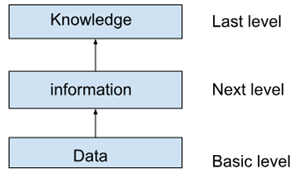
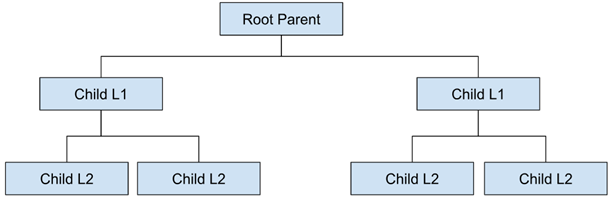
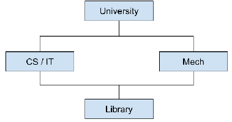

# Day01- DataCollectionAndDBMS

## What is data?

1. Data is nothing but raw piece of information with no context
2. Data can be any information, present in different forms like image, text word, numbers.
3. All the data is basically some information,  when kept together in a structured way
4. If we don’t provide any context to the data, then it is meaningless & useless
5. Data in the format of integers like 12, 2, 36, and suppose of we have the same data in the context of marks of the students in a particular subject, that would be ‘information’

## Data vs Information (interview Question)

1. 12, 26, 36, is some random numbers without context that are just ‘data’. It is the basic level.
2. By adding context , the above integers become the marks of students in particular subject which is ‘information’, It is next level to the data
3. And, when we find out who has secured the highest marks, or some other kind of insight, that is ‘knowledge’. It is next level to the information

## File System

1. File System is a way to organize and store data on your system.
2. It provides a structured way to store and retrieve files/directories
3. It can store these files and directories on HDD, SSD, flash drives, etc.
4. File based storage is also called as file level, It is hierarchical storage that is used to organize and store data
5. There are different types of file systems, that are used:
    1. FAT (File Allocation Table)
    2. NTFS(New Technology File System)
    3. HFS(Hierarchical File System)
    4. APFS(Apple File System)

### Disadvantages of File System

1. It is limited to small size, it cannot store large amounts of data
2. File system is complicated and it is very difficult to recover data
3. There are chances that you can have redundant data in file system
4. Data is not very secure in file system (if a file gets corrupt, it is very difficult to retrieve)
5. In file system, we can have same data in several files stored at different locations (exhibits storage space wastage)
6. Suppose, we have created a file in C:\ and in D:\ , and changes in C:\ are not reflected in the file in D:\ . Thus, it creates data inconsistency
7. Suppose, we have created a file ‘student’ containing ‘student name’ and ‘student ID’ of student, and we have another file ‘student info’, that contains information like, ‘student mobile number’, ‘email address’, ‘address’, if we want to send any kind of notice to the student, we’ll have to merge data from these two files, then only we’ll get ‘student name’, ‘student ID’, and ‘Mobile number’, which is very complicated
8. Programs developed on file system are very difficult to maintain

## What is Database?

1. Database is collection of interrelated data (structured & unstructured data), which can be used for inserting, retrieving, deleting, sorting any data effectively .
2. Database can be used in many different applications like accounting, inventory management, customer relationship management, and many more

## What is a DBMS?

1. DBMS(DataBase management System) is a software system that allows the user to create, maintain & control access to a database
2. Popular DBMS are
    1. MySQL
    2. Oracle SQL
    3. PostgreSQL
    4. MongoDB
    5. Cassandra

### DataBase vs. DataBase Management System

| Database | Database Management System (DBMS) |
| :-- | :-- |
| Database is a collection of interrelated data, that can be structured or unstructured | DBMS is a software system that allows user to create, define, maintain and control access to a database |
| Database is a physical/logical representation of data that is managed by DBMS | - |
| Database is a collection of tables, relation, index, and other structures that are created and managed by DBMS | - |

### DBMS vs. File System (interview question)

| DBMS | File System |
| :-- | :-- |
| It is a software that allows user to create, define, maintain and control access to a database | File System is collection of data stored in files or directories |
| e.g. MySQL, , PostgreSQL, OracleSQL, MongoDB | e.g. NTFS, FAT, HFS |
| Integrity constraint is easy to apply | Integrity constraint is difficult to apply |
| Data Redundancy is handled in DBMS | Data redundancy is not handled in file system |
| As data redundancy is handled properly, data inconsistency is controlled | As data redundancy is not handled properly in file system, there are chances that it leads to data inconsistency |
| DBMS software is costlier | File system is very cheap |
| DBMS allows concurrent changes | FIle system does not allow concurrent changes, i.e. only one user can change/operate at a time |

### Advantages of DBMS

1. Data consistency and data integrity is maintained in DBMS
2. It has improved data security (enforces security policies and access control to prevent unauthorized access)
3. DBMS provides efficient data access, as we can retrieve or manipulate data (in many tables)
4. We reduce data redundancy in DBMS using normalization
5. Data sharing is very easy

### Disadvantages of DBMS

1. DBMS softwares can be expensive(cost of software license, hardware, etc.)
2. DBMS is very complex, and only trained professionals can use it
3. It needs maintenance (patches & updates)

### Types of Databases

#### 1. Hierarchical Database

1. This is  a database management model in which data is stored in parent-child relationship mode
2. In this, data is organized in tree-structured format
3. The data is stored in the form of collection of fields where each field contains only one value
4. The records are linked to each other in parent-child relation
5. Each child record will have one parent , and one parent can have multiple children
6. To retrieve a field data, we need to traverse through each tree until record is found
7. These kind of database are usually used in banking or telecom industry
8. e.g. IBM Information Management System, Windows Registry

##### Advantages of Hierarchical database

1. Data can be accessed and updated fast because this follows tree structure and the relationship between the records are defined in advance

#### 2. Network Database

1. In network DBMS, it uses network structure to create relationships between entities..
2. These are commonly used on large digital computer
3. These are like hierarchical database but, in hierarchical database where node can have one parent only, but in network DBMS, one node can have multiple parents
4. In network database, child entity is called as members while parents are called as occupiers
5. E.g. Integrated Data Store, Integrated database management system

#### 3. NoSQL (NotSQL) Database

1. NoSQL/NotSQL is a type of database that is used to store a wide range of datasets
2. These are used in many applications which are used these days
3. NoSQL database is further divided into:
    1. **Key-value Storage:** Key-value storage stores each item as key(attribute name) and value together
    2. **Graph database:** it is used to store vast amount of data in graph like structure which is mostly used in social networking sites
    3. **Document Oriented Database:** this type of database is used to store data as a Json like document
        - e.g. Hadoop, Hbase, Cassandra, Hyper Table, Map R, Cloudera, Amazon SimpleDB, Azure DocumentDB, MongoDB
    4. **Wide Column Store:** it is similar to relational databases where data is stored in large columns instead of rows.
        - e.g. Azure CosmoDB
