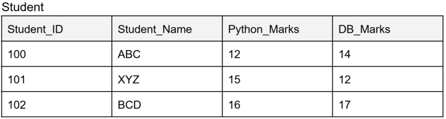
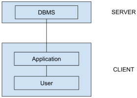

# Day02- DataCollectionAndDBMS

## What is RDBMS

1. RDBMS stands for Relational Database Management System
2. Relational Database Management System is a database management system based on relational model
3. In this model, data is stored in tables(relations), and is represented in the form of tuples(rows)
4. RDBMS is used to manage relational database
5. A relational database is a collection of organized set of tables, that are related to each other
6. Relational database helps us to access the data easily as all tables are related to each other
7. RDBMS helps us to do basic manipulations like Create, Read, Update & Delete, and these operations are collectively called as  CRUD

### Advantages of RDBMS

1. This support very large databases
2. RDBMS uses SQL(Structured Query Language)
3. RDBMS defines how data is organized in table and the relationship among these
4. New data can be added without modifying existing records, which in turn provides scalability

### Disadvantages of RDBMS

1. RDBMS does not support complex objects such as documents, videos and images

## What is table

1. A Table is a  collection of data entries and contains row & columns to store data
2. Each table represents some real-world entities like a person(Employee, Student, etc.), any event about which we collect information

### Properties of a table

1. Each table is identified by a unique name in the database
2. Relations/tables does not contain duplicate tuples/rows
3. Tuples/rows of table have no specific order. All attributes in a table are atomic

    

4. ‘Student_ID’, ‘Student_Name’ and ‘Course_ID’ are the attributes of the ‘Student’ table

## Record / Row / Tuple

1. A single entry in a table is called as tuple/record/row

    

2. The one highlighted in red color is called tuple/row/record. Each record/row in a table is considered as a tuple
3. The order of records is irrelevant, they are identified by their content and not by the position at which data is stored

    

4. No two rows can have identical /duplicate entries, so above two duplicate entries are not allowed

## Columns/Attributes

1. A column is a vertical entity in a table, which contains information related to a table

    

2. The above marked in red color viz., ‘Student_ID’, ‘Student_Name’ and ‘Course_ID’ are attributes for ‘Student’ table

    

3. Every column should have an attribute name, so above table is not allowed

    

A null value is permitted for an attribute.e.g. For a student with ‘Student_ID’ as 100 has NULL (blank) value for ‘Course_ID’

## Attribute Domain

1. Attribute domain refers to possible value for each attribute, that it may contain
2. It can be specified using data types

    

3. e.g. : an attribute ‘Student_name’ cannot contain an integer or float value

## Degree

1. Total number of attributes that comprises in a table, is known as degree of that table

    

2. e.g. : in the above table, we have 4 attributes, so the degree of Table ‘Student’ is 4

## Cardinality

1. The total number of records in a table is known as cardinality

    

2. e.g.: in the above table , we have 3 records/rows, so the cardinality of the table ‘Student’ is 3

## NULL values

1. A null value of a table specify the field that is left blank

## Parts of a table

## Codd Rules

1. Invented by EF Codd in 1970
2. **Rule 0 (The Foundation Rule)**
    1. This rule states that an application or a system, in order to qualify as an RDBMS, it must be able to manage the database entirely through relational capability
    2. e.g. : suppose, we are designing a library management system, and we need to create tables like book_details, issuer_details, etc. In this system, we will have all the tables/relations related to library only (we cannot add tables of other entities like employee details)
3. **Rule 1 (Information Rule)**
    1. All information is to be presented or stored in table format (rows & columns)
4. **Rule 2 (Guaranteed access Rule)**
    1. Each & every table/relation must be logically accessible using table name/ primary key and column name.
    2. This means that each table will have a unique name, a table must have a primary key, and to access any data through attribute name should be proper and atomic
5. **Rule 3 (Systematic  treatment of NULL values)**
    1. NULL values are fully supported in RDBMS
    2. NULL is a term used to represent missing value(s)
    3. A field with NULL value should be treated properly, so that accessibility of any kind of data is not restricted
    4. We may assign few dummy values to handle NULL values
6. **Rule 4 (Active/Dynamic Online Catalog based on Relational Model)**
    1. Data dictionary is a structure description of complete database and it must be stored
    2. A metadata about the table contains constraint, keys, data types, etc and these data should be stored in a table format so that privileged user can access these tables
7. **Rule 5 (Comprehensive data sub-language tool)**
    1. Relational system supports many languages but there should be one language using which we can do Data Definition, Data Manipulation, Data Integrity, providing the constraints, etc.
8. **Rule 6 (View Updating Rule)**
    1. All the views should be updated as soon as table is updated
9. **Rule 7 (High Level Insert, Update and Delete)**
    1. There must be Insert, Update and Delete operations at each level
    2. Operations like union, intersection should also be supported
10. **Rule 8 (Physical Data Dependency)**
    1. The Physical storage of data should not matter if any file/table is renamed or its location is changed, it should not affect the application
11. **Rule 9 (Logical Data Independency)**
    1. If there is a change in logical structure (table structure of database), the user view of the database must not change
12. **Rule 10 (Integrity Independency)**
    1. If there is a change in logical structure, the user view should not be changed as data integrity should be maintained throughout the manipulation process
13. **Rule 11 (Distribution Independency)**
    1. A database should work properly regardless of its distribution across a network
    2. The end user should not see the data distributed over many locations, they should get an impression that data is located at a single location
14. **Rule 12 (Non-subversion rule)**
    1. If low level access is allowed to a system, it should not be able to bypass the integrity rule to change the data

## Normalization

< TBD >

## DBMS vs. RDBMS

| DBMS | RDBMS |
| :-- | :-- |
|There is no concept of relations | Whole RDBMS is based on relations |
| The speed of any operation in DBMS is very slow | The speed of operation is very fast as it deals on basis of relations |
| DBMS uses the concept of files | RDBMS uses the concept of tables |
| e.g. : FoxBase | e.g. : MySQL, OracleSQL |
| Normalization is not present | Normalization is there |
| DBMS does not support distributed database | RDBMS supports distributed database |

## DBMS Architecture

1. This is based on client-server architecture
2. Client is our system or workstation through which we make the request and servers are the machines that give us the responses and store all the data
3. DBMS architecture depends on how a user is connected to the database to get its response

### Types of DBMS Architecture

There are three types of DBMS architectures:

1. **Tier 1 architecture**
    1. DBMS architecture in which client server and database all reside at one system comes under this category.
    2. e.g.: MySQL which  we have installed on our system
    3. In this architecture, a database is directly available to the user.
    4. Here any changes if performed are applied directly on the database
    5. These architecture is used to develop any local application, where programmers can directly communicate with the database
2. **Tier 2 architecture**
    1. It is same as client-server architecture
    2. Application on client can directly communicate to the database at server end using API’s like JDBC, ODBC, etc.

        

3. **Tier 3 architecture**
    1. This  type of architecture is used for large websites like google.com, amazon.com, etc.
    2. In this architecture, client cannot directly connect to server
    3. The application at client end will communicate to application server which further communicates to database system

        

### DBMS Schemas

1. In DBMS, schema is the logical structure of the database or the blueprint of the database
2. It defines data and their relationship
3. These schema are used to provide data abstraction to hide the data complexity from the user
4. These three levels of architectures enable multiple users to access the same data with personalized view while storing the data
5. Different users needs different views on the same data
6. The user should not be worried about physical implementation and internal working of database
7. All users should be able to access same data according to their requirements
8. DBA(DataBase Administrator) should be able to change the conceptual structure of database without affecting the user

## Levels of Data Abstraction

1. There are three levels of data abstraction
    1. **Internal abstraction**
        1. This internal level has an internal schema which describes the physical storage & structure of the database.
        2. This is also referred as physical schema
        3. It is used to define how data will be stored in a block
        4. This is the lowest level of abstraction
        5. It helps the user to keep information about actual representation of the entire database
        6. The internal level is generally concerned with storage space allocation like Binary Tree, Hashing, the Access Path (using indexes or keys or pointers or sequence)
        7. Example – Internal View

            | Stored Item | Length |
            | :-- | :-- |
            | Emp_Id | Type=Byte(6) |
            | Emp_Name | Type=Byte(36), offset=10 |
            | Emp_sal | Type=Byte(6), offset=8 |

    2. **Logical / Conceptual Abstraction**
        1. In conceptual level/schema, we focus on describing, data types, entities, relations, constraints, etc.
        2. This level comes in-between user level/view level and internal/physical storage
        3. There is only one conceptual view of single database
        4. In conceptual schema, we describe the structure of whole database
        5. Programmers & DBA’s (DataBase Administrators) work at this level
        6. Example – Conceptual View

            | Stored Item | Length |
            | :-- | :-- |
            | Emp_Id | Number(5) |
            | Emp_Name | Character(36) |
            | Emp_Sal | Number(6+2) |

    3. **External / View abstraction**
        1. At external level, database contains several schema, which is referred as sub-schema
        2. These sub-schema are used to describe different view of the database
        3. This is also referees as view schema
        4. This schema refers to end user interaction with database system
        5. An external level is only related to data which is used by a specific user
        6. Example – External View

            | Store Item |
            | :-- |
            | Emp_Id |
            | Emp_Name |
            | Emp_Sal |

    

## Key

1. In DBMS, an attribute or a set of attributes helps us to identify a record/row in a table
2. These keys help us to find relationship between two tables
3. Keys are used to uniquely identify a row in a table like combination of two or more attributes in a table

### Types of keys

1. There are many types of keys:
    1. **Super key**
        1. Super key is a group of single or multiple keys, which identify a row in a table
        2. In super key, we may have attributes which are not needed for unique identification

            

    2. **Primary key**
        1. An attribute that helps you to uniquely identify a row in a table, that can be a primary key
        2. A primary key cannot be duplicate, which means an attribute like student_Id cannot hold duplicate data
        3. Rules for primary key:
            1. In a table, we cannot, we cannot have two primary keys
            2. A primary key cannot be NULL
            3. A primary key cannot hold duplicate data
            4. The value of primary key column cannot be changed or modified if any foreign key refers to that primary key
            5. In the above case, we can make student_Id as primary key

                

            6. In the above case, we can make ‘s_id’ as primary key
            7. One student can have multiple ‘mobile_no’ and multiple ‘email_id’, hence, they cannot be turned into primary key
    3. **Candidate key**
        1. A super key, with no repeated attributes is called as candidate key
        2. A primary key must be chosen / selected from candidate keys
        3. Rules for candidate key:
            1. It must contain unique values
            2. candidate key can have multiple attributes
            3. It should contain values that provide uniqueness
            4. A candidate key must not contain NULL values

                

    4. **Alternate key**
        1. All the keys from the set of candidate keys, which are not primary keys are referred as alternate keys

            

    5. **Foreign key**
        1. Foreign key is a column which is added to create a relationship with another table
        2. One table’s primary key acts as foreign key in other table

            

    6. **Composite key**
        1. Composite key is a set of primary keys that consist of two or more columns
        2. It is used when one single column cannot be used to uniquely identify each row

    7. **Surrogate key**
        1. < TBD >

## Users

1. User in a database are an individual or an application that interacts with database to perform various tasks like retrieving data, manipulating data
2. Users are broadly categorized in three sections, based on their roles, responsibilities and the level of access to the database

### Types of User

There are three types of users

1. **Administrator (DBA- DataBase Administrator)**

    1. Administrator maintains & is responsible for administering a database
    2. DBA looks after the usage of database, creates access profiles for end-users and applies limitations, isolation and enforce security

2. **Designer**

    1. These are the group of people who work on the designing of a database
    2. These designers design the whole database/schema by maintaining relationships, constraints among the different entities

3. **End-User**

    1. These are the users who interact with database to retrieve data or get a view of a database
