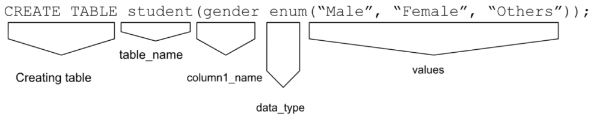
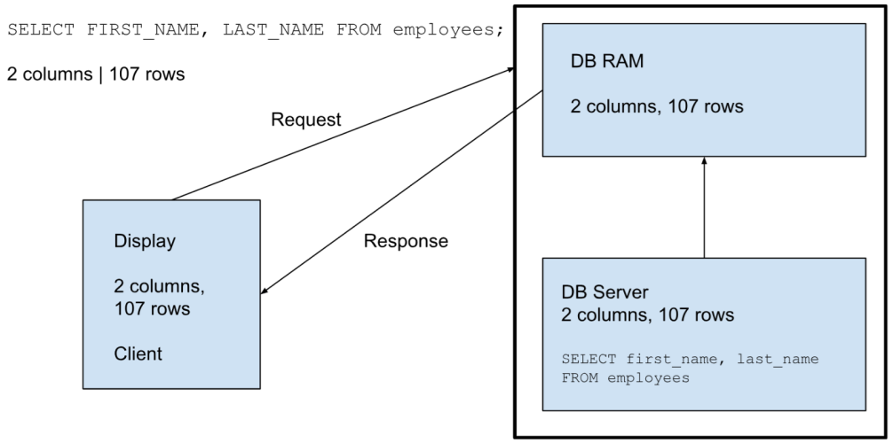

# Day02- DataCollectionAndDBMS

## MySQL

MySQL is Structured Query Language and SQL commands are further divided into 4 sub categories

1. **DDL (Data Definition Language)**
    1. DDL is used to modify any database or table structure and schema
    2. These statements are used to handle storage of database objects for designing
    3. `CREATE`, `ALTER`, `DROP`, `TRUNCATE` commands fall under this category of commands

2. **DQL (Data Query language)**
    1. DQL statements are used for performing queries on the data within schema objects.
    2. The purpose of the DQL Command is to get some schema relation based on the query passed to it.
    3. It is an SQL statement that allows getting data from the database and imposing order upon it.
    4. It includes the `SELECT` statement.
    5. This command allows getting the data out of the database to perform operations with it.
    6. When a SELECT is fired against a table or tables the result is compiled into a further temporary table, which is displayed or perhaps received by the program i.e. a front-end.

3. **DML (Data Manipulation Language)**
    1. DML  statements affect the records in the table and perform basic operations like selecting any record, inserting any new record, deleting any record or updating or modifying existing records
    2. `INSERT`, `UPDATE`, `DELETE` Commands fall under this category of commands

4. **DCL (Data Control Language)**
    1. DCL commands control the level of access that users have on database objects
    2. Commands like `GRANT`(allows the user to read/write on a certain database). `REVOKE`(taking away the already granted permission to read/write on database object) fall under this category of commands

5. **TCL (Transaction Control Language)**
    1. TCL statements allows you to control and manage transaction to maintain the integrity of data within the system
    2. Commands like `BEGIN`(this opens the transaction), `COMMIT`(to commit any transaction), `ROLLBACK`(to undo/rollback any transaction in case of any error) fall under this category of commands


## Data Types in MySQL

1. A data type is a type/category to which data belongs
2. Data type defines the type of data to be stored in each column of the table
3. Each column/attribute has its own type, we need to specify the type during creation of any table
4. Syntax:

    ```sql
    CREATE TABLE table_name(column1 < dataType >, column2 < dataType >);
    ```

5. Example:

    ```sql
    CREATE TABLE student(student_id INT, Student_name CHAR(30));
    ```

    

### String and Character data types

1. `CHAR`
    1. This data type can hold alphabets, numbers & special symbols
    2. This data type is of fixed length as specified at the time of creation of variable
    3. If length of data type is not specified, then default size is 1 character
    4. It’ll occupy memory according to the size of parameter
    5. Suppose , `CHAR(10)` is specified as data type, it’ll occupy 10 bytes of memory
    6. The length of char can vary from 0 to 255
    7. Length is fixed when we declare a table

2. `VARCHAR`
    1. It stands for *VAR*iable *CHAR*acter, which means, it can store variable length of string
    2. The range of characters this can hold is between 0 to 65,535
    3. You cannot exceed the length of string defined using size parameter
    4. Its default size is also 1
    5. Suppose you’ve declared `VARCHAR(20)`, and you’ve assigned a value *Ram*, as size of *Ram* is  3 bytes, it’ll occupy only 3 bytes and release other spaces, thus it’ll not pad unoccupied bytes

    > *Interview Question:* `CHAR` Vs. `VARCHAR`

    | `VARCHAR` | `CHAR` |
    | :-- | :-- |
    |It is variable length data type | It is fixed length data type |
    | No padding (white-space) is necessary, as it is of variable size | Padding is automatically put at the right side to store the string when its length is less than declared length |
    | Length can range between 0 to 65,535 | Length can range between 0 to 255 |

3. `BLOB`
    1. It stands for *B*inary *L*arge *OB*ject
    2. This can hold variable amount of data
    3. It can store binary data such as image, pdf, videos, etc
    4. Suppose, your data contains 50 bytes, then `BLOB` will occupy 52 bytes, as it’ll add 2 bytes of data overhead to each specified data

4. `TEXT`
    1. `TEXT` is useful for storing long format text String such as articles, blogs, etc
    2. It can hold data up-to 4GB in length
    3. Suppose, your data contains 50 bytes, then `TEXT` will occupy 52 bytes, as it’ll add 2 bytes of data overhead to each specified data

5. `ENUM`
    1. This is a string object whose value is chosen from a list of permitted values defined at the time of table creation
    2. This provides compact storage of data
    3. If a value is assigned which is not in the list, a blank value will be assigned
    4. Syntax:

        ```sql
        CREATE TABLE table_name(column_name enum(“val1”, “val2”, “val3”));
        ```

    5. Example:

        ```sql
        CREATE TABLE student(gender enum(“Male”, “Female”, “Others”));
        ```

        

### Numeric data types

1. `INT(size)`
    1. It is used for storing integer type values
    2. The size parameter specifies the maximum length of the number which you can store
    3. Default size of `INT` is 4 bytes, `BIGINT` is 8 bytes

2. `FLOAT(p)`
    1. Here ‘p’ is used to specify whether to use float or double for the resulting data type
    2. If the value of ‘p’ ranges from 0-24, then it is float
    3. If the value of ‘p’ ranges from 25-53, then it is double
    4. The default size of `FLOAT` is 4 bytes

3. `FLOAT(size, d)`
    1. The length of digits is specified using ‘size’ parameter
    2. The number of digits after decimal point is specified by ‘d’ parameter
    3. The default size of `FLOAT` is 4 bytes
    4. Example: `FLOAT(3, 2)` means that you can store the size of the number till 3 and 2 digits after decimal

4. `DOUBLE(size, d)`
    1. The length of digits is specified using ‘size’ parameter
    2. The number of digits after decimal point is specified by ‘d’ parameter
    3. The default size of `DOUBLE` is 8 bytes
    4. Example: `DOUBLE(3, 2)` means that you can store the size of the number till 3 and 2 digits after decimal

5. `BOOLEAN`
    1. False is stored as ‘0’ and True is stored as ‘1’

6. `DATE`
    1. You can store data in `YYYY-MM-DD` format
    2. Date within the range `1000-01-01` to `9999-12-31` can be stored

7. `TIME`
    1. It is used for storing the time of a day
    2. It can store time in format `HH-MM-SS`

8. `DATETIME`
    1. It can store date & time altogether in format `YYYY-MM-DD HH-MM-SS`

9. `TIMESTAMP`
    1. It stores the data in the same format as `DATETIME`
    2. You can automatically update/store the current date & time by using `default_current_timestamp`

10. `YEAR`
    1. It is used to store year in 4-digit format `YYYY`

| Data Type | Size |
| :-- | :-- |
| `INT` | 4 Bytes |
| `BIGINT` | 8 bytes |
| `FLOAT` | 4 bytes |
| `DOUBLE` | 8 bytes |

## Starting to operate on Database

1. `SELECT`
    1. We can view a table using `SELECT` statement
    2. Here `*` will give the output, all of the records along with their attributes will be displayed
    3. Syntax:

        ```sql
        SELECT * FROM table_name;
        ```

    4. Example:

        ```sql
        SELECT * FROM employees;
        ```

2. `CREATE DATABASE`
    1. To use any data from a table, first we need to create a database using `SELECT` command
    2. Syntax:

        ```sql
        CREATE DATABASE database_name;
        ```

    3. Example:

        ```sql
        CREATE DATABASE hr;
        ```

3. `USE`
    1. If database is already created, then we need to use the database command as
    2. Syntax:

        ```sql
        USE database_name;
        ```

    3. Example:

        ```sql
        USE hr;
        ```

4. `DESC`
    1. We can see the description of any table using `DESC` command
    2. Syntax:

        ```sql
        DESC table_name;
        ```

    3. Example:

        ```sql
        DESC employees;
        ```

## `SELECT` statement

1. ```sql
    SELECT * FROM table_name;
    ````

2. To use any data from a table, first we need to create a database using `SELECT` command

## `DESC` statement

1. ```sql
    DESC table_name;
    ```

2. It is used to see the description of any table
3. It gives you the structure or schema of any table which includes column/attribute names, data types, constraints, indexes applied on it

## `SHOW` statement

1. Alternative way to show the structure of table/database, we can use

    ```sql
    SHOW COLUMNS FROM table_name;
    ```

2. To display all the tables in current database
3. To use this command, firstly we need to use the database, and then show tables from database

    ```sql
    USE hr;
    SHOW TABLES;
    ```

4. Alternate way to show table is

    ```sql
    SHOW TABLE STATUS;
    ```

5. To show databases, we use

    ```sql
    SHOW DATABASES;
    SHOW DATABASES LIKE %hr%; -- works in different version
    ```



## Alias

1. Aliases are used to give temporary names to any column or table
2. It is used to make a statement more readable
3. We can create an alias using `AS` keyword, for any table or any column

4. column Alias - using `AS` keyword
    - Syntax (column Alias - using `AS` keyword):

        ```sql
        SELECT column_name AS alias_name FROM table_name;
        ```

    - Example (column Alias - using `AS` keyword):

        ```sql
        SELECT FIRST_NAME AS fname FROM employees;
        ```

5. Table Alias
    - Syntax (Table Alias):

        ```sql
        SELECT <table_alias_symbol>.<column_name> FROM <table_name> <table_alias_symbol>;
        ```

    - Example (Table Alias):

        ```sql
        SELECT e.FIRST_NAME FROM employees e;
        ```

6. Shorthand Alias - *without* using `AS` keyword
    - Syntax (Shorthand Alias - *without* using `AS` keyword):

        ```sql
        SELECT column_name alias_name FROM table_name;
        ```

    - Example (Shorthand Alias - *without* using `AS` keyword):

        ```sql
        SELECT FIRST_NAME fname FROM employees;
        ```

7. Temporary View Using Alias
    - Example (Temporary View Using Alias):

        ```sql
        SELECT FIRST_NAME AS fname, salary*10 increment, salary FROM employees; 
        ```

## Practical

```sql
-- ###################
-- Database- Day03a
-- ###################
-- List users in your database
SELECT USER FROM mysql.user;

-- SHOW GRANTS command
SHOW GRANTS FOR seconduser@localhost;
-- this '*.*' means that USER seconduser
-- can only login to the databaseserver
-- and have no other privilege

-- --------------------------------
-- password change in user
-- this can be done using 3 commands (UPDATE, ALTER, SET)

-- 1. using SET
-- SET PASSWORD FOR 'seconduser'@'localhost'=PASSWORD('abc');     -- for older version
SET PASSWORD FOR 'seconduser'@'localhost'='abc';

-- 2. using ALTER
ALTER user 'thirduser'@'localhost' IDENTIFIED BY 'abc';

-- 3. using UPDATE
USE mysql;
-- UPDATE user SET password=password('xyz') WHERE user='seconduser' AND host='localhost';     -- for older version
UPDATE user SET seconduser=password('xyz') WHERE user='seconduser' AND host='localhost';
-- UPDATE user SET authentication_string=password('xyz') WHERE user='seconduser' AND host='localhost';        -- shows error
FLUSH PRIVILEGES;

-- RENAME a user
RENAME user 'seconduser'@'localhost' TO 'dusrauser'@'localhost';
SELECT user FROM mysql.user;

-- DROP user (to remove user from database)
DROP user 'dusrauser'@'localhost';
SELECT user FROM mysql.user;

-- GRANT (giving permission to the user)
GRANT ALL PRIVILEGES ON *.* TO thirduser@localhost;
SHOW GRANTS FOR thirduser@localhost;

-- GRANT only 'SELECT' command PRIVILEGE
GRANT SELECT ON *.* TO thirduser@localhost;
SHOW GRANTS FOR thirduser@localhost;


-- ###################
-- Database- Day03b
-- ###################

-- run hr.sql script
USE hr;
SELECT * FROM countries;
SELECT * FROM departments;
SELECT * FROM employees;
SELECT * FROM job_history;
SELECT * FROM jobs;
SELECT * FROM locations;
SELECT * FROM regions;

DESC countries;
DESC departments;
DESC employees;
DESC job_history;
DESC jobs;
DESC locations;
DESC regions;

SHOW COLUMNS FROM countries;

USE hr;
SHOW TABLES;        -- SHOW table

SHOW TABLE STATUS;
SHOW DATABASES;     -- SHOW DATABASE
-- SHOW DATABASES LIKE %hr%;  -- works in different version


SELECT * FROM employees;
SELECT FIRST_NAME, LAST_NAME FROM employees;
SELECT * FROM employees WHERE LAST_NAME='King';
SELECT first_name, LAST_NAME FROM employees WHERE LAST_NAME='King';

-- ALIASES
-- COLUMN ALIAS
SELECT FIRST_NAME FROM employees;       -- original column
SELECT FIRST_NAME AS fname FROM employees;      -- ALIAS using AS

-- TABLE ALIAS
SELECT e.FIRST_NAME FROM employees e;       -- ALIAS of table used to display column

-- SHORTHAND
SELECT FIRST_NAME fname FROM employees;     -- SHORTHAND, ALIAS without using AS, 

-- created temporary view
SELECT FIRST_NAME AS fname, salary*10 increment, salary FROM employees;

```
