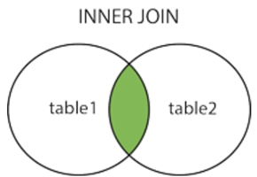
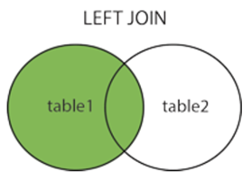
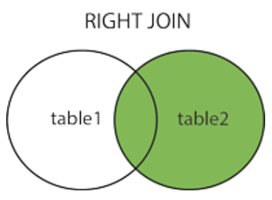
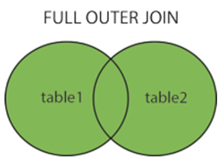

# Day05- DataCollectionAndDBMS

## DDL (Data Definition Language)

1. DDL is a subset of SQL commands that are used to define and manage the **structure** of a database, including creation, modification or deletion of database objects like tables, indexes, views, and schemas
2. it focuses on structure and organization of the database itself
3. DDL statements are typically non-transactional in most databases (however newer versions might differ), meaning once a DDL operation is executed, it is committed immediately and cannot be rolled back
4. DDL is used for database schema changes
5. These are the foundations to the database administration and management
6. Common DDL commands are
    1. `CREATE`
    2. `ALTER`
    3. `DROP`
    4. `TRUNCATE`
    5. `RENAME`
    6. `COMMENT`

### 1. `CREATE` statement

1. It is used to create new database objects such as tables, views, indexes and schemas
2. To use any data from a table, first we need to create a database using `CREATE DATABASE` command
    1. Syntax:

        ```sql
        CREATE DATABASE <database_name>;
        ```

    2. Example:

        ```sql
        CREATE DATABASE hr;
        ```

3. The `CREATE TABLE` statement is used to create a new table in a database.
    1. Syntax:

        ```sql
        CREATE TABLE <table_name> (
            <column1_name> <datatype>,
            <column2_name> <datatype>,
            <column3_name> <datatype>,
            ...
        );
        ```

    2. Example:

        ```sql
        CREATE TABLE IF NOT EXISTS `countries` (
            `COUNTRY_ID` varchar(2) NOT NULL,
            `COUNTRY_NAME` varchar(40) DEFAULT NULL,
            `REGION_ID` decimal(10,0) DEFAULT NULL,
            PRIMARY KEY (`COUNTRY_ID`),
            KEY `COUNTR_REG_FK` (`REGION_ID`)
        ) ENGINE=MyISAM DEFAULT CHARSET=latin1;
        ```

4. To `CREATE TABLE` using another table / **Create Table As Select (`CTAS`)**
    1. The structure of new table is created on basis of the `SELECT` statement
    2. When `SELECT` is executed, the output of the `SELECT` statement will be inserted into the new table
    3. If you don't use `WHERE` clause, all the records will be copied into the new table
    4. Syntax:

        ```sql
        CREATE TABLE <new_table_name> AS
            SELECT <column1>, <column2>, ...
            FROM <existing_table_name>
            WHERE ... ;
        ```

    5. Example:

        ```sql
        CREATE TABLE employeescopy AS
            SELECT *
            FROM employees;
        ```

### 2. `ALTER` statement

1. It is used to make changes in a table using `ADD`, `RENAME`/`CHANGE`, `MODIFY`, `DROP` keywords
2. Using ALTER, you can
    1. `RENAME` a column
    2. `ADD` a column to the table
    3. `DROP` a column
    4. `MODIFY` a table/column to
        1. increase/decrease the width of a column
        2. change data type of a column
        3. copy a table
        4. copy the structure of a table
        5. change position of column in the table structure
3. `ADD`, `RENAME`/`CHANGE`, `MODIFY`, `DROP` clauses helps you in `ALTER` command

    > **Tip:** Data will be truncated if you try to insert more than the new/modified size

#### 4. `ADD` a column

1. To add a new column to an existing table
2. Syntax:

    ```sql
    ALTER TABLE <table_name>
    ADD <column_name> <data_type>;
    ```

3. Example:

    ```sql
    ALTER TABLE employeescopy 
    ADD age INT DEFAULT 18; -- ALTER command to ADD COLUMN `age` with default value 18
    
    DESC employees; -- to describe the table employees after altering
    ```

#### 5. `RENAME`/`CHANGE` a column

1. To `RENAME`/`CHANGE` the name of an existing column
2. Syntax:

    ```sql
    -- MySQL
    ALTER TABLE <table_name>
        CHANGE COLUMN <old_column_name> <new_column_name> <column_definition>;
    -- PostgreSQL/Oracle
    ALTER TABLE <table_name>
        RENAME COLUMN old_column_name TO <new_column_name>;
    ```

3. Example:

    ```sql
    -- MySQL
    ALTER TABLE employeescopy 
        CHANGE COLUMN age min_age INTEGER DEFAULT 20;
    -- PostgreSQL/Oracle
    ALTER TABLE employeescopy
        RENAME COLUMN age TO min_age;
    ```

#### 6. `RENAME` a table

1. This command will rename the table (renaming a table is not recommended)
2. Syntax:

    ```sql
    ALTER TABLE <old_table_name>
        RENAME TO <new_table_name>;
    ```

3. Example:

    ```sql
    ALTER TABLE employeescopy 
        RENAME TO employeescpy;
    ```

#### 7. `MODIFY` a column

1. To Change the Data type or size of an existing column
    1. Syntax:

        ```sql
        ALTER TABLE <table_name> 
            MODIFY <column_name> <column_definition>;
        ```

    2. Example:

        ```sql
        ALTER TABLE employeescpy
            MODIFY min_age VARCHAR(10);
        ```

#### 8. `DROP` a column

1. To remove a column from a table
2. Syntax:

    ```sql
    ALTER TABLE <table_name> 
        DROP COLUMN <column_name>;
    ```

3. Example:

    ```sql
    ALTER TABLE employeescpy 
        DROP COLUMN min_age;
    ```

#### 9. `ADD` or `DROP` `CONSTRAINTS`

1. You can `ADD` or `DROP` a `CONSTRAINT` using `ALTER` command

##### 2. `ADD` a `CONSTRAINT`

1. You can add constraints such as `PRIMARY KEY`, `FOREIGN KEY`, etc. using `ALTER` command
2. Syntax:

    ```sql
    ALTER TABLE <table_name>
        ADD CONSTRAINT [<pk_constraint_name>]   -- for PRIMARY | FOREIGN | UNIQUE | CHECK
            [PRIMARY KEY (<column_name>)][FOREIGN KEY (<column_name>) REFERENCES table_2 (<column2_name>)][UNIQUE (<column_name>)][CHECK (<condition>)]
        ALTER COLUMN <column_name>  -- for DEFAULT
            SET DEFAULT <default_value>
        MODIFY <column_name> <data_type> NOT NULL ; -- for NOT NULL
    ```

3. Example:

    ```sql
    ALTER TABLE departmentscpy
        ADD CONSTRAINT 
            PRIMARY KEY (DEPARTMENT_ID);
    ```

##### 3. `DROP` a `CONSTRAINT`

1. You can drop existing constraints such as `PRIMARY KEY`, `FOREIGN KEY`, etc. using `ALTER` command
2. Syntax:

    ```sql
    ALTER TABLE <table_name>
        DROP [[PRIMARY][FOREIGN] KEY][INDEX][CONSTRAINT] [<constraint_name>]    -- for PRIMARY | FOREIGN | UNIQUE | CHECK
        ALTER COLUMN <column_name> DROP DEFAULT    -- for DEFAULT
        MODIFY COLUMN <column_name> <column_definition> NULL;   -- for NOT NULL
    ```

3. Example:

    ```sql
    ALTER TABLE departmentscpy
        DROP PRIMARY KEY;
    ```

#### 10. Change table properties or storage parameters

1. In some RDBMS, `ALTER` command can be used to modify storage properties like table partitions
2. Example:

    ```sql
    ALTER TABLE my_table 
        ENGINE = InnoDB;
    ```

### 3. `DROP` statement

1. It removes entire objects from database, such as tables, views, indexes or even entire databases
2. This command cannot be undone once executed, thus irreversible
3. All the data stored in the object will be lost permanently
4. The user must have appropriate permissions (such as `DROP` privileges) to execute the `DROP` command on a specific object
5. You may use `DROP COLUMN` command with `ALTER` command to remove a column from an existing table, as shown in [DROP a column](#8-drop-a-column)
6. Syntax:

    ```sql
    DROP [TABLE][DATABASE][VIEW][INDEX] <object_name>;
    ```

7. Example:

    ```sql
    DROP TABLE employeescpy -- removes database
    DROP VIEW IT_dept_employees_view;   -- removes view
    DROP INDEX idx_employee_id ON employees; -- removes index from table employees
    DROP DATABASE hr2;  -- removes database
    ```

### 4. `TRUNCATE` statement

1. It removes all the rows from a table while keeping the table structure intact for future use
2. It is similar to `DELETE` operation, and faster than `DELETE` operation, as it does not has to deal with `WHERE` condition (searching of a particular record)
3. `TRUNCATE` operation is non-transactional and cannot be rolled back especially in older MySQL (but newer versions support it within transactions)
4. It simply de-allocates the data pages, making it more efficient & fast to delete all records compared to a `DELETE` statement, especially for large tables
5. It resets auto-increment in MySQL, but table structure (columns, constraints, etc.) remain intact
6. No trigger is fired, because it is a DML operation
7. You'll typically need `DROP` privileges to execute `TRUNCATE`
8. If a table is referenced by a `FOREIGN KEY` constraint, then `TRUNCATE` cannot be executed on that table unless those constraints are disabled or referencing table is truncated first
9. Syntax:

    ```sql
    TRUNCATE TABLE <table_name>;
    ```

10. Example:

    ```sql
    TRUNCATE TABLE employees;
    ```

### 5. `RENAME` statement

1. Sometimes we may want to rename our table to give it a more relevant name. For this purpose we can use `RENAME` command to rename the name of the table (in newer versions of MySQL).
2. Syntax:

    ```sql
    RENAME TABLE <old_table_name> TO <new_table_name>;
    ```

3. Example:

    ```sql
    RENAME TABLE employeescpy TO employeescopy;
    ```

4. This above syntax works in newer versions of MySQL, but to work with older versions of MySQL, you may use the `ALTER TABLE` syntax to rename a table as shown in [RENAME TABLE](#6-rename-a-table)

## DQL (Data Query Language)

1. DQL is a subset of SQL that focuses on querying data from databases
2. Primary purpose of DQL is to retrieve data and retrieve it in a specific way, without modifying the actual data in the database
3. Most commonly used DQL statement is `SELECT` statement, which is used to query the database and retrieve information

### 1. `SELECT` statement

1. We can retrieve data from one or more tables in a database using `SELECT` statement
2. Here `*` will give the output, all of the records along with their attributes will be displayed
3. Syntax:

    ```sql
    SELECT column1, column2, ... 
    FROM <table_name>
    [WHERE <condition>]
    [GROUP BY <column1> [HAVING <condition>]]
    [ORDER BY <column2> [DESC]]
    [LIMIT <n> [OFFSET <m>]];
    ```

4. Example:

    ```sql
    SELECT * 
    FROM employees;
    ```

## DML (Data Manipulation Language)

1. DML is a subset of SQL used for managing and manipulating **data** within database objects such as tables.
2. Unlike DDL which defines the structure of the database, DML focuses on the actual data stored in the database
3. DML is focused on non-structural changes, manipulating data within the existing database structure, rather than altering the structure itself
4. DML commands are typically used within transactions, i.e., you can commit or roll back changes
5. `WHERE` clause is often used in DML operations to specify which rows should be affected, to avoid unintentional changes to the entire table
6. Common DML commands are
    1. `INSERT`
    2. `UPDATE`
    3. `DELETE`
    4. `MERGE`

### 1. `INSERT` statement

1. It adds a new row of data into a table
2. It is possible to use `INSERT` statement in two ways
    1. Insert new records/rows into a table
    2. Copy data from one table/view to another table

#### 1. Insert new records/rows into a table

1. Specify both the column names and values to be inserted in the order of columns you've specified
2. If you're adding values for all columns of the table, you may skip specifying column names. However, ensure the order of the values matches with the order of columns in the schema of the table
3. Syntax:

    ```sql
    INSERT INTO table_name [(column1, column2, ...)]
        VALUES
            (row1value1, row2value2, ...),
            [(row2value1, row2value3, ...), ...] ;
    ```

4. Example:

    ```sql
    INSERT INTO regions (REGION_ID, REGION_NAME)
        VALUES 
            (5, “Australia”);
    ```

    ```sql
    INSERT INTO regions -- can skip columns if all values are added for all columns
        VALUES 
            (5, “Australia”);
    ```

#### 2. Copy data from one table/view to another table

1. You can `SELECT` data from one table/view and copy it into another existing table using `INSERT`
2. Destination table should be already existing to perform data copy
3. Table structure/schema of source and destination tables should match, otherwise data won't be inserted
4. If you're copying data across databases, you need to use the fully qualified names e.g. `database.table` in MySQL or `database.schema.table` in MS SQL Server or other catalog based DBs
5. Syntax:

    ```sql
    INSERT INTO <dest_existing_table> 
        SELECT * FROM [<src_existing_table>][<src_existing_view>];
    ```

6. Example:

    ```sql
    INSERT INTO employeescpy
        SELECT * FROM employeescopy;
    ```

### 2. `UPDATE` statement

1. It is used to modify existing rows/records in a table
2. You need to specify some filtering criteria using `WHERE` clause to identify which record(s) need to be updated, otherwise it'll update all the records
3. Syntax:

    ```sql
    UPDATE <table_name>
        SET <column1> = <value1>[, <column2> = <value2>[, ...]]
        [WHERE <condition>] ;
    ```

4. Example:

    ```sql
    SET SQL_SAFE_UPDATES = 0;   -- to disable safe updates
    UPDATE employeescopy 
        SET SALARY = 100000 
        WHERE EMPLOYEE_ID = 110 ;
    ```

    ```sql
    UPDATE employeescopy 
        SET SALARY = 110000, LAST_NAME = 'Cena' -- Updating multiple columns
        WHERE EMPLOYEE_ID = 110 ;
    ```

#### `UPDATE` vs. `ALTER` - Interview Problem/Challenge

| `UPDATE` | `ALTER` |
| :-- | :-- |
| It is used to modify the specific column | It is used to modify the structure of database object such as table_name, column_name |
| It uses `SET` keyword to specify new value for one or more columns and uses `WHERE` clause to specify the condition | Keywords like `ADD`, `DROP`, `MODIFY` are used to make the changes in the structure |
| This command can be undone using `ROLLBACK` | This command cannot be undone |

### 3. `DELETE` statement

1. It is used to remove the rows/records from a table
2. Syntax:

    ```sql
    DELETE FROM <table_name>
        WHERE <condition>;
    ```

3. Example:

    ```sql
    DELETE FROM employeescopy
        WHERE EMPLOYEE_ID = 110;
    ```

### 4. `MERGE` statement

1. Also known as Upsert operation
2. Combines `INSERT` and `UPDATE` operations in a single statement
3. It is used to either insert new data or update existing data based on a specified condition
4. It is commonly used in scenarios while maintaining Slowly Changing Dimensions (SCDs) in data warehouses
5. MySQL does not support `MERGE` statement, but supported in other databases like PostgreSQL, Oracle SQL, MS SQL Server, IBM DB2
6. Syntax:

    ```sql
    MERGE INTO <dest_table> 
        USING <src_table>
        ON <condition>
    WHEN MATCHED THEN 
        UPDATE SET <column1> = <value1>, <column2> = <value2>, ...
    WHEN NOT MATCHED THEN
        INSERT (<column1>, <column2>, ...)
            VALUES
                (<value1>, <value2>, ...) ;
    ```

## `GROUP BY` clause

1. Under aggregate functions, we saw `avg()`, `sum()`, `count()`, `min()`, `max()`

    ```sql
    SELECT SALARY FROM employees WHERE SALARY >avg(SALARY);
    ```

    In above query, We cannot use aggregate functions in `WHERE` clause
2. `GROUP BY` clause is used to group two rows to have same value in one or more columns
3. It typically works with aggregate functions viz. `avg()`, `sum()`, `count()`, `min()`, `max()`
4. `GROUP BY` clause should be written after `WHERE` clause to specify which column should be grouped together
5. When you write `SELECT` statement, the column which you’ve grouped, should be present in `SELECT` statement
6. Example:

    ```sql
    SELECT DEPARTMENT_ID, count(*) num_of_employees
    FROM employees 
    WHERE DEPARTMENT_ID=50 
    GROUP BY DEPARTMENT_ID ;
    ```

### Rules for `GROUP BY` clause

1. Besides group function or aggregate function, whichever column is present in `SELECT` clause, that column name has to be present in `GROUP BY` clause
2. But, Whichever column is present in `GROUP BY` clause, it may or may not be present in `SELECT` statement
3. Example:

    ```sql
    SELECT max(SALARY) 
    FROM employees 
    GROUP BY DEPARTMENT_ID;
    ```

    In this case, `DEPARTMENT_ID` will also be bought to server RAM, sorting will be performed department wise, sorting in salary will also be performed but `DEPARTMENT_ID` will not be displayed
4. There is no upper limit in `GROUP BY` clause, if you have large number of columns in `GROUP BY` clause, but it’ll be slow in execution because sorting will take time

    ```sql
    SELECT JOB_ID, DEPARTMENT_ID, sum(SALARY) 
    FROM employees 
    GROUP BY JOB_ID, DEPARTMENT_ID;
    
    SELECT DEPARTMENT_ID, JOB_ID, sum(SALARY) 
    FROM employees 
    GROUP BY JOB_ID, DEPARTMENT_ID;
    ```

5. The position of column in `SELECT` clause and the position of column in `GROUP BY` clause need not to be same
6. The position of the column in the `SELECT` clause will determine the position of the column in the output
7. The position of column in `GROUP BY` clause will determine sorting order, grouping order
8. **Spatial query** or **n-dimensional queries**
    1. If you have 1 column in `GROUP BY` clause, this means 2D query
    2. If you have 2 columns in `GROUP BY` columns, this means 3D query
    3. If you have 3 columns in `GROUP BY` columns, this means 4D query
    4. If you have multiple columns in `GROUP BY` columns, this means **spatial query**

### `HAVING` clause

1. It is used to filter the results based on aggregate functions, using a condition
2. It is used in combination with `GROUP BY` clause, which groups the row based on one or more columns
3. `HAVING` clause is applied to the grouped row and filters out any group that does not satisfy the condition
4. It is similar to `WHERE` clause, but while `WHERE` clause filters rows/records before aggregation, the `HAVING` clause filters after the aggregation
5. Syntax:

    ```sql
    SELECT <column1>, <column2>, <aggregate_function(column3)> 
    FROM <table_name> 
    WHERE <condition> 
    GROUP BY <column1>, <column2> HAVING <condition>;
    ```

6. `WHERE` clause is used to restrict the row
7. `HAVING` clause works after all searching, sorting and conditioning performed on any SQL statement
8. It is recommended that only group function should be used in `HAVING` clause
9. A statement like

    ```sql
    SELECT DEPARTMENT_ID, sum(sal) 
    FROM employees 
    GROUP BY DEPARTMENT_ID HAVING sal > 17000 ;
    ```

    This will give you error, as `sal` is not a group function
10. This below statement will work but it is not an efficient way of using `HAVING` clause

    ```sql
    SELECT DEPARTMENT_ID, sum(sal) 
    FROM employees 
    GROUP BY DEPARTMENT_ID HAVING DEPARTMENT_ID = 110 ;
    ```

11. It is recommended that only group functions should be used in `HAVING` clause

### `WHERE` vs. `HAVING` - Interview Problem/Challenge

| `WHERE` | `HAVING` |
| :-- | :-- |
| It filters the row depending on the condition | It filters on the group condition |
| It is applicable without `GROUP BY` clause | It does not work without `GROUP BY` clause |
| It gives you row restriction/row function | It gives you column restriction/column function |
| It is used before `GROUP BY` clause | It is used after `GROUP BY` clause |
| It is single-row operation | It is multiple-row operation as it uses aggregate function |

## `JOIN` statement

1. `JOIN` statement is used to combine rows from two or more tables based on related/common field between them
2. `JOIN` is used to retrieve data from two or more tables in a single query, which is useful when the data you need is spread across different tables
3. `JOIN` works from left to Right

### Types of Joins

1. `INNER JOIN` or `JOIN` or *Equi-Join* or *Natural Join*
2. `LEFT JOIN` or `LEFT OUTER JOIN`
3. `RIGHT JOIN` or `RIGHT OUTER JOIN`
4. `FULL JOIN` or `FULL OUTER JOIN`
5. Cartesian Join or `CROSS JOIN`
6. `SELF JOIN`

#### 1. `INNER JOIN` or `JOIN` or *Equi-Join* or *Natural Join*

1. `INNER JOIN`returns only the rows that have matching values based in both the tables
2. If there is no match, those rows are excluded from the result
3. This join is based on equality conditions, so matching rows of both the tables
4. Both tables should have common column(s) / attribute(s)
5. It fetches matching data from the common column as specified in `JOIN` condition

    

6. Syntax:

    ```sql
    SELECT t1.column1, t1.column2, ..., t2.column1, t2.column2, ...
    FROM table1 t1
    [INNER] JOIN table2 t2 ON [<join_condition>][table1.column1 = table2.column2] ;
    ```

    ```sql
    SELECT t1.column1, t1.column2, ..., t2.column1, t2.column2, ...
    FROM table1 t1, table2 t2
    WHERE t1.column1 = t2.column2 ;
    ```

7. Example:

    ```sql
    SELECT e.EMPLOYEE_ID, e.DEPARTMENT_ID, d.DEPARTMENT_ID, d.DEPARTMENT_NAME 
    FROM employees e
    INNER JOIN departments d ON e.DEPARTMENT_ID = d.DEPARTMENT_ID ; -- using INNER JOIN keyword
    ```

    ```sql
    SELECT e.EMPLOYEE_ID, e.DEPARTMENT_ID, d.DEPARTMENT_ID, d.DEPARTMENT_NAME 
    FROM employees e
    JOIN departments d ON e.DEPARTMENT_ID = d.DEPARTMENT_ID ;   -- using only JOIN keyword
    ```

    ```sql
    SELECT e.EMPLOYEE_ID, e.DEPARTMENT_ID, d.DEPARTMENT_ID, d.DEPARTMENT_NAME 
    FROM employees e, departments d
    WHERE e.DEPARTMENT_ID = d.DEPARTMENT_ID;    -- using WHERE keyword
    ```

##### Non-equi-Join

1. This is also a type `INNER JOIN`, but based on conditions other than equality such as `<`, `>`, `>=`, `<=`, `BETWEEN`, etc.
2. It’ll show non-matching rows of both the tables
3. Performs joins using comparison operators other than equals(`=`) sign such as `<`, `>`, `>=`, `<=`, `BETWEEN`, etc. in condition(s)
4. It is used in exception reports
5. Syntax:

    ```sql
    SELECT t1.column1, t1.column2, ..., t2.column1, t2.column2, ...
    FROM table1 t1, table2 t2
    WHERE t1.column1 [> | < | >= | <= ] t2.column2 ;
    ```

6. Example:

    ```sql
    SELECT e.name, e.salary, s.department_category
    FROM employees e
    JOIN salary_ranges s ON e.salary BETWEEN s.min_salary AND s.max_salary;
    ```

    ```sql
    SELECT e.name, e.salary, s.department_category
    FROM employees e
    JOIN salary_ranges s ON e.salary < s.max_salary;
    ```

#### 2. `LEFT JOIN` or `LEFT OUTER JOIN`

1. It returns all the rows from the left table and the matched rows from the right table
2. If there is no match in the right table, the result will contain `NULL` value in the right table column(s)
3. Syntax:

    ```sql
    SELECT t1.column1, t1.column2, ..., t2.column1, t2.column2, ...
    FROM table1 t1
    LEFT [OUTER] JOIN table2 t2 ON [<join_condition>][table1.column1 = table2.column2] ;
    ```

    

4. Example:

    ```sql
    SELECT e.EMPLOYEE_ID, e.DEPARTMENT_ID, d.DEPARTMENT_ID, d.DEPARTMENT_NAME 
    FROM employees e
    LEFT JOIN departments d ON e.DEPARTMENT_ID = d.DEPARTMENT_ID ;
    ```

    ```sql
    SELECT e.EMPLOYEE_ID, e.DEPARTMENT_ID, d.DEPARTMENT_ID, d.DEPARTMENT_NAME 
    FROM employees e
    LEFT OUTER JOIN departments d ON e.DEPARTMENT_ID = d.DEPARTMENT_ID ;
    ```

#### 3. `RIGHT JOIN` or `RIGHT OUTER JOIN`

1. It returns all the rows from the right table, and the matching rows from the left table
2. If there is no matching row in the table, the result will contain `NULL` value in the left table column(s)

    

3. Syntax:

    ```sql
    SELECT t1.column1, t1.column2, ..., t2.column1, t2.column2, ...
    FROM table1 t1
    RIGHT [OUTER] JOIN table2 t2 ON [<join_condition>][table1.column1 = table2.column2] ;
    ```

4. Example:

    ```sql
    SELECT e.EMPLOYEE_ID, e.DEPARTMENT_ID, d.DEPARTMENT_ID, d.DEPARTMENT_NAME 
    FROM employees e
    RIGHT JOIN departments d ON e.DEPARTMENT_ID = d.DEPARTMENT_ID ;
    ```

    ```sql
    SELECT e.EMPLOYEE_ID, e.DEPARTMENT_ID, d.DEPARTMENT_ID, d.DEPARTMENT_NAME 
    FROM employees e
    RIGHT OUTER JOIN departments d ON e.DEPARTMENT_ID = d.DEPARTMENT_ID ;
    ```

#### 4. `FULL JOIN` or `FULL OUTER JOIN`

1. MySQL does not support the `FULL JOIN` or `FULL OUTER JOIN`. However, you can achieve the same result by using a combination of `LEFT JOIN` and `RIGHT JOIN`along with a `UNION`
2. A `FULL JOIN` returns all the rows when there is a match in either the left table or the right table, and it returns NULL values for missing columns

    

3. Syntax:

    ```sql
    SELECT t1.column1, t1.column2, ..., t2.column1, t2.column2, ...
    FROM table1 t1
    FULL [OUTER] JOIN table2 t2 ON [<join_condition>][table1.column1 = table2.column2] ;    -- FULL OUTER JOIN available in PostgreSQL, MS SQL Server, Oracle SQL
    ```

    ```sql
    SELECT t1.column1, t2.column1, ...
    FROM table1 t1
    LEFT [OUTER] JOIN table2 t2 ON [<join_condition>][table1.column1 = table2.column2] 
        UNION   -- simulate FULL JOIN in MySQL using UNION of LEFT JOIN and RIGHT JOIN
    SELECT t1.column1, t2.column1, ...
    FROM table1 t1
    RIGHT [OUTER] JOIN table2 t2 ON [<join_condition>][table1.column1 = table2.column2] ;
    ```

4. Example:

    ```sql
    SELECT s.COURSE_ID, c.COURSE_ID
    FROM student s 
    FULL OUTER JOIN course_detail c ON s.COURSE_ID = c.COURSE_ID;   -- FULL OUTER JOIN available in PostgreSQL, MS SQL Server, Oracle SQL
    ```

    ```sql
    SELECT e.EMPLOYEE_ID, e.DEPARTMENT_ID, d.DEPARTMENT_ID, d.DEPARTMENT_NAME
    FROM employees e
    LEFT OUTER JOIN departments d ON e.DEPARTMENT_ID = d.DEPARTMENT_ID
        UNION   -- simulate FULL JOIN in MySQL using UNION of LEFT JOIN and RIGHT JOIN
    SELECT e1.employee_ID, e1.DEPARTMENT_ID, d1.DEPARTMENT_ID, d1.DEPARTMENT_NAME
    FROM employees e1
    RIGHT OUTER JOIN departments d1 ON e1.DEPARTMENT_ID = d1.DEPARTMENT_ID ;
    ```

#### 5. Cartesian Join or `CROSS JOIN`

1. The `CROSS JOIN` returns the cartesian product of two tables, meaning every row from the first table is combined with every row from the second table
2. You can use it when you want to generate all possible combinations of rows from both tables
3. It can result into a large result set especially if both the tables are large
4. This is a `JOIN` without a condition, and by default it will resolve on the cartesian product of records/rows from the tables
5. But, if you specify a condition to `CROSS JOIN` using `ON` keyword or `WHERE` clause, it becomes an `INNER JOIN`

6. Syntax:

    ```sql
    SELECT t1.column1, t1.column2, ..., t2.column1, t2.column2, ...
    FROM table1 t1
    CROSS JOIN table2 t2;
    ```

    ```sql
    SELECT e.EMPLOYEE_ID, e.DEPARTMENT_ID, d.DEPARTMENT_ID, d.DEPARTMENT_NAME
    FROM employees e, departments d;    -- without CROSS JOIN keyword
    ```

7. Example:

    ```sql
    SELECT e.EMPLOYEE_ID, e.DEPARTMENT_ID, d.DEPARTMENT_ID, d.DEPARTMENT_NAME
    FROM employees e
    CROSS JOIN departments d;
    ```

    ```sql
    SELECT e.EMPLOYEE_ID, e.DEPARTMENT_ID, d.DEPARTMENT_ID, d.DEPARTMENT_NAME
    FROM employees e, departments d;    -- without CROSS JOIN keyword
    ```

#### 6. SELF JOIN

1. A Self Join is a join where a table is joined with itself
2. This is useful for hierarchical data or recursive data, like employees reporting to other employees
3. You should use it when you have to compare rows within the same table
4. Two copies fo the same table are used in this join, but they both are treated as separate tables with different aliases, so creating aliases for tables is essential to implement Self Join
5. Syntax:

    ```sql
    SELECT t1.column1, t1.column2, ..., t2.column1, t2.column2, ...
    FROM table t1  -- table is joined with itself
    JOIN table t2 ON [<join_condition>][t1.column1 = t2.column2] ;
    ```

6. Example:

    ```sql
    SELECT e.EMPLOYEE_ID, CONCAT(e.FIRST_NAME, ' ', e.LAST_NAME) AS employee, e1.EMPLOYEE_ID AS mgr_EMP_ID, CONCAT(e1.FIRST_NAME, ' ', e1.LAST_NAME) AS manager
    FROM employees e
    JOIN employees e1 ON e.MANAGER_ID = e1.EMPLOYEE_ID ;
    ```

## Practical

```sql
-- ###################
-- Database- Day05
-- ###################
use hr;
SELECT * FROM employees;
SELECT count(EMPLOYEE_ID) count_emp FROM employees ORDER BY EMPLOYEE_ID;
SELECT FIRST_NAME, SALARY+1000 increment FROM employees ORDER BY increment;

SELECT SALARY, EMPLOYEE_ID FROM employees ORDER BY SALARY ASC, EMPLOYEE_ID DESC;
-- RENAME table_name TO new_table_name
-- ALTER TABLE old_table RENAME new_table
-- ALTER table_name ADD  column_name data_type;
-- UPDATE table_name SET column = VALUE WHERE condition

SELECT * FROM employees WHERE EMPLOYEE_ID=110;
UPDATE employees SET SALARY = 100000 WHERE EMPLOYEE_ID=110;
SELECT * FROM employees WHERE EMPLOYEE_ID=110;

ALTER TABLE employees ADD age int(60);
DESC employees;
SHOW TABLES;
SELECT * FROM regions;
SELECT * FROM employees;

-- ALTER TABLE table_name MODIFY column_name new_data_type;
ALTER TABLE employees MODIFY age int(70);
DESC employees;

-- 
CREATE DATABASE check1;
USE check1;
--
-- Table structure for table `regions`
CREATE TABLE IF NOT EXISTS `regions` (
  `REGION_ID` decimal(5,0) NOT NULL,
  `REGION_NAME` varchar(25) DEFAULT NULL,
  PRIMARY KEY (`REGION_ID`),
  UNIQUE KEY `sss` (`REGION_NAME`)
) ENGINE=MyISAM DEFAULT CHARSET=latin1;

--
-- Dumping data for table `regions`
INSERT INTO `regions` (`REGION_ID`, `REGION_NAME`) VALUES
('1', 'Europe\r'),
('2', 'Americas\r'),
('3', 'Asia\r'),
('4', 'Middle East and Africa\r');

SELECT * FROM regions;
-- delete
DELETE FROM regions WHERE REGION_ID=4;--  deletes specific record as per condition in WHERE
SELECT * FROM regions;
-- truncate
TRUNCATE TABLE regions; --  leaves empty table
SELECT * FROM regions;
-- drop
DROP TABLE regions; --  removes entire table object
SELECT * FROM regions;

USE hr;
-- SELECT SALARY FROM employees WHERE SALARY >avg(SALARY); --  throws error as aggregate functions not allowed with grouping

SELECT count(*) FROM employees WHERE DEPARTMENT_ID=80;
SELECT DEPARTMENT_ID, count(*) num_of_employees
FROM employees GROUP BY DEPARTMENT_ID;
SELECT DEPARTMENT_ID, count(*) num_of_employees
FROM employees WHERE DEPARTMENT_ID=50 GROUP BY DEPARTMENT_ID;

-- problem / challenge find the number of employees hired in each year
SELECT * FROM employees;
SELECT YEAR(HIRE_DATE) FROM employees;
SELECT YEAR(HIRE_DATE), count(*) emp_count FROM employees GROUP BY year(HIRE_DATE);

-- write a query to find total salary paid to each department
-- and order the result in descending order of total salary paid
SELECT * FROM employees;
SELECT SALARY , DEPARTMENT_ID FROM employees WHERE DEPARTMENT_ID=30;
SELECT DEPARTMENT_ID, sum(SALARY) total_sal_to_dept
FROM employees GROUP BY DEPARTMENT_ID ORDER BY total_sal_to_dept DESC;

-- find the department with highest total salary being paid
SELECT max(SALARY) max_total_sal_to_dept
FROM employees GROUP BY DEPARTMENT_ID ORDER BY max_total_sal_to_dept DESC;

-- HAVING
SELECT DEPARTMENT_ID, sum(SALARY) total_sal_to_dept 
FROM employees GROUP BY DEPARTMENT_ID HAVING sum(SALARY)<6000;

-- write a query to get average salary to all the departments who have employees more than 10
SELECT DEPARTMENT_ID, avg(SALARY) avg_salary, count(*) emp_count
FROM employees GROUP BY DEPARTMENT_ID HAVING count(DEPARTMENT_ID)>10;

SELECT JOB_ID, sum(SALARY) FROM employee GROUP BY JOB_ID, DEPARTMENT_ID;

-- JOIN
SELECT * FROM employees;
SELECT * FROM departments;

-- Equi Join
SELECT EMPLOYEE_ID, e.DEPARTMENT_ID, DEPARTMENT_NAME
FROM employees e, departments d --  using alias for table
WHERE e.DEPARTMENT_ID=d.DEPARTMENT_ID;

SELECT EMPLOYEE_ID, employees.DEPARTMENT_ID, DEPARTMENT_NAME
FROM employees , departments    -- using actual table names
WHERE employees.DEPARTMENT_ID=departments.DEPARTMENT_ID;

-- Inequi Join
SELECT * FROM employees;
SELECT * FROM departments;
-- using JOIN & ON keyword, with table alias
SELECT FIRST_NAME, LAST_NAME, EMPLOYEE_ID, e.DEPARTMENT_ID
FROM employees e JOIN departments d
ON e.EMPLOYEE_ID=d.DEPARTMENT_ID AND d.DEPARTMENT_NAME!='hr';
-- using JOIN & ON keyword, without table alias
SELECT FIRST_NAME, LAST_NAME, EMPLOYEE_ID, employees.DEPARTMENT_ID
FROM employees JOIN departments 
ON employees.EMPLOYEE_ID=departments.DEPARTMENT_ID AND departments.DEPARTMENT_NAME!='hr';
use hr;

SELECT FIRST_NAME, LAST_NAME, e.DEPARTMENT_ID, DEPARTMENT_NAME
FROM employees e, departments d -- using WHERE & AND keyword
WHERE e.DEPARTMENT_ID=d.DEPARTMENT_ID AND d.DEPARTMENT_NAME!='IT';

SELECT FIRST_NAME, LAST_NAME, EMPLOYEE_ID, e.DEPARTMENT_ID, DEPARTMENT_NAME
FROM employees e, departments d -- using alias for table
WHERE e.DEPARTMENT_ID!=d.DEPARTMENT_ID;

SELECT FIRST_NAME, LAST_NAME, EMPLOYEE_ID, employees.DEPARTMENT_ID, DEPARTMENT_NAME
FROM employees , departments    -- using actual table names
WHERE employees.DEPARTMENT_ID=departments.DEPARTMENT_ID;


-- waq to find who has scored higher than 80 marks

-- Cartesian Join
SELECT EMPLOYEE_ID, FIRST_NAME, DEPARTMENT_NAME
FROM employees, departments;

-- LEFT JOIN
SELECT e.DEPARTMENT_ID, DEPARTMENT_NAME -- cannot show proper left join due to schema of tables employees, departments
FROM employees e LEFT JOIN departments d
ON e.DEPARTMENT_ID=d.DEPARTMENT_ID;

SELECT s.NAME, c.COURSE_ID
FROM student s LEFT JOIN course c
ON c.ROLL_NO=s.ROLL_NO;

-- RIGHT JOIN
SELECT e.DEPARTMENT_ID, DEPARTMENT_NAME
FROM employees e RIGHT JOIN departments d
ON e.DEPARTMENT_ID=d.DEPARTMENT_ID;

SELECT s.NAME, c.COURSE_ID
FROM student s RIGHT JOIN course c
ON c.ROLL_NO=s.ROLL_NO;


-- WAQ to find the addresses(location_id, street_address, city, state_province, country_name) of all the departments
SELECT * FROM countries;
SELECT * FROM locations;
SELECT * FROM departments;
SELECT DEPARTMENT_ID, DEPARTMENT_NAME 
FROM departments;
```
