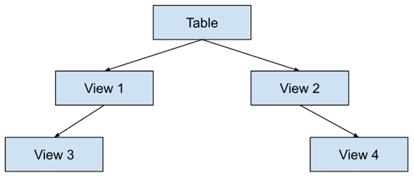

# Day06- DataCollectionAndDBMS

## Sub-Query

1. A sub-query is a query which is nested within another query
2. Also called as **Inner-Queries**
3. It is used to retrieve data from one or more tables and use a result of query as condition/criteria for another table in outer query
4. Sub-queries help in executing queries with dependency on the output of another query
5. Sub-queries are enclosed in parenthesis `( )`
6. It can be used with `SELECT`, `FROM`, `WHERE`, `HAVING` clauses
7. Sub-query is executed first before the execution of the outer query
8. We can write almost 255 levels of sub-queries

    > Larger the number of sub-queries, slower the execution time

9. `JOIN` is faster than sub-queries
10. In sub-queries, we use operators like `IN`(logical OR), `ANY`(logical OR), `ALL`(logical AND)

### Benefits of Sub-queries

1. **Modularity:** Sub-queries break down complex problems into simpler parts
2. **Flexibility:** You can query a dataset and use it dynamically in another query
3. **Readability:** They can improve the clarity of a query, making it easier to understand, compared to writing all the logic in one query

### Limitations of Sub-Queries

1. **Performance:** In some cases, Sub-Queries can be inefficient because they may require repeated executions of the Inner-query for each row of the Outer-query. This can be mitigated by using `JOIN` or optimizing sub-queries
2. **Nested Limits:** Some database systems impose a limit on the number of sub-queries or the depth of nested queries. e.g. MySQL has a limit of 256 sub-query depth

### Types of Sub-queries

1. Scalar Sub-queries
2. Row Sub-queries
3. Column Sub-queries
4. Multiple Row Sub-queries

#### 1. Scalar Sub-queries

1. These return a single value (one row or one column)
2. These are often used in `SELECT` or `WHERE` or `HAVING` or `FROM` clause and a comparison operator

    > **Note:** The inner-query is independent of the outer query and gives a meaningful result by running on its own (it is a non-correlated sub-query)

3. Scalar sub-queries can be used with the `WHERE` or `HAVING` clause to filter the results of the Outer-query
4. Example:

    ```sql
    SELECT EMPLOYEE_ID, 
        CONCAT(FIRST_NAME, ' ', LAST_NAME) AS employee_name, 
        SALARY , (SELECT AVG(SALARY)     -- in SELECT statement
            FROM employees) AS avg_salary
    FROM employees ;
    ```

    ```sql
    SELECT EMPLOYEE_ID, FIRST_NAME, LAST_NAME, SALARY 
    FROM employees
    WHERE SALARY > (SELECT AVG(SALARY)     -- similar usage in WHERE or HAVING or FROM clause to filter results in Outer-query
        FROM employees) ;
    ```

#### 2. Row Sub-queries

1. These returns a single row as an output to their parent query, and thus can return more than one column values in a row, which can be used with operators like `IN`, `NOT IN` `ANY`, `ALL`
2. Example:

    ```sql
    SELECT EMPLOYEE_ID, FIRST_NAME, LAST_NAME, DEPARTMENT_ID
    FROM employees
    WHERE ROW(DEPARTMENT_ID, MANAGER_ID) IN (SELECT DEPARTMENT_ID, MANAGER_ID
        FROM departments 
        WHERE LOCATION_ID = 2500) ;
    ```

    ```sql
    SELECT EMPLOYEE_ID, FIRST_NAME, LAST_NAME, DEPARTMENT_ID
    FROM employees
    WHERE (DEPARTMENT_ID, MANAGER_ID) IN (SELECT DEPARTMENT_ID, MANAGER_ID
        FROM departments 
        WHERE LOCATION_ID = 2500) ;
    ```

#### 3. Column Sub-queries

1. These return a single column of multiple values to their parent query
2. Example:

    ```sql
    SELECT EMPLOYEE_ID, FIRST_NAME, LAST_NAME, DEPARTMENT_ID
    FROM employees
    WHERE DEPARTMENT_ID IN (SELECT DEPARTMENT_ID 
        FROM departments 
        WHERE LOCATION_ID = 2500) ;
    ```

#### 4. Multiple Row Sub-queries

1. THese return multiple rows, which can be used in `HAVING` clause, `WHERE` clause, `FROM` clause, along with some logical operators like `IN`, `NOT IN` `ANY`, `ALL`
2. Example:

    ```sql
    SELECT EMPLOYEE_ID, FIRST_NAME, LAST_NAME, DEPARTMENT_ID
    FROM employees
    WHERE DEPARTMENT_ID IN (SELECT DEPARTMENT_ID 
        FROM departments 
        WHERE LOCATION_ID = 2500) ;
    ```

### Correlated and Non-Correlated Sub-Queries

#### 1. Non-Correlated Sub-Queries

1. These do not reference any columns of the Outer-query
2. These can be executed independently of the Outer-query
3. Example:

    ```sql
    SELECT EMPLOYEE_ID, SALARY 
    FROM employees
    WHERE SALARY > (SELECT AVG(SALARY) 
        FROM employees) ;
    ```

#### 2. Correlated Sub-Queries

1. These reference one or more columns from the Outer-query
2. They cannot be executed independently, as they depend on the Outer-query
3. Example:

    ```sql
    SELECT EMPLOYEE_ID, 
        DEPARTMENT_ID, SALARY, (SELECT MAX(SALARY) 
            FROM employees
            WHERE DEPARTMENT_ID = e.DEPARTMENT_ID) as max_salary
    FROM employees e;
    ```

### Sub-query in `SELECT` clause

1. A sub-query can be used to return a value in the result set for each row
2. Syntax:

    ```sql
    SELECT <column1_name>, (SELECT <agg_func>(<column1_name>) 
        FROM <table1> 
        WHERE <column2_name> = t1.<column2_name>)
    FROM <table1> t1;
    ```

3. Example:

    ```sql
    SELECT EMPLOYEE_ID,
        CONCAT(FIRST_NAME, ' ', LAST_NAME) AS employee_name, 
        SALARY , DEPARTMENT_ID, (SELECT MAX(salary) 
            FROM employees 
            WHERE department_id = e.department_id) AS max_salary_in_dept
    FROM employees e
    ORDER BY DEPARTMENT_ID;
    ```

### Sub-query in `WHERE` clause

1. This is the most common use of sub-queries
2. A sub-query can be used to filter rows in the main query
3. Syntax:

    ```sql
    SELECT <column_name> 
    FROM <table1_name> 
    WHERE <column_name> [= | > | < | >= | <= | != | NOT | IN] (SELECT <column_name> 
        FROM <table2_name>) ;
    ```

4. Example:

    ```sql
    SELECT EMPLOYEE_ID, FIRST_NAME, LAST_NAME, DEPARTMENT_ID
    FROM employees
    WHERE DEPARTMENT_ID IN 
        (SELECT DEPARTMENT_ID 
        FROM departments 
        WHERE LOCATION_ID = 2500) ;
    ```

### Sub-query in `FROM` clause

1. Sub-queries can also be used in the `FROM` clause to create temporary table that is referenced in the Outer-query
2. Syntax:

    ```sql
    SELECT <column_name> 
    FROM (SELECT <column_name> 
        FROM <table2>) 
    WHERE <condition>;
    ```

3. Example:

    ```sql
    SELECT tmp_tbl.DEPARTMENT_ID, SUM(tmp_tbl.SALARY)
    FROM (SELECT DEPARTMENT_ID, SALARY
        FROM employees ) AS tmp_tbl
    GROUP BY tmp_tbl.DEPARTMENT_ID ;
    ```

### Rules to write Sub-queries

1. A sub-query must be enclosed in parenthesis `( )`
2. A sub-query cannot return more than one column, but you may return them as a `ROW`
3. A sub-query can return only one row in most cases, however we can use some clauses like `IN`, `ANY`, which will allow sub-query to return multiple rows
4. A sub-query can be used in various clauses like `SELECT`, `FROM`, `WHERE`, `HAVING`, `DELETE`
5. Syntax of sub-query will vary depending on the clause we have used
6. A sub-query can be nested to multiple levels, but this can make the query more complex and harder to understand
7. A sub-query slows down the query execution time. In order to have better performance, we need to optimize sub-queries by rewriting them in an efficient manner possible

## Views

1. View are virtual tables that are based on the result of a query
2. They allow you to encapsulate complex queries and reuse them in different parts of your database applications
3. A view does not store data itself, rather it stores the SQL `SELECT` query that defines how the data should be retrieved
4. When you query a view, it runs the underlying query to generate the result dynamically
5. You cannot include DML statements like `INSERT`, `UPDATE` `DELETE` or `MERGE` within the view's definition, but views are not designed for data modification
6. Views are generally Read-Only, meaning you cannot directly perform `INSERT`, `UPDATE` or `DELETE` operations on data through a view unless it satisfies certain conditions
    1. The view must map directly into a single table (no joins or aggregations)
    2. The columns in the view must directly correspond to the columns in the underlying table
    3. The view should not contain any aggregate functions (e.g. `SUM`, `COUNT`, etc.)
    4. The view should not have a `GROUP BY` or `HAVING` clause
    5. The view should not have complex expressions or transformations on the data

7. A view is a logical entity, while a table is a physical entity, so you can create a view from another view/table, but if parent table is dropped then view becomes inaccessible

    

8. Views are generally Read-Only, meaning you cannot directly Insert, Update or Delete data through a view unless it satisfies certain conditions
9. Example:

    ```sql
    CREATE VIEW employee_view AS
        SELECT EMPLOYEE_ID, FIRST_NAME, LAST_NAME, DEPARTMENT_ID
        FROM employees
        WHERE DEPARTMENT_ID <> 0 ;
    ```

### Uses of Views

1. **Simplify complex queries:** Use a view to encapsulate complicated joins or sub-queries that you need to use often
2. **Security:** Restrict access to sensitive data by exposing only a subset of columns or rows via views
3. **Data abstraction:** Create a level of abstraction, making it easier to maintain changes to the database schema without affecting application code that uses views

### Performance Considerations

1. **Performance Overhead:** Views are generally efficient, but since views do not store data, each time a view is queried, MySQL must execute the underlying `SELECT` query. This can add performance overhead, especially for complex queries with large data sets
2. **Indexing:** You cannot create indexes directly on a view in MySQL, as views do no store data. If performance is a concern, you might need to optimize the underlying tables or materialize the views manually by creating a table to store the query result
3. **Materialized Views:** MySQL does not support **materialized views** (views that store data), but you can manually create a table and populate it with the result of a query (which is a workaround for a materialized view)

### Advantages of Views in MySQL

1. **Data Abstraction:** Views provide a level of abstraction by hiding the complexity of queries
2. **Code Reusability:** You can reuse complex query logic across multiple applications or queries by querying the view
3. **Security:** Views can restrict the access to sensitive data by exposing only specific columns or rows
4. **Data Consistency:** Views ensure that the same query is used across different parts of the application, ensuring consistency

### Limitations of Views in MySQL

1. **Performance:** Views can add overhead if the underlying queries are complex or involve large datasets
2. **No Indexing on Views:** You cannot create indexes on views, so optimizing performance may require indexing the underlying tables
3. **Not always updatable:** Some views, especially those involving joins or aggregates, are not updatable, limiting their usefulness for modifying data

### `CREATE VIEW`

1. To create a view, you use the `CREATE VIEW` statement followed by the view's name and SQL query that defines it
2. Syntax:

    ```sql
    CREATE VIEW <view_name> AS 
        SELECT <column1>, <column2>, ... 
        FROM <table_name> 
        WHERE <condition> ;
    ```

3. Example:

    ```sql
    CREATE VIEW sal_emp_view AS -- basic VIEW
        SELECT FIRST_NAME, SALARY, DEPARTMENT_ID 
        FROM employees 
        WHERE SALARY > 10000 ;
    ```

    ```sql
    CREATE VIEW emp_count_by_dept_view1 AS  -- GROUP BY VIEW
        SELECT DEPARTMENT_ID, count(*) 
        FROM employees 
        GROUP BY DEPARTMENT_ID ;
    ```

    ```sql
    CREATE VIEW join_view1 AS   -- JOIN VIEW
        SELECT e.FIRST_NAME, d.DEPARTMENT_NAME, e.SALARY 
        FROM employees e 
        JOIN departments d ON e.DEPARTMENT_ID = d.DEPARTMENT_ID ;
    ```

    ```sql
    CREATE VIEW subquery_view1 AS   -- Sub-query VIEW
        SELECT max(SALARY) 
        FROM employees 
        WHERE SALARY < (SELECT max(SALARY) 
            FROM employees) ;
    ```

### Querying a View

1. Once a view is created, you can query it like a regular table
2. Syntax:

    ```sql
    SELECT <column1_name>, <column2_name> 
    FROM <view_name>;
    ```

3. Example:

    ```sql
    SELECT * 
    FROM sal_emp_view ;
    ```

### DML operations on data through View

1. Generally, Views are read-only, and DML operations on data are not possible using views unless it satisfies some criteria
2. The common conditions across all DML operations on data that a `VIEW` should satisfy are
    1. **Single Table:** The view must be based on a single table. If the View is based on multiple tables (e.g. using `JOIN`), MySQL will not allow data manipulation (insert, update, delete) on it
    2. **No Aggregates:** The View should not contain aggregate functions such as `SUM()`, `COUNT()`, `AVG()`, etc. Views that include aggregation are non-updatable
    3. **No `GROUP BY`:** The View should not use the `GROUP BY` or `HAVING` clauses. Grouping alters the underlying data in ways that prevent direct modification
    4. **No `DISTINCT`:** Using `DISTINCT` in the view's `SELECT` query can also make the view non-updatable because it changes the result set in ways that don't map directly to a single row in the underlying table
    5. **No calculated or Derived Columns:** The View should not include calculated or derived columns that do not exist in the base table (e.g. expressions or concatenated columns), as this can interfere with updating or deleting individual rows in the underlying table
    6. **All Non-Nullable columns must be included:** If the underlying table has non-nullable columns, columns must be included in the View's `SELECT` statement. This ensures that when you insert or update data, the necessary values are provided

#### `INSERT` data through View

1. For an `INSERT` operation to work on a View, the View must meet the following additional conditions:
    1. **Direct Column Mappings:**
        - The View must expose all the necessary columns in the underlying table for the `INSERT` to work. This means the columns of the view must directly correspond to the columns in the underlying table that do not have default values or are not nullable
        - For non-nullable columns or columns without a default value in the underlying table, you must provide a value for those columns through the view during the `INSERT`
2. Example:

    ```sql
    INSERT INTO country_view (COUNTRY_ID, COUNTRY_NAME, REGION_ID)
    VALUES ('SL', 'ShriLanka', 3) ;
    ```

#### `UPDATE` data through View

1. For an `UPDATE` operation to work on a View, the View must meet the following additional conditions:
    1. **Direct Column Mappings:** The columns to be updated in the view must match the underlying table's columns without any transformations. If the view presents data in a way that transforms or combines columns (e.g. using `CONCAT` or `IF` statements), MySQL will not allow the update
    2. **Primary Key or Unique Key:** The view must include a Primary Key or a Unique Key from the underlying table that uniquely identifies the rows being updated. Without a unique key, MySQL cannot determine which rows to update when using the views.
2. Example:

    ```sql
    SET COUNTRY_NAME = 'Sri Lanka'
    WHERE COUNTRY_ID = 'SL' ;
    ```

#### `DELETE` data through View

1. For a `DELETE` operation to work on a View, the View must meet the following additional conditions:
    1. **Primary Key or Unique Key:** The view should provide a mechanism (such as Primary Key or Unique Key) to uniquely identify the rows to delete. If the view does not include a unique key, MySQL won't know which specific row to delete from the underlying table
2. Example:

    ```sql
    DELETE FROM country_view
    WHERE country_ID = 'SL' ;
    ```

### Alter View

1. In MySQL, you **cannot directly alter a view** once it is created. However, you can modify a view using the `CREATE OR REPLACE VIEW` statement, which replaces the existing view with a new definition
2. Syntax:

    ```sql
    CREATE OR REPLACE VIEW <view_name> AS 
        SELECT <column1>, <column2>, ... 
        FROM <table_name> 
        WHERE <condition> ;
    ```

3. Example:

    ```sql
    CREATE OR REPLACE VIEW sal_emp_view AS
        SELECT EMPLOYEE_ID, FIRST_NAME, SALARY, DEPARTMENT_ID
        FROM employees
        WHERE SALARY > 10000 ;
    ```

### `DROP VIEW`

1. To remove a view from the database, use the `DROP VIEW` statement
2. Syntax:

    ```sql
    DROP VIEW <view_name> ;
    ```

3. Example:

    ```sql
    DROP VIEW sal_emp_view ;
    ```

## Random Tips

1. The `SELECT` column is used to select required data from database
2. The `FROM` clause is used to specify the source from where the data has to be fetched
3. The `WHERE` condition is used to filter the records, the row will be filtered according to comparison between result of sub-query
4. The `GROUP BY` clause is used to group rows having similar values
5. The `HAVING` clause is used to filter based on specified condition, filtering the group on basis of result of sub-query
6. `IN` operator is faster than `ANY` operator, but `ANY` is is more powerful than `IN` operator

## Practical

```sql
-- ###################
-- Database- Day06
-- ###################

use week2;
SELECT * FROM student;
SELECT * FROM course_detail;

-- cartesian Join
SELECT s.STUDENT_ID,  c.COURSE_ID
FROM student s, course_detail c;

-- INNER JOIN / EQUI JOIN / NATURAL JOIN
    -- using JOIN keyword
SELECT s.STUDENT_ID, c.COURSE_ID
FROM student s 
JOIN course_detail c ON s.STUDENT_ID = c.STUDENT_ID; 
    -- using INNER JOIN keyword
SELECT s.STUDENT_ID, c.COURSE_ID
FROM student s 
INNER JOIN course_detail c ON s.STUDENT_ID = c.STUDENT_ID;
    -- using WHERE keyword
SELECT s.STUDENT_ID, c.COURSE_ID
FROM student s, course_detail c
WHERE s.STUDENT_ID = c.STUDENT_ID;

-- LEFT JOIN
SELECT s.STUDENT_ID, c.COURSE_ID
FROM student s 
LEFT JOIN course_detail c ON s.student_ID = c.STUDENT_ID;

-- RIGHT JOIN
SELECT s.STUDENT_ID, c.COURSE_ID
FROM student s 
RIGHT JOIN course_detail c ON s.student_ID = c.STUDENT_ID;

-- SELF JOIN
SELECT s1.STUDENT_ID, s2.COURSE_ID
FROM student s1 
JOIN student s2 ON s1.COURSE_ID = s2.COURSE_ID;

-- OUTER JOIN
-- cannot implement FULL JOIN in MySQL
-- SELECT s.COURSE_ID, c.COURSE_ID
-- FROM student s FULL JOIN course_detail c
-- ON s.COURSE_ID=c.COURSE_ID;
-- FULL JOIN implemented in MySQL using UNION of LEFT JOIN & RIGHT JOIN
SELECT s.STUDENT_ID, c.COURSE_ID
FROM student s 
LEFT JOIN course_detail c ON s.student_ID = c.STUDENT_ID
    UNION
SELECT s.STUDENT_ID, c.COURSE_ID
FROM student s 
RIGHT JOIN course_detail c ON s.student_ID = c.STUDENT_ID;

SELECT * FROM student;
SELECT * FROM course_detail;


USE hr;
SELECT * FROM departments;
SELECT * FROM employees;
-- find number of employees in each department
SELECT count(EMPLOYEE_ID), DEPARTMENT_ID 
FROM employees
WHERE DEPARTMENT_ID IN (SELECT DEPARTMENT_ID 
    FROM departments) 
GROUP  BY DEPARTMENT_ID ;

SELECT DEPARTMENT_ID 
FROM departments;

-- find the average salary of employees in IT dept
SELECT avg(SALARY) avg_sal_of_IT 
FROM employees 
WHERE DEPARTMENT_ID = (SELECT DEPARTMENT_ID 
    FROM departments 
    WHERE DEPARTMENT_NAME = 'IT');

SELECT DEPARTMENT_ID 
FROM departments 
WHERE DEPARTMENT_NAME = 'IT';

-- find the total no of employees working in finance dept
SELECT count(EMPLOYEE_ID) 
FROM employees 
WHERE DEPARTMENT_ID = (SELECT DEPARTMENT_ID 
    FROM departments 
    WHERE DEPARTMENT_NAME = 'Finance');

SELECT DEPARTMENT_ID 
FROM departments 
WHERE DEPARTMENT_NAME = 'Finance';

-- find the names of employees, who work in same dept of Steven king
SELECT FIRST_NAME, LAST_NAME, DEPARTMENT_ID
FROM employees 
WHERE DEPARTMENT_ID = (SELECT DEPARTMENT_ID 
    FROM employees 
    WHERE FIRST_NAME = 'Steven' AND LAST_NAME = 'King');

SELECT DEPARTMENT_ID 
FROM employees 
WHERE FIRST_NAME = 'Steven' AND LAST_NAME = 'King';

-- find the dept where no employees earn more than 4000
SELECT DEPARTMENT_NAME, DEPARTMENT_ID
FROM departments
WHERE DEPARTMENT_ID IN (SELECT DEPARTMENT_ID
    FROM employees
    WHERE SALARY < 4000);

SELECT SALARY, DEPARTMENT_ID 
FROM employees 
WHERE SALARY < 4000;

-- interview challenge/problem
--  find out the employee with second highest salary
SELECT * 
FROM employees 
WHERE SALARY = (SELECT SALARY 
    FROM employees 
    ORDER BY SALARY DESC 
    LIMIT 1 OFFSET 1);

SELECT SALARY 
FROM employees 
ORDER BY SALARY DESC 
LIMIT 1 OFFSET 1;

--  find out the employee with third highest salary
SELECT * 
FROM employees 
WHERE SALARY = (SELECT SALARY 
    FROM employees 
    ORDER BY SALARY DESC 
    LIMIT 1 OFFSET 2);

SELECT SALARY 
FROM employees 
ORDER BY SALARY DESC 
LIMIT 1 OFFSET 1;


-- Views
-- create view
CREATE VIEW sal_emp AS 
    SELECT FIRST_NAME, SALARY, DEPARTMENT_ID 
    FROM employees 
    WHERE SALARY > 10000;
-- select view
SELECT * 
FROM sal_emp;

CREATE VIEW no_emp_dept AS
    SELECT DEPARTMENT_ID, count(*) 
    FROM employees 
    GROUP BY DEPARTMENT_ID;

SELECT * 
FROM no_emp_dept;

CREATE VIEW join_view1 AS
    SELECT e.FIRST_NAME, d.DEPARTMENT_NAME, e.SALARY
    FROM employees e 
    JOIN departments d ON e.DEPARTMENT_ID = d.DEPARTMENT_ID;

SELECT * 
FROM join_view1;

CREATE VIEW sub_examp AS
    SELECT max(SALARY) 
    FROM employees
    WHERE SALARY < (SELECT max(SALARY) 
        FROM employees);

SELECT * 
FROM sub_examp;

SELECT * 
FROM sal_emp; 

UPDATE sal_emp 
SET FIRST_NAME = "John" 
WHERE SALARY = 24000 AND DEPARTMENT_ID = 90 AND FIRST_NAME = "Steven"; -- updates name of Steven to John

SELECT * 
FROM employees; -- shows updated name as John

SELECT * 
FROM employees; -- show record of John in table employees

DELETE FROM sal_emp 
WHERE SALARY = 24000 AND DEPARTMENT_ID = 90 AND FIRST_NAME = 'John'; -- deletes record of John with salary 24000, dept id 90

SELECT * 
FROM employees; -- does not show record of John

SELECT * 
FROM sal_emp; --  shows view sal_emp

DROP VIEW sal_emp; -- drops view sal_emp

SELECT * 
FROM sal_emp; -- throws error as sal_emp does not exist anymore
```
