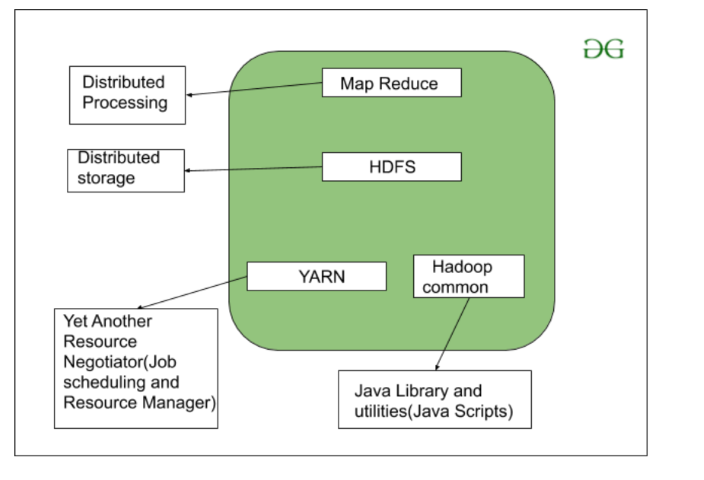

# Day01 - Big Data Technologies

- **Analysis:** diving deep into the data, to get some insightful info, which would be used to understand the patterns,(in order to take up some actions which would result into the growth of
the organization)

- **Action:** some steps taken up with respect to the insights that we get from analysis, for the growth of the organization

## Forms of Data

1. Structured Data
    1. RDBMS (Relational Database Management System)
    2. Business data in table format
2. Semi-Structured Data
    1. XML, JSON, excel, Files (Key-Value)
    2. Usually produced from social media, telematics
3. Unstructured Data
    1. Audio, video, text, images, social media


## Big Data

- **Big Data:** any collection of data set that is large and complex

1. To handle huge volume of data, we use hadoop + spark
2. This huge volume of data can be used for analysis to understand patterns & trends
3. More Data, More Analysis
4. More Data, More Permutation, Better Analysis

### 4Vs of Big Data


1. **Volume**

    1. Scale of data
    2. Huge amount of data in terms of TBs & PBs

2. **Variety**

    1. Different forms of data
    2. Nature of data being structured, unstructured or semi-structured

    | | |
    | :- | :- |
    | Structured | has fixed format and length of data |
    | Semi-structured | does not have a proper format/length like log files |
    | Unstructured | unorganized data, like texts, pictures, videos, etc. |

3. **Velocity**

    1. Massive and continuous flow of data
    2. Analysis of streaming data
    3. That which is being generated rapidly (real-time data)
    4. Data from stock markets, location tracking, telematics like car sensors, games like cricket are generated rapidly

4. **Veracity**

    1. Inconsistency / Uncertainty of data
    2. Uncertainty can be in terms of
        1. *Quality:* sometimes data is messy and quality/accuracy of data are difficult
to control (cases of data that needs to be cleaned first)
        2. *Quantity:* sometimes the volume of data is very less
    3. Data which is lacking quality or quantity causes confusion or could convey incomplete information
5. **Value**
    1. Creating value out of data
    2. Data without any value is of no use to the organization

## Example: Customer Churn


1. Loss of customers based on behavior due to any bad customer service
2. We can cater to this problem using Big Data by generating insights regarding the customers
who might opt out and taking appropriate actions can save the business
3. Need to use predictive analysis tools like ML
4. Data need to be split into two parts:
    1. Training data 70%
    2. Testing data 30%

> **Spark** is good for real-time data due to fast processing speed, and **Hadoop** is recommended for huge data storage and parallel processing

## Hadoop

1. **Cluster:** Lot of machines put together in single network
2. Can store huge amount of data by scaling the hadoop nodes vertically of horizontally
3. Two types of scalability in hadoop
    1. *Vertical Scalability:* adding new nodes
    2. *Horizontal Scalability:* increasing size of existing node
4. Can store any type of data in hadoop cluster
5. We use hadoop to store & process (transform) data
6. Hadoop is based on ELT framework (Extract→ Load→ Transform)
7. It does high-speed, parallel computing, so we need to store data in a distributed manner
on hadoop clusters
8. It stores any amount and any type of data


### 1 Node Machine vs. 100 Node Cluster

- Deploy on 1 Node Machine with 100TB on 1 machine [100MB/s]
  - Time = data / speed

``` text
1TB = 1024 GB x 1024 MB x 100 TB /100 MB/s
    = 1048576 secs
    = 291 hrs (approx 12d)
```

- Deploy on 100 node cluster with 1TB on each node [100MB/s]
  - Each node = 1TB

```text
Time for 1TB    = 1024 GB x 1024 MB / 100 MB/s
                = 10486 secs
                = 2.91 secs
                ≈ 3hrs
```

- Deploy on 500 node cluster with 200GB on each node
  - Each node = 200GB = ${\frac{1}{5}}$ x 1TB

```text
Time    = 3hrs x 1/5
        ≈ 45 min or under 1hr
```

> **Note:** distribute data over multiple nodes trying to keep lesser/few data on each node, so that data can be accessed and processed quickly

### Hadoop Architecture




- To import data to Hadoop
    1. For structured data: **Sqoop**
    2. For unstructured data: **Flume**

1. **HDFS (Hadoop distributed File System)**

    1. HDFS stands for Hadoop Distributed File System
    2. Works on flat files (splits of files being stored)
    3. File system to store data while processing
    4. Automatically manages data imported to HDFS
    

2. **YARN (Yet-Another Resource Negotiator) framework**

    1. is a service
    2. Takes Map-Reduce code to execute
    3. Schedules jobs and tasks / set queries to run on Hadoop system
    4. Responsible for processing of data in distributed/parallel computing manner
    

3. **Map-Red (Map-Reduce) framework**

    1. Has two separate Map program & Reduce program
    2. Map program takes input data and converts it into a dataset which is in key-value pair format
    3. Used to write queries to Hadoop system in parallel computing,
    4. Written in Java language
    

4. **Data Pipelines**

    1. Passing multiple programs for parallel computing

5. **Hive**

    1. Converts SQL queries to Java programs internally
    2. Sends converted query to Map-Reduce
    3. Cannot run SQL queries on flat files in Hadoop directly, so we need to convert to Java program
    

6. **HBase**

    1. No SQL Database
    2. Used for faster retrieval as it is NoSql
    

7. **Pig**

    1. Developed by Yahoo researchers
    2. Released in 2008
    3. Represents data flows
    4. High-Level platform or tool, alternate for traditional Map-Reduce
    5. Provides high-level scripting language called “Pig Latin”
    6. Pig Engine converts Pig scripts into Map-Reduce tasks
    7. Pig has two main components
        1. *Pig Latin*
            1. SQL like scripting language
            2. Fewer lines of code
            3. Abstraction at higher level, so user is not able to see how Map-Reduce tasks are completed
        2. *Pig Engine*
    8. Needed because Map-Reduce has long development cycle
    9. Provides rich set of operators like filtering, joining, sorting, aggregation etc
    10. Data Models in Pig are Atom (like string), Tuple, Bag(collection of tuples), Map(Key-Value pair)
    

8. **Oozie**

    i. To automate jobs


- Data is processed in stages, and in each stage data is kept on Hadoop
- Once data is processed, it is exported/converted to Machine Learning/Data Science stream
using Sqoop, thus transforming data
- All the steps from raw data, fetching using Sqoop/Flume, transforming data on Hadoop &
sending data into data science stream using Sqoop

### Why is Hadoop important to big data apps?

1. Big Data is just huge data which is problem, and we need hadoop as a solution to transform data quickly so that we can use it in further analytics
2. Need to process raw Big Data using Hadoop

## Spark

1. Independent system
2. Unlike Hadoop, it is Processing-based system
3. Both do distributed computing, so need to use them separately based on the approach required

## Challenges for Big Data Developer

1. To reduce turn-around time
2. To handle the increasing volume of data which increases each day
3. To optimize the processing of data
4. To prepare data & apply analytics to reduce turnaround time & increase monetary gains
5. To understand processing in business
