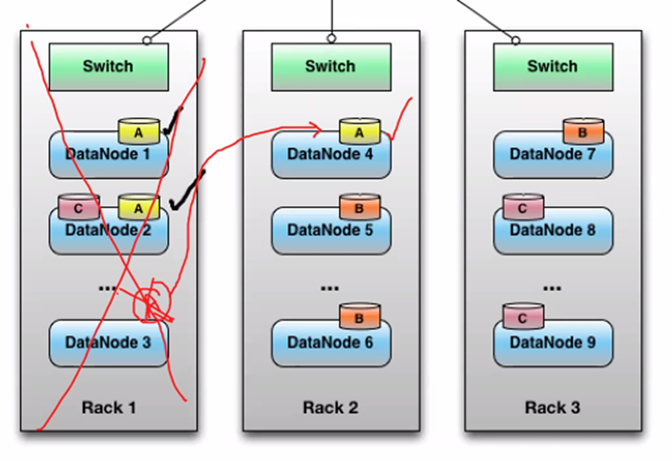

# Day 02 - Big Data Technologies

## HDFS

1. HDFS stands for Hadoop Distributed File System
2. Based on Master-Slave Architecture
3. Basic rule : more the number of partitions/divisions, faster the processing
4. HDFS = Master (NameNodes) + Slaves(DataNodes)
5. *Metadata of Name Node*
    1. Contains File System (F.S.) image and Edit Logs
    2. In case, metadata is destroyed or Name Node goes down, all files in hadoop cluster become inaccessible
    3. Metadata is a very critical part of Hadoop cluster to access files
6. *Metadata of Block*
    1. Block IDs + Location/IP of Data Node storing a block
    2. Block Pool (BP)
7. Block Size
    1. Size of split being created
    2. Default block size in HDFS (Hadoop v3) is 128MB (but Hadoop v2 or previous had default block size 64MB)
    3. e.g. : A file of 10GB size with default block size of 128MB splits into 80 blocks
        - ${\frac{10GB}{128MB}} = \frac{10GB \times 1024MB}{128MB} = 80\ Splits\ or\ Blocks$
        - ${\frac{1TB}{128MB} = \frac{1TB \times 1024GB \times 1024MB}{128MB} = 8192\ Splits\ or\ Blocks}$

8. Client Machine/Gateway
    1. Also known as *Gateway*, refers to the interface to communicate with the Hadoop File System
    2. Users can connect to HDFS using Client/Gateway
    3. User can fire queries using Client
    4. Can Read/Write data to Data Nodes using Name Node
    5. While writing a file, client Splits the file as per default Block Size and sends files to Name Node for storage
    6. Client only writes the first replica, but other replicas are created by Name Node
    7. While reading a file, Client only sends the filename to Name node and it fetches the data
    8. Client can delete old data using hdfs `-rm` command, and all the blocks along with their Metadata will be deleted from hdfs
    9. Filesystem Client has following commonly used types
        1. `hdfs dfs` : Basic Filesystem Client, used to connect to a Hadoop Filesystem and perform basic Linux related tasks, uses *ClientProtocol* to communicate with a Name Node daemon, and connects directly to Data Nodes to Read/Write Block Data
        2. `hdfs dfsadmin` : to perform administrative tasks on HDFS
        3. `hdfs haadmin` : for High-Availability (H.A.) tasks
9. HDFS Has two types of Nodes in Hadoop cluster:
    1. **Master Node/Name Node**
        1. Only one Master Node / Name Node can exist which manages the Hadoop cluster
        2. NameNode is a very powerful machine as it has to do cluster management tasks
        3. It should always be in a running state, otherwise files become inaccessible
        4. Based on UNIX + Hadoop + Java
        5. Assigns Block Pool, Block IDs and Locations/IPs of Data Node to splits of file received from client to store on Data Node
        6. Contains Metadata which includes FS (File System) image and Edit Logs
        7. Manages all the Slave/Data Nodes in Hadoop cluster, manage data and communication between Slave/Data Nodes
        8. Sends heartbeat signal *to Zookeeper* for monitoring
        9. Runs Resource Manager (R.M.) service to manage resources and Jobs on Data Nodes
    2. **Slave Node/Data Node**
        1. There may be number of Slave Nodes called Data Nodes
        2. Minimum one Data Node is required for cluster
        3. Can be of heterogeneous configuration
        4. Sends heartbeat signal *to Name Node* every 3 secs
        5. Sends block report to Name Node every 30 secs
        6. Runs Node Manager service which accepts tasks and resources (files) from Resource Manager (R.M.) on Name Node to store & process data
        7. Data is stored on Slave Nodes/Data Nodes as splits distributed over different Data Nodes
10. Apache Zookeeper
    1. A separate set of centralized services for maintaining configuration information, naming, providing distributed synchronization, and providing group services
    2. Monitors health of every Name Node
    3. Adds automatic failover capabilities to an HDFS deployment
    4. Zookeeper is a highly available service for maintaining small amounts of coordination data, notifying clients of changes in that data, and monitoring clients for failures
    5. HDFS relies on Zookeeper for following
        1. **Failure Detection:** Each of Name Node machines in the cluster maintains a persistent session in Zookeeper. If the Name Node crashes, the Zookeeper session will expire, notifying the other Name Node (Standby NameNode) that a failover should be triggered
        2. **Active NameNode Election:** Zookeeper provides a simple mechanism to exclusively elect a NameNode as active. If the current active NameNode crashes, another node may take a special exclusive lock in Zookeeper to indicating that it should become the next active NameNode

## Objectives of Cluster

- Cluster means a collection of computers/servers and other resources, that are networked together, so they acts as a single entity to perform parallel computations, enabling high-availability and load-balancing
- An HDFS cluster consists of a single Name Node, a master server that manages the file system namespace and regulates access to files by clients. In addition, there are a number of Data Nodes, usually one per node in the cluster, which manages storage attached to the nodes that they run on.
    1. To store data
    2. To perform parallel processing


## Fault Tolerance in Hadoop

- Fault Tolerance is the ability to handle any faults in the system
- Fault Tolerance in hadoop is implemented using three methods
    1. Method 1 - **Replication Factor (R.F.)**
        1. In case one node goes down, another replica can be created from nodes which are active, so it is needed in a Distributed System
        2. Represents the Number of replicas being created
        3. An automatic procedure performed by Name Node while writing a file or when a Data Node goes down
        4. *Default* Replication Factor is **3**, and *Minimum* Replication Factor is **1**, *Maximum* Replication Factor is **512**
        5. Replication Factor can be changed to factor ‘n’ using command

            ```bash
            hadoop fs -setrep <n> file1 # syntax to set RF to 'n'
            hadoop fs -setrep 4 file1   # sets RF to 4
            ```

        6. Replication Factor should not be more than number of Data Nodes in cluster

            ```text
            Replication Factor ≤ Number of Data Nodes
            ```

        7. Client only writes the first replica, but other replicas are created by Name Node
        8. *Under-Replication*
            1. When there are less replicas than the set replication factor
            2. e.g.:
                - A file of 950GB is stored on 1TB cluster will have only 1 replica possible
                - But if RF is 3, if we want to store 1PB data on 10 Data Nodes
                - Then 3 replicas will be created, so effectively we have ${1PB×3\ RF = 1024TB×3\ RF = 3076TB}$ to store on Data Nodes
                - And, if we want to store this much data on 10 Data Nodes, the size that will be eaten up on each Data Node will be ${\frac{3076TB}{10\ Data\ Nodes} = 307.6TB ≈ 308TB}$
                
            3. Immediate solution for Under-Replication is to EITHER delete the extra files to create more space, so that hadoop can automatically create more replicas as per set Replication Factor (R.F.) OR user can reduce the Replication Factor (R.F.) to the existing number of replicas
        9. No two replicas should be on same node
        
        
    2. Method 2 - **Rack Awareness**
        1. Represents creating a 3rd copy or *Disaster Recovery (DR)* copy
        2. Placing the nodes not in one location, but at at-least 2 different locations
        3. Storing data in *different Racks* at *different Locations* to avoid failure of the cluster all at once
        4. Hadoop cluster consists of all the racks at different locations
        5. Each rack contains multiple Data Nodes
        
    3. Method 3 - **Backup Node**
        1. **Secondary Name Node**
            1. Existed till Hadoop v2.0
            2. Serves as backup for Active Name Node
            3. Backup of Metadata which includes File System (FS) image and Edit Logs, is taken every 1 hour from Active Name Node to Secondary Name Node
            4. Can recover to last backup which was taken within last 1 hour
            5. Causes lot of downtime, as recovering becomes difficult because it can only be recovered to the last backup and the jobs are lost which are launched after backup was taken
        2. **Standby Name Node**
            1. Exists from Hadoop v3.0
            2. Is a “perfect” replica of Active Name Node
            3. Backup of Metadata which includes File System (F.S.) Image and Edit Logs, is taken simultaneously
            4. Can recover to immediate state of Active Name Node, so no running job is lost
            5. Near to zero downtime as hot Standby Name Node starts working immediately after Active Name Node goes down
            6. Hadoop v3.x+ supports mode than 2 NameNode (or more than 1 Standby NameNode)
            

## Types of failures

1. **Block Failure:** One or more blocks get corrupt, so NameNode replicates only the corrupt
block(s) by copying the corrupt Blocks from other replicas of those blocks
2. **Node Failure:** DataNode fails, so NameNode replicates the blocks stored on the failing
Data Node to other Data Node to maintain replication factor
3. **Location Failure/Rack Failure:** A rack or some of the nodes are down
4. **Name Node Failure:** Standby Node is automatically launched using failover trigger in case Name Node fails

## Properties of Hadoop System

1. Reliable
2. Economical
3. Failure Tolerant
4. scalable

## Hadoop Web Shell Commands

- Web Shell connects to gateway

### `hadoop fs` command

```bash
[bigdatalab456422@ip-10-1-1-204 ~]$ hadoop fs
```


### Listing root directory of hadoop fs

```bash
[bigdatalab456422@ip-10-1-1-204 ~]$ hadoop fs -ls /
```


### Create a file in client machine file system

- Create a file named `file1.txt` using vi editor

```bash
[bigdatalab456422@ip-10-1-1-204 ~]$ vi file1.txt
```

- Now add the below content to this file using `:i` command for insert mode, and then save it using `:wq` command, you may use `ESC` key to go back to command mode

```text
this is a unix file
we will be uploading on hdfs
```

- Now run below command to concatenate the file contents on default output stream

```bash
[bigdatalab456422@ip-10-1-1-204 ~]$ cat file1.txt
```


- Now run long-listing command to locate `file1.txt` file

```bash
[bigdatalab456422@ip-10-1-1-204 ~]$ ll
```

```console
total 4
-rw-rw-r-- 1 bigdatalab456422 bigdatalab456422 50 May 16 12:19 file1.txt
```

### `put` one file to hdfs

- run command below to copy/put the file from client machine file system to hdfs

```bash
[bigdatalab456422@ip-10-1-1-204 ~]$ hadoop fs -put file1.txt /user/bigdatalab456422
```

- Now list files on hdfs

```bash
[bigdatalab456422@ip-10-1-1-204 ~]$ hadoop fs -ls /user/bigdatalab456422
```

```console
Found 1 items
-rw-r--r-- 3 bigdatalab456422 bigdatalab456422 50 2023-05-16 12:22 /user/bigdatalab456422/file1.txt
```

- Now concatenate the contents of `file1.txt` file on hdfs to default output stream

```bash
[bigdatalab456422@ip-10-1-1-204 ~]$ hadoop fs -cat /user/bigdatalab456422/file1.txt
```


### Creating a directory in hdfs

- use below command to create a directory `training` in hdfs

```bash
[bigdatalab456422@ip-10-1-1-204 ~]$ hadoop fs -mkdir /user/bigdatalab456422/training
```

- Now, list the content and locate the newly created directory

```bash
[bigdatalab456422@ip-10-1-1-204 ~]$ hadoop fs -ls /user/bigdatalab456422
```

```console
Found 2 items
-rw-r--r-- 3 bigdatalab456422 bigdatalab456422 50 2023-05-16 12:22 /user/bigdatalab456422/file1.txt
drwxr-xr-x - bigdatalab456422 bigdatalab456422 0 2023-05-16 12:25 /user/bigdatalab456422/training
```

### `put` another file to hdfs

- first create another new file in Client file system

```bash
touch file2.txt
```

- Now, `put` this file to hdfs

```bash
[bigdatalab456422@ip-10-1-1-204 ~]$ hadoop fs -put file2.txt /user/bigdatalab456422/training
```

### Move a file within hdfs

- use command below to move `file1.txt` and `file2.txt` from hdfs user directory to `training/` directory on hdfs

```bash
[bigdatalab456422@ip-10-1-1-204 ~]$ hadoop fs -mv /user/bigdatalab456422/file1.txt /user/bigdatalab456422/training
[bigdatalab456422@ip-10-1-1-204 ~]$ hadoop fs -mv /user/bigdatalab456422/file2.txt /user/bigdatalab456422/training
```

- Use the `hdfs fs -mv` utility to rename `file1.txt` to `newfile.txt`

```bash
[bigdatalab456422@ip-10-1-1-204 ~]$ hadoop fs -mv /user/bigdatalab456422/training/file1.txt /user/bigdatalab456422/training/newfile.txt
```

- Now list the files in in `training/` directory in hdfs to locate the `file2.txt` and `newfile.txt` files

```bash
[bigdatalab456422@ip-10-1-1-204 ~]$ hadoop fs -ls /user/bigdatalab456422/training
```

```console
Found 2 items
-rw-r--r-- 3 bigdatalab456422 bigdatalab456422 20 2023-05-16 12:32 /user/bigdatalab456422/training/file2.txt
-rw-r--r-- 3 bigdatalab456422 bigdatalab456422 50 2023-05-16 12:22 /user/bigdatalab456422/training/newfile.txt
```

- Now list the files in hdfs user directory to check its contents after moving the files

```bash
[bigdatalab456422@ip-10-1-1-204 ~]$ hadoop fs -ls /user/bigdatalab456422
```

```console
Found 1 items
drwxr-xr-x - bigdatalab456422 bigdatalab456422 0 2023-05-16 12:34 /user/bigdatalab456422/training
```

### Copy a file within hdfs

- use command below to copy `newfile.txt` in `training/` directory on hdfs to hdfs user directory

```bash
[bigdatalab456422@ip-10-1-1-204 ~]$ hadoop fs -cp /user/bigdatalab456422/training/newfile.txt /user/bigdatalab456422/
```

- Now, list the contents of hdfs user directory which should show the copied file

```bash
[bigdatalab456422@ip-10-1-1-204 ~]$ hadoop fs -ls /user/bigdatalab456422/
```

```console
Found 2 items
-rw-r--r-- 3 bigdatalab456422 bigdatalab456422 50 2023-05-16 12:43 /user/bigdatalab456422/newfile.txt
drwxr-xr-x - bigdatalab456422 bigdatalab456422 0 2023-05-16 12:34 /user/bigdatalab456422/training
```

### Delete a file on hdfs (Move to trash) using hdfs `-rm` utility

- Use the command below to delete the `newfile.txt` in `training/` directory

```bash
[bigdatalab456422@ip-10-1-1-204 ~]$ hadoop fs -rm /user/bigdatalab456422/training/newfile.txt
```

```console
23/05/16 12:46:15 INFO fs.TrashPolicyDefault: Moved: 'hdfs://nameservice1/user/bigdatalab456422/training/newfile.txt' to trash at: hdfs://nameservice1/user/bigdatalab456422/.Trash/Current/user/bigdatalab456422/training/newfile.txt
```

### Deleting an empty directory in hdfs using hdfs `-rmdir` utility

- You may use the command below to create an empty directory

```bash
[bigdatalab456422@ip-10-1-1-204 ~]$ hadoop fs -mkdir /user/bigdatalab456422/training2
```

- Now, Use the command below to delete this empty directory

```bash
[bigdatalab456422@ip-10-1-1-204 ~]$ hadoop fs -rmdir /user/bigdatalab456422/training2
```

### Delete a non-empty directory in hdfs

- First try to use the command below with hdfs `-rmdir` utility (same as above) to delete a non-empty directory on hdfs, and notice that it does not allow to delete a non-empty directory on hdfs

```bash
[bigdatalab456422@ip-10-1-1-204 ~]$ hadoop fs -rmdir /user/bigdatalab456422/training
```

```console
rmdir: '/user/bigdatalab456422/training': Directory is not empty
```

- Instead you may use hdfs `rmr` utility to delete/remove directories recursively, to be used to remove non-empty directories which need to be removed recursively

```bash
[bigdatalab456422@ip-10-1-1-204 ~]$ hadoop fs -rmr /user/bigdatalab456422/training
```

```console
rmr: DEPRECATED: Please use '-rm -r' instead.
23/05/16 13:04:53 INFO fs.TrashPolicyDefault: Moved: 'hdfs://nameservice1/user/bigdatalab456422/training' to trash at: hdfs://nameservice1/user/bigdatalab456422/.Trash/Current/user/bigdatalab456422/training
```

> **Alternate:** Since `rmr` utility is deprecated, so you may use `-rm -r` to delete/remove non-empty directories recursively
