# Day 03 - BigDataTechnologies

## Hadoop Web Shell Commands

- Web Shell connects to gateway
- Use your credentials to log into Nuevopro Web Shell

### Create a directory `training/` in hdfs

- Use command below to create a directory `training/` in hdfs

  ```bash
  [bigdatalab456422@ip-10-1-1-204 ~]$ hadoop fs -mkdir training
  ```

  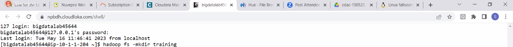

  - Now list content of current directory to see the newly created directory

  ```bash
  [bigdatalab456422@ip-10-1-1-204 ~]$ hadoop fs -ls
  ```

  ```console
  Found 3 items
  drwx------ - bigdatalab456422 bigdatalab456422 0 2023-05-16 14:00 .Trash
  -rw-r--r-- 3 bigdatalab456422 bigdatalab456422 50 2023-05-16 12:43 newfile.txt
  drwxr-xr-x - bigdatalab456422 bigdatalab456422 0 2023-05-17 08:37 training
  ```

### Upload a file to Hadoop client/gateway using FTP

- Upload a dataset file named `NYSE.csv` to Hadoop gateway/client using FTP option
- Upload another file named `eclipse-standard-kepler-R-linux-gtk.tar.gz` to Hadoop gateway/client using FTP option
  - Now long-list the files to verify if the file is uploaded

  ```bash
  [bigdatalab456422@ip-10-1-1-204 ~]$ ls -l
  ```

  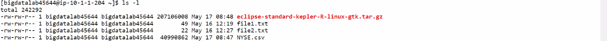

- Now rename the `eclipse-standard-kepler-R-linux-gtk.tar.gz` file to `eclipse.tar.gz` using linux `mv` command

  ```bash
  [bigdatalab456422@ip-10-1-1-204 ~]$ mv eclipse-standard-kepler-R-linux-gtk.tar.gz eclipse.tar.gz
  ```

  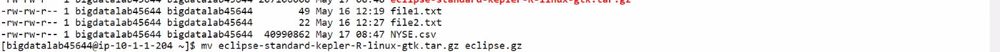

  - Now long-list the files to verify if the file is renamed

  ```bash
  [bigdatalab456422@ip-10-1-1-204 ~]$ ls -l
  ```

  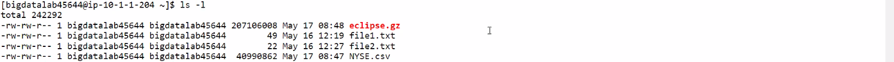

### `put` files from client to hdfs

- Use commands below to copy/put `NYSE.csv` and `eclipse.gz` to `training/` directory on hdfs

  ```bash
  [bigdatalab456422@ip-10-1-1-204 ~]$ hadoop fs -put NYSE.csv training
  [bigdatalab456422@ip-10-1-1-204 ~]$ hadoop fs -put eclipse.gz training
  ```

  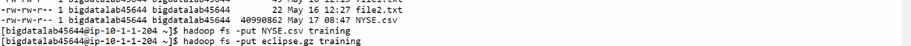

### create a file using `fallocate`

- Use command below to create a file `myfile` of size 200M on hdfs using `fallocate` utility, so this will false allocate specified space by creating a file

  ```bash
  [bigdatalab456422@ip-10-1-1-204 ~]$ fallocate -l 200M myfile
  ```

  - Now long-list files in client/linux filesystem,and notice the space allocated to the `myfile` file

  ```bash
  [bigdatalab456422@ip-10-1-1-204 ~]$ ls -l
  ```

  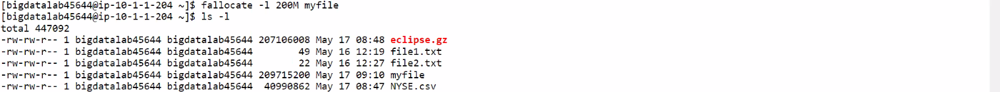

- Now remove the `eclipse.gz` file, as it is taking up space in client/linux filesystem and it has been put/copied to hdfs

  ```bash
  [bigdatalab456422@ip-10-1-1-204 ~]$ rm eclipse.gz
  ```

  - Now, list files in client/linux filesystem

  ```bash
  [bigdatalab456422@ip-10-1-1-204 ~]$ ll
  ```

  ```console
  total 244840
  -rw-rw-r-- 1 bigdatalab456422 bigdatalab456422 50 May 16 12:19 file1.txt
  -rw-rw-r-- 1 bigdatalab456422 bigdatalab456422 20 May 16 12:30 file2.txt
  -rw-rw-r-- 1 bigdatalab456422 bigdatalab456422 209715200 May 17 09:16 myfile
  -rw-rw-r-- 1 bigdatalab456422 bigdatalab456422 40990862 May 17 09:21 NYSE.csv
  ```

- Now create another file `myfile2` of size 500M using `fallocate` command

  ```bash
  [bigdatalab456422@ip-10-1-1-204 ~]$ fallocate -l 500M myfile2
  ```

  - List files in client/linux filesystem to check for `myfile2` file with 500M space allocated

  ```bash
  bigdatalab456422@ip-10-1-1-204 ~]$ ll
  ```

  ```console
  total 756844
  -rw-rw-r-- 1 bigdatalab456422 bigdatalab456422 50 May 16 12:19 file1.txt
  -rw-rw-r-- 1 bigdatalab456422 bigdatalab456422 20 May 16 12:30 file2.txt
  -rw-rw-r-- 1 bigdatalab456422 bigdatalab456422 209715200 May 17 09:16 myfile
  -rw-rw-r-- 1 bigdatalab456422 bigdatalab456422 524288000 May 17 09:35 myfile2
  -rw-rw-r-- 1 bigdatalab456422 bigdatalab456422 40990862 May 17 09:21 NYSE.csv
  ```

- Now, use hdfs `-put` utility to put/copy `myfile` and `myfile2` from client/linux filesystem to hdfs

  ```bash
  [bigdatalab456422@ip-10-1-1-204 ~]$ hadoop fs -put myfile training
  [bigdatalab456422@ip-10-1-1-204 ~]$ hadoop fs -put myfile2 training
  ```

  - Now, use hdfs `-ls` utility to list files in `training/` directory in hdfs, to verify that both files have been put successfully

  ```bash
  [bigdatalab456422@ip-10-1-1-204 ~]$ hadoop fs -ls training
  ```

  ```console
  Found 6 items
  -rw-r--r-- 3 bigdatalab456422 bigdatalab456422 40990862 2023-05-17 09:27 training/NYSE.csv
  -rw-r--r-- 3 bigdatalab456422 bigdatalab456422 207106008 2023-05-19 05:26 training/eclipse.gz
  -rw-r--r-- 4 bigdatalab456422 bigdatalab456422 209715200 2023-05-17 09:27 training/myfile
  -rw-r--r-- 3 bigdatalab456422 bigdatalab456422 524288000 2023-05-17 09:36 training/myfile2
  ```

### FileSystem check using `hadoop fsck` command

- Now do a file system check for `training/myfile` using `hadoop fsck` command, to check `files`, `blocks` and `locations`, so you'll get details of each of the replica of the specified file including details such as Block Pool (BP), replication, DataNodeinfoWithStorage, etc.

  ```bash
  [bigdatalab456422@ip-10-1-1-204 ~]$ hadoop fsck training/myfile -files -blocks -locations
  ```

  > **Note:** Since `hadoop fsck` is deprecated, you may use `hdfs fsck` for the same

  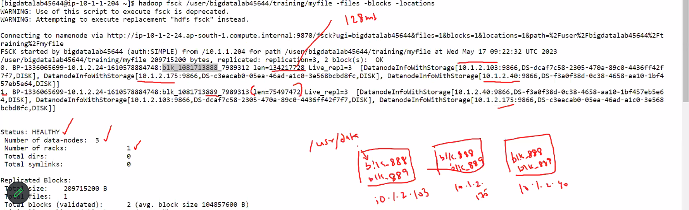

  - In the output, notice that it shows `replication=3` and `2 block(s): OK`, because file is of size 200M and default block size is 128M, so it created 2 blocks considering a factor of 128M

  ```console
  WARNING: Use of this script to execute fsck is deprecated.
  WARNING: Attempting to execute replacement "hdfs fsck" instead.

  Connecting to namenode via http://ip-10-1-2-24.ap-south-1.compute.internal:9870/fsck?ugi=bigdatalab456422&files=1&blocks=1&locations=1&path=%2Fuser%2Fbigdatalab456422%2Ftraining%2Fmyfile
  FSCK started by bigdatalab456422 (auth:SIMPLE) from /10.1.1.204 for path /user/bigdatalab456422/training/myfile at Wed May 17 09:28:35 UTC 2023
  /user/bigdatalab456422/training/myfile 209715200 bytes, replicated: replication=3, 2 block(s): OK
  0. BP-1336065699-10.1.2.24-1610578884748:blk_1081713995_7989428 len=134217728 Live_repl=3 [DatanodeInfoWithStorage[10.1.2.175:9866,DS-c3eacab0-05ea-46ad-a1c0-3e568bcbd8fc,DISK], DatanodeInfoWithStorage[10.1.2.40:9866,DS-f3a0f38d-0c38-4658-aa10-1bf457eb5e64,DISK], DatanodeInfoWithStorage[10.1.2.103:9866,DS-dcaf7c58-2305-470a-89c0-4436ff42f7f7,DISK]]
  1. BP-1336065699-10.1.2.24-1610578884748:blk_1081713996_7989429 len=75497472 Live_repl=3 [DatanodeInfoWithStorage[10.1.2.175:9866,DS-c3eacab0-05ea-46ad-a1c0-3e568bcbd8fc,DISK], DatanodeInfoWithStorage[10.1.2.40:9866,DS-f3a0f38d-0c38-4658-aa10-1bf457eb5e64,DISK], DatanodeInfoWithStorage[10.1.2.103:9866,DS-dcaf7c58-2305-470a-89c0-4436ff42f7f7,DISK]]


  Status: HEALTHY
    Number of data-nodes: 3
    Number of racks: 1
    Total dirs: 0
    Total symlinks: 0

  Replicated Blocks:
    Total size: 209715200 B
    Total files: 1
    Total blocks (validated): 2 (avg. block size 104857600 B)
    Minimally replicated blocks: 2 (100.0 %)
    Over-replicated blocks: 0 (0.0 %)
    Under-replicated blocks: 0 (0.0 %)
    Mis-replicated blocks: 0 (0.0 %)
    Default replication factor: 3
    Average block replication: 3.0
    Missing blocks: 0
    Corrupt blocks: 0
    Missing replicas: 0 (0.0 %)
    Blocks queued for replication: 0
    Erasure Coded Block Groups:
    Total size: 0 B
    Total files: 0
    Total block groups (validated): 0
    Minimally erasure-coded block groups: 0
    Over-erasure-coded block groups: 0
    Under-erasure-coded block groups: 0
    Unsatisfactory placement block groups: 0
    Average block group size: 0.0
    Missing block groups: 0
    Corrupt block groups: 0
    Missing internal blocks: 0
    Blocks queued for replication: 0

  FSCK ended at Wed May 17 09:28:35 UTC 2023 in 1 milliseconds
  The filesystem under path '/user/bigdatalab456422/training/myfile' is HEALTHY
  ```

- Now do a file system check for `training/myfile2` using `hadoop fsck` command

  ```bash
  [bigdatalab456422@ip-10-1-1-204 ~]$ hadoop fsck training/myfile2 -files -blocks -locations
  ```

  - In the output, notice that it shows `replication=3` and `4 block(s): OK`, because file is of size 500M and default block size is 128M, so it created 4 blocks considering a factor of 128M

  ```console
  WARNING: Use of this script to execute fsck is deprecated.
  WARNING: Attempting to execute replacement "hdfs fsck" instead.

  Connecting to namenode via http://ip-10-1-2-24.ap-south-1.compute.internal:9870/fsck?ugi=bigdatalab456422&files=1&blocks=1&locations=1&path=%2Fuser%2Fbigdatalab456422%2Ftraining%2Fmyfile2
  FSCK started by bigdatalab456422 (auth:SIMPLE) from /10.1.1.204 for path /user/bigdatalab456422/training/myfile2 at Wed May 17 09:38:11 UTC 2023
  /user/bigdatalab456422/training/myfile2 524288000 bytes, replicated: replication=3, 4 block(s): OK
  0. BP-1336065699-10.1.2.24-1610578884748:blk_1081714135_7989571 len=134217728 Live_repl=3 [DatanodeInfoWithStorage[10.1.2.103:9866,DS-dcaf7c58-2305-470a-89c0-4436ff42f7f7,DISK], DatanodeInfoWithStorage[10.1.2.175:9866,DS-c3eacab0-05ea-46ad-a1c0-3e568bcbd8fc,DISK], DatanodeInfoWithStorage[10.1.2.40:9866,DS-f3a0f38d-0c38-4658-aa10-1bf457eb5e64,DISK]]
  1. BP-1336065699-10.1.2.24-1610578884748:blk_1081714136_7989572 len=134217728 Live_repl=3 [DatanodeInfoWithStorage[10.1.2.175:9866,DS-c3eacab0-05ea-46ad-a1c0-3e568bcbd8fc,DISK], DatanodeInfoWithStorage[10.1.2.103:9866,DS-dcaf7c58-2305-470a-89c0-4436ff42f7f7,DISK], DatanodeInfoWithStorage[10.1.2.40:9866,DS-f3a0f38d-0c38-4658-aa10-1bf457eb5e64,DISK]]
  2. BP-1336065699-10.1.2.24-1610578884748:blk_1081714137_7989573 len=134217728 Live_repl=3 [DatanodeInfoWithStorage[10.1.2.103:9866,DS-dcaf7c58-2305-470a-89c0-4436ff42f7f7,DISK], DatanodeInfoWithStorage[10.1.2.40:9866,DS-f3a0f38d-0c38-4658-aa10-1bf457eb5e64,DISK], DatanodeInfoWithStorage[10.1.2.175:9866,DS-c3eacab0-05ea-46ad-a1c0-3e568bcbd8fc,DISK]]
  3. BP-1336065699-10.1.2.24-1610578884748:blk_1081714138_7989574 len=121634816 Live_repl=3 [DatanodeInfoWithStorage[10.1.2.103:9866,DS-dcaf7c58-2305-470a-89c0-4436ff42f7f7,DISK], DatanodeInfoWithStorage[10.1.2.175:9866,DS-c3eacab0-05ea-46ad-a1c0-3e568bcbd8fc,DISK], DatanodeInfoWithStorage[10.1.2.40:9866,DS-f3a0f38d-0c38-4658-aa10-1bf457eb5e64,DISK]]


  Status: HEALTHY
    Number of data-nodes: 3
    Number of racks: 1
    Total dirs: 0
    Total symlinks: 0

  Replicated Blocks:
    Total size: 524288000 B
    Total files: 1
    Total blocks (validated): 4 (avg. block size 131072000 B)
    Minimally replicated blocks: 4 (100.0 %)
    Over-replicated blocks: 0 (0.0 %)
    Under-replicated blocks: 0 (0.0 %)
    Mis-replicated blocks: 0 (0.0 %)
    Default replication factor: 3
    Average block replication: 3.0
    Missing blocks: 0
    Corrupt blocks: 0
    Missing replicas: 0 (0.0 %)
    Blocks queued for replication: 0
    Erasure Coded Block Groups:
    Total size: 0 B
    Total files: 0
    Total block groups (validated): 0
    Minimally erasure-coded block groups: 0
    Over-erasure-coded block groups: 0
    Under-erasure-coded block groups: 0
    Unsatisfactory placement block groups: 0
    Average block group size: 0.0
    Missing block groups: 0
    Corrupt block groups: 0
    Missing internal blocks: 0
    Blocks queued for replication: 0

  FSCK ended at Wed May 17 09:38:11 UTC 2023 in 0 milliseconds
  The filesystem under path '/user/bigdatalab456422/training/myfile2' is HEALTHY
  ```

### Change Replication Factor (R.F.)

- Use hdfs `-setrep` to set/update the Replication Factor (R.F.) to a new value of 4 for file `training/myfile`

  ```bash
  [bigdatalab456422@ip-10-1-1-204 ~]$ hadoop fs -setrep 4 training/myfile
  ```

  ```console
  Replication 4 set: training/myfile
  ```

  - Now list the files in `training` directory in hdfs to verify the new Replication Factor (R.F.)

  ```bash
  [bigdatalab456422@ip-10-1-1-204 ~]$ hadoop fs -ls training
  ```

  Notice the number **4** before the owner for `myfile` which indicates the successful update in replication factor

  ```console
  Found 3 items
  -rw-r--r-- 3 bigdatalab456422 bigdatalab456422 40990862 2023-05-17 09:27 training/NYSE.csv
  -rw-r--r-- 4 bigdatalab456422 bigdatalab456422 209715200 2023-05-17 09:27 training/myfile
  -rw-r--r-- 3 bigdatalab456422 bigdatalab456422 524288000 2023-05-17 09:36 training/myfile2
  ```

- Now run the hadoop FileSystem Check again to check for any changes due to new replication factor

  ```bash
  [bigdatalab456422@ip-10-1-1-204 ~]$ hadoop fsck training/myfile -files -blocks -locations
  ```

  - In output, notice that it shows
    1. `replication=4`, which reflects new Replication Factor (R.F.)
    2. `2 block(s): Under replicated`, which indicates that currently there are 2 blocks, both of which are Under Replicated
    3. in block pool (`BP`) details, it shows, `Target Replicas is 4 but found 3 live replica(s), 0 decommissioned replica(s), 0 decommissioning replica(s)`
    4. In `Replicated Blocks:`, it shows `Missing replicas: 2 (25.0 %)`

  ```console
  WARNING: Use of this script to execute fsck is deprecated.
  WARNING: Attempting to execute replacement "hdfs fsck" instead.

  Connecting to namenode via http://ip-10-1-2-24.ap-south-1.compute.internal:9870/fsck?ugi=bigdatalab456422&files=1&blocks=1&locations=1&path=%2Fuser%2Fbigdatalab456422%2Ftraining%2Fmyfile
  FSCK started by bigdatalab456422 (auth:SIMPLE) from /10.1.1.204 for path /user/bigdatalab456422/training/myfile at Wed May 17 09:44:30 UTC 2023
  /user/bigdatalab456422/training/myfile 209715200 bytes, replicated: replication=4, 2 block(s):
    Under replicated BP-1336065699-10.1.2.24-1610578884748:blk_1081713995_7989428. Target Replicas is 4 but found 3 live replica(s), 0 decommissioned replica(s), 0 decommissioning replica(s).
    Under replicated BP-1336065699-10.1.2.24-1610578884748:blk_1081713996_7989429. Target Replicas is 4 but found 3 live replica(s), 0 decommissioned replica(s), 0 decommissioning replica(s).
  0. BP-1336065699-10.1.2.24-1610578884748:blk_1081713995_7989428 len=134217728 Live_repl=3 [DatanodeInfoWithStorage[10.1.2.175:9866,DS-c3eacab0-05ea-46ad-a1c0-3e568bcbd8fc,DISK], DatanodeInfoWithStorage[10.1.2.40:9866,DS-f3a0f38d-0c38-4658-aa10-1bf457eb5e64,DISK], DatanodeInfoWithStorage[10.1.2.103:9866,DS-dcaf7c58-2305-470a-89c0-4436ff42f7f7,DISK]]
  1. BP-1336065699-10.1.2.24-1610578884748:blk_1081713996_7989429 len=75497472 Live_repl=3 [DatanodeInfoWithStorage[10.1.2.175:9866,DS-c3eacab0-05ea-46ad-a1c0-3e568bcbd8fc,DISK], DatanodeInfoWithStorage[10.1.2.40:9866,DS-f3a0f38d-0c38-4658-aa10-1bf457eb5e64,DISK], DatanodeInfoWithStorage[10.1.2.103:9866,DS-dcaf7c58-2305-470a-89c0-4436ff42f7f7,DISK]]


  Status: HEALTHY
    Number of data-nodes: 3
    Number of racks: 1
    Total dirs: 0
    Total symlinks: 0

  Replicated Blocks:
    Total size: 209715200 B
    Total files: 1
    Total blocks (validated): 2 (avg. block size 104857600 B)
    Minimally replicated blocks: 2 (100.0 %)
    Over-replicated blocks: 0 (0.0 %)
    Under-replicated blocks: 2 (100.0 %)
    Mis-replicated blocks: 0 (0.0 %)
    Default replication factor: 3
    Average block replication: 3.0
    Missing blocks: 0
    Corrupt blocks: 0
    Missing replicas: 2 (25.0 %)
    Blocks queued for replication: 0
    Erasure Coded Block Groups:
    Total size: 0 B
    Total files: 0
    Total block groups (validated): 0
    Minimally erasure-coded block groups: 0
    Over-erasure-coded block groups: 0
    Under-erasure-coded block groups: 0
    Unsatisfactory placement block groups: 0
    Average block group size: 0.0
    Missing block groups: 0
    Corrupt block groups: 0
    Missing internal blocks: 0
    Blocks queued for replication: 0

  FSCK ended at Wed May 17 09:44:30 UTC 2023 in 0 milliseconds
  The filesystem under path '/user/bigdatalab456422/training/myfile' is HEALTHY
  ```

## Configuration Files in Hadoop

### Configuration Files for Default values

1. **core-default.xml**
2. **hdfs–default.xml**
    - for using default values
    - You may find the hdfs-default.xml file at
    [https://hadoop.apache.org/docs/r2.4.1/hadoop-project-dist/hadoop-hdfs/hdfs-default.xml](https://hadoop.apache.org/docs/r2.4.1/hadoop-project-dist/hadoop-hdfs/hdfs-default.xml)
3. **mapred-default.xml**
4. **yarn-default.xml**

### Configuration Files for Site (modified) values

- These Site (modified) configuration files are present in the `hadoop-x.x.x/etc/hadoop` directory inside the directory which you've extracted/installed the hadoop

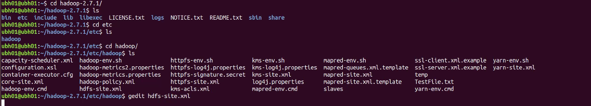

1. **core-site.xml**

    1. `hadoop.tmp.dir`: A base for other temporary directories

        ```xml
        <name>hadoop.tmp.dir</name>
        <value>/app/hadoop/tmp</value>
        <description>A base for other temporary directories.</ description>
        ```

    2. `fs.default.name`: URI whose scheme and authority determine the FileSystem implementation

        ```xml
        <name>fs.default.name</name>
        <value>hdfs://localhost:54310</value>
        <description>The name of the default file system. A URI whose scheme and authority determine the FileSystem implementation. The uri's scheme determines the config property (fs.SCHEME.impl) naming the FileSystem implementation class. The uri's authority is used to determine the host, port, etc. for a filesystem.</description>
        ```

2. **mapred-site.xml**
    1. `mapred.job.tracker`: URI of MapReduce Job tracker

        ```xml
        <name>mapred.job.tracker</name>
        <value>localhost:54311</value>
        <description>The host and port that the MapReduce job tracker runs at. If "local", then jobs are run in-process as a single map and reduce task.</description>
        ```

3. **hdfs-site.xml**
    1. `dfs.replication`: Default block Replication Factor to be used when Replication Factor is not specified

        ```xml
        <name>dfs.replication</name>
        <value>1</value>
        <description>Default block replication. The actual number of replications can be specified when the file is created. The default is used if replication is not specified in create time.</description>
        ```

    2. `dfs.blocksize`: dfs block size, overrides the default value of 128M in Hadoop v3.x+

        ```xml
        <name>dfs.blocksize</name>
        <value>27M</value>
        ```

    3. `dfs.namenode.name.dir`: NameNode Directory

        ```xml
        <name>dfs.namenode.name.dir</name>
        <value>file:/usr/local/hadoop_store/hdfs/namenode</value>
        ```

    4. `dfs.datanode.data.dir`: DataNode Directory

        ```xml
        <name>dfs.datanode.data.dir</name>
        <value>file:/usr/local/hadoop_store/hdfs/datanode</value>
        ```

## Starting Hadoop System

- Use command below to start Hadoop system

```bash
sdevsinx@sdevsinx-marshalVB:~$ start-dfs.sh
```

### jps

- jps stands for `Java Process Status`
- jps tool allows you to scan for each running instance of Java Virtual Machine (JVM)
- After starting Hadoop System, `jps` command should show the Process IDs and following processes
    1. `Jps` itself
    2. `NameNode`
    3. `DataNode`
    4. `SecondaryNameNode`
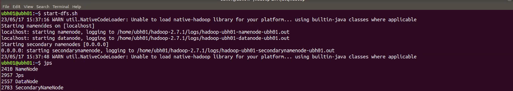

## Map-Reduce (MapRed)

- It has two tasks
    1. `Map` task: filters data
    2. `Reduce` task: Processes the filtered Data

## Hadoop Distributed File System (HDFS)

- It primarily has two kinds of Nodes
    1. `NameNode`: only one active NameNode can exist, but there can be more than one `StandbyNameNode`
    2. `DataNodes`: Read + Write

## Yet Another Resource Manager (YARN)

- It has three kinds of managers involved with it
    1. `ResourceManager (RM)`: works at NameNode to perform resource management
    2. `NodeManager (NM)`: works at DataNode to manage processes
    3. `ApplicationMaster (AM)`: works at container level to manage the resources in that container

### Resource Manager (RM)

1. Works at NameNode (MasterNode) to handle query
2. Schedules jobs
3. Starts separate instances of temporary service (ApplicationMaster) for each of the
query/job received by RM from client
4. Gets Node status from Node Managers at each of the DataNode

### Node Manager (NM)

1. Works at DataNode (SlaveNode) to manage the ApplicationMaster & container(s) for query
2. Communicates with Resource Manager to manage processes

### Application Master (AM)

1. Manages containers for each node and gets MapReduce status from each of the Containers
2. Checks details of blocks from NameNode
3. Shares task (Mapper code) to NodeManager to process
4. Only one ApplicationMaster is launched per application being application specific, and runs in a container
5. can request to ResourceManager at NameNode for more containers to run application tasks

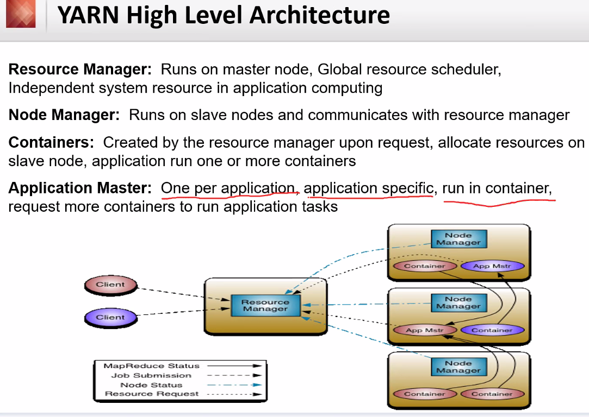

### Map-Reduce Job LifeCycle

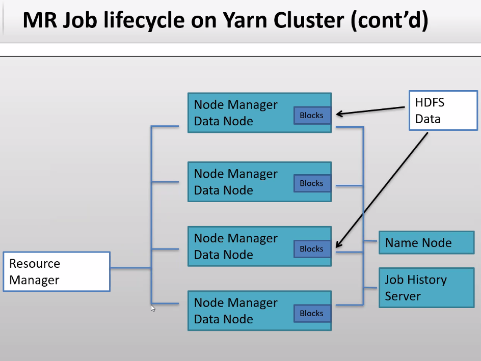

### Flow of Job in YARN Cluster

1. Job/query starts from client
2. YARN keeps Job History server keeps track of jobs being launched, but job history server is optional
3. Application master actually runs the job/query
4. YARN launches separate ApplicationManager/ApplicationMaster (AM) for each job/query
5. ApplicationManager/ApplicationMaster approaches NodeManager for block details
6. NameNode provides Metadata/block details to ApplicationManager/ApplicationMaster
7. Now logical split is evaluated, and required resources(memory) is calculated by ApplicationMaster
8. Based on resources calculated by ApplicationManager, ApplicationManager then requests resources from ResourceManager at NameNode
9. YARN job/query reaches ResourceManager at NameNode to launch containers with a temporary service i.e. ApplicationManager which will run job/query
10. ApplicationManager sends the MapperCode to NodeManager on the DataNode where data is located, so that data is processed by MapperCode

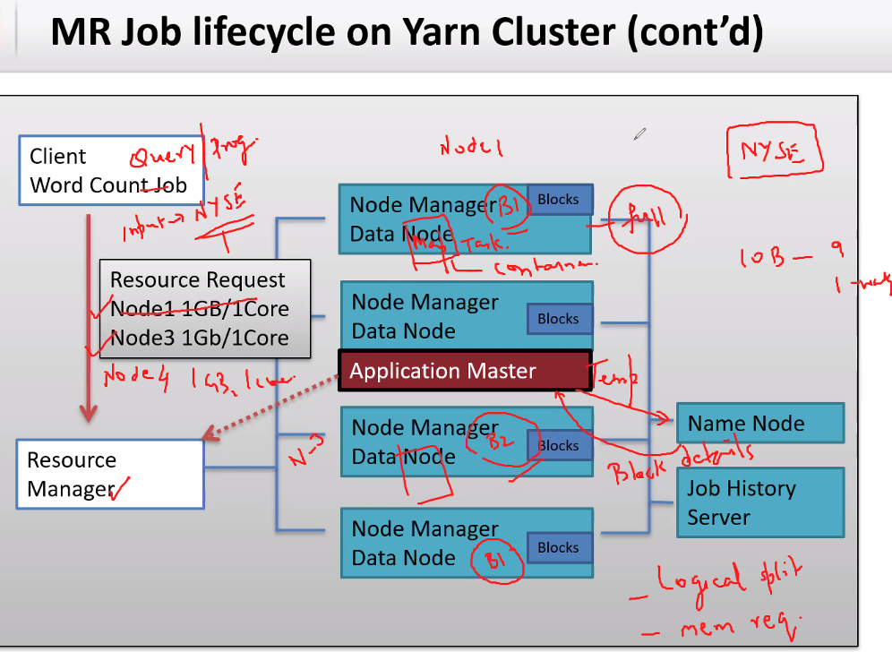
