# Day 04 - BigDataTechnologies

## Word Count Job

### MapReduce Job Lifecycle : Word Count

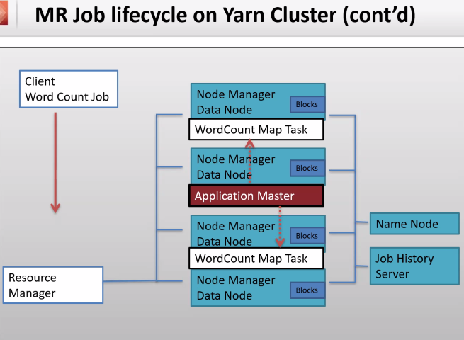

### Application Master (AM)

1. is a temporary Service
2. one coordinator for one job to handle one or more containers
3. Can be on any DataNode containing requested resources
4. Does not process data, but will coordinate the processing, while actual processing is performed by respective NodeManager on each DataNode
5. Data is processed locally by NodeManager on each DataNode

## MapReduce (MapRed)

1. `Mapper` : program to filter the data → results into (Key,Value)
2. `Reducer` : program to process/aggregate the mapper result in form of (Key,Value) → results into (Key,Value)

```text
Mapper : prog to filter the data -> key, val
Reducer : Prog to process/aggregate the mapper data -> k,v

Retail store example

store id, prod, qty_sold, price/unit,,,,,,


blk_1 [node 1]
1,201,5,80
1,202,10,20
2,201,20,80
2,202,30,20

blk_2 [node 3]
1,201,10,80
1,202,20,20
2,201,30,80
2,202,40,20

prob statement : find total qty sold for each prod
```

```sql
select prod, sum(qty_sold) from sales group by prod;
```

```text
key = prod
value = qty
```

### MapReduce vs. Spark

- `MapReduce` : Disk-based processing (Local Disk Storage -> Local Node Storage)
- `Spark` : Memory-based processing (in-memory storage)

### Stages in MapReduce

- Mappers are launched parallel for single job/query

1. **Mapper**
    1. Data is `filtered`
    2. Input is text format, output in key-value format
2. **Data Shuffling**
    1. First resource container is created for `Sort and Shuffle` stage
    2. Sort & Shuffle is processed on separate node
    3. Merging and then processing data on another node
    4. Format is (Key,[list of values from different nodes])
    5. Keys are sorted in ascending (ASC) order, while values are in random order
    6. Output of shuffling in Mapper stage (which also includes Data Shuffling stage) is now input for Reducer in (Key,Value) pair format
    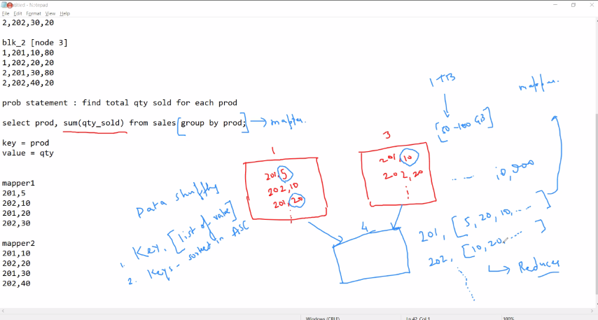
3. **Reducer**
    1. First resource container is launched for Reduce stage, Then reducer computes the final result And then it writes the final output to the HDFS
    2. Reducer is launched only once all the Mapping-Shuffling is complete
    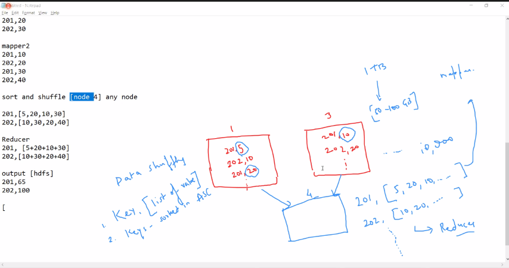

### find total volume for each stockID

```text
Mapper : prog to filter the data -> key, val
Reducer : Prog to process/aggregate the mapper data -> k,v

Retail store example

store id, prod, qty_sold, price/unit,,,,,,


blk_1 [node 1]
1,201,5,80
1,202,10,20
2,201,20,80
2,202,30,20

blk_2 [node 3]
1,201,10,80
1,202,20,20
2,201,30,80
2,202,40,20

prob statement : find total qty sold for each prod
```

```sql
select prod, sum(qty_sold) from sales group by prod;
```

```text
key = prod
value = qty

Mapper
--------
m1
1,400
1,200
2,1600
2,600

m2
1,800
1,400
2,2400
2,800

Shuffling
--------
1, [400,200,800,400]
2, [1600,600,2400,800]

Reducer
--------
1, [400+200+800+400]
2, [1600+600+2400+800]

Output
--------
1,1800
2,5400
```

#### Generating the .jar file

1. Launch Eclipse application using Java perspective, click OK for Workspace Launcher
2. Create a new project by going to `File > New > Java Project`
3. Enter project name as `Hadoop` and click Finish
4. Expand the Project `Hadoop` in the package explorer, `Right-click on Hadoop project > New > Class`
5. Enter the class name as `StockVolume` and click Finish
6. Add the below code to `StockVolume.java`, and save it, it might show some error because external jars are not added right now, but will be added in next step

    ```java
    import java.io.*;
    import org.apache.hadoop.io.Text;
    import org.apache.hadoop.io.LongWritable;
    import org.apache.hadoop.mapreduce.Job;
    import org.apache.hadoop.mapreduce.Mapper;
    import org.apache.hadoop.mapreduce.Reducer;
    import org.apache.hadoop.conf.*;
    import org.apache.hadoop.fs.*;
    import org.apache.hadoop.mapreduce.lib.input.*;
    import org.apache.hadoop.mapreduce.lib.output.*;


    public class StockVolume {
        
        public static class MapClass extends Mapper<LongWritable,Text,Text,LongWritable>
        {
            public void map(LongWritable key, Text value, Context context)
            {
                try{
                    String[] str = value.toString().split(",");
                    long vol = Long.parseLong(str[7]);
                    context.write(new Text(str[1]),new LongWritable(vol));
                }
                catch(Exception e)
                {
                    System.out.println(e.getMessage());
                }
            }
        }
        
        public static class ReduceClass extends Reducer<Text,LongWritable,Text,LongWritable>
        {
                private LongWritable result = new LongWritable();
                
                public void reduce(Text key, Iterable<LongWritable> values,Context context) throws IOException, InterruptedException {
                long sum = 0;
                    
                    for (LongWritable val : values)
                    {
                        sum += val.get();      
                    }
                    
                result.set(sum);
                context.write(key, result);
                //context.write(key, new LongWritable(sum));
                
                }
        }
        public static void main(String[] args) throws Exception {
                Configuration conf = new Configuration();
                //conf.set("name", "value")
                //conf.set("mapreduce.input.fileinputformat.split.minsize", "134217728");
                Job job = Job.getInstance(conf, "Volume Count");
                job.setJarByClass(StockVolume.class);
                job.setMapperClass(MapClass.class);
                //job.setCombinerClass(ReduceClass.class);
                job.setReducerClass(ReduceClass.class);
                job.setNumReduceTasks(1);
                job.setOutputKeyClass(Text.class);
                job.setOutputValueClass(LongWritable.class);
                FileInputFormat.addInputPath(job, new Path(args[0]));
                FileOutputFormat.setOutputPath(job, new Path(args[1]));
                System.exit(job.waitForCompletion(true) ? 0 : 1);
            }
    }
    ```

7. `Right-Click on Hadoop project > Build Path > Configure Build Path`, select the `Libraries` tab, and click on `Add external jars`, click on File System and add two jar files which are `hadoop-common.jar` and `hadoop-mapreduce-client-core.jar`
8. After saving the changes, there should not be any *ERROR* in java program
9. `Right-Click on Hadoop Project > Export > Java > Jar File > Next >` Enter the jar file name as `myjar.jar` with full path in export destination, click on Finish

#### Upload .jar file using FTP

- Upload the `myjar.jar` file which you've generated by compiling the Java code for MapReduce task
- Now list the contents of Client/Linux file system

```bash
[bigdatalab456422@ip-10-1-1-204 ~]$ ll
```

```console
total 959100
-rw-rw-r-- 1 bigdatalab456422 bigdatalab456422 207106008 May 17 12:44 eclipse.gz
-rw-rw-r-- 1 bigdatalab456422 bigdatalab456422        50 May 16 12:19 file1.txt
-rw-rw-r-- 1 bigdatalab456422 bigdatalab456422        20 May 16 12:30 file2.txt
-rw-rw-r-- 1 bigdatalab456422 bigdatalab456422 209715200 May 17 09:16 myfile
-rw-rw-r-- 1 bigdatalab456422 bigdatalab456422 524288000 May 17 09:35 myfile2
-rw-rw-r-- 1 bigdatalab456422 bigdatalab456422      4088 May 18 11:41 myjar.jar
-rw-rw-r-- 1 bigdatalab456422 bigdatalab456422  40990862 May 17 09:21 NYSE.csv
```

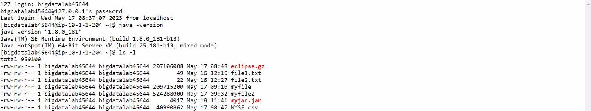

#### unzip the .jar file

- We need to extract the class file(s) from the .jar file, we extract it using `jar` command as by running the command below

```bash
[bigdatalab456422@ip-10-1-1-204 ~]$ jar tvf myjar.jar
```

```console
  25 Thu May 18 17:09:20 UTC 2023 META-INF/MANIFEST.MF
 387 Thu May 18 15:53:20 UTC 2023 .project
2408 Thu May 18 17:00:02 UTC 2023 StockVolume$MapClass.class
2349 Thu May 18 17:00:02 UTC 2023 StockVolume$ReduceClass.class
1697 Thu May 18 17:00:02 UTC 2023 StockVolume.class
 640 Thu May 18 17:00:00 UTC 2023 .classpath
```

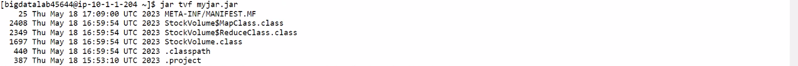

#### Run the MapReduce job using `hadoop jar` utility

- Run the command below to launch the MapReduce job for `StockVolume` class extracted from `myjar.jar` file, it'll read input from `training/NYSE.csv` dataset and it'll dump output/results in `training/out1` directory

```bash
[bigdatalab456422@ip-10-1-1-204 ~]$ hadoop jar myjar.jar StockVolume training/NYSE.csv training/out1
```

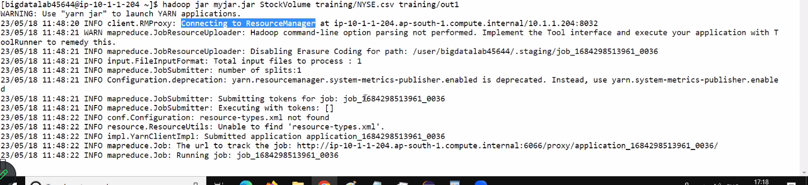

- In output verbose, notice that, in **Map-Reduce Framework** section
  - `Map input records=735026` is same as `Map output records=735026`, which is initially fed to Mapper
  - `Reduce input groups=203` is same as `Reduce output records=203`, which is after shuffling given to Reducer
  - `Shuffled Maps =1` and `Merged Map outputs=1`

```console
WARNING: Use "yarn jar" to launch YARN applications.
23/05/18 11:48:33 INFO client.RMProxy: Connecting to ResourceManager at ip-10-1-1-204.ap-south-1.compute.internal/10.1.1.204:8032
23/05/18 11:48:33 WARN mapreduce.JobResourceUploader: Hadoop command-line option parsing not performed. Implement the Tool interface and execute your application with ToolRunner to remedy this.
23/05/18 11:48:33 INFO mapreduce.JobResourceUploader: Disabling Erasure Coding for path: /user/bigdatalab456422/.staging/job_1684298513961_0041
23/05/18 11:48:34 INFO input.FileInputFormat: Total input files to process : 1
23/05/18 11:48:34 INFO mapreduce.JobSubmitter: number of splits:1
23/05/18 11:48:34 INFO Configuration.deprecation: yarn.resourcemanager.system-metrics-publisher.enabled is deprecated. Instead, use yarn.system-metrics-publisher.enabled
23/05/18 11:48:34 INFO mapreduce.JobSubmitter: Submitting tokens for job: job_1684298513961_0041
23/05/18 11:48:34 INFO mapreduce.JobSubmitter: Executing with tokens: []
23/05/18 11:48:34 INFO conf.Configuration: resource-types.xml not found
23/05/18 11:48:34 INFO resource.ResourceUtils: Unable to find 'resource-types.xml'.
23/05/18 11:48:34 INFO impl.YarnClientImpl: Submitted application application_1684298513961_0041
23/05/18 11:48:34 INFO mapreduce.Job: The url to track the job: http://ip-10-1-1-204.ap-south-1.compute.internal:6066/proxy/application_1684298513961_0041/
23/05/18 11:48:34 INFO mapreduce.Job: Running job: job_1684298513961_0041
23/05/18 11:48:58 INFO mapreduce.Job: Job job_1684298513961_0041 running in uber mode : false
23/05/18 11:48:58 INFO mapreduce.Job: map 0% reduce 0%
23/05/18 11:49:27 INFO mapreduce.Job: map 67% reduce 0%
23/05/18 11:49:29 INFO mapreduce.Job: map 100% reduce 0%
23/05/18 11:50:00 INFO mapreduce.Job: map 100% reduce 100%
23/05/18 11:50:01 INFO mapreduce.Job: Job job_1684298513961_0041 completed successfully
23/05/18 11:50:01 INFO mapreduce.Job: Counters: 54
File System Counters
        FILE: Number of bytes read=3584395
        FILE: Number of bytes written=7613961
        FILE: Number of read operations=0
        FILE: Number of large read operations=0
        FILE: Number of write operations=0
        HDFS: Number of bytes read=40990986
        HDFS: Number of bytes written=2918
        HDFS: Number of read operations=8
        HDFS: Number of large read operations=0
        HDFS: Number of write operations=2
        HDFS: Number of bytes read erasure-coded=0
Job Counters
        Launched map tasks=1
        Launched reduce tasks=1
        Data-local map tasks=1
        Total time spent by all maps in occupied slots (ms)=26310
        Total time spent by all reduces in occupied slots (ms)=28739
        Total time spent by all map tasks (ms)=26310
        Total time spent by all reduce tasks (ms)=28739
        Total vcore-milliseconds taken by all map tasks=26310
        Total vcore-milliseconds taken by all reduce tasks=28739
        Total megabyte-milliseconds taken by all map tasks=26941440
        Total megabyte-milliseconds taken by all reduce tasks=29428736
Map-Reduce Framework
        Map input records=735026
        Map output records=735026
        Map output bytes=8781587
        Map output materialized bytes=3584391
        Input split bytes=124
        Combine input records=0
        Combine output records=0
        Reduce input groups=203
        Reduce shuffle bytes=3584391
        Reduce input records=735026
        Reduce output records=203
        Spilled Records=1470052
        Shuffled Maps =1
        Failed Shuffles=0
        Merged Map outputs=1
        GC time elapsed (ms)=575
        CPU time spent (ms)=8990
        Physical memory (bytes) snapshot=882450432
        Virtual memory (bytes) snapshot=5186535424
        Total committed heap usage (bytes)=1075314688
        Peak Map Physical memory (bytes)=621236224
        Peak Map Virtual memory (bytes)=2586968064
        Peak Reduce Physical memory (bytes)=261267456
        Peak Reduce Virtual memory (bytes)=2599567360
Shuffle Errors
        BAD_ID=0
        CONNECTION=0
        IO_ERROR=0
        WRONG_LENGTH=0
        WRONG_MAP=0
        WRONG_REDUCE=0
File Input Format Counters
        Bytes Read=40990862
File Output Format Counters
        Bytes Written=2918
```

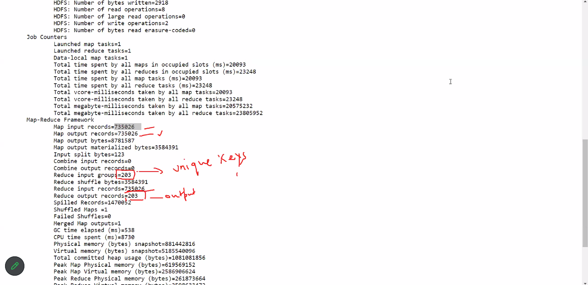

##### Output of MapReduce Job

- To see the output files, launch the `Hue` tool from the `Nuevopro` web dashboard from where you earlier launched the `Web Console`
- Once `Hue` tool is open, it can be used to navigate through hdfs in an interactive Web UI, so navigate to `/user/bigdatalab456422/training/out1` where it should have dumped the output files
- Notice that it has a file named .`success` which indicates that the MapReduce job completed successfully, and it also has a file `part-r-00000` which shows only one partition of a file was created & `r` in its name indicates that it is Reducer Output

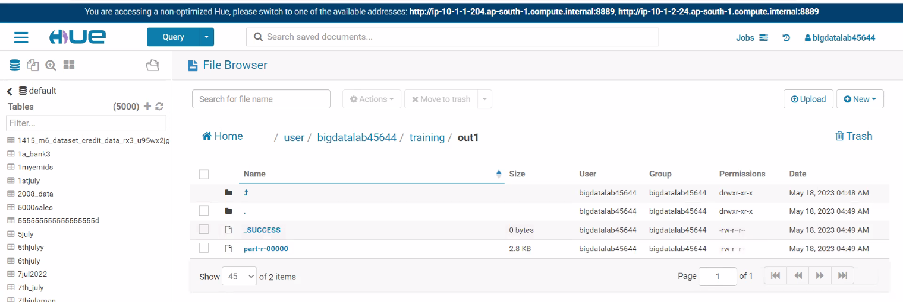

- Open the file `part-r-00000` to view its contents, notice that all the keys are sorted in ascending (ASC) order

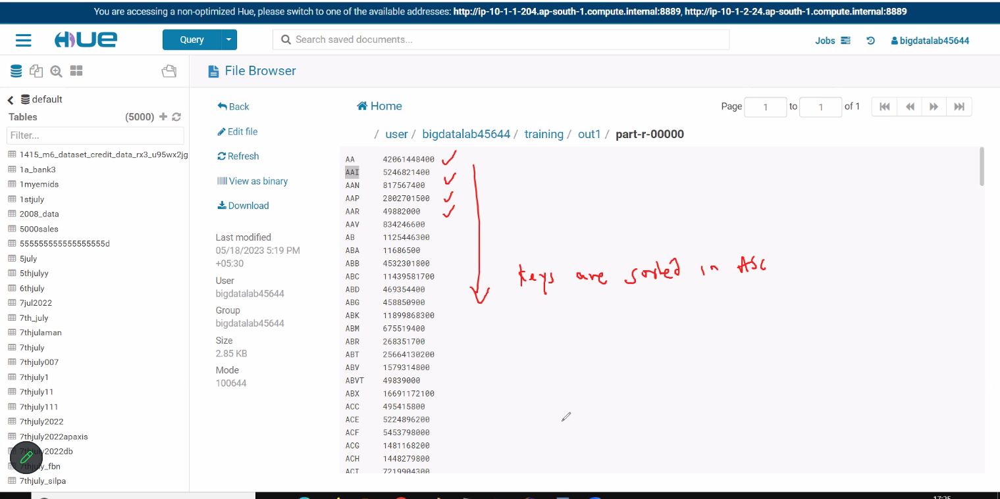

- Note that, the difference between Hadoop and Spark lies where these can store output
  - Hadoop will take input from HDFS, do MapReduce processing, and dump output in HDFS only
  - Spark an take input from anywhere, do Spark processing, and dump output anywhere

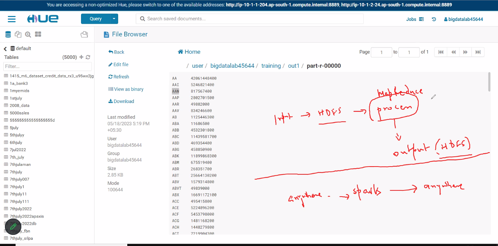

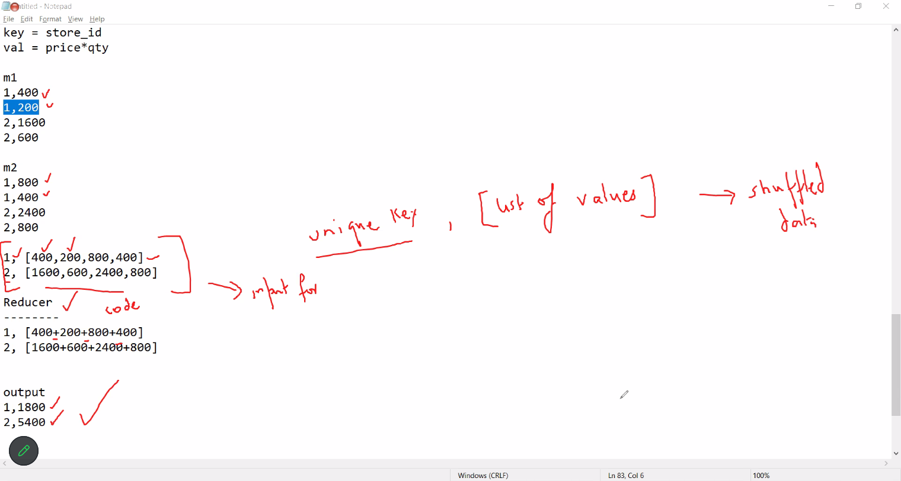

#### Run only the Map job using `hadoop jar` utility

- Change the java code in `main()` by setting `job.setNumReduceTasks` to `0`, so that it does not have any Reducer task, leaving only Mapper task

    ```java
            public static void main(String[] args) throws Exception {
                Configuration conf = new Configuration();
                //conf.set("name", "value")
                //conf.set("mapreduce.input.fileinputformat.split.minsize", "134217728");
                Job job = Job.getInstance(conf, "Volume Count");
                job.setJarByClass(StockVolume.class);
                job.setMapperClass(MapClass.class);
                //job.setCombinerClass(ReduceClass.class);
                job.setReducerClass(ReduceClass.class);
                job.setNumReduceTasks(0);
                job.setOutputKeyClass(Text.class);
                job.setOutputValueClass(LongWritable.class);
                FileInputFormat.addInputPath(job, new Path(args[0]));
                FileOutputFormat.setOutputPath(job, new Path(args[1]));
                System.exit(job.waitForCompletion(true) ? 0 : 1);
            }
    }
    ```

- Earlier, we got output as Reducer output file, but here we have eliminated Reducer, so we should get result as Mapper output

- Generate the `.jar` file and upload to client/linux filesystem using FTP, and then extract the contents of `.jar` file so that we get the new generated class file which can be run with `hadoop jar` utility to produce only Mapper result
- Once, class file is extracted, Run the command below

```bash
[bigdatalab456422@ip-10-1-1-204 ~]$ hadoop jar myjar.jar StockVolume training/NYSE.csv training/out2
```

- In verbose text, notice that the `Shuffle Errors` before `File Input Format Counters` is missing this time as shuffle stage has not run because Reducer(s) were eliminated

```console
WARNING: Use "yarn jar" to launch YARN applications.
23/05/18 12:23:09 INFO client.RMProxy: Connecting to ResourceManager at ip-10-1-1-204.ap-south-1.compute.internal/10.1.1.204:8032
23/05/18 12:23:10 WARN mapreduce.JobResourceUploader: Hadoop command-line option parsing not performed. Implement the Tool interface and execute your application with ToolRunner to remedy this.
23/05/18 12:23:10 INFO mapreduce.JobResourceUploader: Disabling Erasure Coding for path: /user/bigdatalab456422/.staging/job_1684298513961_0137
23/05/18 12:23:10 INFO input.FileInputFormat: Total input files to process : 1
23/05/18 12:23:10 INFO mapreduce.JobSubmitter: number of splits:1
23/05/18 12:23:10 INFO Configuration.deprecation: yarn.resourcemanager.system-metrics-publisher.enabled is deprecated. Instead, use yarn.system-metrics-publisher.enabled
23/05/18 12:23:10 INFO mapreduce.JobSubmitter: Submitting tokens for job: job_1684298513961_0137
23/05/18 12:23:10 INFO mapreduce.JobSubmitter: Executing with tokens: []
23/05/18 12:23:11 INFO conf.Configuration: resource-types.xml not found
23/05/18 12:23:11 INFO resource.ResourceUtils: Unable to find 'resource-types.xml'.
23/05/18 12:23:11 INFO impl.YarnClientImpl: Submitted application application_1684298513961_0137
23/05/18 12:23:11 INFO mapreduce.Job: The url to track the job: http://ip-10-1-1-204.ap-south-1.compute.internal:6066/proxy/application_1684298513961_0137/
23/05/18 12:23:11 INFO mapreduce.Job: Running job: job_1684298513961_0137 23/05/18 12:23:20 INFO mapreduce.Job: Job job_1684298513961_0137 running in uber mode : false
23/05/18 12:23:20 INFO mapreduce.Job: map 0% reduce 0%
23/05/18 12:23:26 INFO mapreduce.Job: map 100% reduce 0%
23/05/18 12:23:26 INFO mapreduce.Job: Job job_1684298513961_0137 completed successfully
23/05/18 12:23:26 INFO mapreduce.Job: Counters: 33
File System Counters
        FILE: Number of bytes read=0
        FILE: Number of bytes written=222430
        FILE: Number of read operations=0
        FILE: Number of large read operations=0
        FILE: Number of write operations=0
        HDFS: Number of bytes read=40990986
        HDFS: Number of bytes written=7842509
        HDFS: Number of read operations=7
        HDFS: Number of large read operations=0
        HDFS: Number of write operations=2
        HDFS: Number of bytes read erasure-coded=0
Job Counters
        Launched map tasks=1
        Data-local map tasks=1
        Total time spent by all maps in occupied slots (ms)=4102
        Total time spent by all reduces in occupied slots (ms)=0
        Total time spent by all map tasks (ms)=4102
        Total vcore-milliseconds taken by all map tasks=4102
        Total megabyte-milliseconds taken by all map tasks=4200448
        Map-Reduce Framework
        Map input records=735026
        Map output records=735026
        Input split bytes=124
        Spilled Records=0
        Failed Shuffles=0
        Merged Map outputs=0
        GC time elapsed (ms)=69
        CPU time spent (ms)=3170
        Physical memory (bytes) snapshot=361504768
        Virtual memory (bytes) snapshot=2584989696
        Total committed heap usage (bytes)=480772096
        Peak Map Physical memory (bytes)=361504768
        Peak Map Virtual memory (bytes)=2584989696
File Input Format Counters
        Bytes Read=40990862
File Output Format Counters
        Bytes Written=7842509

```

##### Output of Mapper job

- To see the output files, launch the `Hue` tool from the Nuevopro web dashboard from where you earlier launched the `Web Console`, or you can go to the already open `Hue` tool
- Once `Hue` tool is open, it navigate to `/user/bigdatalab456422/training/out2` where it should have dumped the output files
- Notice that it has `.success` file which indicates that the Mapper job completed successfully, and also it has a file `part-m-00000` which shows only one partition of a file was created & `m` in its name indicates that it is Mapper output

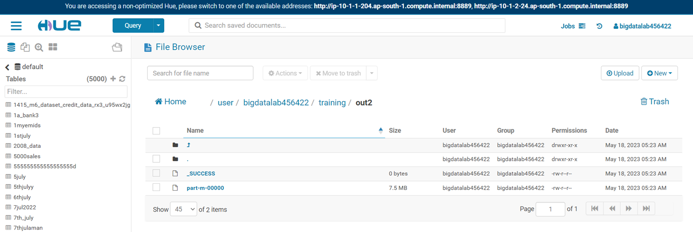

## Instructions- Java Program using Eclipse

```text
steps for creating jar file in eclipse
----------------------------------------
1) Launch the eclipse application using Java perspective

2) Click OK for Workspace Launcher

3) create a new project -
    a) File ->New --->Java project
    b) Enter "Hadoop" as project name and click Finish

4) create a new java program
    a) Expand the said project in the Package explorer
    b) Right click on Hadoop project --->New --->Class
    c) Enter the class name as "StockVolume" and click Finish
    d) copy the original program in the eclipse and save

5) add external jar files for the project
    a) Right click on Hadoop project --->Build path --->Configure build path
    b) select the Libraries tab and click on "Add external jars"
    c) click on File System and add 2 jars as under
        1. hadoop-common.jar
        2. hadoop-mapreduce-client-core.jar
    d) After saving the changes there should not be any ERROR in java program

6) Create a jar file from class files
    a) Right click on Hadoop project --->Export--->Java--->Jar file-->Next
    b) enter the jar file name with full path in export destination
        myjar.jar
    c) click on Finish

7) Upload the file myjar.jar and NYSE.csv to client from your base machine.


create a training folder
-----------------------
hadoop fs -mkdir cdac

upload NYSE.csv on hdfs
------------------------
hadoop fs -put NYSE.csv cdac


Run the java jar file on Hadoop
----------------------------------
hadoop jar myjar.jar StockVolume cdac/NYSE.csv cdac/out1
```

## Steps for installing .ovs file

```text
Using OVA Files with VirtualBox
To use OVA files with VirtualBox, you need to import them and let VirtualBox configure the file as it needs to. 
The process is quite straightforward.

Download and install VirtualBox if you don’t have it already.

https://www.virtualbox.org/wiki/Downloads


Open VirtualBox and select File > Import Appliance…
Now, select your OVA file in the import box and verify the settings in the center window.
Make any changes if you need to in that center window.
Click Import at the bottom.
Allow VirtualBox to import the file and then configure it for use.
It may take a little while to import OVA files. I recently imported a new Mac OS image and it took over an hour. A previous Linux image took a mere ten minutes so you may or may not need to be patient waiting for VirtualBox to install the operating system on your virtual machine. The procedure is fairly reliable, though, so it is safe to go have a coffee or something while it’s working. Just let the setup process run until it’s finished.

When you select the OVA file to import, the main details of the VM appear in the center of the import box. You can change some details but not others. If you don’t change them here, you can modify some of them later in the main Settings menu within VirtualBox.
```
