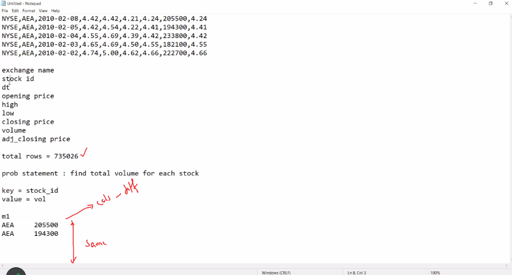
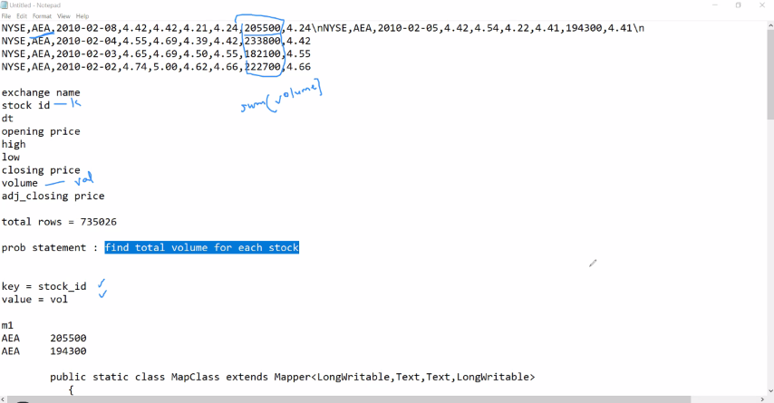
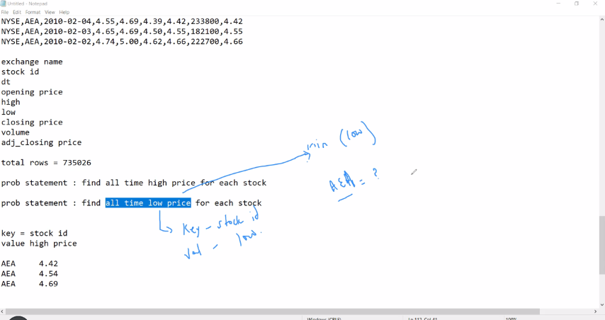
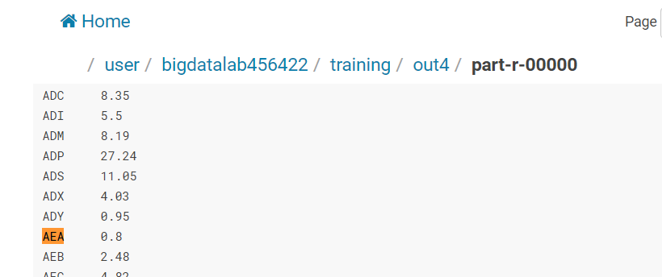
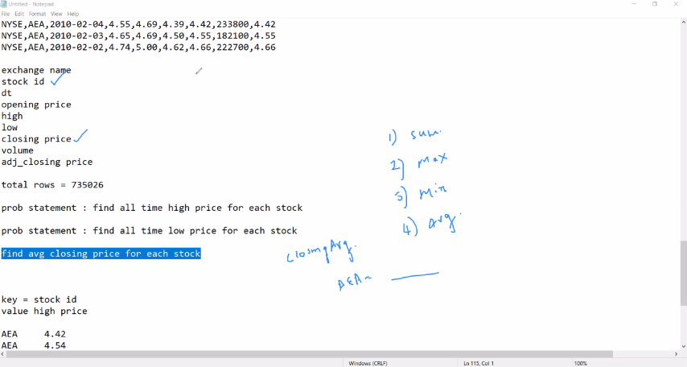
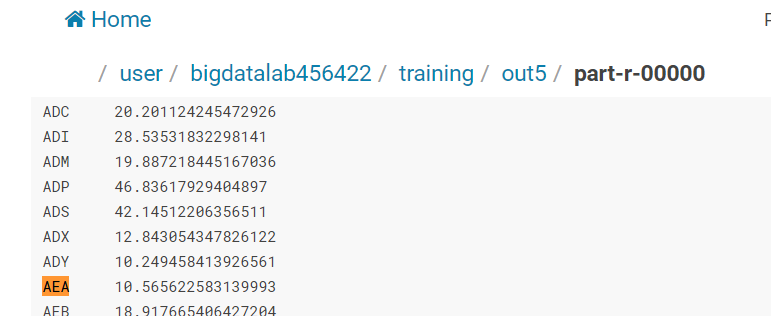
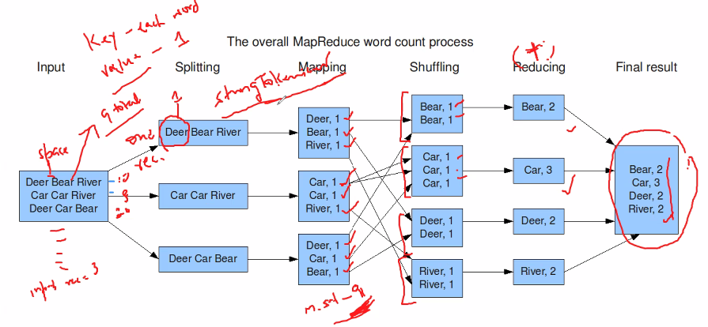
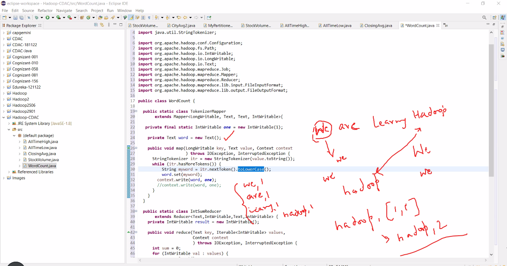
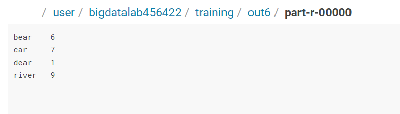

# Day 05 - BigDataTechnologies

## MapReduce (MapRed)

### Find Total Volume for each Stock

#### NYSE.csv Dataset

```csv
NYSE,AEA,2010-02-08,4.42,4.42,4.21,4.24,205500,4.24
NYSE,AEA,2010-02-05,4.42,4.54,4.22,4.41,194300,4.41
NYSE,AEA,2010-02-04,4.55,4.69,4.39,4.42,233800,4.42
NYSE,AEA,2010-02-03,4.65,4.69,4.50,4.55,182100,4.55
NYSE,AEA,2010-02-02,4.74,5.00,4.62,4.66,222700,4.66
```

#### Problem Statement

```text
exchage name
stock id
date
high
low
closing price
volume
adj_closing price

total rows = 735026

prob statement : find total volume for each stock

key = stock_id
value = vol

Mapper m1
AEA     205500
AEA     194300
```

#### Mapper Logic

```java
    public static class MapClass extends Mapper<LongWritable,Text,Text,LongWritable>
    {
        public void map(LongWritable key, Text value, Context context)
        {
            try{
                String[] str = value.toString().split(",");
                long vol = Long.parseLong(str[7]);
                context.write(new Text(str[1]),new LongWritable(vol));
            }
            catch(Exception e)
            {
                System.out.println(e.getMessage());
            }
        }
    }
```

```java
input: LongWritable key = offset byte pos of each line
input: Text val = entire string

0, (NYSE,AEA,2010-02-08,4.42,4.42,4.21,4.24,205500,4.24)
```

```java
string[] str = (NYSE,AEA,2010-02-08,4.42,4.42,4.21,4.24,205500,4.24).split(",")
```

```text
str[0] = NYSE
str[1] = AEA
str[7] = 205500

AEA 205500
AEA 194300
AEA 233800
AEA 182100
AEA 222700
AEA 194800
AEA 222900

AEA,[205500,194300, ...]
ARR,[...]
AZZ,[...]
203 rows
```



#### Reducer Logic

```java
    public static class ReduceClass extends Reducer<Text,LongWritable,Text,LongWritable>
    {
            private LongWritable result = new LongWritable();
            
            public void reduce(Text key, Iterable<LongWritable> values,Context context) throws IOException, InterruptedException {
            long sum = 0;
                
                for (LongWritable val : values)
                {
                    sum += val.get();      
                }
                
            result.set(sum);
            context.write(key, result);
            //context.write(key, new LongWritable(sum));
            
            }
    }
```



### Find All-time High Price for each stock

```text
exchage name
stock id
date
high
low
closing price
volume
adj_closing price

total rows = 735026

prob statement : find all time high price for each stock

key = stock_id
value = high price

AEA     4.42
AEA     4.54
AEA     4.69

AEA, [4.42, 4.54, 4.69, ...]

AEA     4.69
```

#### Generating the .jar file

1. Launch Eclipse application using Java perspective, click OK for Workspace Launcher
2. Open Project `Hadoop`, Expand the Project `Hadoop` in the package explorer, `Right-click on Hadoop project > New > Class`
3. Enter the class name as `AllTimeHigh` and click Finish
4. Add the below code to `AllTimeHigh.java`, and save it

    ```java
    import java.io.*;
    import org.apache.hadoop.io.Text;
    import org.apache.hadoop.io.LongWritable;
    import org.apache.hadoop.io.DoubleWritable;
    import org.apache.hadoop.mapreduce.Job;
    import org.apache.hadoop.mapreduce.Mapper;
    import org.apache.hadoop.mapreduce.Reducer;
    import org.apache.hadoop.conf.*;
    import org.apache.hadoop.fs.*;
    import org.apache.hadoop.mapreduce.lib.input.*;
    import org.apache.hadoop.mapreduce.lib.output.*;


    public class AllTimeHigh {
        
        public static class MapClass extends Mapper<LongWritable,Text,Text,DoubleWritable>
        {
            public void map(LongWritable key, Text value, Context context)
            {
                try{
                    String[] str = value.toString().split(",");
                    double high = Double.parseDouble(str[4]);
                    context.write(new Text(str[1]),new DoubleWritable(high));
                }
                catch(Exception e)
                {
                    System.out.println(e.getMessage());
                }
            }
        }
        
        public static class ReduceClass extends Reducer<Text,DoubleWritable,Text,DoubleWritable>
        {
                private DoubleWritable result = new DoubleWritable();
                
                public void reduce(Text key, Iterable<DoubleWritable> values,Context context) throws IOException, InterruptedException {
                double max = Double.MIN_VALUE;
                    
                    for (DoubleWritable val : values)
                    {
                        //sum += val.get();
                        if (val.get()>max) {
                            max = val.get();
                        }
                        
                    }
                    
                result.set(max);
                context.write(key, result);
                //context.write(key, new LongWritable(sum));
                
                }
        }
        public static void main(String[] args) throws Exception {
                Configuration conf = new Configuration();
                //conf.set("name", "value")
                //conf.set("mapreduce.input.fileinputformat.split.minsize", "134217728");
                Job job = Job.getInstance(conf, "All Time High  price for each stock");
                job.setJarByClass(AllTimeHigh.class);
                job.setMapperClass(MapClass.class);
                //job.setCombinerClass(ReduceClass.class);
                job.setReducerClass(ReduceClass.class);
                job.setNumReduceTasks(1); // means it will run one reducer only
                //job.setNumReduceTasks(0); // means no reducer will run
                job.setOutputKeyClass(Text.class);
                job.setOutputValueClass(DoubleWritable.class);
                FileInputFormat.addInputPath(job, new Path(args[0]));
                FileOutputFormat.setOutputPath(job, new Path(args[1]));
                System.exit(job.waitForCompletion(true) ? 0 : 1);
            }
    }
    ```

5. You may skip adding external jar files `hadoop-common.jar` and `hadoop-mapreduce-client-core.jar` since these are added while doing exercise on `Day 04`
6. `Right-Click on Hadoop Project > Export > Java > Jar File > Next >` Enter the jar file name as `myjar.jar` with full path in export destination, click on Finish

#### Upload .jar file using FTP

- Upload the `myjar.jar` file which you've generated by compiling the Java code for MapReduce task

#### Unzip the .jar file

- We need to extract the class file(s) from the .jar file, we extract it using `jar` command as by running the command below

```bash
[bigdatalab456422@ip-10-1-1-204 ~]$ jar tvf myjar.jar
```

```console
  25 Fri May 19 15:15:34 UTC 2023 META-INF/MANIFEST.MF
 387 Thu May 18 15:53:20 UTC 2023 .project
2408 Thu May 18 17:48:56 UTC 2023 StockVolume$MapClass.class
2349 Thu May 18 17:48:56 UTC 2023 StockVolume$ReduceClass.class
1697 Thu May 18 17:48:56 UTC 2023 StockVolume.class
2459 Fri May 19 15:12:14 UTC 2023 AllTimeHigh$MapClass.class
2381 Fri May 19 15:12:14 UTC 2023 AllTimeHigh$ReduceClass.class
1722 Fri May 19 15:12:14 UTC 2023 AllTimeHigh.class
 640 Thu May 18 17:00:00 UTC 2023 .classpath
```

#### Run the MapReduce job using `hadoop jar` utility

- Run the command below to launch the MapReduce job for `AllTimeHigh` class extracted from `myjar.jar` file, it'll read input from `training/NYSE.csv` dataset and it'll dump output/results in `training/out3` directory

```bash
[bigdatalab456422@ip-10-1-1-204 ~]$ hadoop jar myjar.jar AllTimeHigh training/NYSE.csv training/out3
```

```console
WARNING: Use "yarn jar" to launch YARN applications.
23/05/19 09:50:01 INFO client.RMProxy: Connecting to ResourceManager at ip-10-1-1-204.ap-south-1.compute.internal/10.1.1.204:8032
23/05/19 09:50:01 WARN mapreduce.JobResourceUploader: Hadoop command-line option parsing not performed. Implement the Tool interface and execute your application with ToolRunner to remedy this.
23/05/19 09:50:01 INFO mapreduce.JobResourceUploader: Disabling Erasure Coding for path: /user/bigdatalab456422/.staging/job_1684298513961_0282
23/05/19 09:50:02 INFO input.FileInputFormat: Total input files to process : 1
23/05/19 09:50:02 INFO mapreduce.JobSubmitter: number of splits:1
23/05/19 09:50:02 INFO Configuration.deprecation: yarn.resourcemanager.system-metrics-publisher.enabled is deprecated. Instead, use yarn.system-metrics-publisher.enabled
23/05/19 09:50:02 INFO mapreduce.JobSubmitter: Submitting tokens for job: job_1684298513961_0282
23/05/19 09:50:02 INFO mapreduce.JobSubmitter: Executing with tokens: []
23/05/19 09:50:02 INFO conf.Configuration: resource-types.xml not found
23/05/19 09:50:02 INFO resource.ResourceUtils: Unable to find 'resource-types.xml'.
23/05/19 09:50:03 INFO impl.YarnClientImpl: Submitted application application_1684298513961_0282
23/05/19 09:50:03 INFO mapreduce.Job: The url to track the job: http://ip-10-1-1-204.ap-south-1.compute.internal:6066/proxy/application_1684298513961_0282/
23/05/19 09:50:03 INFO mapreduce.Job: Running job: job_1684298513961_0282
23/05/19 09:50:12 INFO mapreduce.Job: Job job_1684298513961_0282 running in uber mode : false
23/05/19 09:50:12 INFO mapreduce.Job: map 0% reduce 0%
23/05/19 09:50:25 INFO mapreduce.Job: map 100% reduce 0%
23/05/19 09:50:34 INFO mapreduce.Job: map 100% reduce 100%
23/05/19 09:50:34 INFO mapreduce.Job: Job job_1684298513961_0282 completed successfully
23/05/19 09:50:34 INFO mapreduce.Job: Counters: 54
File System Counters
        FILE: Number of bytes read=2738889
        FILE: Number of bytes written=5922999
        FILE: Number of read operations=0
        FILE: Number of large read operations=0
        FILE: Number of write operations=0
        HDFS: Number of bytes read=40990986
        HDFS: Number of bytes written=1998
        HDFS: Number of read operations=8
        HDFS: Number of large read operations=0
        HDFS: Number of write operations=2
        HDFS: Number of bytes read erasure-coded=0
Job Counters
        Launched map tasks=1
        Launched reduce tasks=1
        Data-local map tasks=1
        Total time spent by all maps in occupied slots (ms)=10743
        Total time spent by all reduces in occupied slots (ms)=6640
        Total time spent by all map tasks (ms)=10743
        Total time spent by all reduce tasks (ms)=6640
        Total vcore-milliseconds taken by all map tasks=10743
        Total vcore-milliseconds taken by all reduce tasks=6640
        Total megabyte-milliseconds taken by all map tasks=11000832
        Total megabyte-milliseconds taken by all reduce tasks=6799360
Map-Reduce Framework
        Map input records=735026
        Map output records=735026
        Map output bytes=8781587
        Map output materialized bytes=2738885
        Input split bytes=124
        Combine input records=0
        Combine output records=0
        Reduce input groups=203
        Reduce shuffle bytes=2738885
        Reduce input records=735026
        Reduce output records=203
        Spilled Records=1470052
        Shuffled Maps =1
        Failed Shuffles=0
        Merged Map outputs=1
        GC time elapsed (ms)=441
        CPU time spent (ms)=7560
        Physical memory (bytes) snapshot=906223616
        Virtual memory (bytes) snapshot=5185675264
        Total committed heap usage (bytes)=1080033280
        Peak Map Physical memory (bytes)=640352256
        Peak Map Virtual memory (bytes)=2586497024
        Peak Reduce Physical memory (bytes)=265871360
        Peak Reduce Virtual memory (bytes)=2599178240
Shuffle Errors
        BAD_ID=0
        CONNECTION=0
        IO_ERROR=0
        WRONG_LENGTH=0
        WRONG_MAP=0
        WRONG_REDUCE=0
File Input Format Counters
        Bytes Read=40990862
File Output Format Counters
        Bytes Written=1998
```

### Find All-time Low Price for each stock

- Check if AllTimeLow for AEA is 0.8



```csv
NYSE,AEA,2010-02-08,4.42,4.42,4.21,4.24,205500,4.24
NYSE,AEA,2010-02-05,4.42,4.54,4.22,4.41,194300,4.41
NYSE,AEA,2010-02-04,4.55,4.69,4.39,4.42,233800,4.42
NYSE,AEA,2010-02-03,4.65,4.69,4.50,4.55,182100,4.55
NYSE,AEA,2010-02-02,4.74,5.00,4.62,4.66,222700,4.66
```

```text
exchage name
stock id
date
high
low
closing price
volume
adj_closing price

total rows = 735026

prob statement : find all time low price for each stock

key = stock_id
value = low price

AEA     4.42
AEA     4.54
AEA     4.69
```

#### Generating the .jar file for AllTimeLow

1. Launch Eclipse application using Java perspective, click OK for Workspace Launcher
2. Open Project `Hadoop`, Expand the Project `Hadoop` in the package explorer, `Right-click on Hadoop project > New > Class`
3. Enter the class name as `AllTimeLow` and click Finish
4. Add the below code to `AllTimeLow.java`, and save it

    ```java
    import java.io.*;
    import org.apache.hadoop.io.Text;
    import org.apache.hadoop.io.LongWritable;
    import org.apache.hadoop.io.DoubleWritable;
    import org.apache.hadoop.mapreduce.Job;
    import org.apache.hadoop.mapreduce.Mapper;
    import org.apache.hadoop.mapreduce.Reducer;
    import org.apache.hadoop.conf.*;
    import org.apache.hadoop.fs.*;
    import org.apache.hadoop.mapreduce.lib.input.*;
    import org.apache.hadoop.mapreduce.lib.output.*;


    public class AllTimeLow {
        
        public static class MapClass extends Mapper<LongWritable,Text,Text,DoubleWritable>
        {
            public void map(LongWritable key, Text value, Context context)
            {
                try{
                    String[] str = value.toString().split(",");
                    double low = Double.parseDouble(str[5]);
                    context.write(new Text(str[1]),new DoubleWritable(low));
                }
                catch(Exception e)
                {
                    System.out.println(e.getMessage());
                }
            }
        }
        
        public static class ReduceClass extends Reducer<Text,DoubleWritable,Text,DoubleWritable>
        {
                private DoubleWritable result = new DoubleWritable();
                
                public void reduce(Text key, Iterable<DoubleWritable> values,Context context) throws IOException, InterruptedException {
                double min = Double.MAX_VALUE;
                    
                    for (DoubleWritable val : values)
                    {
                        //sum += val.get();
                        if (val.get()<min) {
                            min = val.get();
                        }
                        
                    }
                    
                result.set(min);
                context.write(key, result);
                //context.write(key, new LongWritable(sum));
                
                }
        }
        public static void main(String[] args) throws Exception {
                Configuration conf = new Configuration();
                //conf.set("name", "value")
                //conf.set("mapreduce.input.fileinputformat.split.minsize", "134217728");
                Job job = Job.getInstance(conf, "All Time High  price for each stock");
                job.setJarByClass(AllTimeHigh.class);
                job.setMapperClass(MapClass.class);
                //job.setCombinerClass(ReduceClass.class);
                job.setReducerClass(ReduceClass.class);
                job.setNumReduceTasks(1); // means it will run one reducer only
                //job.setNumReduceTasks(0); // means no reducer will run
                job.setOutputKeyClass(Text.class);
                job.setOutputValueClass(DoubleWritable.class);
                FileInputFormat.addInputPath(job, new Path(args[0]));
                FileOutputFormat.setOutputPath(job, new Path(args[1]));
                System.exit(job.waitForCompletion(true) ? 0 : 1);
            }
    }
    ```

5. You may skip adding external jar files `hadoop-common.jar` and `hadoop-mapreduce-client-core.jar` since these are added while doing exercise on `Day 04`
6. `Right-Click on Hadoop Project > Export > Java > Jar File > Next >` Enter the jar file name as `myjar.jar` with full path in export destination, click on Finish

#### Upload .jar file using FTP for AllTimeLow

- Upload the `myjar.jar` file which you've generated by compiling the Java code for MapReduce task

#### Unzip the .jar file for AllTimeLow

- We need to extract the class file(s) from the .jar file, we extract it using `jar` command as by running the command below

```bash
[bigdatalab456422@ip-10-1-1-204 ~]$ jar tvf myjar.jar
```

```console
  25 Fri May 19 15:48:28 UTC 2023 META-INF/MANIFEST.MF
 387 Thu May 18 15:53:20 UTC 2023 .project
2408 Thu May 18 17:48:56 UTC 2023 StockVolume$MapClass.class
2349 Thu May 18 17:48:56 UTC 2023 StockVolume$ReduceClass.class
1697 Thu May 18 17:48:56 UTC 2023 StockVolume.class
2459 Fri May 19 15:12:14 UTC 2023 AllTimeHigh$MapClass.class
2381 Fri May 19 15:12:14 UTC 2023 AllTimeHigh$ReduceClass.class
1722 Fri May 19 15:12:14 UTC 2023 AllTimeHigh.class
2454 Fri May 19 15:48:18 UTC 2023 AllTimeLow$MapClass.class
2388 Fri May 19 15:48:18 UTC 2023 AllTimeLow$ReduceClass.class
1734 Fri May 19 15:48:18 UTC 2023 AllTimeLow.class
 640 Thu May 18 17:00:00 UTC 2023 .classpath
```

#### Run the MapReduce job using `hadoop jar` utility  for AllTimeLow

- Run the command below to launch the MapReduce job for `AllTimeLow` class extracted from `myjar.jar` file, it'll read input from `training/NYSE.csv` dataset and it'll dump output/results in `training/out4` directory

```bash
[bigdatalab456422@ip-10-1-1-204 ~]$ hadoop jar myjar.jar AllTimeLow training/NYSE.csv training/out4
```

```console
WARNING: Use "yarn jar" to launch YARN applications.
23/05/19 10:29:35 INFO client.RMProxy: Connecting to ResourceManager at ip-10-1-1-204.ap-south-1.compute.internal/10.1.1.204:8032
23/05/19 10:29:36 WARN mapreduce.JobResourceUploader: Hadoop command-line option parsing not performed. Implement the Tool interface and execute your application with ToolRunner to remedy this.
23/05/19 10:29:36 INFO mapreduce.JobResourceUploader: Disabling Erasure Coding for path: /user/bigdatalab456422/.staging/job_1684298513961_0441
23/05/19 10:29:36 INFO input.FileInputFormat: Total input files to process : 1
23/05/19 10:29:37 INFO mapreduce.JobSubmitter: number of splits:1
23/05/19 10:29:37 INFO Configuration.deprecation: yarn.resourcemanager.system-metrics-publisher.enabled is deprecated. Instead, use yarn.system-metrics-publisher.enabled
23/05/19 10:29:37 INFO mapreduce.JobSubmitter: Submitting tokens for job: job_1684298513961_0441
23/05/19 10:29:37 INFO mapreduce.JobSubmitter: Executing with tokens: []
23/05/19 10:29:37 INFO conf.Configuration: resource-types.xml not found
23/05/19 10:29:37 INFO resource.ResourceUtils: Unable to find 'resource-types.xml'.
23/05/19 10:29:37 INFO impl.YarnClientImpl: Submitted application application_1684298513961_0441
23/05/19 10:29:37 INFO mapreduce.Job: The url to track the job: http://ip-10-1-1-204.ap-south-1.compute.internal:6066/proxy/application_1684298513961_0441/
23/05/19 10:29:37 INFO mapreduce.Job: Running job: job_1684298513961_0441
23/05/19 10:29:50 INFO mapreduce.Job: Job job_1684298513961_0441 running in uber mode : false
23/05/19 10:29:50 INFO mapreduce.Job: map 0% reduce 0%
23/05/19 10:30:00 INFO mapreduce.Job: map 100% reduce 0%
23/05/19 10:30:08 INFO mapreduce.Job: map 100% reduce 100%
23/05/19 10:30:09 INFO mapreduce.Job: Job job_1684298513961_0441 completed successfully
23/05/19 10:30:09 INFO mapreduce.Job: Counters: 54
File System Counters
        FILE: Number of bytes read=2735137
        FILE: Number of bytes written=5915491
        FILE: Number of read operations=0
        FILE: Number of large read operations=0
        FILE: Number of write operations=0
        HDFS: Number of bytes read=40990986
        HDFS: Number of bytes written=1840
        HDFS: Number of read operations=8
        HDFS: Number of large read operations=0
        HDFS: Number of write operations=2
        HDFS: Number of bytes read erasure-coded=0
Job Counters
        Launched map tasks=1
        Launched reduce tasks=1
        Data-local map tasks=1
        Total time spent by all maps in occupied slots (ms)=8087
        Total time spent by all reduces in occupied slots (ms)=5188
        Total time spent by all map tasks (ms)=8087
        Total time spent by all reduce tasks (ms)=5188
        Total vcore-milliseconds taken by all map tasks=8087
        Total vcore-milliseconds taken by all reduce tasks=5188
        Total megabyte-milliseconds taken by all map tasks=8281088
        Total megabyte-milliseconds taken by all reduce tasks=5312512
Map-Reduce Framework
        Map input records=735026
        Map output records=735026
        Map output bytes=8781587
        Map output materialized bytes=2735133
        Input split bytes=124
        Combine input records=0
        Combine output records=0
        Reduce input groups=203
        Reduce shuffle bytes=2735133
        Reduce input records=735026
        Reduce output records=203
        Spilled Records=1470052
        Shuffled Maps =1
        Failed Shuffles=0
        Merged Map outputs=1
        GC time elapsed (ms)=372
        CPU time spent (ms)=7280
        Physical memory (bytes) snapshot=892690432
        Virtual memory (bytes) snapshot=5184163840
        Total committed heap usage (bytes)=1028653056
        Peak Map Physical memory (bytes)=643117056
        Peak Map Virtual memory (bytes)=2589208576
        Peak Reduce Physical memory (bytes)=249573376
        Peak Reduce Virtual memory (bytes)=2594955264
Shuffle Errors
        BAD_ID=0
        CONNECTION=0
        IO_ERROR=0
        WRONG_LENGTH=0
        WRONG_MAP=0
        WRONG_REDUCE=0
File Input Format Counters
        Bytes Read=40990862
File Output Format Counters
        Bytes Written=1840
```

#### Output of AllTimeLow MapReduce job

- To see the output files, launch the `Hue` tool from the Nuevopro web dashboard from where you earlier launched the `Web Console`, or you can go to the already open `Hue` tool
- Once `Hue` tool is open, it navigate to `/user/bigdatalab456422/training/out4` where it should have dumped the output files
- Notice that it has `.success` file which indicates that the MapReduce job completed successfully
- Note that the `AllTimeLow` for stock `AEA` is `0.8`



### Find Average Closing Price for each stock

- Check if AvgClosingPrice for AEA is 10.5656



```csv
NYSE,AEA,2010-02-08,4.42,4.42,4.21,4.24,205500,4.24
NYSE,AEA,2010-02-05,4.42,4.54,4.22,4.41,194300,4.41
NYSE,AEA,2010-02-04,4.55,4.69,4.39,4.42,233800,4.42
NYSE,AEA,2010-02-03,4.65,4.69,4.50,4.55,182100,4.55
NYSE,AEA,2010-02-02,4.74,5.00,4.62,4.66,222700,4.66
```

```text
exchage name
stock id
date
high
low
closing price
volume
adj_closing price

total rows = 735026

prob statement : find avg closing price for each stock

key = stock_id
value = low price

AEA     4.42
AEA     4.54
AEA     4.69
```

#### Generating the .jar file for AvgClosingPrice

1. Launch Eclipse application using Java perspective, click OK for Workspace Launcher
2. Open Project `Hadoop`, Expand the Project `Hadoop` in the package explorer, `Right-click on Hadoop project > New > Class`
3. Enter the class name as `AvgClosingPrice` and click Finish
4. Add the below code to `AvgClosingPrice.java`, and save it

    ```java
    import java.io.*;
    import org.apache.hadoop.io.Text;
    import org.apache.hadoop.io.LongWritable;
    import org.apache.hadoop.io.DoubleWritable;
    import org.apache.hadoop.mapreduce.Job;
    import org.apache.hadoop.mapreduce.Mapper;
    import org.apache.hadoop.mapreduce.Reducer;
    import org.apache.hadoop.conf.*;
    import org.apache.hadoop.fs.*;
    import org.apache.hadoop.mapreduce.lib.input.*;
    import org.apache.hadoop.mapreduce.lib.output.*;


    public class AvgClosingPrice {
        public static class MapClass extends Mapper<LongWritable,Text,Text,DoubleWritable>
        {
            public void map(LongWritable key, Text value, Context context)
            {
                try{
                    String[] str = value.toString().split(",");
                    double low = Double.parseDouble(str[6]);
                    context.write(new Text(str[1]),new DoubleWritable(low));
                }
                catch(Exception e)
                {
                    System.out.println(e.getMessage());
                }
            }
        }
        
        public static class ReduceClass extends Reducer<Text,DoubleWritable,Text,DoubleWritable>
        {
                private DoubleWritable result = new DoubleWritable();
                
                public void reduce(Text key, Iterable<DoubleWritable> values,Context context) throws IOException, InterruptedException {
                    double avg = 0.0;
                    double sum = 0.0;
                    double cnt = 0.0;
                    
                    for (DoubleWritable val : values)
                    {
                        sum += val.get();
                        cnt++;
                    }
                    avg = sum/cnt;
                    
                    
                result.set(avg);
                context.write(key, result);
                //context.write(key, new LongWritable(sum));
                
                }
        }
        public static void main(String[] args) throws Exception {
                Configuration conf = new Configuration();
                //conf.set("name", "value")
                //conf.set("mapreduce.input.fileinputformat.split.minsize", "134217728");
                Job job = Job.getInstance(conf, "Average ");
                job.setJarByClass(AllTimeHigh.class);
                job.setMapperClass(MapClass.class);
                //job.setCombinerClass(ReduceClass.class);
                job.setReducerClass(ReduceClass.class);
                job.setNumReduceTasks(1); // means it will run one reducer only
                //job.setNumReduceTasks(0); // means no reducer will run
                job.setOutputKeyClass(Text.class);
                job.setOutputValueClass(DoubleWritable.class);
                FileInputFormat.addInputPath(job, new Path(args[0]));
                FileOutputFormat.setOutputPath(job, new Path(args[1]));
                System.exit(job.waitForCompletion(true) ? 0 : 1);
            }
    }
    ```

5. You may skip adding external jar files `hadoop-common.jar` and `hadoop-mapreduce-client-core.jar` since these are added while doing exercise on `Day 04`
6. `Right-Click on Hadoop Project > Export > Java > Jar File > Next >` Enter the jar file name as `myjar.jar` with full path in export destination, click on Finish

#### Upload .jar file using FTP for AvgClosingPrice

- Upload the `myjar.jar` file which you've generated by compiling the Java code for MapReduce task

#### Unzip the .jar file for AvgClosingPrice

- We need to extract the class file(s) from the .jar file, we extract it using `jar` command as by running the command below

```bash
[bigdatalab456422@ip-10-1-1-204 ~]$ jar tvf myjar.jar
```

```console
  25 Fri May 19 16:54:14 UTC 2023 META-INF/MANIFEST.MF
 387 Thu May 18 15:53:20 UTC 2023 .project
2408 Thu May 18 17:48:56 UTC 2023 StockVolume$MapClass.class
2349 Thu May 18 17:48:56 UTC 2023 StockVolume$ReduceClass.class
1697 Thu May 18 17:48:56 UTC 2023 StockVolume.class
2459 Fri May 19 16:03:30 UTC 2023 AllTimeHigh$MapClass.class
2392 Fri May 19 16:03:30 UTC 2023 AllTimeHigh$ReduceClass.class
1722 Fri May 19 16:03:30 UTC 2023 AllTimeHigh.class
2475 Fri May 19 16:53:46 UTC 2023 AvgClosingPrice$MapClass.class
2454 Fri May 19 16:53:46 UTC 2023 AvgClosingPrice$ReduceClass.class
1732 Fri May 19 16:53:46 UTC 2023 AvgClosingPrice.class
2454 Fri May 19 15:53:50 UTC 2023 AllTimeLow$MapClass.class
2388 Fri May 19 15:53:50 UTC 2023 AllTimeLow$ReduceClass.class
1734 Fri May 19 15:53:50 UTC 2023 AllTimeLow.class
 640 Thu May 18 17:00:00 UTC 2023 .classpath
```

#### Run the MapReduce job using `hadoop jar` utility  for AvgClosingPrice

- Run the command below to launch the MapReduce job for `AvgClosingPrice` class extracted from `myjar.jar` file, it'll read input from `training/NYSE.csv` dataset and it'll dump output/results in `training/out5` directory

```bash
[bigdatalab456422@ip-10-1-1-204 ~]$ hadoop jar myjar.jar AvgClosingPrice training/NYSE.csv training/out5
```

```console
WARNING: Use "yarn jar" to launch YARN applications.
23/05/19 11:26:43 INFO client.RMProxy: Connecting to ResourceManager at ip-10-1-1-204.ap-south-1.compute.internal/10.1.1.204:8032
23/05/19 11:26:44 WARN mapreduce.JobResourceUploader: Hadoop command-line option parsing not performed. Implement the Tool interface and execute your application with ToolRunner to remedy this.
23/05/19 11:26:44 INFO mapreduce.JobResourceUploader: Disabling Erasure Coding for path: /user/bigdatalab456422/.staging/job_1684298513961_0557
23/05/19 11:26:44 INFO input.FileInputFormat: Total input files to process : 1
23/05/19 11:26:44 INFO mapreduce.JobSubmitter: number of splits:1
23/05/19 11:26:44 INFO Configuration.deprecation: yarn.resourcemanager.system-metrics-publisher.enabled is deprecated. Instead, use yarn.system-metrics-publisher.enabled
23/05/19 11:26:45 INFO mapreduce.JobSubmitter: Submitting tokens for job: job_1684298513961_0557
23/05/19 11:26:45 INFO mapreduce.JobSubmitter: Executing with tokens: []
23/05/19 11:26:45 INFO conf.Configuration: resource-types.xml not found
23/05/19 11:26:45 INFO resource.ResourceUtils: Unable to find 'resource-types.xml'.
23/05/19 11:26:45 INFO impl.YarnClientImpl: Submitted application application_1684298513961_0557
23/05/19 11:26:45 INFO mapreduce.Job: The url to track the job: http://ip-10-1-1-204.ap-south-1.compute.internal:6066/proxy/application_1684298513961_0557/
23/05/19 11:26:45 INFO mapreduce.Job: Running job: job_1684298513961_0557
23/05/19 11:27:00 INFO mapreduce.Job: Job job_1684298513961_0557 running in uber mode : false
23/05/19 11:27:00 INFO mapreduce.Job: map 0% reduce 0%
23/05/19 11:27:07 INFO mapreduce.Job: map 100% reduce 0%
23/05/19 11:27:16 INFO mapreduce.Job: map 100% reduce 100%
23/05/19 11:27:16 INFO mapreduce.Job: Job job_1684298513961_0557 completed successfully
23/05/19 11:27:16 INFO mapreduce.Job: Counters: 54
File System Counters
        FILE: Number of bytes read=2782149
        FILE: Number of bytes written=6009481
        FILE: Number of read operations=0
        FILE: Number of large read operations=0
        FILE: Number of write operations=0
        HDFS: Number of bytes read=40990986
        HDFS: Number of bytes written=4564
        HDFS: Number of read operations=8
        HDFS: Number of large read operations=0
        HDFS: Number of write operations=2
        HDFS: Number of bytes read erasure-coded=0
Job Counters
        Launched map tasks=1
        Launched reduce tasks=1
        Data-local map tasks=1
        Total time spent by all maps in occupied slots (ms)=5043
        Total time spent by all reduces in occupied slots (ms)=6366
        Total time spent by all map tasks (ms)=5043
        Total time spent by all reduce tasks (ms)=6366
        Total vcore-milliseconds taken by all map tasks=5043
        Total vcore-milliseconds taken by all reduce tasks=6366
        Total megabyte-milliseconds taken by all map tasks=5164032
        Total megabyte-milliseconds taken by all reduce tasks=6518784
Map-Reduce Framework
        Map input records=735026
        Map output records=735026
        Map output bytes=8781587
        Map output materialized bytes=2782145
        Input split bytes=124
        Combine input records=0
        Combine output records=0
        Reduce input groups=203
        Reduce shuffle bytes=2782145
        Reduce input records=735026
        Reduce output records=203
        Spilled Records=1470052
        Shuffled Maps =1
        Failed Shuffles=0
        Merged Map outputs=1
        GC time elapsed (ms)=255
        CPU time spent (ms)=6630
        Physical memory (bytes) snapshot=828112896
        Virtual memory (bytes) snapshot=5179727872
        Total committed heap usage (bytes)=935854080
        Peak Map Physical memory (bytes)=632377344
        Peak Map Virtual memory (bytes)=2587656192
        Peak Reduce Physical memory (bytes)=195735552
        Peak Reduce Virtual memory (bytes)=2592071680
Shuffle Errors
        BAD_ID=0
        CONNECTION=0
        IO_ERROR=0
        WRONG_LENGTH=0
        WRONG_MAP=0
        WRONG_REDUCE=0
File Input Format Counters
        Bytes Read=40990862
File Output Format Counters
        Bytes Written=4564
```

#### Output of AvgClosingPrice MapReduce job

- To see the output files, launch the `Hue` tool from the Nuevopro web dashboard from where you earlier launched the `Web Console`, or you can go to the already open `Hue` tool
- Once `Hue` tool is open, it navigate to `/user/bigdatalab456422/training/out5` where it should have dumped the output files
- Notice that it has `.success` file which indicates that the MapReduce job completed successfully
- Note that the `AvgClosingPrice` for stock `AEA` is `10.5656`



### Find the Word Count





> In Mapper class, we're using `StringTokenizer` to tokenize each of the line and then use `StringTokenizer.nextToken()` method to get next token, so that each of the token/word becomes a key and it is assigned a value of `1`, and in Reducer stage, each of the words are grouped and their values are summed to get count of each of the word

#### Generating the .jar file for WordCount

1. Launch Eclipse application using Java perspective, click OK for Workspace Launcher
2. Open Project `Hadoop`, Expand the Project `Hadoop` in the package explorer, `Right-click on Hadoop project > New > Class`
3. Enter the class name as `WordCount` and click Finish
4. Add the below code to `WordCount.java`, and save it

    ```java
    import java.io.IOException;
    import java.util.StringTokenizer;

    import org.apache.hadoop.conf.Configuration;
    import org.apache.hadoop.fs.Path;
    import org.apache.hadoop.io.IntWritable;
    import org.apache.hadoop.io.LongWritable;
    import org.apache.hadoop.io.Text;
    import org.apache.hadoop.mapreduce.Job;
    import org.apache.hadoop.mapreduce.Mapper;
    import org.apache.hadoop.mapreduce.Reducer;
    import org.apache.hadoop.mapreduce.lib.input.FileInputFormat;
    import org.apache.hadoop.mapreduce.lib.output.FileOutputFormat;

    public class WordCount {

    public static class TokenizerMapper extends Mapper<LongWritable, Text, Text, IntWritable>{

    private final static IntWritable one = new IntWritable(1);
        
        private Text word = new Text();

        public void map(LongWritable key, Text value, Context context) throws IOException, InterruptedException {
            StringTokenizer itr = new StringTokenizer(value.toString());
            while (itr.hasMoreTokens()) {
                String myword = itr.nextToken().toLowerCase();
                word.set(myword);
                context.write(word, one);
                //context.write(word, one);
            }
        }
    }

    public static class IntSumReducer extends Reducer<Text,IntWritable,Text,IntWritable> {
        private IntWritable result = new IntWritable();

        public void reduce(Text key, Iterable<IntWritable> values, Context context) throws IOException, InterruptedException {
            int sum = 0;
            for (IntWritable val : values) {
                sum += val.get();
            }
            result.set(sum);
            context.write(key, result);
        }
    }

    public static void main(String[] args) throws Exception {
        Configuration conf = new Configuration();
        Job job = Job.getInstance(conf, "word count");
        job.setJarByClass(WordCount.class);
        job.setMapperClass(TokenizerMapper.class);
        job.setReducerClass(IntSumReducer.class);
        job.setNumReduceTasks(1);
        
        job.setMapOutputKeyClass(Text.class);
        job.setMapOutputValueClass(IntWritable.class);
        job.setOutputKeyClass(Text.class);
        job.setOutputValueClass(IntWritable.class);
        FileInputFormat.addInputPath(job, new Path(args[0]));
        FileOutputFormat.setOutputPath(job, new Path(args[1]));
        System.exit(job.waitForCompletion(true) ? 0 : 1);
    }
    }
    ```

5. You may skip adding external jar files `hadoop-common.jar` and `hadoop-mapreduce-client-core.jar` since these are added while doing exercise on `Day 04`
6. `Right-Click on Hadoop Project > Export > Java > Jar File > Next >` Enter the jar file name as `myjar.jar` with full path in export destination, click on Finish

#### Upload .jar file using FTP for WordCount

- Upload the `myjar.jar` file which you've generated by compiling the Java code for MapReduce task

#### Upload the `data` files using FTP

- First create a directory `data` in the hdfs using command below

```bash
[bigdatalab456422@ip-10-1-1-204 ~]$ hadoop fs -mkdir data
```

- Upload the files `data1.text`, `data2.text` and `data3.text` to Client/Linux Filesystem
- Then copy these files on Client/Linux Filesystem to `data` directory on hdfs using command below

```bash
[bigdatalab456422@ip-10-1-1-204 ~]$ hadoop fs -put data1.txt data2.txt data3.txt data
```

#### Unzip the .jar file for WordCount

- We need to extract the class file(s) from the .jar file, we extract it using `jar` command as by running the command below

```bash
[bigdatalab456422@ip-10-1-1-204 ~]$ jar tvf myjar.jar
```

```console
  25 Fri May 19 17:47:10 UTC 2023 META-INF/MANIFEST.MF
 387 Thu May 18 15:53:20 UTC 2023 .project
2408 Thu May 18 17:48:56 UTC 2023 StockVolume$MapClass.class
2349 Thu May 18 17:48:56 UTC 2023 StockVolume$ReduceClass.class
1697 Thu May 18 17:48:56 UTC 2023 StockVolume.class
2459 Fri May 19 16:03:30 UTC 2023 AllTimeHigh$MapClass.class
2392 Fri May 19 16:03:30 UTC 2023 AllTimeHigh$ReduceClass.class
1722 Fri May 19 16:03:30 UTC 2023 AllTimeHigh.class
2475 Fri May 19 16:53:46 UTC 2023 AvgClosingPrice$MapClass.class
2454 Fri May 19 16:53:46 UTC 2023 AvgClosingPrice$ReduceClass.class
1732 Fri May 19 16:53:46 UTC 2023 AvgClosingPrice.class
2454 Fri May 19 15:53:50 UTC 2023 AllTimeLow$MapClass.class
2388 Fri May 19 15:53:50 UTC 2023 AllTimeLow$ReduceClass.class
1734 Fri May 19 15:53:50 UTC 2023 AllTimeLow.class
2337 Fri May 19 17:41:44 UTC 2023 WordCount$IntSumReducer.class
2461 Fri May 19 17:41:44 UTC 2023 WordCount$TokenizerMapper.class
1790 Fri May 19 17:41:44 UTC 2023 WordCount.class
 640 Thu May 18 17:00:00 UTC 2023 .classpath
```

#### Run the MapReduce job using `hadoop jar` utility  for WordCount

- Run the command below to launch the MapReduce job for `WordCount` class extracted from `myjar.jar` file, it'll read input from `data` dataset and it'll dump output/results in `training/out6` directory

```bash
[bigdatalab456422@ip-10-1-1-204 ~]$ hadoop jar myjar.jar WordCount data training/out6
```

- In verbose text, notice that it shows
    1. It is processing all three input files inside `training/data` directory on hdfs which is indicated by message

        ```console
        INFO input.FileInputFormat: Total input files to process : 3
        ```

    2. It has Launched 3 Mapper tasks to collect from 3 files and only 1 Reducer Task

        ```console
                Launched map tasks=3
                Launched reduce tasks=1
        ```

    3. It shows the total number of records from all the files being 8 records which are being fed to Mapper task

        ```console
                Map input records=8
                Map output records=23
        ```

    4. It shows the total number of groups being 4, which are being fed to Reducer to reduce the values

        ```console
                Reduce input groups=4
                Reduce input records=23
                Reduce output records=4
        ```

```console
WARNING: Use "yarn jar" to launch YARN applications.
23/05/19 12:20:55 INFO client.RMProxy: Connecting to ResourceManager at ip-10-1-1-204.ap-south-1.compute.internal/10.1.1.204:8032
23/05/19 12:20:56 WARN mapreduce.JobResourceUploader: Hadoop command-line option parsing not performed. Implement the Tool interface and execute your application with ToolRunner to remedy this.
23/05/19 12:20:56 INFO mapreduce.JobResourceUploader: Disabling Erasure Coding for path: /user/bigdatalab456422/.staging/job_1684298513961_0641
23/05/19 12:20:57 INFO input.FileInputFormat: Total input files to process : 3
23/05/19 12:20:57 INFO mapreduce.JobSubmitter: number of splits:3
23/05/19 12:20:57 INFO Configuration.deprecation: yarn.resourcemanager.system-metrics-publisher.enabled is deprecated. Instead, use yarn.system-metrics-publisher.enabled
23/05/19 12:20:57 INFO mapreduce.JobSubmitter: Submitting tokens for job: job_1684298513961_0641
23/05/19 12:20:57 INFO mapreduce.JobSubmitter: Executing with tokens: []
23/05/19 12:20:57 INFO conf.Configuration: resource-types.xml not found
23/05/19 12:20:57 INFO resource.ResourceUtils: Unable to find 'resource-types.xml'.
23/05/19 12:20:57 INFO impl.YarnClientImpl: Submitted application application_1684298513961_0641
23/05/19 12:20:57 INFO mapreduce.Job: The url to track the job: http://ip-10-1-1-204.ap-south-1.compute.internal:6066/proxy/application_1684298513961_0641/
23/05/19 12:20:57 INFO mapreduce.Job: Running job: job_1684298513961_0641
23/05/19 12:21:06 INFO mapreduce.Job: Job job_1684298513961_0641 running in uber mode : false
23/05/19 12:21:06 INFO mapreduce.Job: map 0% reduce 0%
23/05/19 12:21:19 INFO mapreduce.Job: map 67% reduce 0%
23/05/19 12:21:20 INFO mapreduce.Job: map 100% reduce 0%
23/05/19 12:21:29 INFO mapreduce.Job: map 100% reduce 100%
23/05/19 12:21:30 INFO mapreduce.Job: Job job_1684298513961_0641 completed successfully
23/05/19 12:21:30 INFO mapreduce.Job: Counters: 54
File System Counters
        FILE: Number of bytes read=69
        FILE: Number of bytes written=892107
        FILE: Number of read operations=0
        FILE: Number of large read operations=0
        FILE: Number of write operations=0
        HDFS: Number of bytes read=479
        HDFS: Number of bytes written=28
        HDFS: Number of read operations=14
        HDFS: Number of large read operations=0
        HDFS: Number of write operations=2
        HDFS: Number of bytes read erasure-coded=0
Job Counters
        Launched map tasks=3
        Launched reduce tasks=1
        Data-local map tasks=3
        Total time spent by all maps in occupied slots (ms)=33524
        Total time spent by all reduces in occupied slots (ms)=6740
        Total time spent by all map tasks (ms)=33524
        Total time spent by all reduce tasks (ms)=6740
        Total vcore-milliseconds taken by all map tasks=33524
        Total vcore-milliseconds taken by all reduce tasks=6740
        Total megabyte-milliseconds taken by all map tasks=34328576
        Total megabyte-milliseconds taken by all reduce tasks=6901760
Map-Reduce Framework
        Map input records=8
        Map output records=23
        Map output bytes=209
        Map output materialized bytes=169
        Input split bytes=363
        Combine input records=0
        Combine output records=0
        Reduce input groups=4
        Reduce shuffle bytes=169
        Reduce input records=23
        Reduce output records=4
        Spilled Records=46
        Shuffled Maps =3
        Failed Shuffles=0
        Merged Map outputs=3
        GC time elapsed (ms)=921
        CPU time spent (ms)=4030
        Physical memory (bytes) snapshot=1674539008
        Virtual memory (bytes) snapshot=10335776768
        Total committed heap usage (bytes)=1815085056
        Peak Map Physical memory (bytes)=501350400
        Peak Map Virtual memory (bytes)=2579140608
        Peak Reduce Physical memory (bytes)=255815680
        Peak Reduce Virtual memory (bytes)=2599342080
Shuffle Errors
        BAD_ID=0
        CONNECTION=0
        IO_ERROR=0
        WRONG_LENGTH=0
        WRONG_MAP=0
        WRONG_REDUCE=0
File Input Format Counters
        Bytes Read=116
File Output Format Counters
        Bytes Written=28
```

#### Output of WordCount MapReduce job

- To see the output files, launch the `Hue` tool from the Nuevopro web dashboard from where you earlier launched the `Web Console`, or you can go to the already open `Hue` tool
- Once `Hue` tool is open, it navigate to `/user/bigdatalab456422/training/out6` where it should have dumped the output files
- Notice that it has `.success` file which indicates that the MapReduce job completed successfully
- Note that it has counted each of the words in the three files `data1.txt`, `data2.txt` and `data3.txt`


