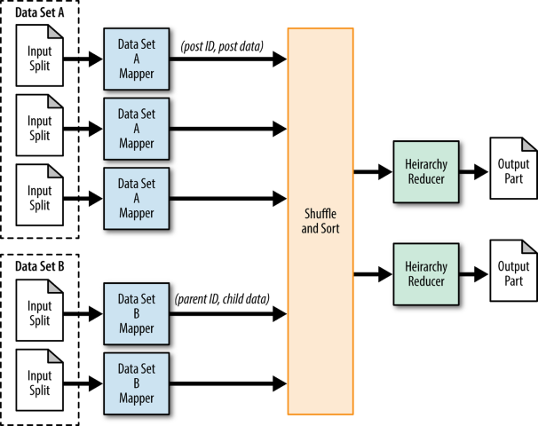

# Day 06 - BigDataTechnologies

## Combiner

1. Called local Reducer
2. Runs on same node where mapper is running
3. Its function is to Summarize / Combine / Aggregate data before Reducer
4. It is used between the `Map` class  and the `Reducer` class to reduce the volume of data transfer between Map and Reduce
5. Also known as `Semi-Reducer` or `Mini-Reducer`, since it summarizes the Mapper output records with same key before passing it to the Reducer
6. It is an optional optimization in MapReduce that aggregates intermediate data locally on Mapper nodes
7. A combiner does not have a predefined interface and it must implement the Reducer interface’s `reduce()` method

> Combiner is basically a Reducer that runs in Mapper stage

```text
mapper1
A,10
A,20
A,50
B,20
B,30

mapper2
A,5
A,20
B,10
B,60

A,[10,20,50,5,20]
B,[20,30,10,60]

Reducer - addition

A,105
B,120

without comb
AA      42061448400

after combiner
AA      42061448400

m1
A,76
A,70

c1


m2
A,60

A, [76,70,60]

sum = 206
cnt = 3

avg = 206/3 = 68.66

A,68.66
```


### Find Total Volume for each Stock Using Combiner

#### NYSE.csv Dataset

```csv
NYSE,AEA,2010-02-08,4.42,4.42,4.21,4.24,205500,4.24
NYSE,AEA,2010-02-05,4.42,4.54,4.22,4.41,194300,4.41
NYSE,AEA,2010-02-04,4.55,4.69,4.39,4.42,233800,4.42
NYSE,AEA,2010-02-03,4.65,4.69,4.50,4.55,182100,4.55
NYSE,AEA,2010-02-02,4.74,5.00,4.62,4.66,222700,4.66
```

#### Generating the .jar file for StockVolumeWithCombiner

1. Launch Eclipse application using Java perspective, click OK for Workspace Launcher
2. Open Project `Hadoop`, Expand the Project `Hadoop` in the package explorer, `Right-click on Hadoop project > New > Class`
3. Enter the class name as `StockVolumeWithCombiner` and click Finish
4. Add the below code to `StockVolumeWithCombiner.java`, and save it

    ```java
    import java.io.*;
    import org.apache.hadoop.io.Text;
    import org.apache.hadoop.io.LongWritable;
    import org.apache.hadoop.mapreduce.Job;
    import org.apache.hadoop.mapreduce.Mapper;
    import org.apache.hadoop.mapreduce.Reducer;
    import org.apache.hadoop.conf.*;
    import org.apache.hadoop.fs.*;
    import org.apache.hadoop.mapreduce.lib.input.*;
    import org.apache.hadoop.mapreduce.lib.output.*;


    public class StockVolumeWithCombiner {
        
        public static class MapClass extends Mapper<LongWritable,Text,Text,LongWritable>
        {
            public void map(LongWritable key, Text value, Context context)
            {
                try
                {
                    String[] str = value.toString().split(",");
                    long vol = Long.parseLong(str[7]);
                    context.write(new Text(str[1]),new LongWritable(vol));
                }
                catch(Exception e)
                {
                    System.out.println(e.getMessage());
                }
            }
        }
        
        public static class ReduceClass extends Reducer<Text,LongWritable,Text,LongWritable>
        {
            private LongWritable result = new LongWritable();
            
            public void reduce(Text key, Iterable<LongWritable> values,Context context) throws IOException, InterruptedException
            {
            long sum = 0;
                
                for (LongWritable val : values)
                {
                    sum += val.get();      
                }
                
            result.set(sum);
            context.write(key, result);
            //context.write(key, new LongWritable(sum));
            }
        }
        public static void main(String[] args) throws Exception {
            Configuration conf = new Configuration();
            //conf.set("name", "value")
            //conf.set("mapreduce.input.fileinputformat.split.minsize", "134217728");
            Job job = Job.getInstance(conf, "Volume Count");
            job.setJarByClass(StockVolume.class);
            job.setMapperClass(MapClass.class);
            //job.setCombinerClass(ReduceClass.class);
            job.setCombinerClass(ReduceClass.class); //enables combiner class to run at mapper
            job.setReducerClass(ReduceClass.class);
            //job.setNumReduceTasks(1); // means it will run one reducer only
            job.setNumReduceTasks(0); // means no reducer will run
            job.setOutputKeyClass(Text.class);
            job.setOutputValueClass(LongWritable.class);
            FileInputFormat.addInputPath(job, new Path(args[0]));
            FileOutputFormat.setOutputPath(job, new Path(args[1]));
            System.exit(job.waitForCompletion(true) ? 0 : 1);
        }
    }
    ```

    - Notice that in `main()`
        - we've set Combiner class as Reducer class using `job.setCombinerClass(ReduceClass.class)`
        - and we've set the code to run none of the Reducer task using `job.setNumReduceTasks(0)`

5. You may skip adding external jar files `hadoop-common.jar` and `hadoop-mapreduce-client-core.jar` since these are added while doing exercise on `Day 04`
6. `Right-Click on Hadoop Project > Export > Java > Jar File > Next >` Enter the jar file name as `myjar.jar` with full path in export destination, click on Finish

#### Upload .jar file using FTP for StockVolumeWithCombiner

- Upload the `myjar.jar` file which you've generated by compiling the Java code for MapReduce task

#### Unzip the .jar file for StockVolumeWithCombiner

- We need to extract the class file(s) from the .jar file, we extract it using `jar` command as by running the command below

```bash
[bigdatalab456422@ip-10-1-1-204 ~]$ jar tvf myjar.jar
```

```console
  25 Sat May 20 15:05:20 UTC 2023 META-INF/MANIFEST.MF
2459 Fri May 19 16:03:30 UTC 2023 AllTimeHigh$MapClass.class
2392 Fri May 19 16:03:30 UTC 2023 AllTimeHigh$ReduceClass.class
1722 Fri May 19 16:03:30 UTC 2023 AllTimeHigh.class
2475 Fri May 19 16:53:46 UTC 2023 AvgClosingPrice$MapClass.class
2454 Fri May 19 16:53:46 UTC 2023 AvgClosingPrice$ReduceClass.class
1732 Fri May 19 16:53:46 UTC 2023 AvgClosingPrice.class
2337 Fri May 19 17:41:44 UTC 2023 WordCount$IntSumReducer.class
2461 Fri May 19 17:41:44 UTC 2023 WordCount$TokenizerMapper.class
1790 Fri May 19 17:41:44 UTC 2023 WordCount.class
2454 Fri May 19 15:53:50 UTC 2023 AllTimeLow$MapClass.class
2388 Fri May 19 15:53:50 UTC 2023 AllTimeLow$ReduceClass.class
1734 Fri May 19 15:53:50 UTC 2023 AllTimeLow.class
2408 Thu May 18 17:48:56 UTC 2023 StockVolume$MapClass.class
2349 Thu May 18 17:48:56 UTC 2023 StockVolume$ReduceClass.class
1697 Thu May 18 17:48:56 UTC 2023 StockVolume.class
2456 Sat May 20 15:04:24 UTC 2023 StockVolumeWithCombiner$MapClass.class
2397 Sat May 20 15:04:24 UTC 2023 StockVolumeWithCombiner$ReduceClass.class
1813 Sat May 20 15:04:24 UTC 2023 StockVolumeWithCombiner.class
```

#### Run the MapReduce job using `hadoop jar` utility for StockVolumeWithCombiner

- Run the command below to launch the MapReduce job for `StockVolumeWithCombiner` class extracted from `myjar.jar` file, it'll read input from `training/NYSE.csv` dataset and it'll dump output/results in `training/out7` directory

```bash
[bigdatalab456422@ip-10-1-1-204 ~]$ hadoop jar myjar.jar StockVolumeWithCombiner training/NYSE.csv training/out7
```

- In verbose text, notice that
    1. It only has Mapper task, and does not have any Shuffle or Reduce task, since we have configured it with Reducer class as Combiner and none of Reducer tasks being running

        ```console
                Map input records=735026
                Map output records=735026
        ```

```console
WARNING: Use "yarn jar" to launch YARN applications.
23/05/20 09:39:36 INFO client.RMProxy: Connecting to ResourceManager at ip-10-1-1-204.ap-south-1.compute.internal/10.1.1.204:8032
23/05/20 09:39:37 WARN mapreduce.JobResourceUploader: Hadoop command-line option parsing not performed. Implement the Tool interface and execute your application with ToolRunner to remedy this.
23/05/20 09:39:37 INFO mapreduce.JobResourceUploader: Disabling Erasure Coding for path: /user/bigdatalab456422/.staging/job_1684298513961_0758
23/05/20 09:39:37 INFO input.FileInputFormat: Total input files to process : 1
23/05/20 09:39:37 INFO mapreduce.JobSubmitter: number of splits:1
23/05/20 09:39:37 INFO Configuration.deprecation: yarn.resourcemanager.system-metrics-publisher.enabled is deprecated. Instead, use yarn.system-metrics-publisher.enabled
23/05/20 09:39:37 INFO mapreduce.JobSubmitter: Submitting tokens for job: job_1684298513961_0758
23/05/20 09:39:37 INFO mapreduce.JobSubmitter: Executing with tokens: []
23/05/20 09:39:37 INFO conf.Configuration: resource-types.xml not found
23/05/20 09:39:37 INFO resource.ResourceUtils: Unable to find 'resource-types.xml'.
23/05/20 09:39:37 INFO impl.YarnClientImpl: Submitted application application_1684298513961_0758
23/05/20 09:39:37 INFO mapreduce.Job: The url to track the job: http://ip-10-1-1-204.ap-south-1.compute.internal:6066/proxy/application_1684298513961_0758/
23/05/20 09:39:37 INFO mapreduce.Job: Running job: job_1684298513961_0758
23/05/20 09:39:47 INFO mapreduce.Job: Job job_1684298513961_0758 running in uber mode : false
23/05/20 09:39:47 INFO mapreduce.Job: map 0% reduce 0%
23/05/20 09:39:53 INFO mapreduce.Job: map 100% reduce 0%
23/05/20 09:39:53 INFO mapreduce.Job: Job job_1684298513961_0758 completed successfully
23/05/20 09:39:53 INFO mapreduce.Job: Counters: 33
File System Counters
        FILE: Number of bytes read=0
        FILE: Number of bytes written=222643
        FILE: Number of read operations=0
        FILE: Number of large read operations=0
        FILE: Number of write operations=0
        HDFS: Number of bytes read=40990986
        HDFS: Number of bytes written=7842509
        HDFS: Number of read operations=7
        HDFS: Number of large read operations=0
        HDFS: Number of write operations=2
        HDFS: Number of bytes read erasure-coded=0
Job Counters
        Launched map tasks=1
        Data-local map tasks=1
        Total time spent by all maps in occupied slots (ms)=4110
        Total time spent by all reduces in occupied slots (ms)=0
        Total time spent by all map tasks (ms)=4110
        Total vcore-milliseconds taken by all map tasks=4110
        Total megabyte-milliseconds taken by all map tasks=4208640
Map-Reduce Framework
        Map input records=735026
        Map output records=735026
        Input split bytes=124
        Spilled Records=0
        Failed Shuffles=0
        Merged Map outputs=0
        GC time elapsed (ms)=68
        CPU time spent (ms)=3180
        Physical memory (bytes) snapshot=370642944
        Virtual memory (bytes) snapshot=2587979776
        Total committed heap usage (bytes)=468713472
        Peak Map Physical memory (bytes)=370642944
        Peak Map Virtual memory (bytes)=2587979776
File Input Format Counters
    Bytes Read=40990862
File Output Format Counters
    Bytes Written=7842509
```

## Customized Combiner

- You need to create a cusomized Combiner class `CityCombineClass` which is extended from `Reducer` class

```text
mapper1
A,10
A,20
A,50
B,20
B,30

mapper2
A,5
A,20
B,10
B,60

A,[10,20,50,5,20]
B,[20,30,10,60]

Reducer - addition

A,105
B,120

without comb
AA      42061448400

after combiner
AA      42061448400

m1
A,76
A,70

c1


m2
A,60

A, [76,70,60]

sum = 206
cnt = 3

avg = 206/3 = 68.66

A,68.66
-----------------------------
customized combiner

m1
A,76
A,70

c1
A,(146,2)

m2
A,60

c2
A,(60,1)

A,[(146,2),(60,1)]

sum = 146+60
cnt=2+1

avg = 206/3

A,68.66
```


### Find Average Score `CityAvg2` for students of each city

- Check if Pune City has AverageScore of 68.6666...

#### Upload the `student` files using FTP

- First create a directory `student` in the hdfs using command below

```bash
[bigdatalab456422@ip-10-1-1-204 ~]$ hadoop fs -mkdir student
```

- Upload the files `student1` and `student2` to Client/Linux Filesystem
- Then copy these files on Client/Linux Filesystem to `student` directory on hdfs using command below

```bash
[bigdatalab456422@ip-10-1-1-204 ~]$ hadoop fs -put student1 student2 student
```

#### Generating the .jar file for CityAvg2

1. Launch Eclipse application using Java perspective, click OK for Workspace Launcher
2. Open Project `Hadoop`, Expand the Project `Hadoop` in the package explorer, `Right-click on Hadoop project > New > Class`
3. Enter the class name as `CityAvg2` and click Finish
4. Add the below code to `CityAvg2.java`, and save it

    ```java
    import java.io.*;

    import org.apache.hadoop.io.Text;
    import org.apache.hadoop.io.LongWritable;
    import org.apache.hadoop.io.DoubleWritable;
    import org.apache.hadoop.mapreduce.Job;
    import org.apache.hadoop.mapreduce.Mapper;
    import org.apache.hadoop.mapreduce.Reducer;
    import org.apache.hadoop.conf.*;
    import org.apache.hadoop.fs.*;
    import org.apache.hadoop.mapreduce.lib.input.*;
    import org.apache.hadoop.mapreduce.lib.output.*;

    //data - student
    public class CityAvg2 {

        public static class CityMapClass extends Mapper<LongWritable,Text,Text,Text>
        {
        // private final static FloatWritable score = new FloatWritable();

            public void map(LongWritable key, Text value, Context context)
            {
                try
                {
                    String[] str = value.toString().split(",");
                    context.write(new Text(str[3]),new Text(str[2]));
                }
                catch(Exception e)
                {
                    System.out.println(e.getMessage());
                }
            }
        }

        public static class CityCombineClass extends Reducer<Text,Text,Text,Text>
        {

            private final static Text result = new Text();

            public void reduce(Text key, Iterable<Text> values,Context context) throws IOException, InterruptedException
            {
                int sum = 0;
                int total = 0;
                
                for (Text val : values)
                {
                    sum += Integer.parseInt(val.toString());
                    total ++;
                }

                String str = String.format("%d,%d", sum, total);
                result.set(str);
                context.write(key, result);
            }
        }


        public static class CityReduceClass extends Reducer<Text,Text,Text,DoubleWritable>
        {

            private DoubleWritable result = new DoubleWritable();
                
            public void reduce(Text key, Iterable<Text> values,Context context) throws IOException, InterruptedException
            {
                int sum = 0;
                int total = 0;
                double myavg = 0;
                
                for (Text val : values)
                {
                    String[] str = val.toString().split(",");

                    sum += Integer.parseInt(str[0]);
                    total += Integer.parseInt(str[1]);
                }
                myavg = ((double)sum / (double) total);   
                
                result.set(myavg);
                
                context.write(key, result);
            }
        }

        public static void main(String[] args) throws Exception 
        {
            Configuration conf = new Configuration();
            conf.set("mapreduce.output.textoutputformat.separator", ",");
            Job job = Job.getInstance(conf, "Student average scores in each city");
            job.setJarByClass(CityAvg2.class);
            job.setMapperClass(CityMapClass.class);
            job.setCombinerClass(CityCombineClass.class);
            job.setReducerClass(CityReduceClass.class);
            job.setMapOutputKeyClass(Text.class);
            job.setMapOutputValueClass(Text.class);
            job.setOutputKeyClass(Text.class);
            job.setOutputValueClass(DoubleWritable.class);
            job.setNumReduceTasks(1);

            FileInputFormat.addInputPath(job, new Path(args[0]));
            FileOutputFormat.setOutputPath(job, new Path(args[1]));
            System.exit(job.waitForCompletion(true) ? 0 : 1);
        }
    }
    ```

    - Notice that in `main()`
        - we've set Mapper class as `CityMapClass` class extending from `Mapper`, using `job.setMapperClass(CityMapClass.class)`
        - we've set custom Combiner class as `CityCombineClass` class extending from `Reducer`, using `job.setCombinerClass(CityCombineClass.class)`
        - we've set Reducer class as `CityReduceClass` class extending from `Reducer`, using `job.setReducerClass(CityReduceClass.class)`
        - and, we've set the code to run one Reducer task using `job.setNumReduceTasks(1)`

5. You may skip adding external jar files `hadoop-common.jar` and `hadoop-mapreduce-client-core.jar` since these are added while doing exercise on `Day 04`
6. `Right-Click on Hadoop Project > Export > Java > Jar File > Next >` Enter the jar file name as `myjar.jar` with full path in export destination, click on Finish

#### Upload .jar file using FTP for CityAvg2

- Upload the `myjar.jar` file which you've generated by compiling the Java code for MapReduce task

#### Unzip the .jar file for CityAvg2

- We need to extract the class file(s) from the .jar file, we extract it using `jar` command as by running the command below

```bash
[bigdatalab456422@ip-10-1-1-204 ~]$ jar tvf myjar.jar
```

```console
  25 Sat May 20 15:05:20 UTC 2023 META-INF/MANIFEST.MF
2459 Fri May 19 16:03:30 UTC 2023 AllTimeHigh$MapClass.class
2392 Fri May 19 16:03:30 UTC 2023 AllTimeHigh$ReduceClass.class
1722 Fri May 19 16:03:30 UTC 2023 AllTimeHigh.class
2475 Fri May 19 16:53:46 UTC 2023 AvgClosingPrice$MapClass.class
2454 Fri May 19 16:53:46 UTC 2023 AvgClosingPrice$ReduceClass.class
1732 Fri May 19 16:53:46 UTC 2023 AvgClosingPrice.class
2337 Fri May 19 17:41:44 UTC 2023 WordCount$IntSumReducer.class
2461 Fri May 19 17:41:44 UTC 2023 WordCount$TokenizerMapper.class
1790 Fri May 19 17:41:44 UTC 2023 WordCount.class
2454 Fri May 19 15:53:50 UTC 2023 AllTimeLow$MapClass.class
2388 Fri May 19 15:53:50 UTC 2023 AllTimeLow$ReduceClass.class
1734 Fri May 19 15:53:50 UTC 2023 AllTimeLow.class
2408 Thu May 18 17:48:56 UTC 2023 StockVolume$MapClass.class
2349 Thu May 18 17:48:56 UTC 2023 StockVolume$ReduceClass.class
1697 Thu May 18 17:48:56 UTC 2023 StockVolume.class
2456 Sat May 20 15:04:24 UTC 2023 StockVolumeWithCombiner$MapClass.class
2397 Sat May 20 15:04:24 UTC 2023 StockVolumeWithCombiner$ReduceClass.class
1813 Sat May 20 15:04:24 UTC 2023 StockVolumeWithCombiner.class
```

#### Run the MapReduce job using `hadoop jar` utility for CityAvg2

- Run the command below to launch the MapReduce job for `CityAvg2` class extracted from `myjar.jar` file, it'll read input from `student` directory dataset and it'll dump output/results in `training/out8` directory

```bash
[bigdatalab456422@ip-10-1-1-204 ~]$ hadoop jar myjar.jar CityAvg2 student training/out8
```

- In verbose text, notice that it shows
    1. It is processing two input files inside `student` directory on hdfs which is indicated by message

        ```console
        INFO input.FileInputFormat: Total input files to process : 2
        ```

    2. It has Launched 2 Mapper tasks to collect from 2 files and only 1 Reducer Task as set in `main()`

        ```console
                Launched map tasks=2
                Launched reduce tasks=1
        ```

    3. It shows the total number of records from all the files being 12 records which are being fed to Mapper task

        ```console
                Map input records=12
                Map output records=12
        ```

    4. It shows the total number of records being fed to combiner being 12, and combiner generates 10 records in output

        ```console
                Combine input records=12
                Combine output records=10
        ```

    5. It shows 2 shuffled Maps for each of the input files, so shuffler will shuffle and merge the two maps generated by combiner on each of the input files

        ```console
                Shuffled Maps =2
                Failed Shuffles=0
                Merged Map outputs=2
        ```

    6. It shows the total number of groups being 7, which are being fed to Reducer to reduce the values

        ```console
                Reduce input groups=7
                Reduce shuffle bytes=179
                Reduce input records=10
                Reduce output records=7
        ```

```console
WARNING: Use "yarn jar" to launch YARN applications.
23/05/20 10:25:44 INFO client.RMProxy: Connecting to ResourceManager at ip-10-1-1-204.ap-south-1.compute.internal/10.1.1.204:8032
23/05/20 10:25:45 WARN mapreduce.JobResourceUploader: Hadoop command-line option parsing not performed. Implement the Tool interface and execute your application with ToolRunner to remedy this.
23/05/20 10:25:45 INFO mapreduce.JobResourceUploader: Disabling Erasure Coding for path: /user/bigdatalab456422/.staging/job_1684298513961_0784
23/05/20 10:25:45 INFO input.FileInputFormat: Total input files to process : 2
23/05/20 10:25:46 INFO mapreduce.JobSubmitter: number of splits:2
23/05/20 10:25:46 INFO Configuration.deprecation: yarn.resourcemanager.system-metrics-publisher.enabled is deprecated. Instead, use yarn.system-metrics-publisher.enabled
23/05/20 10:25:46 INFO mapreduce.JobSubmitter: Submitting tokens for job: job_1684298513961_0784
23/05/20 10:25:46 INFO mapreduce.JobSubmitter: Executing with tokens: []
23/05/20 10:25:46 INFO conf.Configuration: resource-types.xml not found
23/05/20 10:25:46 INFO resource.ResourceUtils: Unable to find 'resource-types.xml'.
23/05/20 10:25:46 INFO impl.YarnClientImpl: Submitted application application_1684298513961_0784
23/05/20 10:25:46 INFO mapreduce.Job: The url to track the job: http://ip-10-1-1-204.ap-south-1.compute.internal:6066/proxy/application_1684298513961_0784/
23/05/20 10:25:46 INFO mapreduce.Job: Running job: job_1684298513961_0784
23/05/20 10:26:09 INFO mapreduce.Job: Job job_1684298513961_0784 running in uber mode : false
23/05/20 10:26:09 INFO mapreduce.Job: map 0% reduce 0%
23/05/20 10:26:17 INFO mapreduce.Job: map 100% reduce 0%
23/05/20 10:26:31 INFO mapreduce.Job: map 100% reduce 100%
23/05/20 10:26:33 INFO mapreduce.Job: Job job_1684298513961_0784 completed successfully
23/05/20 10:26:34 INFO mapreduce.Job: Counters: 54
File System Counters
        FILE: Number of bytes read=148
        FILE: Number of bytes written=670328
        FILE: Number of read operations=0
        FILE: Number of large read operations=0
        FILE: Number of write operations=0
        HDFS: Number of bytes read=493
        HDFS: Number of bytes written=101
        HDFS: Number of read operations=11
        HDFS: Number of large read operations=0
        HDFS: Number of write operations=2
        HDFS: Number of bytes read erasure-coded=0
Job Counters
        Launched map tasks=2
        Launched reduce tasks=1
        Data-local map tasks=2
        Total time spent by all maps in occupied slots (ms)=10570
        Total time spent by all reduces in occupied slots (ms)=12278
        Total time spent by all map tasks (ms)=10570
        Total time spent by all reduce tasks (ms)=12278
        Total vcore-milliseconds taken by all map tasks=10570
        Total vcore-milliseconds taken by all reduce tasks=12278
        Total megabyte-milliseconds taken by all map tasks=10823680
        Total megabyte-milliseconds taken by all reduce tasks=12572672
Map-Reduce Framework
        Map input records=12
        Map output records=12
        Map output bytes=122
        Map output materialized bytes=179
        Input split bytes=246
        Combine input records=12
        Combine output records=10
        Reduce input groups=7
        Reduce shuffle bytes=179
        Reduce input records=10
        Reduce output records=7
        Spilled Records=20
        Shuffled Maps =2
        Failed Shuffles=0
        Merged Map outputs=2
        GC time elapsed (ms)=571
        CPU time spent (ms)=3370
        Physical memory (bytes) snapshot=1306103808
        Virtual memory (bytes) snapshot=7778222080
        Total committed heap usage (bytes)=1710227456
        Peak Map Physical memory (bytes)=526311424
        Peak Map Virtual memory (bytes)=2590330880
        Peak Reduce Physical memory (bytes)=256356352
        Peak Reduce Virtual memory (bytes)=2599239680
Shuffle Errors
        BAD_ID=0
        CONNECTION=0
        IO_ERROR=0
        WRONG_LENGTH=0
        WRONG_MAP=0
        WRONG_REDUCE=0
File Input Format Counters
        Bytes Read=247
File Output Format Counters
        Bytes Written=101
```

#### Output of CityAvg2 MapReduce job

- To see the output files, launch the `Hue` tool from the Nuevopro web dashboard from where you earlier launched the `Web Console`, or you can go to the already open `Hue` tool
- Once `Hue` tool is open, it navigate to `/user/bigdatalab456422/training/out8` where it should have dumped the output files
- Note that it has counted each of the students in the two files `student1` and `student2` in MapReduce output file, so it shows 7 cities for which it has counted students


## Partitioner

1. Runs on same node where mapper is running
2. Its function is to distribute the data to the reducers
3. The Partition class determines a (key,value) pair's partition assignment
4. The Partitioning stage occurs after Map stage and before Reduce stage
5. It works like a condition in processing the input dataset
6. A Partitioner class should extend `org.apache.hadoop.mapreduce.Partitioner<KEY,VALUE>` class and should override `public abstract int getPartition(KEY key, VALUE value,int numPartitions)` method to define the partitioning pattern

> The total number of partitions is same as the number of Reducer tasks for the job, and Partitioner is created only when there are multiple reducers



### Find max salary paid to each gender in 3 different age groups

- Find maximum salary paid to each gender in 3 different age groups
    1. age<=20
    2. age > 20 and age <=30
    3. age > 30

```text
1201,gopal,45,Male,50000
1202,manisha,40,Female,51000
1203,khaleel,34,Male,30000
1204,prasanth,30,Male,31000
1205,kiran,20,Male,40000
1206,laxmi,25,Female,35000
1207,bhavya,20,Female,15000
1208,reshma,19,Female,14000
1209,kranthi,22,Male,22000
1210,Satish,24,Male,25000
1211,Krishna,25,Male,26000
1212,Arshad,28,Male,20000
1213,lavanya,18,Female,8000

prob statement : find max salary paid to each gender in 3 diff age groups

1) age<=20
2) age> and <=30
3) age > 30

mapper code
gender, (age,sal)

1201,gopal,45,Male,50000
1202,manisha,40,Female,51000
1203,khaleel,34,Male,30000
1204,prasanth,30,Male,31000

m1
Male, (45,50000)
Female, (40,51000)
Male, (34,30000)
Male,(30,31000)

p-0
no records

p-1
Male, (30, 31000)

p-2
Male, (45,50000)
Female, (40,51000)
Male, (34,30000)

r-2
Female, [(40,51000)]
Male, [(45,50000),(34,30000)]

F - 51k
M - 50K
```


#### Upload the `emp.csv` file using FTP

- Upload the file `emp.csv` to Client/Linux Filesystem
- Then copy this file on Client/Linux Filesystem to `training` directory on hdfs using command below

```bash
[bigdatalab456422@ip-10-1-1-204 ~]$ hadoop fs -put emp.csv training
```

#### Generating the .jar file for MyPartitioner

1. Launch Eclipse application using Java perspective, click OK for Workspace Launcher
2. Open Project `Hadoop`, Expand the Project `Hadoop` in the package explorer, `Right-click on Hadoop project > New > Class`
3. Enter the class name as `MyPartitioner` and click Finish
4. Add the below code to `MyPartitioner.java`, and save it

    ```java
    import java.io.*;

    import org.apache.hadoop.io.*;
    import org.apache.hadoop.mapreduce.*;
    import org.apache.hadoop.conf.*;

    import org.apache.hadoop.fs.*;

    import org.apache.hadoop.mapreduce.lib.input.*;
    import org.apache.hadoop.mapreduce.lib.output.*;

    import org.apache.hadoop.util.*;

    public class MyPartitioner extends Configured implements Tool
    {
        //Map class

        public static class MapClass extends Mapper<LongWritable,Text,Text,Text>
        {
            public void map(LongWritable key, Text value, Context context)
            {
                try{
                    String[] str = value.toString().split(",");
                    String gender=str[3];
                    //String name = str[1];
                    //String age = str[2];
                    //String salary = str[4];
                    //String myValue = name + ',' + age + ',' + salary;
                    context.write(new Text(gender), new Text(value));
                }
                catch(Exception e)
                {
                    System.out.println(e.getMessage());
                }
            }
        }
    
        //Reducer class

        public static class ReduceClass extends Reducer<Text,Text,Text,IntWritable>
        {
            public int max = 0;
            private Text outputKey = new Text();

            public void reduce(Text key, Iterable <Text> values, Context context) throws IOException, InterruptedException
            {
                max = -1;
                
                for (Text val : values)
                {
                    //outputKey.set(key);
                    String [] str = val.toString().split(",");
                    if(Integer.parseInt(str[4])>max)
                    {
                        max=Integer.parseInt(str[4]);
                        String mykey = str[0] + ',' + str[3] + ',' + str[1] + ',' + str[2];
                        outputKey.set(mykey);

                    }
                }
                context.write(outputKey, new IntWritable(max));
            }
        }
    
        //Partitioner class

        public static class CaderPartitioner extends Partitioner < Text, Text >
        {
            @Override
            public int getPartition(Text key, Text value, int numReduceTasks)
            {
                String[] str = value.toString().split(",");
                int age = Integer.parseInt(str[2]);
                
                if(age<=20)
                {
                return 0;
                }
                else if(age>20 && age<=30)
                {
                return 1 ;
                }
                else
                {
                return 2;
                }
            }
        }


        public int run(String[] arg) throws Exception
        {
            Configuration conf = new Configuration();
            conf.set("mapreduce.output.textoutputformat.separator",",");

            Job job = Job.getInstance(conf);
            job.setJarByClass(MyPartitioner.class);
            job.setJobName("Top Salaried Employees");
            FileInputFormat.setInputPaths(job, new Path(arg[0]));
            FileOutputFormat.setOutputPath(job,new Path(arg[1]));
            
            job.setMapperClass(MapClass.class);
            
            job.setMapOutputKeyClass(Text.class);
            job.setMapOutputValueClass(Text.class);

            //set partitioner statement
            
            job.setPartitionerClass(CaderPartitioner.class);
            job.setReducerClass(ReduceClass.class);
            job.setNumReduceTasks(3);
            job.setInputFormatClass(TextInputFormat.class);
            
            job.setOutputFormatClass(TextOutputFormat.class);
            job.setOutputKeyClass(Text.class);
            job.setOutputValueClass(Text.class);
            
            System.exit(job.waitForCompletion(true)? 0 : 1);
            return 0;
        }

        public static void main(String ar[]) throws Exception
        {
        ToolRunner.run(new Configuration(), new MyPartitioner(),ar);
        System.exit(0);
        }
    }
    ```

    - Notice that
        1. In `CaderPartitioner` class
            1. we've overridden `getPartition()` method to define the partitioning pattern to create three partitions
        2. In `main()` driver, we invoke `ToolRunner.run()` method to run `MyPartitioner()` class with pre-set configuration in `run()` method
        3. In `run()` method
            1. we've created an instance of `Configuration()`, set it for seprator, then pass it to create an instance of `Job`
            2. we've set class for jar as `MyPartitioner` class, using `job.setJarByClass(MyPartitioner.class)`
            3. we've set Mapper class as `MapClass` class extending from `Mapper`, using `job.setMapperClass(MapClass.class)`
            4. we've set Partitioner class as `CaderPartitioner` class extending from `Partitioner`, using `job.setPartitionerClass(CaderPartitioner.class)`
            5. we've set Reducer class as `ReduceClass` class extending from `Reducer`, using `job.setReducerClass(ReduceClass.class)`
            6. and, we've set the code to run three Reducer tasks using `job.setNumReduceTasks(3)`, which should match with the count of partitions we've specified to create, since one reducer is required per partition

5. You may skip adding external jar files `hadoop-common.jar` and `hadoop-mapreduce-client-core.jar` since these are added while doing exercise on `Day 04`
6. `Right-Click on Hadoop Project > Export > Java > Jar File > Next >` Enter the jar file name as `myjar.jar` with full path in export destination, click on Finish

#### Upload .jar file using FTP for MyPartitioner

- Upload the `myjar.jar` file which you've generated by compiling the Java code for MapReduce task

#### Unzip the .jar file for MyPartitioner

- We need to extract the class file(s) from the .jar file, we extract it using `jar` command as by running the command below

```bash
[bigdatalab456422@ip-10-1-1-204 ~]$ jar tvf myjar.jar
```

```console
  25 Sat May 20 17:36:10 UTC 2023 META-INF/MANIFEST.MF
2459 Fri May 19 16:03:30 UTC 2023 AllTimeHigh$MapClass.class
2392 Fri May 19 16:03:30 UTC 2023 AllTimeHigh$ReduceClass.class
1722 Fri May 19 16:03:30 UTC 2023 AllTimeHigh.class
2475 Fri May 19 16:53:46 UTC 2023 AvgClosingPrice$MapClass.class
2454 Fri May 19 16:53:46 UTC 2023 AvgClosingPrice$ReduceClass.class
1732 Fri May 19 16:53:46 UTC 2023 AvgClosingPrice.class
2337 Fri May 19 17:41:44 UTC 2023 WordCount$IntSumReducer.class
2461 Fri May 19 17:41:44 UTC 2023 WordCount$TokenizerMapper.class
1790 Fri May 19 17:41:44 UTC 2023 WordCount.class
2454 Fri May 19 15:53:50 UTC 2023 AllTimeLow$MapClass.class
2388 Fri May 19 15:53:50 UTC 2023 AllTimeLow$ReduceClass.class
1734 Fri May 19 15:53:50 UTC 2023 AllTimeLow.class
1242 Sat May 20 17:28:50 UTC 2023 MyPartitioner$CaderPartitioner.class
2365 Sat May 20 17:28:50 UTC 2023 MyPartitioner$MapClass.class
2905 Sat May 20 17:28:50 UTC 2023 MyPartitioner$ReduceClass.class
2632 Sat May 20 17:28:50 UTC 2023 MyPartitioner.class
2408 Thu May 18 17:48:56 UTC 2023 StockVolume$MapClass.class
2349 Thu May 18 17:48:56 UTC 2023 StockVolume$ReduceClass.class
1697 Thu May 18 17:48:56 UTC 2023 StockVolume.class
2648 Sat May 20 15:42:48 UTC 2023 CityAvg2$CityCombineClass.class
2269 Sat May 20 15:42:48 UTC 2023 CityAvg2$CityMapClass.class
2639 Sat May 20 15:42:48 UTC 2023 CityAvg2$CityReduceClass.class
2034 Sat May 20 15:42:48 UTC 2023 CityAvg2.class
2456 Sat May 20 15:04:24 UTC 2023 StockVolumeWithCombiner$MapClass.class
2397 Sat May 20 15:04:24 UTC 2023 StockVolumeWithCombiner$ReduceClass.class
1813 Sat May 20 15:04:24 UTC 2023 StockVolumeWithCombiner.class
```

#### Run the MapReduce job using `hadoop jar` utility for MyPartitioner

- Run the command below to launch the MapReduce job for `MyPartitioner` class extracted from `myjar.jar` file, it'll read input from `training/emp.csv` dataset and it'll dump output/results in `training/out9` directory

```bash
[bigdatalab456422@ip-10-1-1-204 ~]$ hadoop jar myjar.jar MyPartitioner training/emp.csv training/out9
```

- In verbose text, notice that it shows
    1. It is processing one input file `training/emp.csv` on hdfs which is indicated by message

        ```console
        INFO input.FileInputFormat: Total input files to process : 1
        ```

    2. It has Launched 1 Mapper task to collect from 1 file and 3 Reducer Tasks to cater to delivering three partitions

        ```console
                Launched map tasks=1
                Launched reduce tasks=3
        ```

    3. It shows the total number of records from the input file being 13 records which are being fed to Mapper task

        ```console
                Map input records=13
                Map output records=13
        ```

    4. It shows the total number of groups being 6 which includes two groups of gender for each of three partitions, which are being fed to Reducer to reduce the values per partition

        ```console
                Reduce input groups=6
                Reduce shuffle bytes=422
                Reduce input records=13
                Reduce output records=6
        ```

    5. It shows 3 shuffled Maps for each of the partition/reducer, so shuffler will shuffle and merge for each of the partition and then reducer will reduce the output

        ```console
                Shuffled Maps =3
                Failed Shuffles=0
                Merged Map outputs=3
        ```

```console
WARNING: Use "yarn jar" to launch YARN applications.
23/05/20 12:09:40 INFO client.RMProxy: Connecting to ResourceManager at ip-10-1-1-204.ap-south-1.compute.internal/10.1.1.204:8032
23/05/20 12:09:40 WARN mapreduce.JobResourceUploader: Hadoop command-line option parsing not performed. Implement the Tool interface and execute your application with ToolRunner to remedy this.
23/05/20 12:09:40 INFO mapreduce.JobResourceUploader: Disabling Erasure Coding for path: /user/bigdatalab456422/.staging/job_1684298513961_0866
23/05/20 12:09:41 INFO input.FileInputFormat: Total input files to process : 1
23/05/20 12:09:41 INFO mapreduce.JobSubmitter: number of splits:1
23/05/20 12:09:41 INFO Configuration.deprecation: yarn.resourcemanager.system-metrics-publisher.enabled is deprecated. Instead, use yarn.system-metrics-publisher.enabled
23/05/20 12:09:41 INFO mapreduce.JobSubmitter: Submitting tokens for job: job_1684298513961_0866
23/05/20 12:09:41 INFO mapreduce.JobSubmitter: Executing with tokens: []
23/05/20 12:09:41 INFO conf.Configuration: resource-types.xml not found
23/05/20 12:09:41 INFO resource.ResourceUtils: Unable to find 'resource-types.xml'.
23/05/20 12:09:42 INFO impl.YarnClientImpl: Submitted application application_1684298513961_0866
23/05/20 12:09:42 INFO mapreduce.Job: The url to track the job: http://ip-10-1-1-204.ap-south-1.compute.internal:6066/proxy/application_1684298513961_0866/
23/05/20 12:09:42 INFO mapreduce.Job: Running job: job_1684298513961_0866
23/05/20 12:09:57 INFO mapreduce.Job: Job job_1684298513961_0866 running in uber mode : false
23/05/20 12:09:57 INFO mapreduce.Job: map 0% reduce 0%
23/05/20 12:10:04 INFO mapreduce.Job: map 100% reduce 0%
23/05/20 12:10:13 INFO mapreduce.Job: map 100% reduce 67%
23/05/20 12:10:16 INFO mapreduce.Job: map 100% reduce 100%
23/05/20 12:10:17 INFO mapreduce.Job: Job job_1684298513961_0866 completed successfully
23/05/20 12:10:17 INFO mapreduce.Job: Counters: 54
File System Counters
        FILE: Number of bytes read=434
        FILE: Number of bytes written=895851
        FILE: Number of read operations=0
        FILE: Number of large read operations=0
        FILE: Number of write operations=0
        HDFS: Number of bytes read=474
        HDFS: Number of bytes written=162
        HDFS: Number of read operations=18
        HDFS: Number of large read operations=0
        HDFS: Number of write operations=6
        HDFS: Number of bytes read erasure-coded=0
Job Counters
        Launched map tasks=1
        Launched reduce tasks=3
        Data-local map tasks=1
        Total time spent by all maps in occupied slots (ms)=4465
        Total time spent by all reduces in occupied slots (ms)=24744
        Total time spent by all map tasks (ms)=4465
        Total time spent by all reduce tasks (ms)=24744
        Total vcore-milliseconds taken by all map tasks=4465
        Total vcore-milliseconds taken by all reduce tasks=24744
        Total megabyte-milliseconds taken by all map tasks=4572160
        Total megabyte-milliseconds taken by all reduce tasks=25337856
Map-Reduce Framework
        Map input records=13
        Map output records=13
        Map output bytes=426
        Map output materialized bytes=422
        Input split bytes=123
        Combine input records=0
        Combine output records=0
        Reduce input groups=6
        Reduce shuffle bytes=422
        Reduce input records=13
        Reduce output records=6
        Spilled Records=26
        Shuffled Maps =3
        Failed Shuffles=0
        Merged Map outputs=3
        GC time elapsed (ms)=697
        CPU time spent (ms)=4550
        Physical memory (bytes) snapshot=1158127616
        Virtual memory (bytes) snapshot=10370674688
        Total committed heap usage (bytes)=1611137024
        Peak Map Physical memory (bytes)=526077952
        Peak Map Virtual memory (bytes)=2587410432
        Peak Reduce Physical memory (bytes)=249159680
        Peak Reduce Virtual memory (bytes)=2601119744
Shuffle Errors
        BAD_ID=0
        CONNECTION=0
        IO_ERROR=0
        WRONG_LENGTH=0
        WRONG_MAP=0
        WRONG_REDUCE=0
File Input Format Counters
        Bytes Read=351
File Output Format Counters
        Bytes Written=162
```

#### Output of MyPartitioner MapReduce job

- To see the output files, launch the `Hue` tool from the Nuevopro web dashboard from where you earlier launched the `Web Console`, or you can go to the already open `Hue` tool
- Once `Hue` tool is open, it navigate to `/user/bigdatalab456422/training/out9` where it should have dumped the output partitioned files
- Notice that it has `.success` file which indicates that the MapReduce job completed successfully


- Since partitions have been created based on the logic for three age groups, so it has created three files which are partitioned output, and to access each of the output partition, you need to open each one of them
- Notice that file names `part-r-00000`, `part-r-00001` and `part-r-00002` have a last number which is automatically generated to represent the number you set to return while overriding `getPartition()` method definition
  - for `partition 0` representing age group `[age<=20]`, open partition/file `part-r-00000`

  

  - for `partition 1` representing age group `[age > 20 and age <=30]`, open partition/file `part-r-00001`

  

  - for `partition 2` representing age group `[age > 30]`, open partition/file `part-r-00002`

  
