# Day 07 - BigDataTechnologies

## Joins

```text
What are Joins?

Combining 2 or more datasets / tables - to create output
```

- The join operation is used to combine two or more database tables based on foreign keys
- In general, companies maintain separate tables for separate type of records in their database, and many times these companies need to generate analytic reports using the data present in such separate tables. Therefore, they perform join operations on these separate tables using a common column (foreign key), like some ID field, etc. to generate a combined table

### Types of Joins

```text
inner
left outer
right outer
full

TableA
id,name
1,John
2,Alan

TableB
id,location
1,NYC
3,LA

inner
id,name,id,location
1,John,1,NYC

left outer
1,John,1,NYC
2,Alan,null,null

right outer
1,NYC,1,John
3,LA,null,null

full outer
1,John,1,NYC
2,Alan,null,null
null,null,3,LA
```

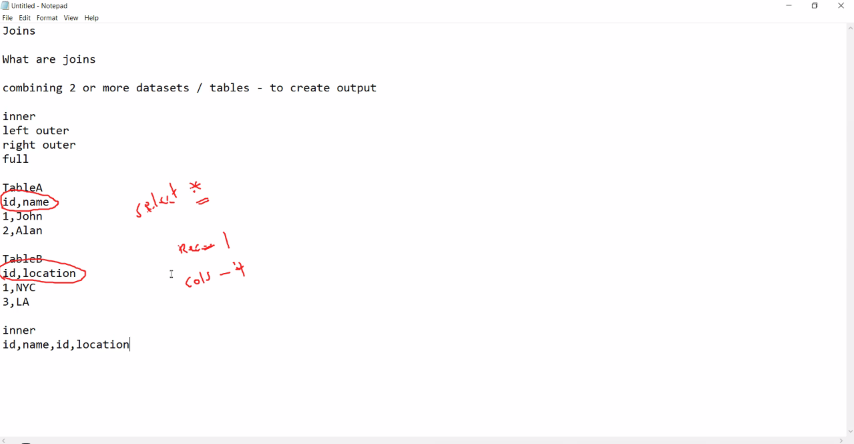

### Types of Joins in Hadoop

#### Reduce-side Join

```text
In  Hadoop

one big dataset with another big dataset
100 TB join with 100TB
Reduce-side Join
```

#### Map-side Join

```text
joining one big data set with one or many lookup files (reference)
100 TB join 100 MB
Map-side Join
```

```text
Sales table with Customer/Product

Map Side Join
```

```sql
SELECT * FROM employee e, desig d, salary s WHERE id e = id d = id s;
```

```sql
SELECT e.*, s.salary, d.designation FROM
employees e JOIN salary s ON e.id = s.id
JOIN
designation d
ON e.id = d.id;
```

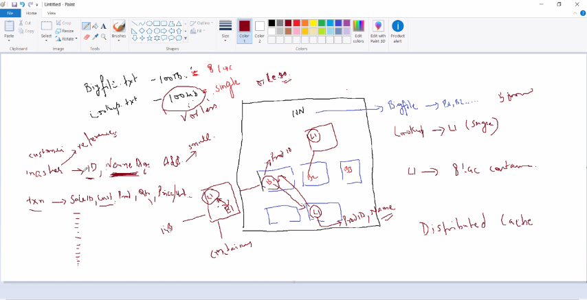

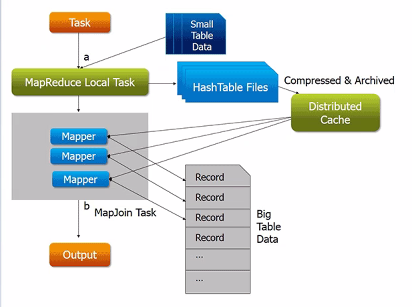

### Modes to Read/Write data in Java

- We can Read/Write by two modes using `java.io` library
    1. Buffer
        - Reads file in one go as a buffer using `FileReader()` & `BufferedReader()`
        - Java code will take input form a file `sample.txt`

        ```text
        Java is used as a native lang
        Second line
        Sixth line
        Java is used as a native lang
        Second line
        Sixth line
        Java is used as a native lang
        Second line
        Sixth line
        ```

        - Java code

        ```java
            import java.io.*;
            public class JavaBufferReader {
                public static void main(String[] args) throws IOException {
                    try {
                        FileReader fr = new FileReader("./src/sample.txt");
                        BufferedReader br = new BufferedReader(fr);
                        String line = br.readLine();
                        while (line != null)
                        {
                            System.out.println(line);
                            line = br.readLine();
                        }
                        br.close();
                        fr.close();
                    }
                    catch(FileNotFoundException f)
                    {
                        System.out.println("File is not avialable");
                    }
                }
            }
        ```

        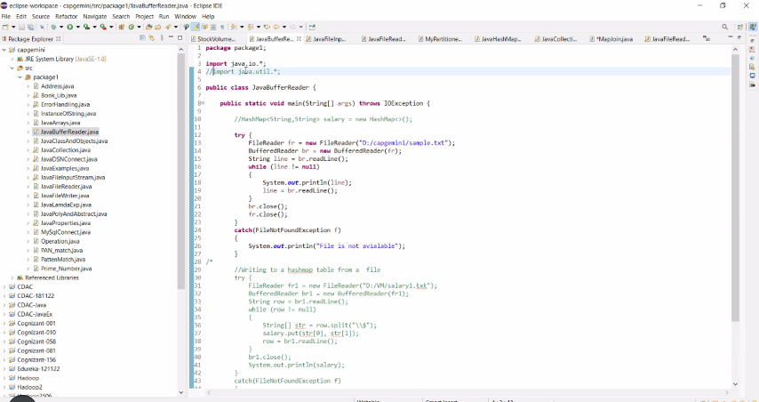

    2. Stream
        - Reads file as a stream using `FileInputStream()`, and you can write data to a file using `FileOutputStream()`
        - You can also read from an input stream such as `InputStreamReader()` and print to an output stream such as `PrintStream()`
        - In below code, File Steam logic is commented right now, and this code reads from default input stream and gives output to default print stream, you can use either of stream Read/Write methods depending on whether you want to read from a File Stream or default io stream

        ```java
        import java.io.*;

        public class JavaFileInputStream {

            public static void main(String[] args) throws IOException {
                
                try
                {
                //FileInputStream input = new FileInputStream("./src/sample.txt");
                InputStreamReader input = new InputStreamReader(System.in);
                //FileOutputStream output = new FileOutputStream("./src/output1.txt", true);
                //OutputStreamWriter output = new OutputStreamWriter(System.out);
                PrintStream output = new PrintStream(System.out);
                int i = 0;
                
                //while ((i = input.read() ) != -1)
                //{
                    //output.print((char)i);
                //}
                
                //input.close();
                
                
                while ((i = input.read() ) != -1)
            {
                    //System.out.print(i);
                    output.write(i);
                    
                }
                }
                catch(Exception f)
                {
                    System.out.println("File not found");
                }

            }

        }
        ```

### `HashMap` and `TreeMap` for Key,Value in MapReduce Joins

- The Key,Value format in MapReduce joins is implemented using `HashMap` and `TreeMap` in Java `Collection`
- These `HashMap` and `TreeMap` store data in dictionary format as `(Key,Value)`

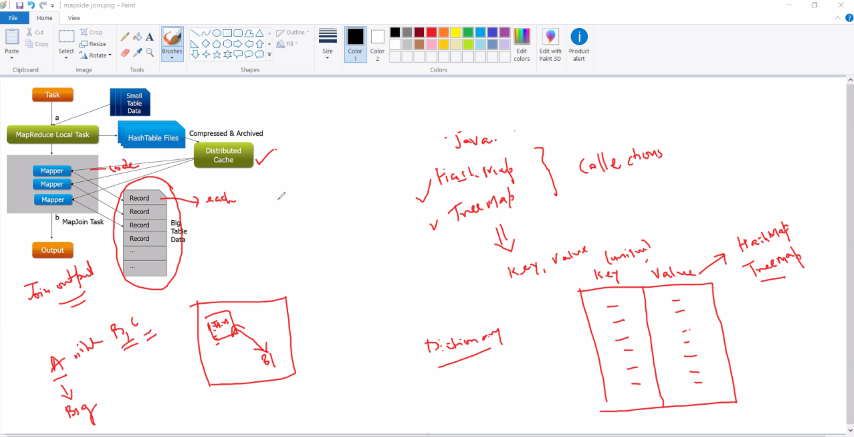

- Below Java code shows the Key which is Name & Value being stored for `Employees` using `HashMap` and `TreeMap`

    ```java
    import java.util.HashMap;
    import java.util.TreeMap;

    public class JavaHashMap {
        public static void main(String[] args) {
            // TODO Auto-generated method stub
            System.out.println("Hashap Employees");
            HashMap<Integer, String> Employees = new HashMap<>();
            
            Employees.put(20, "John");
            Employees.put(35, "Mary");
            Employees.put(20, "Alan"); // replaces John with value Alan at key 20
            
            System.out.println(Employees.size());
            System.out.println(Employees);
            System.out.println(Employees.get(20));
            
            
            System.out.println("\nTreeMap Emp");
            TreeMap<Integer, String> Emp = new TreeMap<>();
            
            Emp.put(20, "John");
            Emp.put(35, "Mary");
            Emp.put(20, "Alan"); // replaces John with value Alan at key 20
            
            System.out.println(Emp.size());
            System.out.println(Emp);
            System.out.println(Emp.get(20));
        }
    }
    ```

    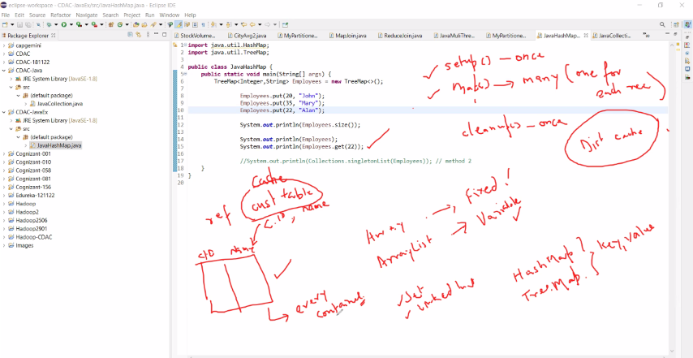

### Left Join Example

- We've taken three files `Employees.txt`, `salary.txt`, `desig.txt` for input and produce a left join a s generated by Map side join

- `Employees.txt`

```text
10001,James,Foller,52,New Orleans
10002,Marrier,King,40,New Jersey
10003,Annie,George,35,New York
```

- `salary.txt`

```text
10001,500000
10002,750000
10004,600000
```

- `desig.txt`

```text
10001,Manager
10002,President
10004,Vice-President
```

- Upon performing Map side Join for these three data files `Employees.txt`, `salary.txt` and `desig.txt`, it'll generate a Left Join as indicated in the output

```console
10001,James,Foller,52,New Orleans,500000,Manager
10002,Marrier,King,40,New Jersey,750000,President
10003,Annie,George,35,New York,null,null
```

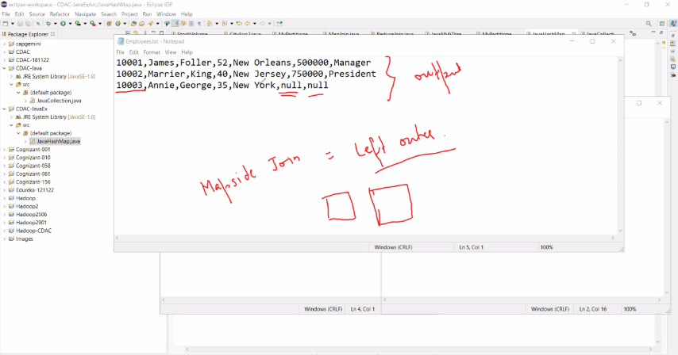

### Map Side Join

- As the name implies, the join operation is performed in Map stage itself
- Therefore, in Map side join, it becomes mandatory that the input to each map is partitioned and sorted according to the keys
- Map side Join is faster as it does not have to wait for all the mappers to complete
- There are some pre-requisites for Mapside join
  - All the records of the same key must reside in the same partition
  - Must be sorted with same key
  - Each input data should be divided in same number of partition
- You will use Map side join if one of your table can be fit in memory which will reduce the overhead on your sort and shuffle data
- Map side join produces a `LEFT JOIN`
- It is used where one data set is large say 100TB which has one or many small/lookup/reference data sets, say of 100MB
- Map side join is similar to a join but all the tasks are performed by the mapper alone so only mapper is needed in Map side join
- One Lookup file data is in memory in Map side join

#### Example: Customers Map side JOIN Orders

- Since Map Side join only has one stage which is Mapper, it does not require any Reducer or Shuffle stage

```text
(LookUp) cust               (BigData) orders
id,name                     order_id,id,amt
1,John                      101,1,2000
                            102,2,3000
```

```sql
SELECT c.id, c.name, sum(o.amt)
FROM customers c
JOIN orders o
ON c.id=o.id
GROUP BY o.id;
```

#### Advantages of Map Side Join

- Map side join helps in minimizing the cost that is incurred for sorting and merging in the *shuffle* and *reduce* stages
- Map side join also helps in improving the performance of the task by decreasing the time to finish the task

#### Disadvantages of Map Side Join

- Map side join is adequate only when one of the tables on which you perform Map side join operation is small enough to fit into the memory. Hence it is not suitable to perform map side join on tables which have huge data in both tables, instead it is recommended to use Reduce side join in such cases

### Generate Left Map Join using Map Side Join based on ID column to produce Left Join

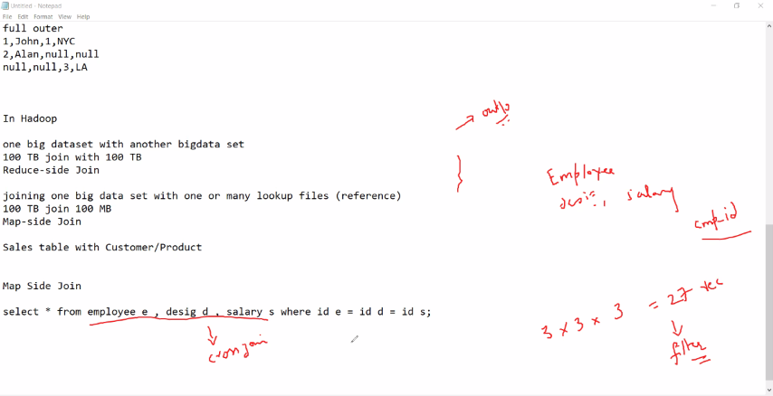

- Generate Map Side Join based on ID column to produce Left Join in three dataset files
    1. `Employees.txt`

        ```text
        10001,James,Foller,52,New Orleans
        10002,Marrier,King,40,New Jersey
        10003,Annie,George,35,New York
        ```

    2. `salary.txt`

        ```text
        10001,500000
        10002,750000
        10004,600000
        ```

    3. `desig.txt`

        ```text
        10001,Manager
        10002,President
        10004,Vice-President
        ```

#### Upload `Employees.txt`, `salary.txt`, `desig.txt` files using FTP

- Upload `Employees.txt`, `salary.txt`, `desig.txt` files to Client/Linux Filesystem
- Then copy these file on Client/Linux Filesystem to `training` directory on hdfs using command below

```bash
[bigdatalab456422@ip-10-1-1-204 ~]$ hadoop fs -put Employees.txt salary.txt desig.txt training
```

#### Generating the .jar file for MapJoin

1. Launch Eclipse application using Java perspective, click OK for Workspace Launcher
2. Open Project `Hadoop`, Expand the Project `Hadoop` in the package explorer, `Right-click on Hadoop project > New > Class`
3. Enter the class name as `MapJoin` and click Finish
4. Add the below code to `MapJoin.java`, and save it

    ```java
    import java.io.BufferedReader;
    import java.io.InputStreamReader;
    import java.io.IOException;
    import java.net.URI;
    import java.util.HashMap;
    import java.util.Map;

    import org.apache.hadoop.conf.Configuration;
    import org.apache.hadoop.fs.FileSystem;
    import org.apache.hadoop.fs.Path;
    import org.apache.hadoop.io.LongWritable;
    import org.apache.hadoop.io.Text;
    import org.apache.hadoop.mapreduce.lib.input.FileInputFormat;
    import org.apache.hadoop.mapreduce.lib.output.FileOutputFormat;
    import org.apache.hadoop.mapreduce.Job;
    import org.apache.hadoop.mapreduce.Mapper;

    public class MapJoin {

        public static class MyMapper extends Mapper<LongWritable,Text, Text, Text> {
            private Map<String, String> abMap = new HashMap<String, String>();
            private Map<String, String> abMap1 = new HashMap<String, String>();
            private Text outputKey = new Text();
            private Text outputValue = new Text();

            protected void setup(Context context) throws java.io.IOException, InterruptedException{

                super.setup(context);

                URI[] files = context.getCacheFiles(); // getCacheFiles returns null

                Path p = new Path(files[0]);

                Path p1 = new Path(files[1]);

                FileSystem fs = FileSystem.get(context.getConfiguration());

                if (p.getName().equals("salary.txt")) {
                    //BufferedReader reader = new BufferedReader(new FileReader(p.toString()));
                    BufferedReader reader = new BufferedReader(new InputStreamReader(fs.open(p)));

                    String line = reader.readLine();
                    while(line != null) {
                        String[] tokens = line.split(",");
                        String emp_id = tokens[0];
                        String emp_sal = tokens[1];
                        abMap.put(emp_id, emp_sal);
                        line = reader.readLine();
                    }
                    reader.close();
                }
                if (p1.getName().equals("desig.txt")) {
                    //BufferedReader reader = new BufferedReader(new FileReader(p1.toString()));
                    BufferedReader reader = new BufferedReader(new InputStreamReader(fs.open(p1)));
                    String line = reader.readLine();
                    while(line != null) {
                    String[] tokens = line.split(",");
                    String emp_id = tokens[0];
                    String emp_desig = tokens[1];
                    abMap1.put(emp_id, emp_desig);
                    line = reader.readLine();
                    }
                    reader.close();
                }
                if (abMap.isEmpty()) {
                    throw new IOException("MyError:Unable to load salary data.");
                }
                if (abMap1.isEmpty()) {
                    throw new IOException("MyError:Unable to load designation data.");
                }
            }
            protected void map(LongWritable key, Text value, Context context) throws java.io.IOException, InterruptedException {
                String row = value.toString();//reading the data from Employees.txt
                String[] tokens = row.split(",");
                String emp_id = tokens[0];
                String salary = abMap.get(emp_id);
                String desig = abMap1.get(emp_id);
                String sal_desig = salary + "," + desig; 
                outputKey.set(row);
                outputValue.set(sal_desig);
                    context.write(outputKey,outputValue);
            }  
        }

        public static void main(String[] args) throws IOException, ClassNotFoundException, InterruptedException {
            
            Configuration conf = new Configuration();
            conf.set("mapreduce.output.textoutputformat.separator", ",");
            Job job = Job.getInstance(conf);
                job.setJarByClass(MapJoin.class);
                job.setJobName("Map Side Join");
                job.setMapperClass(MyMapper.class);
                job.addCacheFile(new Path(args[1]).toUri());
                job.addCacheFile(new Path(args[2]).toUri());
                job.setNumReduceTasks(0);
                job.setMapOutputKeyClass(Text.class);
                job.setMapOutputValueClass(Text.class);
                
                FileInputFormat.addInputPath(job, new Path(args[0]));
                FileOutputFormat.setOutputPath(job, new Path(args[3]));
                
                job.waitForCompletion(true);
        }
    }
    ```

    - Notice that
        1. In `MyMapper` class
            1. it has `setup()` method which will be run only once to do tasks such as settting up configuration and file paths, creating Key,Value pairs from the files, etc
            2. it has `map()` method which will run multiple times for each record/row, and defines the logic for the Join to be performed on `id` columns
        2. In `main()` driver
            1. we've created an instance of `Configuration()`, set it for seprator, then pass it to create an instance of `Job`
            2. we've set class for jar as `MapJoin` class, using `job.setJarByClass(MapJoin.class)`
            3. we've set Mapper class as `MyMapper` class extending from `Mapper`, using `job.setMapperClass(MyMapper.class)`
            4. we've added Cache file paths using `job.addCacheFile()`
            5. we've set the code to run no reducer using `job.setNumReduceTasks(0)`, since we need to run Map side join logic which requires only mapper to perfrom mapping to produce join

5. You may skip adding external jar files `hadoop-common.jar` and `hadoop-mapreduce-client-core.jar` since these are added while doing exercise on `Day 04`
6. `Right-Click on Hadoop Project > Export > Java > Jar File > Next >` Enter the jar file name as `myjar.jar` with full path in export destination, click on Finish

#### Upload .jar file using FTP for MapJoin

- Upload the `myjar.jar` file which you've generated by compiling the Java code for MapReduce task

#### Unzip the .jar file for MapJoin

- We need to extract the class file(s) from the .jar file, we extract it using `jar` command as by running the command below

```bash
[bigdatalab456422@ip-10-1-1-204 ~]$ jar tvf myjar.jar
```

```console
  25 Mon May 22 12:17:26 UTC 2023 META-INF/MANIFEST.MF
 387 Thu May 18 15:53:20 UTC 2023 .project
2459 Fri May 19 16:03:30 UTC 2023 AllTimeHigh$MapClass.class
2392 Fri May 19 16:03:30 UTC 2023 AllTimeHigh$ReduceClass.class
1722 Fri May 19 16:03:30 UTC 2023 AllTimeHigh.class
2475 Fri May 19 16:53:46 UTC 2023 AvgClosingPrice$MapClass.class
2454 Fri May 19 16:53:46 UTC 2023 AvgClosingPrice$ReduceClass.class
1732 Fri May 19 16:53:46 UTC 2023 AvgClosingPrice.class
2337 Fri May 19 17:41:44 UTC 2023 WordCount$IntSumReducer.class
2461 Fri May 19 17:41:44 UTC 2023 WordCount$TokenizerMapper.class
1790 Fri May 19 17:41:44 UTC 2023 WordCount.class
2454 Fri May 19 15:53:50 UTC 2023 AllTimeLow$MapClass.class
2388 Fri May 19 15:53:50 UTC 2023 AllTimeLow$ReduceClass.class
1734 Fri May 19 15:53:50 UTC 2023 AllTimeLow.class
1242 Sat May 20 17:37:44 UTC 2023 MyPartitioner$CaderPartitioner.class
2365 Sat May 20 17:37:44 UTC 2023 MyPartitioner$MapClass.class
2905 Sat May 20 17:37:44 UTC 2023 MyPartitioner$ReduceClass.class
2632 Sat May 20 17:37:44 UTC 2023 MyPartitioner.class
2408 Thu May 18 17:48:56 UTC 2023 StockVolume$MapClass.class
2349 Thu May 18 17:48:56 UTC 2023 StockVolume$ReduceClass.class
1697 Thu May 18 17:48:56 UTC 2023 StockVolume.class
2648 Sat May 20 15:42:48 UTC 2023 CityAvg2$CityCombineClass.class
2269 Sat May 20 15:42:48 UTC 2023 CityAvg2$CityMapClass.class
2639 Sat May 20 15:42:48 UTC 2023 CityAvg2$CityReduceClass.class
2034 Sat May 20 15:42:48 UTC 2023 CityAvg2.class
4760 Mon May 22 12:05:50 UTC 2023 MapJoin$MyMapper.class
1817 Mon May 22 12:05:50 UTC 2023 MapJoin.class
2456 Sat May 20 15:04:24 UTC 2023 StockVolumeWithCombiner$MapClass.class
2397 Sat May 20 15:04:24 UTC 2023 StockVolumeWithCombiner$ReduceClass.class
1813 Sat May 20 15:04:24 UTC 2023 StockVolumeWithCombiner.class
 640 Thu May 18 17:00:00 UTC 2023 .classpath
```

#### Run the MapReduce job using `hadoop jar` utility for MapJoin

- Run the command below to launch the MapReduce job for `MapJoin` class extracted from `myjar.jar` file, it'll read `Employees.txt`, `salary.txt`, `desig.txt` input files from `training` dataset directory and it'll dump output/results in `training/out10` directory

```bash
[bigdatalab456422@ip-10-1-1-204 ~]$ hadoop jar myjar.jar MapJoin training/Employees.txt training/salary.txt training/desig.txt training/out10
```

- In verbose text, notice that it shows
    1. It is processing one big input file `training/Employees.txt` on hdfs which is indicated by message below, and other two files are smaller so it considers those to be reference files

        ```console
        INFO input.FileInputFormat: Total input files to process : 1
        ```

    2. It has Launched 1 Mapper task to collect from 1 big file

        ```console
                Launched map tasks=1
        ```

    3. It shows the total number of records from the input file being 3 records which are being fed to Mapper task

        ```console
                Map input records=3
                Map output records=3
        ```

    4. It does not show any Reduce task details indicating no reducer was run for this Left Map side Join

```console
WARNING: Use "yarn jar" to launch YARN applications.
23/05/22 06:52:19 INFO client.RMProxy: Connecting to ResourceManager at ip-10-1-1-204.ap-south-1.compute.internal/10.1.1.204:8032
23/05/22 06:52:20 WARN mapreduce.JobResourceUploader: Hadoop command-line option parsing not performed. Implement the Tool interface and execute your application with ToolRunner to remedy this.
23/05/22 06:52:20 INFO mapreduce.JobResourceUploader: Disabling Erasure Coding for path: /user/bigdatalab456422/.staging/job_1684298513961_1023
23/05/22 06:52:20 INFO input.FileInputFormat: Total input files to process : 1
23/05/22 06:52:20 INFO mapreduce.JobSubmitter: number of splits:1
23/05/22 06:52:20 INFO Configuration.deprecation: yarn.resourcemanager.system-metrics-publisher.enabled is deprecated. Instead, use yarn.system-metrics-publisher.enabled
23/05/22 06:52:20 INFO mapreduce.JobSubmitter: Submitting tokens for job: job_1684298513961_1023
23/05/22 06:52:20 INFO mapreduce.JobSubmitter: Executing with tokens: []
23/05/22 06:52:20 INFO conf.Configuration: resource-types.xml not found
23/05/22 06:52:20 INFO resource.ResourceUtils: Unable to find 'resource-types.xml'.
23/05/22 06:52:20 INFO impl.YarnClientImpl: Submitted application application_1684298513961_1023
23/05/22 06:52:20 INFO mapreduce.Job: The url to track the job: http://ip-10-1-1-204.ap-south-1.compute.internal:6066/proxy/application_1684298513961_1023/
23/05/22 06:52:20 INFO mapreduce.Job: Running job: job_1684298513961_1023
23/05/22 06:52:28 INFO mapreduce.Job: Job job_1684298513961_1023 running in uber mode : false
23/05/22 06:52:28 INFO mapreduce.Job: map 0% reduce 0%
23/05/22 06:52:33 INFO mapreduce.Job: map 100% reduce 0%
23/05/22 06:52:33 INFO mapreduce.Job: Job job_1684298513961_1023 completed successfully
23/05/22 06:52:34 INFO mapreduce.Job: Counters: 33
File System Counters
        FILE: Number of bytes read=0
        FILE: Number of bytes written=223551
        FILE: Number of read operations=0
        FILE: Number of large read operations=0
        FILE: Number of write operations=0
        HDFS: Number of bytes read=326
        HDFS: Number of bytes written=140
        HDFS: Number of read operations=9
        HDFS: Number of large read operations=0
        HDFS: Number of write operations=2
        HDFS: Number of bytes read erasure-coded=0
Job Counters
        Launched map tasks=1
        Data-local map tasks=1
        Total time spent by all maps in occupied slots (ms)=2749
        Total time spent by all reduces in occupied slots (ms)=0
        Total time spent by all map tasks (ms)=2749
        Total vcore-milliseconds taken by all map tasks=2749
        Total megabyte-milliseconds taken by all map tasks=2814976
Map-Reduce Framework
        Map input records=3
        Map output records=3
        Input split bytes=129
        Spilled Records=0
        Failed Shuffles=0
        Merged Map outputs=0
        GC time elapsed (ms)=57
        CPU time spent (ms)=540
        Physical memory (bytes) snapshot=262836224
        Virtual memory (bytes) snapshot=2590892032
        Total committed heap usage (bytes)=362807296
        Peak Map Physical memory (bytes)=262836224
        Peak Map Virtual memory (bytes)=2590892032
File Input Format Counters
        Bytes Read=101
File Output Format Counters
        Bytes Written=140
```

#### Output of MapJoin MapReduce job

- To see the output files, launch the `Hue` tool from the Nuevopro web dashboard from where you earlier launched the `Web Console`, or you can go to the already open `Hue` tool
- Once `Hue` tool is open, it navigate to `/user/bigdatalab456422/training/out10` where it should have dumped the output partitioned files
- Notice that it has `.success` file which indicates that the Mapper job completed successfully, and also it has a file `part-m-00000` & `m` in its name indicates that it is Mapper output because only Mapper is used for Map side join, no Reducer task is run in this job
- Note that it has joined based on `id` columns from `Employees.txt`, `salary.txt`, `desig.txt` files generating a LEFT JOIN output


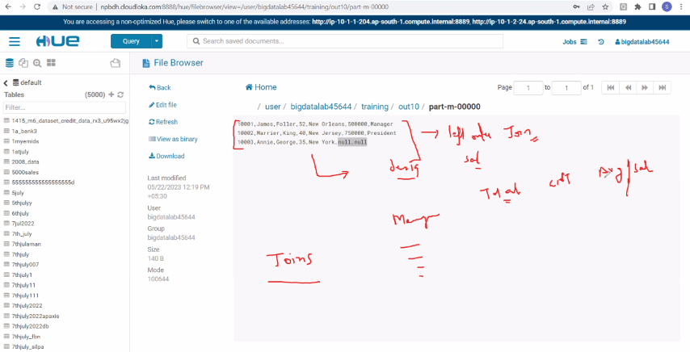

### Generate Inner Map Join using Map Side Join based on ID column to produce Inner Join

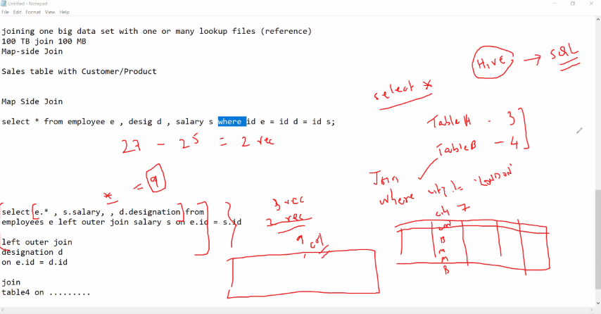

- Generate Map Side Join based on ID column to produce Inner Join in three dataset files
    1. `Employees.txt`

        ```text
        10001,James,Foller,52,New Orleans
        10002,Marrier,King,40,New Jersey
        10003,Annie,George,35,New York
        ```

    2. `salary.txt`

        ```text
        10001,500000
        10002,750000
        10004,600000
        ```

    3. `desig.txt`

        ```text
        10001,Manager
        10002,President
        10004,Vice-President
        ```

#### Generating the .jar file for MapInnerJoin

1. Launch Eclipse application using Java perspective, click OK for Workspace Launcher
2. Open Project `Hadoop`, Expand the Project `Hadoop` in the package explorer, `Right-click on Hadoop project > New > Class`
3. Enter the class name as `MapInnerJoin` and click Finish
4. Add the below code to `MapInnerJoin.java`, and save it

    ```java
    import java.io.BufferedReader;
    import java.io.InputStreamReader;
    import java.io.IOException;
    import java.net.URI;
    import java.util.HashMap;
    import java.util.Map;

    import org.apache.hadoop.conf.Configuration;
    import org.apache.hadoop.fs.FileSystem;
    import org.apache.hadoop.fs.Path;
    import org.apache.hadoop.io.LongWritable;
    import org.apache.hadoop.io.Text;
    import org.apache.hadoop.mapreduce.lib.input.FileInputFormat;
    import org.apache.hadoop.mapreduce.lib.output.FileOutputFormat;
    import org.apache.hadoop.mapreduce.Job;
    import org.apache.hadoop.mapreduce.Mapper;

    public class MapInnerJoin {

        public static class MyMapper extends Mapper<LongWritable,Text, Text, Text> {
            private Map<String, String> abMap = new HashMap<String, String>();
            private Map<String, String> abMap1 = new HashMap<String, String>();
            private Text outputKey = new Text();
            private Text outputValue = new Text();

            protected void setup(Context context) throws java.io.IOException, InterruptedException{
                super.setup(context);

                URI[] files = context.getCacheFiles(); // getCacheFiles returns null if no files found

                Path p = new Path(files[0]);

                Path p1 = new Path(files[1]);

                FileSystem fs = FileSystem.get(context.getConfiguration());

                if (p.getName().equals("salary.txt")) {
                    // BufferedReader reader = new BufferedReader(new FileReader(p.toString()));
                    BufferedReader reader = new BufferedReader(new InputStreamReader(fs.open(p)));

                    String line = reader.readLine();
                    while(line != null) {
                    String[] tokens = line.split(",");
                    String emp_id = tokens[0];
                    String emp_sal = tokens[1];
                    abMap.put(emp_id, emp_sal);
                    line = reader.readLine();
                    }
                    reader.close();
                }
                if (p1.getName().equals("desig.txt")) {
                    // BufferedReader reader = new BufferedReader(new FileReader(p1.toString()));
                    BufferedReader reader = new BufferedReader(new InputStreamReader(fs.open(p1)));
                    String line = reader.readLine();
                    while(line != null) {
                    String[] tokens = line.split(",");
                    String emp_id = tokens[0];
                    String emp_desig = tokens[1];
                    abMap1.put(emp_id, emp_desig);
                    line = reader.readLine();
                    }
                    reader.close();
                }
                if (abMap.isEmpty()) {
                    throw new IOException("MyError:Unable to load salary data.");
                }
                if (abMap1.isEmpty()) {
                    throw new IOException("MyError:Unable to load designation data.");
                }
            }

            protected void map(LongWritable key, Text value, Context context) throws java.io.IOException, InterruptedException {
                String row = value.toString();//reading the data from Employees.txt
                String[] tokens = row.split(",");
                String emp_id = tokens[0];
                String salary = abMap.get(emp_id);
                String desig = abMap1.get(emp_id);
                if((salary!=null) && (desig!=null)) {
                    String sal_desig = salary + "," + desig; 
                    outputKey.set(row);
                    outputValue.set(sal_desig);
                    context.write(outputKey,outputValue);
                }
            }
        }

        public static void main(String[] args) throws IOException, ClassNotFoundException, InterruptedException {
            Configuration conf = new Configuration();
            conf.set("mapreduce.output.textoutputformat.separator", ",");
            Job job = Job.getInstance(conf);
            job.setJarByClass(MapJoin.class);
            job.setJobName("Map Side Join");
            job.setMapperClass(MyMapper.class);
            job.addCacheFile(new Path(args[1]).toUri());
            job.addCacheFile(new Path(args[2]).toUri());
            job.setNumReduceTasks(0);
            job.setMapOutputKeyClass(Text.class);
            job.setMapOutputValueClass(Text.class);

            FileInputFormat.addInputPath(job, new Path(args[0]));
            FileOutputFormat.setOutputPath(job, new Path(args[3]));

            job.waitForCompletion(true);
        }
    }
    ```

    - Notice that
        1. In `MyMapper` class
            1. it has `setup()` method which will be run only once to do tasks such as settting up configuration and file paths, creating Key,Value pairs from the files, etc
            2. it has `map()` method which will run multiple times for each record/row, and defines the logic for the Join to be performed on `id` columns
        2. In `main()` driver
            1. we've created an instance of `Configuration()`, set it for seprator, then pass it to create an instance of `Job`
            2. we've set class for jar as `MapJoin` class, using `job.setJarByClass(MapJoin.class)`
            3. we've set Mapper class as `MyMapper` class extending from `Mapper`, using `job.setMapperClass(MyMapper.class)`
            4. we've added Cache file paths using `job.addCacheFile()`
            5. we've set the code to run no reducer using `job.setNumReduceTasks(0)`, since we need to run Map side join logic which requires only mapper to perfrom mapping to produce join

5. You may skip adding external jar files `hadoop-common.jar` and `hadoop-mapreduce-client-core.jar` since these are added while doing exercise on `Day 04`
6. `Right-Click on Hadoop Project > Export > Java > Jar File > Next >` Enter the jar file name as `myjar.jar` with full path in export destination, click on Finish

#### Upload .jar file using FTP for MapInnerJoin

- Upload the `myjar.jar` file which you've generated by compiling the Java code for MapReduce task

#### Unzip the .jar file for MapInnerJoin

- We need to extract the class file(s) from the .jar file, we extract it using `jar` command as by running the command below

```bash
[bigdatalab456422@ip-10-1-1-204 ~]$ jar tvf myjar.jar
```

```console
  25 Mon May 22 12:31:44 UTC 2023 META-INF/MANIFEST.MF
 387 Thu May 18 15:53:20 UTC 2023 .project
2459 Fri May 19 16:03:30 UTC 2023 AllTimeHigh$MapClass.class
2392 Fri May 19 16:03:30 UTC 2023 AllTimeHigh$ReduceClass.class
1722 Fri May 19 16:03:30 UTC 2023 AllTimeHigh.class
2475 Fri May 19 16:53:46 UTC 2023 AvgClosingPrice$MapClass.class
2454 Fri May 19 16:53:46 UTC 2023 AvgClosingPrice$ReduceClass.class
1732 Fri May 19 16:53:46 UTC 2023 AvgClosingPrice.class
2337 Fri May 19 17:41:44 UTC 2023 WordCount$IntSumReducer.class
2461 Fri May 19 17:41:44 UTC 2023 WordCount$TokenizerMapper.class
1790 Fri May 19 17:41:44 UTC 2023 WordCount.class
2454 Fri May 19 15:53:50 UTC 2023 AllTimeLow$MapClass.class
2388 Fri May 19 15:53:50 UTC 2023 AllTimeLow$ReduceClass.class
1734 Fri May 19 15:53:50 UTC 2023 AllTimeLow.class
1242 Sat May 20 17:37:44 UTC 2023 MyPartitioner$CaderPartitioner.class
2365 Sat May 20 17:37:44 UTC 2023 MyPartitioner$MapClass.class
2905 Sat May 20 17:37:44 UTC 2023 MyPartitioner$ReduceClass.class
2632 Sat May 20 17:37:44 UTC 2023 MyPartitioner.class
2408 Thu May 18 17:48:56 UTC 2023 StockVolume$MapClass.class
2349 Thu May 18 17:48:56 UTC 2023 StockVolume$ReduceClass.class
1697 Thu May 18 17:48:56 UTC 2023 StockVolume.class
2648 Sat May 20 15:42:48 UTC 2023 CityAvg2$CityCombineClass.class
2269 Sat May 20 15:42:48 UTC 2023 CityAvg2$CityMapClass.class
2639 Sat May 20 15:42:48 UTC 2023 CityAvg2$CityReduceClass.class
2034 Sat May 20 15:42:48 UTC 2023 CityAvg2.class
4839 Mon May 22 12:31:06 UTC 2023 MapInnerJoin$MyMapper.class
1850 Mon May 22 12:31:06 UTC 2023 MapInnerJoin.class
4760 Mon May 22 12:05:50 UTC 2023 MapJoin$MyMapper.class
1817 Mon May 22 12:05:50 UTC 2023 MapJoin.class
2456 Sat May 20 15:04:24 UTC 2023 StockVolumeWithCombiner$MapClass.class
2397 Sat May 20 15:04:24 UTC 2023 StockVolumeWithCombiner$ReduceClass.class
1813 Sat May 20 15:04:24 UTC 2023 StockVolumeWithCombiner.class
 640 Thu May 18 17:00:00 UTC 2023 .classpath
```

#### Run the MapReduce job using `hadoop jar` utility for MapInnerJoin

- Run the command below to launch the MapReduce job for `MapInnerJoin` class extracted from `myjar.jar` file, it'll read `Employees.txt`, `salary.txt`, `desig.txt` input files from `training` dataset directory and it'll dump output/results in `training/out11` directory

```bash
[bigdatalab456422@ip-10-1-1-204 ~]$ hadoop jar myjar.jar MapInnerJoin training/Employees.txt training/salary.txt training/desig.txt training/out11
```

- In verbose text, notice that it shows
    1. It is processing one big input file `training/Employees.txt` on hdfs which is indicated by message below, and other two files are smaller so it considers those to be reference files

        ```console
        INFO input.FileInputFormat: Total input files to process : 1
        ```

    2. It has Launched 1 Mapper task to collect from 1 big file

        ```console
                Launched map tasks=1
        ```

    3. It shows the total number of records from the input file being 3 records which are being fed to Mapper task, and mapper is generating 2 records in Inner Join task

        ```console
                Map input records=3
                Map output records=2
        ```

    4. It does not show any Reduce task details indicating no reducer was run for this Inner Map side Join

```console
WARNING: Use "yarn jar" to launch YARN applications.
23/05/22 07:05:19 INFO client.RMProxy: Connecting to ResourceManager at ip-10-1-1-204.ap-south-1.compute.internal/10.1.1.204:8032
23/05/22 07:05:20 WARN mapreduce.JobResourceUploader: Hadoop command-line option parsing not performed. Implement the Tool interface and execute your application with ToolRunner to remedy this.
23/05/22 07:05:20 INFO mapreduce.JobResourceUploader: Disabling Erasure Coding for path: /user/bigdatalab456422/.staging/job_1684298513961_1086
23/05/22 07:05:20 INFO input.FileInputFormat: Total input files to process : 1
23/05/22 07:05:20 INFO mapreduce.JobSubmitter: number of splits:1
23/05/22 07:05:20 INFO Configuration.deprecation: yarn.resourcemanager.system-metrics-publisher.enabled is deprecated. Instead, use yarn.system-metrics-publisher.enabled
23/05/22 07:05:20 INFO mapreduce.JobSubmitter: Submitting tokens for job: job_1684298513961_1086
23/05/22 07:05:20 INFO mapreduce.JobSubmitter: Executing with tokens: []
23/05/22 07:05:21 INFO conf.Configuration: resource-types.xml not found
23/05/22 07:05:21 INFO resource.ResourceUtils: Unable to find 'resource-types.xml'.
23/05/22 07:05:21 INFO impl.YarnClientImpl: Submitted application application_1684298513961_1086
23/05/22 07:05:21 INFO mapreduce.Job: The url to track the job: http://ip-10-1-1-204.ap-south-1.compute.internal:6066/proxy/application_1684298513961_1086/
23/05/22 07:05:21 INFO mapreduce.Job: Running job: job_1684298513961_1086
23/05/22 07:05:28 INFO mapreduce.Job: Job job_1684298513961_1086 running in uber mode : false
23/05/22 07:05:28 INFO mapreduce.Job: map 0% reduce 0%
23/05/22 07:05:33 INFO mapreduce.Job: map 100% reduce 0%
23/05/22 07:05:34 INFO mapreduce.Job: Job job_1684298513961_1086 completed successfully
23/05/22 07:05:34 INFO mapreduce.Job: Counters: 33
File System Counters
        FILE: Number of bytes read=0
        FILE: Number of bytes written=223556
        FILE: Number of read operations=0
        FILE: Number of large read operations=0
        FILE: Number of write operations=0
        HDFS: Number of bytes read=326
        HDFS: Number of bytes written=99
        HDFS: Number of read operations=9
        HDFS: Number of large read operations=0
        HDFS: Number of write operations=2
        HDFS: Number of bytes read erasure-coded=0
Job Counters
        Launched map tasks=1
        Data-local map tasks=1
        Total time spent by all maps in occupied slots (ms)=3267
        Total time spent by all reduces in occupied slots (ms)=0
        Total time spent by all map tasks (ms)=3267
        Total vcore-milliseconds taken by all map tasks=3267
        Total megabyte-milliseconds taken by all map tasks=3345408
Map-Reduce Framework
        Map input records=3
        Map output records=2
        Input split bytes=129
        Spilled Records=0
        Failed Shuffles=0
        Merged Map outputs=0
        GC time elapsed (ms)=62
        CPU time spent (ms)=660
        Physical memory (bytes) snapshot=231632896
        Virtual memory (bytes) snapshot=2574462976
        Total committed heap usage (bytes)=239599616
        Peak Map Physical memory (bytes)=231632896
        Peak Map Virtual memory (bytes)=2574462976
File Input Format Counters
        Bytes Read=101
File Output Format Counters
        Bytes Written=99
```

#### Output of MapInnerJoin MapReduce job

- To see the output files, launch the `Hue` tool from the Nuevopro web dashboard from where you earlier launched the `Web Console`, or you can go to the already open `Hue` tool
- Once `Hue` tool is open, it navigate to `/user/bigdatalab456422/training/out11` where it should have dumped the output partitioned files
- Notice that it has `.success` file which indicates that the Mapper job completed successfully, and also it has a file `part-m-00000` & `m` in its name indicates that it is Mapper output because only Mapper is used for Map side join, no Reducer task is run in this job
- Note that it has joined based on `id` columns from `Employees.txt`, `salary.txt`, `desig.txt` files generating a INNER JOIN output

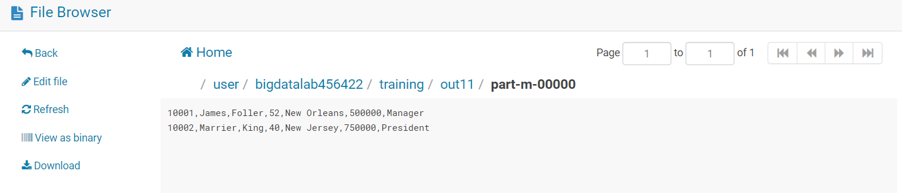
