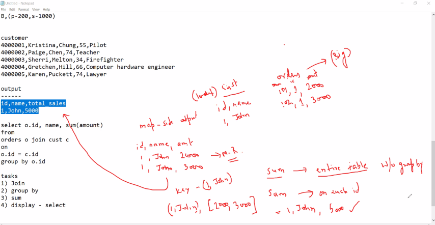
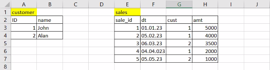
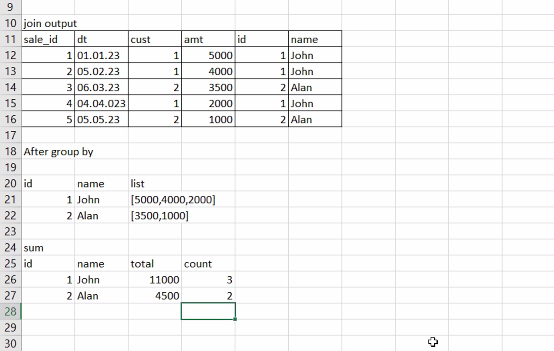
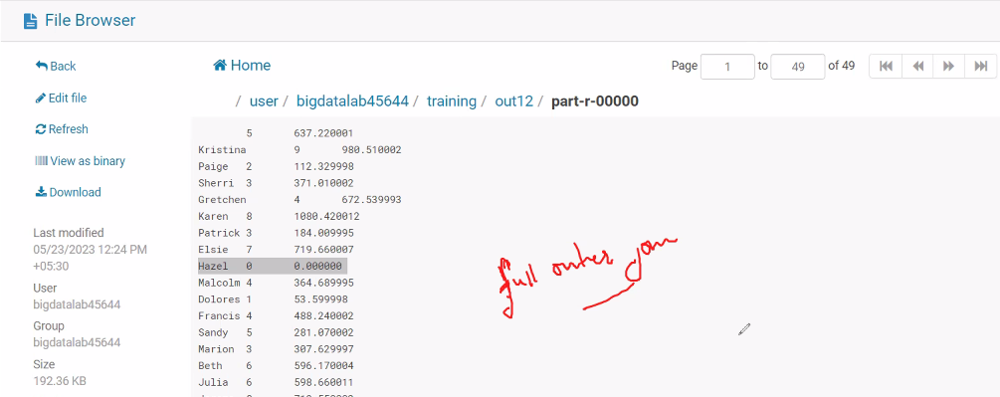
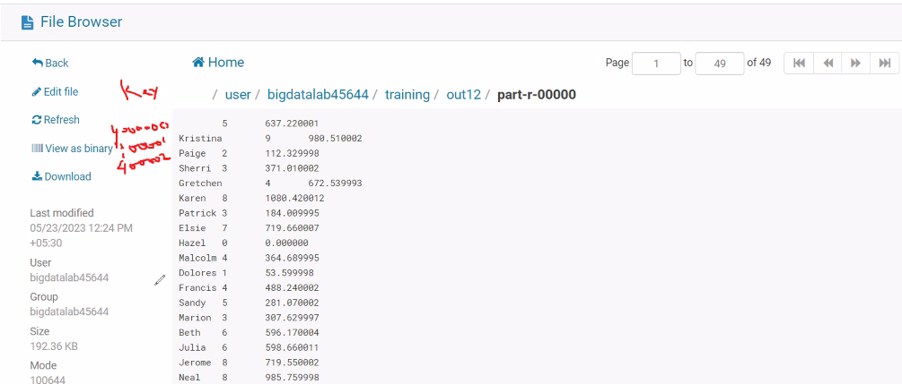

# Day 08 - BigDataTechnologies

## Joins

### Reduce Side Join

- As the name implies, in Reduce side join, the reducer is responsible for performing the join operation
- Reduce side Join is also called `Repartitioned Join` or `Repartitioned sort merge join` , and also it is mostly used join type
- Sorting and Shuffling phase sends the values having identical keys to the same reducer and therefore, by default data is organized for us
- It is comparatively simple and easier to implement than the Map side Join as input datasets need not to be structured
- It undergoes the sort and suffle stage which would incur the network overhead, so it is less efficient/fast than Map side Join
- Reduce side join
  - is much flexible to implement
  - needs to have custom `WritableComparable` with necessary function overridden
  - needs a custom partitioner
- Reduce side join produces a `FULL OUTER JOIN`
- Reduce side join is used to join two or more big data sets, say joining 100TB with 100TB
- It requires two or more multiple mappers, each of which should have same key
- Reduce side join is used when both dataset are so big that none of them can fit into the memory
- Reduce side Join is cheaper than Map side Join since Reduce side Join does not need much resources as compared to Map side Join

> There is one tradeoff while choosing Map side Join or Reduce side Join. While Map side Join are faster, it can be used only when a data set is small enough to fit in the memory thus increasing the cost. But Reduce side Join are slower, it can be used only when all of the datasets are big so that none of them can be fit in the memory, thus making it a cheaper and slow option.

#### Advantages of Reduce Side Join

- Reduce side Join is very easy to implement as we are taking advantage of the inbuilt sorting and shuffling algorithm in the MapReduce framework which combines values of the same key and send it to the same reducer
- Reduce side Join does not require input data to follow any strict format and therefore, you can perform the join operation on unstructured data as well

#### Disadvantages of Reduce Side Join

- Reduce side Join takes more time as compared to Map side Join

#### Steps in Reduce Join Join

- The process flow for Reduce Side Join is as
    1. The input data is read by Mapper, which needs to be combined on the basis of the join key or common column
    2. Once the input data is processed by the Mapper, it adds a tag/identifier to the processed input data in order to distinguish the input origin sources
    3. The Mapper returns the intermediate Key,Value pair, where the key is also the join key
    4. For the Reducer, a key and a list of values is generated once the sorting and shuffling stage is complete
    5. The Reducer joins the values that are present in the generated list along with the key to produce the final outcome

#### Example: Sales Reduce side JOIN Purchase

```text
Reduce Side Join

Join 2 or more big data sets

Purchase Table
pur_id, dt, vendor_id, prod, qty_pur, ...

Sales Table
sales_id, dt, prod_id, qty_sold, cust_id, ...

Inventory analysis
ProdA       p-1000 units        s-200 units
```

```text
Mapping Stage
----------------
sales_mapper                purchase_mapper
prod_id,qty_sold            prod_id,qty_pur
A,s.150                     A,p.300
B,s.600                     B,p.75
A,s.50                      A,p.700
B,s.400                     B,p.125
```

- An identifier/tag is needed to identify which value is from which Mapper, so we should make it like a `Key,<Mapper_Identifier><Delimiter><Value>`, instead of only `Key,Value`

```text
Shuffle Stage
-----------------
A,[s.150, s.50, p.300, p.700]
B,[s.600, s.400, p.75, p.125]
```

- Identifier/tag is very much needed to identify which data is from which Mapper, otherwise it is stuck in Shuffle stage

```text
Reducer Stage
------------------
A,Total_Sale=150+50         B,Total_Sale=600+400
A,Total_Pur=300+700         B,Total_Pur=75+125

A,(p.1000, s.200)
B,(p.200, s.1000)
```

```sql
SELECT s.prod_id, sum(qty_pur) AS total_p, sum(qty_solid) AS total_s
FROM sales s
FULL OUTER JOIN purchase p
ON s.prod_id = p.prod_id
GROUP BY s.prod_id;
```

#### Example: Customers Map side JOIN Orders



```csv
custs.txt
---------------
4000001,Kristina,Chung,55,Pilot
4000002,Paige,Chen,74,Teacher
4000003,Sherri,Melton,34,Firefighter
4000004,Gretchen,Hill,66,Computer hardware engineer
4000005,Karen,Puckett,74,Lawyer
```

```csv
txns1.txt
---------------
00000000,06-26-2011,4007024,040.33,Exercise & Fitness,Cardio Machine Accessories,Clarksville,Tennessee,credit
00000001,05-26-2011,4006742,198.44,Exercise & Fitness,Weightlifting Gloves,Long Beach,California,credit
00000002,06-01-2011,4009775,005.58,Exercise & Fitness,Weightlifting Machine Accessories,Anaheim,California,credit
00000003,06-05-2011,4002199,198.19,Gymnastics,Gymnastics Rings,Milwaukee,Wisconsin,credit
```

```text
output
---------------
(LookUp) cust               (BigData) orders
id,name                     order_id,id,amt
1,John                      101,1,2000
                            102,2,3000
```

```sql
SELECT c.id, c.name, sum(o.amt)
FROM customers c
JOIN orders o
ON c.id=o.id
GROUP BY o.id;
```

#### Example: Customers Reduce side JOIN Sales





- An SQL query for the above problem described using Excel sheet would be

    ```sql
    SELECT name, SUM(amount), count(s.id)
    FROM customers c
    FULL OUTER JOIN
    sales s
    ON c.id=s.id
    GROUP BY s.id, name;
    ```

### Find total amount sold, total count of txns for each cust firstname

- Find Total amount sold, Total count of transactions for each customer's First Name and verify that `Kristina` has `238.77` & `2` in total amount sold & total count of transactions respectively

- Break down of steps/tasks would be
    1. JOIN
    2. GROUP BY
    3. SUM
    4. Display - SELECT

- we have two input data files
    1. `custs.txt`

        ```csv
        4000001,Kristina,Chung,55,Pilot
        4000002,Paige,Chen,74,Teacher
        4000003,Sherri,Melton,34,Firefighter
        4000004,Gretchen,Hill,66,Computer hardware engineer
        4000005,Karen,Puckett,74,Lawyer
        ```

    2. `txns1.txt`

        ```csv
        00000000,06-26-2011,4007024,040.33,Exercise & Fitness,Cardio Machine Accessories,Clarksville,Tennessee,credit
        00000001,05-26-2011,4006742,198.44,Exercise & Fitness,Weightlifting Gloves,Long Beach,California,credit
        00000002,06-01-2011,4009775,005.58,Exercise & Fitness,Weightlifting Machine Accessories,Anaheim,California,credit
        00000003,06-05-2011,4002199,198.19,Gymnastics,Gymnastics Rings,Milwaukee,Wisconsin,credit
        ```

```text
prob statement : find total amount sold, total count of txns for each cust firstname

Kristina        238.77      2

Customer Mapper
4000001, (cust  Kristina)

Sales Mapper
4000001, (txn,040.33)
4000001, (txn,198.44)

4000001, [(cust  Kristina), (txn, 040.33), (txn, 198.44)]

name = "Kristina"


Total_sale = 40.33 + 198.44
Total = 1 + 1


Kristina        (237.77         2)
```

#### Upload `custs.txt`, `txns1.txt` files using FTP

- Upload `custs.txt`, `txns1.txt` files to Client/Linux Filesystem
- Then copy these file on Client/Linux Filesystem to `training` directory on hdfs using command below

```bash
[bigdatalab456422@ip-10-1-1-204 ~]$ hadoop fs -put custs.txt txns1.txt training
```

#### Generating the .jar file for ReduceJoin

1. Launch Eclipse application using Java perspective, click OK for Workspace Launcher
2. Open Project `Hadoop`, Expand the Project `Hadoop` in the package explorer, `Right-click on Hadoop project > New > Class`
3. Enter the class name as `ReduceJoin` and click Finish
4. Add the below code to `MapJoin.java`, and save it

    ```java
    import java.io.IOException;

    import org.apache.hadoop.conf.Configuration;
    import org.apache.hadoop.fs.Path;
    import org.apache.hadoop.io.Text;
    import org.apache.hadoop.io.LongWritable;
    import org.apache.hadoop.mapreduce.Job;
    import org.apache.hadoop.mapreduce.Mapper;
    import org.apache.hadoop.mapreduce.Reducer;
    import org.apache.hadoop.mapreduce.lib.input.MultipleInputs;
    import org.apache.hadoop.mapreduce.lib.input.TextInputFormat;
    import org.apache.hadoop.mapreduce.lib.output.FileOutputFormat;

    public class ReduceJoin {

        public static class CustsMapper extends Mapper<LongWritable, Text, Text, Text> {
            public void map(LongWritable key, Text value, Context context) throws IOException, InterruptedException {
                String record = value.toString();
                String[] parts = record.split(",");
                context.write(new Text(parts[0]), new Text("custs\t" + parts[1]));
            }
        }

        public static class TxnsMapper extends Mapper<LongWritable, Text, Text, Text> {
            public void map(LongWritable key, Text value, Context context) throws IOException, InterruptedException {
                String record = value.toString();
                String[] parts = record.split(",");
                context.write(new Text(parts[2]), new Text("txns\t" + parts[3]));
            }
        }

        public static class ReduceJoinReducer extends Reducer<Text, Text, Text, Text> {
            public void reduce(Text key, Iterable<Text> values, Context context) throws IOException, InterruptedException {
                String name = "";
                double total = 0.0;
                int count = 0;
                for (Text t : values) {
                    String parts[] = t.toString().split("\t");
                    if (parts[0].equals("txns")) {
                    count++;
                    total += Float.parseFloat(parts[1]);
                    } else if (parts[0].equals("custs")) {
                    name = parts[1];
                    }
                }
                String str = String.format("%d\t%f", count, total);
                context.write(new Text(name), new Text(str));
            }
        }

        public static void main(String[] args) throws Exception {
            
            Configuration conf = new Configuration();
            Job job = Job.getInstance(conf);
                job.setJarByClass(ReduceJoin.class);
                job.setJobName("Reduce Side Join");
            job.setReducerClass(ReduceJoinReducer.class);
            job.setOutputKeyClass(Text.class);
            job.setOutputValueClass(Text.class);
            job.setNumReduceTasks(1);
            MultipleInputs.addInputPath(job, new Path(args[0]),TextInputFormat.class, CustsMapper.class);
            MultipleInputs.addInputPath(job, new Path(args[1]),TextInputFormat.class, TxnsMapper.class);
            
            Path outputPath = new Path(args[2]);
            FileOutputFormat.setOutputPath(job, outputPath);
            //outputPath.getFileSystem(conf).delete(outputPath);
            
            System.exit(job.waitForCompletion(true) ? 0 : 1);
        }
    }
    ```

    - Notice that
        1. It has two `Mapper` classes namely `CustsMapper` and `TxnsMapper`, `map()` function in each of which use identifier/tag `"custs\t"` & `"txns\t"` respectively to indicate that which record is coming from which mapper
        2. In `Reducer` class namely `ReduceJoinReducer`, it picks up `name`, its sums for `total` and increments `count`
        3. In `main()` driver
            1. we've created an instance of `Configuration()`, then pass it to create an instance of `Job`

                ```java
                Configuration conf = new Configuration();
                Job job = Job.getInstance(conf);
                ```

            2. we've set class for jar as `ReduceJoin` class, using

                ```java
                job.setJarByClass(ReduceJoin.class)
                ```

            3. we've set multiple Mapper classes as `CustsMapper` class & `TxnsMapper` extending from `Mapper`, using

                ```java
                MultipleInputs.addInputPath(job, new Path(args[0]),TextInputFormat.class, CustsMapper.class);
                MultipleInputs.addInputPath(job, new Path(args[1]),TextInputFormat.class, TxnsMapper.class);
                ```

            4. we've set Reducer class as `ReduceJoinReducer` class extending from `Reducer`, using

                ```java
                job.setReducerClass(ReduceJoinReducer.class);
                ```

            5. and, we've set the code to run one Reducer task using

                ```java
                job.setNumReduceTasks(1)
                ```

5. You may skip adding external jar files `hadoop-common.jar` and `hadoop-mapreduce-client-core.jar` since these are added while doing exercise on `Day 04`
6. `Right-Click on Hadoop Project > Export > Java > Jar File > Next >` Enter the jar file name as `myjar.jar` with full path in export destination, click on Finish

#### Upload .jar file using FTP for ReduceJoin

- Upload the `myjar.jar` file which you've generated by compiling the Java code for MapReduce task

#### Unzip the .jar file for ReduceJoin

- We need to extract the class file(s) from the .jar file, we extract it using `jar` command as by running the command below

```bash
[bigdatalab456422@ip-10-1-1-204 ~]$ jar tvf myjar.jar
```

```console
  25 Mon May 22 12:17:26 UTC 2023 META-INF/MANIFEST.MF
 387 Thu May 18 15:53:20 UTC 2023 .project
2459 Fri May 19 16:03:30 UTC 2023 AllTimeHigh$MapClass.class
2392 Fri May 19 16:03:30 UTC 2023 AllTimeHigh$ReduceClass.class
1722 Fri May 19 16:03:30 UTC 2023 AllTimeHigh.class
2475 Fri May 19 16:53:46 UTC 2023 AvgClosingPrice$MapClass.class
2454 Fri May 19 16:53:46 UTC 2023 AvgClosingPrice$ReduceClass.class
1732 Fri May 19 16:53:46 UTC 2023 AvgClosingPrice.class
2337 Fri May 19 17:41:44 UTC 2023 WordCount$IntSumReducer.class
2461 Fri May 19 17:41:44 UTC 2023 WordCount$TokenizerMapper.class
1790 Fri May 19 17:41:44 UTC 2023 WordCount.class
2454 Fri May 19 15:53:50 UTC 2023 AllTimeLow$MapClass.class
2388 Fri May 19 15:53:50 UTC 2023 AllTimeLow$ReduceClass.class
1734 Fri May 19 15:53:50 UTC 2023 AllTimeLow.class
1242 Sat May 20 17:37:44 UTC 2023 MyPartitioner$CaderPartitioner.class
2365 Sat May 20 17:37:44 UTC 2023 MyPartitioner$MapClass.class
2905 Sat May 20 17:37:44 UTC 2023 MyPartitioner$ReduceClass.class
2632 Sat May 20 17:37:44 UTC 2023 MyPartitioner.class
2408 Thu May 18 17:48:56 UTC 2023 StockVolume$MapClass.class
2349 Thu May 18 17:48:56 UTC 2023 StockVolume$ReduceClass.class
1697 Thu May 18 17:48:56 UTC 2023 StockVolume.class
2648 Sat May 20 15:42:48 UTC 2023 CityAvg2$CityCombineClass.class
2269 Sat May 20 15:42:48 UTC 2023 CityAvg2$CityMapClass.class
2639 Sat May 20 15:42:48 UTC 2023 CityAvg2$CityReduceClass.class
2034 Sat May 20 15:42:48 UTC 2023 CityAvg2.class
2211 Tue May 23 12:59:00 UTC 2023 ReduceJoin$CustsMapper.class
2967 Tue May 23 12:59:00 UTC 2023 ReduceJoin$ReduceJoinReducer.class
2207 Tue May 23 12:59:00 UTC 2023 ReduceJoin$TxnsMapper.class
2071 Tue May 23 12:59:00 UTC 2023 ReduceJoin.class
4839 Mon May 22 12:31:06 UTC 2023 MapInnerJoin$MyMapper.class
1850 Mon May 22 12:31:06 UTC 2023 MapInnerJoin.class
4760 Mon May 22 12:05:50 UTC 2023 MapJoin$MyMapper.class
1817 Mon May 22 12:05:50 UTC 2023 MapJoin.class
2456 Sat May 20 15:04:24 UTC 2023 StockVolumeWithCombiner$MapClass.class
2397 Sat May 20 15:04:24 UTC 2023 StockVolumeWithCombiner$ReduceClass.class
1813 Sat May 20 15:04:24 UTC 2023 StockVolumeWithCombiner.class
 640 Thu May 18 17:00:00 UTC 2023 .classpath
```

#### Run the MapReduce job using `hadoop jar` utility for ReduceJoin

- Run the command below to launch the MapReduce job for `ReduceJoin` class extracted from `myjar.jar` file, it'll read `custs.txt`, `txns1.txt` input files from `training` dataset directory and it'll dump output/results in `training/out12` directory

```bash
[bigdatalab456422@ip-10-1-1-204 ~]$ [bigdatalab456422@ip-10-1-1-204 ~]$ hadoop jar myjar.jar ReduceJoin training/custs.txt training/txns1.txt training/out12
```

- In verbose text, notice that it shows
    1. It is processing `training/custs.txt` & `training/txns1.txt`, one big input file on each of the Mappers on hdfs which is indicated by message below

        ```console
        23/05/23 06:53:45 INFO input.FileInputFormat: Total input files to process : 1
        23/05/23 06:53:45 INFO input.FileInputFormat: Total input files to process : 1
        ```

    2. It has Launched 2 Mapper tasks to collect from 2 big files and only 1 Reducer Task as set in `main()` driver

        ```console
                Launched map tasks=2
                Launched reduce tasks=1
        ```

    3. It shows the total number of records from the input file being 59999 records, a sum of 9999 records from `training/custs.txt` & 50000 records from `training/txns1.txt` which are being fed to Mapper task

        ```console
                Map input records=59999
                Map output records=59999
        ```

    4. It shows 2 shuffled Maps for each of the input files, so shuffler will shuffle and merge the two maps generated by Mapper on each of the input files, and reducer will work further on it to join them

        ```console
                Shuffled Maps =2
                Failed Shuffles=0
                Merged Map outputs=2
        ```

    5. It shows the total number of groups being 10000, which are being fed to Reducer to reduce the values

        ```console
                Reduce input groups=10000
                Reduce shuffle bytes=470223
                Reduce input records=59999
                Reduce output records=10000
        ```

```console
WARNING: Use "yarn jar" to launch YARN applications.
23/05/23 06:53:44 INFO client.RMProxy: Connecting to ResourceManager at ip-10-1-1-204.ap-south-1.compute.internal/10.1.1.204:8032
23/05/23 06:53:44 WARN mapreduce.JobResourceUploader: Hadoop command-line option parsing not performed. Implement the Tool interface and execute your application with ToolRunner to remedy this.
23/05/23 06:53:44 INFO mapreduce.JobResourceUploader: Disabling Erasure Coding for path: /user/bigdatalab456422/.staging/job_1684298513961_1195
23/05/23 06:53:45 INFO input.FileInputFormat: Total input files to process : 1
23/05/23 06:53:45 INFO input.FileInputFormat: Total input files to process : 1
23/05/23 06:53:45 INFO mapreduce.JobSubmitter: number of splits:2
23/05/23 06:53:45 INFO Configuration.deprecation: yarn.resourcemanager.system-metrics-publisher.enabled is deprecated. Instead, use yarn.system-metrics-publisher.enabled
23/05/23 06:53:45 INFO mapreduce.JobSubmitter: Submitting tokens for job: job_1684298513961_1195
23/05/23 06:53:45 INFO mapreduce.JobSubmitter: Executing with tokens: []
23/05/23 06:53:45 INFO conf.Configuration: resource-types.xml not found
23/05/23 06:53:45 INFO resource.ResourceUtils: Unable to find 'resource-types.xml'.
23/05/23 06:53:45 INFO impl.YarnClientImpl: Submitted application application_1684298513961_1195
23/05/23 06:53:45 INFO mapreduce.Job: The url to track the job: http://ip-10-1-1-204.ap-south-1.compute.internal:6066/proxy/application_1684298513961_1195/
23/05/23 06:53:45 INFO mapreduce.Job: Running job: job_1684298513961_1195
23/05/23 06:54:14 INFO mapreduce.Job: Job job_1684298513961_1195 running in uber mode : false
23/05/23 06:54:14 INFO mapreduce.Job: map 0% reduce 0%
23/05/23 06:55:20 INFO mapreduce.Job: map 50% reduce 0%
23/05/23 06:55:25 INFO mapreduce.Job: map 100% reduce 0%
23/05/23 06:55:50 INFO mapreduce.Job: map 100% reduce 100%
23/05/23 06:55:52 INFO mapreduce.Job: Job job_1684298513961_1195 completed successfully
23/05/23 06:55:53 INFO mapreduce.Job: Counters: 54
File System Counters
        FILE: Number of bytes read=509016
        FILE: Number of bytes written=1648298
        FILE: Number of read operations=0
        FILE: Number of large read operations=0
        FILE: Number of write operations=0
        HDFS: Number of bytes read=4810551
        HDFS: Number of bytes written=196981
        HDFS: Number of read operations=11
        HDFS: Number of large read operations=0
        HDFS: Number of write operations=2
        HDFS: Number of bytes read erasure-coded=0
Job Counters
        Launched map tasks=2
        Launched reduce tasks=1
        Data-local map tasks=2
        Total time spent by all maps in occupied slots (ms)=129660
        Total time spent by all reduces in occupied slots (ms)=22300
        Total time spent by all map tasks (ms)=129660
        Total time spent by all reduce tasks (ms)=22300
        Total vcore-milliseconds taken by all map tasks=129660
        Total vcore-milliseconds taken by all reduce tasks=22300
        Total megabyte-milliseconds taken by all map tasks=132771840
        Total megabyte-milliseconds taken by all reduce tasks=22835200
Map-Reduce Framework
        Map input records=59999
        Map output records=59999
        Map output bytes=1206622
        Map output materialized bytes=470223
        Input split bytes=513
        Combine input records=0
        Combine output records=0
        Reduce input groups=10000
        Reduce shuffle bytes=470223
        Reduce input records=59999
        Reduce output records=10000
        Spilled Records=119998
        Shuffled Maps =2
        Failed Shuffles=0
        Merged Map outputs=2
        GC time elapsed (ms)=2426
        CPU time spent (ms)=7290
        Physical memory (bytes) snapshot=1229955072
        Virtual memory (bytes) snapshot=7771475968
        Total committed heap usage (bytes)=1314390016
        Peak Map Physical memory (bytes)=499953664
        Peak Map Virtual memory (bytes)=2591252480
        Peak Reduce Physical memory (bytes)=270733312
        Peak Reduce Virtual memory (bytes)=2599899136
Shuffle Errors
        BAD_ID=0
        CONNECTION=0
        IO_ERROR=0
        WRONG_LENGTH=0
        WRONG_MAP=0
        WRONG_REDUCE=0
File Input Format Counters
        Bytes Read=0
File Output Format Counters
        Bytes Written=196981
```

#### Output of ReduceJoin MapReduce job

- To see the output files, launch the `Hue` tool from the Nuevopro web dashboard from where you earlier launched the `Web Console`, or you can go to the already open `Hue` tool
- Once `Hue` tool is open, it navigate to `/user/bigdatalab456422/training/out12` where it should have dumped the output partitioned files
- Notice that it has `.success` file which indicates that the Mapper job completed successfully, and also it has a file `part-r-00000` & `r` in its name indicates that it is Reducer output because both Mapper & Reducer are used for Reduce side join
- Notice that for customer `Kristina`, we can verify it has `238.77` & `2` in total amount sold & total count of transactions respectively

    ```text
    Kristina        (237.77         2)
    ```



- Note that
  - it has joined based on `id` columns which is key from `custs.txt`, `txns1.txt` files generating a FULL OUTER JOIN output
  - data is alwayd sorted on key column, but we've not included it in output so output may seem non-sorted at first glance, but it is actually sorted on key/`id` column


