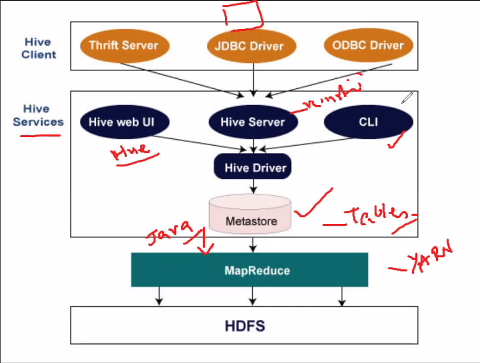

# Day 09 - BigDataTechnologies

## Create & Setup Single Node Hadoop cluster on Ubuntu

### Finding the version of Ubuntu

- Launch the terminal using either by `Right-Clicking on Desktop > Open in Terminal` or using shortcut `Ctrl+Alt+T`
- Run the command below to check the version of ubuntu

    ```bash
    sdevsinx@bdt0:~/Desktop$  cat /etc/lsb-release
    ```

### Updating the source list

- First move to current user's home directory

    ```bash
    sdevsinx@bdt0:~/Desktop$ cd ~
    ```

- Run the command below to update the source list, enter current user's password if asked

    ```bash
    sdevsinx@bdt0:~$ sudo apt update -y
    ```

### Java Setup

#### Install JDK

- The OpenJDK project is the default version of Java that is provided from a supported Ubuntu repository

- Run the command below to install specifically `OpenJDK 8`, a particular version of the Java Development Kit needed for further installation

    ```bash
    sdevsinx@bdt0:~$ sudo apt install openjdk-8-jdk
    ```

- **Optionally**, You may run the command below to install the `Default Java/jdk`, it pulls in the JDK version that the maintainers of your OS consider to be the standard or most stable version for general use

    ```bash
    sdevsinx@bdt0:~$ sudo apt install default-jdk
    ```

#### Check installed Java Version

- Run the command below to check the version of java that is being used, but if it already shows `java version 1.8` then you may skip to [Adding a dedicated Linux User & Group](#adding-a-dedicated-linux-user--group)

    ```bash
    sdevsinx@bdt0:~$ java -version
    ```

    

##### `update-alternatives` command to configure `java` path

- Run command below to set alternative path for `java`, and then enter the selection number when prompted (here `2`) to move the selection star to `openjdk-8-jdk` path to `java`

    ```bash
    sdevsinx@bdt0:~$ sudo update-alternatives --config java
    ```

- Now run the command again to confirm if the star has moved to required `java` path, and press `Enter` when prompted, to keep the selection as it is

    ```bash
    sdevsinx@bdt0:~$ sudo update-alternatives --config java
    ```

    

##### `update-alternatives` command to configure `javac` path

- Run command below to set alternative path for `javac`, and then enter the selection number when prompted (here `2`) to move the selection star to `openjdk-8-jdk` path to `javac`

    ```bash
    sdevsinx@bdt0:~$ sudo update-alternatives --config javac
    ```

- Now run the command again to confirm if the star has moved to required `java` path, and press `Enter` when prompted, to keep the selection as it is

    ```bash
    sdevsinx@bdt0:~$ sudo update-alternatives --config javac
    ```

    

##### Confirming required java version

- Run the command below to check the version of java that is being used, it should show `java v1.8`

    ```bash
    sdevsinx@bdt0:~$ java -version
    ```

    

### Adding a dedicated Linux User & Group

- Now you need to add a dedicated Hadoop user

#### Create Linux group `hadoop`

- Run the command below to add a group `hadoop`

    ```bash
    sdevsinx@bdt0:~$ sudo addgroup hadoop
    ```

    

#### Creating linux user `hduser` and adding it to group `hadoop`

- Run the command below to add a new dedicated user `hduser` and add it to recently created group `hadoop`
- Set a password which you can remember easily (say `hadoop`), enter password again to confirm it
- Keep pressing `Enter` to enter default/skip it, if it asks to enter new value such as Full Name, Room Number, etc. for this new user
- Enter `Y` to confirm the information

    ```bash
    sdevsinx@bdt0:~$ sudo adduser --ingroup hadoop hduser
    ```

    

### `ssh` setup

- `ssh` has two main components
  1. `ssh` : The command we use to connect to remote machines - the client
  2. `sshd` : THe daemon that is running on the server and allows clients to connect to the server

#### Installing `ssh`

- The `ssh` is pre-enabled on Linux, but in order to start the `sshd` daemon, we need to install the `ssh` first
- Run command below to install `ssh`, this will install ssh on our machine

    ```bash
    sdevsinx@bdt0:~$ sudo apt install ssh
    ```

#### Checking path for `ssh` & `sshd`

- If we get something similar to the following, we can think it is setup properly
- Run below command to get path for `ssh`

    ```bash
    sdevsinx@bdt0:~$ which ssh
    ```

    

- Run below command to get path for `sshd`

    ```bash
    sdevsinx@bdt0:~$ which sshd
    ```

    

#### Create and Setup SSH Certificates

Hadoop required SSH access to manage its nodes, i.e. remote machines plus our local machine. For our Single-node setup of Hadoop, we therefore need to configure SSH access to localhost

So, we need to have SSH up and running on our machine and configured it to allow SSH public key authentication

Hadoop uses SSH (to access its modes) which would normally require the user to enter a password. However, this requirement can be eliminated by creating and setting up SSH certificates using the following commands, If asked for a filename, just leave it blank and press `Enter` to continue

- First switch user to `hduser` using command below

    ```bash
    sdevsinx@bdt0:~$ su hduser
    ```

    

- Then change directory to home directory of `hduser` using command below

    ```bash
    hduser@bdt0:/home/sdevsinx$ cd
    ```

- Now, generate a ssh key using command below, which specifies key type as rsa `-t rsa` and passphrase is empty `-P ""`, if asked for any file name press `Enter`

    ```bash
    hduser@bdt0:~$ ssh-keygen -t rsa -P ""
    ```

    

- Now copy the newly generated key in `$HOME/.ssh/id_rsa.pub` into `$HOME/.ssh/authorized_keys`

    ```bash
    hduser@bdt0:~$ cat $HOME/.ssh/id_rsa.pub >> $HOME/.ssh/authorized_keys
    ```

- Now, test the ssh connection to localhost since we're setting hadoop on localhost using the command below

    ```bash
    hduser@bdt0:~$ ssh localhost
    ```

    

### Hadoop Setup

#### Downloading Hadoop

- Use the `wget` command-line tool to download the Hadoop v2.6.0 archive to current directory (home directory of `hduser`) from [https://archive.apache.org/dist/hadoop/common/hadoop-2.6.0/hadoop-2.6.0.tar.gz](https://archive.apache.org/dist/hadoop/common/hadoop-2.6.0/hadoop-2.6.0.tar.gz), using command below

    ```bash
    hduser@bdt0:~$ wget https://archive.apache.org/dist/hadoop/common/hadoop-2.6.0/hadoop-2.6.0.tar.gz
    ```

#### Extracting Hadoop

- Once Hadoop archive is downloaded, you need to use `tar` utility to e**x**tract **f**orcibly through g**z**ip while **v**erbosing using the command below

    ```bash
    hduser@bdt0:~$ tar xvzf hadoop-2.6.0.tar.gz
    ```

#### Renaming & Moving Hadoop

- Once files have been extracted, it should have extracted all the files into a directory `hadoop-2.6.0`, which we'll rename to `hadoop` using `mv` utility

    ```bash
    hduser@bdt0:~$ mv hadoop-2.6.0 hadoop
    ```

- Now move this `hadoop` installation to `/usr/local/hadoop` directory using command below, if it does not show any error then you may skip to [Change Ownership of `hadoop` to `hduser:hadoop`](#change-ownership-of-hadoop-to-hduserhadoop)

    ```bash
    hduser@bdt0:~$ mv hadoop /usr/local/
    ```

    

##### Moving hadoop using sudo

- If it showed error `Permission denied` in previous step while moving `hadoop`, then try moving with `sudo`, if it does not show any error then you may skip to [Change Ownership of `hadoop` to `hduser:hadoop`](#change-ownership-of-hadoop-to-hduserhadoop)

    ```bash
    hduser@bdt0:~$ sudo mv hadoop /usr/local/
    ```

    

##### Adding `hduser` to sudoers

- If it showed error `hduser is not in sudoes file`, then you need to first add user `hduser` into sudoers, then try to move with `sudo` prefix
- First switch to previous user using which you've first logged into system (say `sdevsinx`) using command below

    ```bash
    hduser@bdt0:~$ su sdevsinx
    ```

    

- now run command below to add user `hduser` to sudoers list/group

    ```bash
    sdevsinx@bdt0:/home/hduser$ sudo adduser hduser sudo
    ```

    

- Now the `hduser` has root priviledge, we can move the hadoop installation to `/usr/local/hadoop` without any problem
- Now, switch back to user `hduser`

    ```bash
    sdevsinx@bdt0:/home/hduser$ sudo su hduser
    ```

- And, try to move `hadoop` to `/usr/local/hadoop` directory

    ```bash
    hduser@bdt0:~$ sudo mv hadoop /usr/local/
    ```

#### Change Ownership of `hadoop` to `hduser:hadoop`

- Although `/usr/local/hadoop/` should have `hduser:hadoop` as its `owner:group`, but you may run command below just in case

    ```bash
    hduser@bdt0:~$ sudo chown hduser:hadoop /usr/local/hadoop/
    ```

### Configuring files

- The following files will have to be modified to complete the Hadoop setup
  1. `~/.bashrc`
  2. `/usr/local/hadoop/etc/hadoop/hadoop-env.sh`
  3. `/usr/local/hadoop/etc/hadoop/core-site.xml`
  4. `/usr/local/hadoop/etc/hadoop/mapred-site.xml.template`
  5. `/usr/local/hadoop/etc/hadoop/hdfs-site.xml`

#### `~/.bashrc`

- Before editing the `.bashrc` file in home directory of `hduser`, we need to find the path where Java has been installed to set the `JAVA_HOME` environment variable using the following command

    ```bash
    hduser@bdt0:~$ update-alternatives --config java
    ```

    ```console
    There are 2 choices for the alternative java (providing /usr/bin/java).

      Selection    Path                                            Priority   Status
    ------------------------------------------------------------
      0            /usr/lib/jvm/java-11-openjdk-amd64/bin/java      1111      auto mode
      1            /usr/lib/jvm/java-11-openjdk-amd64/bin/java      1111      manual mode
    * 2            /usr/lib/jvm/java-8-openjdk-amd64/jre/bin/java   1081      manual mode

    Press <enter> to keep the current choice[*], or type selection number:
    ```

- Now we can append the following to the end of `~./bashrc`, you may open it with `vim` editor to make changes

    ```bash
    hduser@bdt0:~$ vim .bashrc
    ```

    ```bash
    #HADOOP VARIABLES START
    #export JAVA_HOME=/usr/lib/jvm/java-11-openjdk-amd64
    export JAVA_HOME=/usr/lib/jvm/java-8-openjdk-amd64
    export HADOOP_INSTALL=/usr/local/hadoop
    export PATH=$PATH:$HADOOP_INSTALL/bin
    export PATH=$PATH:$HADOOP_INSTALL/sbin
    export HADOOP_MAPRED_HOME=$HADOOP_INSTALL
    export HADOOP_COMMON_HOME=$HADOOP_INSTALL
    export HADOOP_HDFS_HOME=$HADOOP_INSTALL
    export YARN_HOME=$HADOOP_INSTALL
    export HADOOP_COMMON_LIB_NATIVE_DIR=$HADOOP_INSTALL/lib/native
    export HADOOP_OPTS="-Djava.library.path=$HADOOP_INSTALL/lib"
    #HADOOP VARIABLES END
    ```

- Save the file, and source it using command below

    ```bash
    hduser@bdt0:~$ source ~/.bashrc
    ```

> **Note:** The `JAVA_HOME` should be set as path just before the `.../bin/`

- To cross-check java path is working fine, you may run commands below
    1. check `javac` version

        ```bash
        hduser@bdt0:~$ javac -version
        ```

        ```console
        javac 1.8.0_362
        ```

    2. check `javac` path

        ```bash
        hduser@bdt0:~$ which javac
        ```

        ```console
        /usr/bin/javac
        ```

    3. `readlink` for `javac`

        ```bash
        hduser@bdt0:~$ readlink -f /usr/bin/javac
        ```

        ```console
        /usr/lib/jvm/java-8-openjdk-amd64/bin/javac
        ```

#### `/usr/local/hadoop/etc/hadoop/hadoop-env.sh`

- We need to set `JAVA_HOME` by modifying `hadoop-env.sh`
- You need to append the following at the end of `hadoop-env.sh`, you may open it with `nano` or `vim` editor to make changes

    ```bash
    hduser@bdt0:~$ nano /usr/local/hadoop/etc/hadoop/hadoop-env.sh
    ```

    ```bash
    export JAVA_HOME=/usr/lib/jvm/java-8-openjdk-amd64
    ```

- Save changes in the file, adding the above `export` statement in `hadoop-env.sh` file ensure, that the value of `JAVA_HOME` variable will be available to Hadoop whenever it is started up.

#### `/usr/local/hadoop/etc/hadoop/core-site.xml`

- The `/usr/local/hadoop/etc/hadoop/core-site.xml` file contains the configuration properties that Hadoop uses when starting up.
- This file can be used to override the default settings that Hadoop starts with.
- In this file we'll configure two properties
    1. `hadoop.tmp.dir` : A base for other temporary directories
    2. `fs.default.name` : The name of the default file system. A URI whose scheme and authority determine the FileSystem implementation. The uri's scheme determines the config property (fs.SCHEME.impl) naming the FileSystem implementation class. The uri's authority is used to determine the host, port, etc. for a filesystem.

##### Creating `tmp` directory for current user

- But first we need to create a temporary directory for `hadoop.tmp.dir` property, so we'll create a directory `/app/hadoop/tmp` and change ownership to `hduser:hadoop` using command below

    ```bash
    hduser@bdt0:~$ sudo mkdir -p /app/hadoop/tmp
    ```

    ```bash
    hduser@bdt0:~$ sudo chown hduser:hadoop /app/hadoop/tmp/
    ```

- Now open `core-site.xml` file in `nano` or `vim` editor to make changes in the `xml` as shown below

    ```xml
    <?xml version="1.0" encoding="UTF-8"?>
    <?xml-stylesheet type="text/xsl" href="configuration.xsl"?>
    <!--
    Licensed under the Apache License, Version 2.0 (the "License");
    you may not use this file except in compliance with the License.
    You may obtain a copy of the License at

        http://www.apache.org/licenses/LICENSE-2.0

    Unless required by applicable law or agreed to in writing, software
    distributed under the License is distributed on an "AS IS" BASIS,
    WITHOUT WARRANTIES OR CONDITIONS OF ANY KIND, either express or implied.
    See the License for the specific language governing permissions and
    limitations under the License. See accompanying LICENSE file.
    -->

    <!-- Put site-specific property overrides in this file. -->
    <configuration>
    <property>
        <name>hadoop.tmp.dir</name>
        <value>/app/hadoop/tmp</value>
        <description>A base for other temporary directories.</description>
    </property>
    <property>
        <name>fs.default.name</name>
        <value>hdfs://localhost:54310</value>
        <description>The name of the default file system. A URI whose scheme and authority determine the FileSystem implementation. The uri's scheme determines the config property (fs.SCHEME.impl) naming the FileSystem implementation class. The uri's authority is used to determine the host, port, etc. for a filesystem.</description>
    </property>
    </configuration>
    ```

#### `/usr/local/hadoop/etc/hadoop/mapred-site.xml.template`

- By default the `/usr/local/hadoop/etc/hadoop/` directory contains `/usr/local/hadoop/etc/hadoop/mapred-site.xml.template` file which has to be renamed/copied with the name `mapred-site.xml`
- The `mapred-site.xml` file is used to specify which framework is being used for MapReduce
- Lets copy `mapred-site.xml.template` to `mapred-site.xml`, use command below

    ```bash
    cp /usr/local/hadoop/etc/hadoop/mapred-site.xml.template /usr/local/hadoop/etc/hadoop/mapred-site.xml
    ```

- Now open `mapred-site.xml` file in `nano` or `vim` editor to make changes in the `xml` as shown below

    ```xml
    <?xml version="1.0"?>
    <?xml-stylesheet type="text/xsl" href="configuration.xsl"?>
    <!--
    Licensed under the Apache License, Version 2.0 (the "License");
    you may not use this file except in compliance with the License.
    You may obtain a copy of the License at

        http://www.apache.org/licenses/LICENSE-2.0

    Unless required by applicable law or agreed to in writing, software
    distributed under the License is distributed on an "AS IS" BASIS,
    WITHOUT WARRANTIES OR CONDITIONS OF ANY KIND, either express or implied.
    See the License for the specific language governing permissions and
    limitations under the License. See accompanying LICENSE file.
    -->

    <!-- Put site-specific property overrides in this file. -->

    <configuration>
    <property>
        <name>mapred.job.tracker</name>
        <value>localhost:54311</value>
        <description>The host and port that the MapReduce job tracker runs at. If "local", then jobs are run in-process as a single map and reduce task.</description>
    </property>
    </configuration>
    ```

#### `/usr/local/hadoop/etc/hadoop/hdfs-site.xml`

- The `/usr/local/hadoop/etc/hadoop/hdfs-site.xml` file need to be configured for each host in the cluster that is being used
- It is used to specify the directories which will be used as the `namenode` and the `datanode` on that host
- In this file, we'll configure four properties
    1. `dfs.replication` : Default block replication. The actual number of replications can be specified when the file is created. The default is used if replication is not specified in create time.
    2. `dfs.blocksize` : it is optional to include, We'll keep it commented it here just for indication, but you may un-comment it to set custom default `blocksize`. Default blocksize in hadoop v1.x was 64MB and hadoop v2.0+ has default blocksize of 128MB
    3. `dfs.namenode.name.dir` : namenode file path
    4. `dfs.datanode.data.dir` : datanode file path

##### Creating Name Node and Data Node

- But before editing this file, we need to create two directories, which will contain the `namenode` and the `datanode` for this hadoop installation
    1. Run command below to create `namenode` directory `/usr/local/hadoop_store/hdfs/namenode`

        ```bash
        hduser@bdt0:~$ sudo mkdir -p /usr/local/hadoop_store/hdfs/namenode
        ```

    2. Run command below to create `datanode` directory `/usr/local/hadoop_store/hdfs/datanode`

        ```bash
        hduser@bdt0:~$ sudo mkdir -p /usr/local/hadoop_store/hdfs/datanode
        ```

    3. Run command below to change ownership of `/usr/local/hadoop_store` to `hduser:hadoop`, because we'll need `W` permission for `hduser`

        ```bash
        hduser@bdt0:~$ sudo chown -R hduser:hadoop /usr/local/hadoop_store
        ```

- Now open `hdfs-site.xml` file in `nano` or `vim` editor to make changes in `xml` as shown below

    ```xml
    <?xml version="1.0" encoding="UTF-8"?>
    <?xml-stylesheet type="text/xsl" href="configuration.xsl"?>
    <!--
    Licensed under the Apache License, Version 2.0 (the "License");
    you may not use this file except in compliance with the License.
    You may obtain a copy of the License at

        http://www.apache.org/licenses/LICENSE-2.0

    Unless required by applicable law or agreed to in writing, software
    distributed under the License is distributed on an "AS IS" BASIS,
    WITHOUT WARRANTIES OR CONDITIONS OF ANY KIND, either express or implied.
    See the License for the specific language governing permissions and
    limitations under the License. See accompanying LICENSE file.
    -->

    <!-- Put site-specific property overrides in this file. -->

    <configuration>
    <property>
        <name>dfs.replication</name>
        <value>1</value>
        <description>Default block replication. The actual number of replications can be specified when the file is created. The default is used if replication is not specified in create time.</description>
    </property>
    <!-- <property>
        <name>dfs.blocksize</name>
        <value>27M</value>
    </property> -->
    <property>
        <name>dfs.namenode.name.dir</name>
        <value>file:/usr/local/hadoop_store/hdfs/namenode</value>
    </property>
    <property>
        <name>dfs.datanode.data.dir</name>
        <value>file:/usr/local/hadoop_store/hdfs/datanode</value>
    </property>
    </configuration>
    ```

### Formatting The new Hadoop Filesystem

- Now, the Hadoop filesystem needs to be formatted so that we can start to use it
- The format command should be issued with write permission, since it creates current directory under `/usr/local/hadoop_store/hdfs/namenode` directory, and we've already changed ownership to `hduser` so it has **W**rite permission
- Now run the command below to format the hadoop filesystem

    ```bash
    hduser@bdt0:~$ hadoop namenode -format
    ```

    ```console
    DEPRECATED: Use of this script to execute hdfs command is deprecated.
    Instead use the hdfs command for it.

    23/05/26 23:52:43 INFO namenode.NameNode: STARTUP_MSG:
    /************************************************************
    STARTUP_MSG: Starting NameNode
    STARTUP_MSG:   host = bdt0./127.0.1.1
    STARTUP_MSG:   args = [-format]
    STARTUP_MSG:   version = 2.6.0
    STARTUP_MSG:   classpath = /usr/local/hadoop/etc/hadoop:/usr/local/hadoop/share/hadoop/common/lib/commons-net-3.1.jar:...
    ...
    ...
    ...:/contrib/capacity-scheduler/*.jar
    STARTUP_MSG:   build = https://git-wip-us.apache.org/repos/asf/hadoop.git -r e3496499ecb8d220fba99dc5ed4c99c8f9e33bb1; compiled by 'jenkins' on 2014-11-13T21:10Z
    STARTUP_MSG:   java = 1.8.0_362
    ************************************************************/
    23/05/26 23:52:43 INFO namenode.NameNode: registered UNIX signal handlers for [TERM, HUP, INT]
    23/05/26 23:52:43 INFO namenode.NameNode: createNameNode [-format]
    23/05/26 23:52:43 WARN util.NativeCodeLoader: Unable to load native-hadoop library for your platform... using builtin-java classes where applicable
    Formatting using clusterid: CID-897f8f27-1621-4021-8991-3935b314aa13
    23/05/26 23:52:43 INFO namenode.FSNamesystem: No KeyProvider found.
    23/05/26 23:52:43 INFO namenode.FSNamesystem: fsLock is fair:true
    23/05/26 23:52:43 INFO blockmanagement.DatanodeManager: dfs.block.invalidate.limit=1000
    23/05/26 23:52:43 INFO blockmanagement.DatanodeManager: dfs.namenode.datanode.registration.ip-hostname-check=true
    23/05/26 23:52:43 INFO blockmanagement.BlockManager: dfs.namenode.startup.delay.block.deletion.sec is set to 000:00:00:00.000
    23/05/26 23:52:43 INFO blockmanagement.BlockManager: The block deletion will start around 2024 Sep 11 23:44:43
    23/05/26 23:52:43 INFO util.GSet: Computing capacity for map BlocksMap
    23/05/26 23:52:43 INFO util.GSet: VM type       = 64-bit
    23/05/26 23:52:43 INFO util.GSet: 2.0% max memory 889 MB = 17.8 MB
    23/05/26 23:52:43 INFO util.GSet: capacity      = 2^21 = 2097152 entries
    23/05/26 23:52:43 INFO blockmanagement.BlockManager: dfs.block.access.token.enable=false
    23/05/26 23:52:43 INFO blockmanagement.BlockManager: defaultReplication         = 1
    23/05/26 23:52:43 INFO blockmanagement.BlockManager: maxReplication             = 512
    23/05/26 23:52:43 INFO blockmanagement.BlockManager: minReplication             = 1
    23/05/26 23:52:43 INFO blockmanagement.BlockManager: maxReplicationStreams      = 2
    23/05/26 23:52:43 INFO blockmanagement.BlockManager: shouldCheckForEnoughRacks  = false
    23/05/26 23:52:43 INFO blockmanagement.BlockManager: replicationRecheckInterval = 3000
    23/05/26 23:52:43 INFO blockmanagement.BlockManager: encryptDataTransfer        = false
    23/05/26 23:52:43 INFO blockmanagement.BlockManager: maxNumBlocksToLog          = 1000
    23/05/26 23:52:43 INFO namenode.FSNamesystem: fsOwner             = hduser (auth:SIMPLE)
    23/05/26 23:52:43 INFO namenode.FSNamesystem: supergroup          = supergroup
    23/05/26 23:52:43 INFO namenode.FSNamesystem: isPermissionEnabled = true
    23/05/26 23:52:43 INFO namenode.FSNamesystem: HA Enabled: false
    23/05/26 23:52:43 INFO namenode.FSNamesystem: Append Enabled: true
    23/05/26 23:52:43 INFO util.GSet: Computing capacity for map INodeMap
    23/05/26 23:52:43 INFO util.GSet: VM type       = 64-bit
    23/05/26 23:52:43 INFO util.GSet: 1.0% max memory 889 MB = 8.9 MB
    23/05/26 23:52:43 INFO util.GSet: capacity      = 2^20 = 1048576 entries
    23/05/26 23:52:43 INFO namenode.NameNode: Caching file names occuring more than 10 times
    23/05/26 23:52:43 INFO util.GSet: Computing capacity for map cachedBlocks
    23/05/26 23:52:43 INFO util.GSet: VM type       = 64-bit
    23/05/26 23:52:43 INFO util.GSet: 0.25% max memory 889 MB = 2.2 MB
    23/05/26 23:52:43 INFO util.GSet: capacity      = 2^18 = 262144 entries
    23/05/26 23:52:43 INFO namenode.FSNamesystem: dfs.namenode.safemode.threshold-pct = 0.9990000128746033
    23/05/26 23:52:43 INFO namenode.FSNamesystem: dfs.namenode.safemode.min.datanodes = 0
    23/05/26 23:52:43 INFO namenode.FSNamesystem: dfs.namenode.safemode.extension     = 30000
    23/05/26 23:52:43 INFO namenode.FSNamesystem: Retry cache on namenode is enabled
    23/05/26 23:52:43 INFO namenode.FSNamesystem: Retry cache will use 0.03 of total heap and retry cache entry expiry time is 600000 millis
    23/05/26 23:52:43 INFO util.GSet: Computing capacity for map NameNodeRetryCache
    23/05/26 23:52:43 INFO util.GSet: VM type       = 64-bit
    23/05/26 23:52:43 INFO util.GSet: 0.029999999329447746% max memory 889 MB = 273.1 KB
    23/05/26 23:52:43 INFO util.GSet: capacity      = 2^15 = 32768 entries
    23/05/26 23:52:43 INFO namenode.NNConf: ACLs enabled? false
    23/05/26 23:52:43 INFO namenode.NNConf: XAttrs enabled? true
    23/05/26 23:52:43 INFO namenode.NNConf: Maximum size of an xattr: 16384
    23/05/26 23:52:43 INFO namenode.FSImage: Allocated new BlockPoolId: BP-705116047-127.0.1.1-1726078483419
    23/05/26 23:52:43 INFO common.Storage: Storage directory /usr/local/hadoop_store/hdfs/namenode has been successfully formatted.
    23/05/26 23:52:43 INFO namenode.NNStorageRetentionManager: Going to retain 1 images with txid >= 0
    23/05/26 23:52:43 INFO util.ExitUtil: Exiting with status 0
    23/05/26 23:52:43 INFO namenode.NameNode: SHUTDOWN_MSG:
    /************************************************************
    SHUTDOWN_MSG: Shutting down NameNode at bdt0./127.0.1.1
    ************************************************************/
    ```

> **Warning:** This `hadoop namenode -format` command should be executed once before we start using Hadoop. If this command is executed again after Hadoop has been used, it'll destroy all the data on the Hadoop

### Starting Hadoop Server

- Now its time to start the newly installed Single-node cluster
- You can use command below to start hadoop, if asked to connect via ssh for secondary nodes, type `yes` and press `Enter`

    ```bash
    hduser@bdt0:~$ start-all.sh
    ```

    ```console
    This script is Deprecated. Instead use start-dfs.sh and start-yarn.sh
    23/05/27 00:13:47 WARN util.NativeCodeLoader: Unable to load native-hadoop library for your platform... using builtin-java classes where applicable
    Starting namenodes on [localhost]
    localhost: starting namenode, logging to /usr/local/hadoop/logs/hadoop-hduser-namenode-bdt0.out
    localhost: starting datanode, logging to /usr/local/hadoop/logs/hadoop-hduser-datanode-bdt0.out
    Starting secondary namenodes [0.0.0.0]
    The authenticity of host '0.0.0.0 (0.0.0.0)' can't be established.
    ED25519 key fingerprint is SHA256:vj8ynkpQlVj6vLgnpVUvCTKfiHuncizUuQ2gE64DkL4.
    This host key is known by the following other names/addresses:
        ~/.ssh/known_hosts:1: [hashed name]
    Are you sure you want to continue connecting (yes/no/[fingerprint])? yes
    0.0.0.0: Warning: Permanently added '0.0.0.0' (ED25519) to the list of known hosts.
    0.0.0.0: starting secondarynamenode, logging to /usr/local/hadoop/logs/hadoop-hduser-secondarynamenode-bdt0.out
    23/05/27 00:15:52 WARN util.NativeCodeLoader: Unable to load native-hadoop library for your platform... using builtin-java classes where applicable starting yarn daemons
    starting resourcemanager, logging to /usr/local/hadoop/logs/yarn-hduser-resourcemanager-bdt0.out
    localhost: starting nodemanager, logging to /usr/local/hadoop/logs/yarn-hduser-nodemanager-bdt0.out
    ```

### Checking Hadoop Processes

#### `jps`

- We can check of its really up  and running using command `jps` which stands for `Java VM Process Status`
- Run command below, which should show PIDs for each of the corresponding classes

    ```bash
    hduser@bdt0:~$ jps
    ```

    ```console
    18113 Jps
    17242 DataNode
    17468 SecondaryNameNode
    17613 ResourceManager
    17103 NameNode
    17727 NodeManager
    ```

- THe output above means that we now have a functional instance of Hadoop running on our VPS (Virtual Private Server)

#### `netstat`

- Another way to check is using `netstat`
- Run command below to filter the `java` processes running over network listing with **p**rograms **l**isteningon **t**cp **e**xtended information with **n**umeric

    ```bash
    hduser@bdt0:~$ netstat -plten | grep java
    ```

    ```console
    (Not all processes could be identified, non-owned process info
    will not be shown, you would have to be root to see it all.)
    tcp        0      0 0.0.0.0:50010           0.0.0.0:*               LISTEN      1001       1767039    124353/java
    tcp        0      0 0.0.0.0:50020           0.0.0.0:*               LISTEN      1001       1767051    124353/java
    tcp        0      0 0.0.0.0:50075           0.0.0.0:*               LISTEN      1001       1767048    124353/java
    tcp        0      0 0.0.0.0:50070           0.0.0.0:*               LISTEN      1001       2029008    124200/java
    tcp        0      0 0.0.0.0:50090           0.0.0.0:*               LISTEN      1001       2082561    125000/java
    tcp        0      0 127.0.0.1:54310         0.0.0.0:*               LISTEN      1001       2029016    124200/java
    tcp6       0      0 :::44101                :::*                    LISTEN      1001       2076298    125500/java
    tcp6       0      0 :::8031                 :::*                    LISTEN      1001       2070528    125202/java
    tcp6       0      0 :::8030                 :::*                    LISTEN      1001       2086044    125202/java
    tcp6       0      0 :::8042                 :::*                    LISTEN      1001       2076309    125500/java
    tcp6       0      0 :::8040                 :::*                    LISTEN      1001       2076305    125500/java
    tcp6       0      0 :::8033                 :::*                    LISTEN      1001       2086059    125202/java
    tcp6       0      0 :::8032                 :::*                    LISTEN      1001       2086048    125202/java
    tcp6       0      0 :::8088                 :::*                    LISTEN      1001       2086052    125202/java
    ```

- In output, you can identify the processes with the `hostname:port` on which process is listening

### Stopping Hadoop Server

- Run the command below to stop the Hadoop server/processes

    ```bash
    hduser@bdt0:~$ stop-all.sh
    ```

    ```console
    This script is Deprecated. Instead use stop-dfs.sh and stop-yarn.sh
    23/05/27 00:41:04 WARN util.NativeCodeLoader: Unable to load native-hadoop library for your platform... using builtin-java classes where applicable
    Stopping namenodes on [localhost]
    localhost: stopping namenode
    localhost: stopping datanode
    Stopping secondary namenodes [0.0.0.0]
    0.0.0.0: stopping secondarynamenode
    23/05/27 00:41:21 WARN util.NativeCodeLoader: Unable to load native-hadoop library for your platform... using builtin-java classes where applicable
    stopping yarn daemons
    stopping resourcemanager
    localhost: stopping nodemanager
    no proxyserver to stop
    ```

### Alternate to start Hadoop Server

- Instead of single command `start-all.sh` to start Hadoop, you may use use two commands below one after another to start Hadoop
    1. Run command below to start dfs

        ```bash
        hduser@bdt0:~$ start-dfs.sh
        ```

    2. Run command below to start yarn

        ```bash
        hduser@bdt0:~$ start-yarn.sh
        ```

- And, instead of single command `stop-all.sh` to stop Hadoop, you may use use two commands below one after another to stop Hadoop
    1. Run command below to stop dfs

        ```bash
        hduser@bdt0:~$ stop-dfs.sh
        ```

    2. Run command below to stop yarn

        ```bash
        hduser@bdt0:~$ stop-yarn.sh
        ```

- You have all the scripts inside `/usr/local/hadoop/sbin` path

    ```bash
    hduser@bdt0:~$ ls -l /usr/local/hadoop/sbin
    ```

    ```console
    total 120
    -rwxr-xr-x 1 hduser hadoop 2752 Nov 14  2014 distribute-exclude.sh
    -rwxr-xr-x 1 hduser hadoop 6452 Nov 14  2014 hadoop-daemon.sh
    -rwxr-xr-x 1 hduser hadoop 1360 Nov 14  2014 hadoop-daemons.sh
    -rwxr-xr-x 1 hduser hadoop 1640 Nov 14  2014 hdfs-config.cmd
    -rwxr-xr-x 1 hduser hadoop 1427 Nov 14  2014 hdfs-config.sh
    -rwxr-xr-x 1 hduser hadoop 2291 Nov 14  2014 httpfs.sh
    -rwxr-xr-x 1 hduser hadoop 2059 Nov 14  2014 kms.sh
    -rwxr-xr-x 1 hduser hadoop 4080 Nov 14  2014 mr-jobhistory-daemon.sh
    -rwxr-xr-x 1 hduser hadoop 1648 Nov 14  2014 refresh-namenodes.sh
    -rwxr-xr-x 1 hduser hadoop 2145 Nov 14  2014 slaves.sh
    -rwxr-xr-x 1 hduser hadoop 1779 Nov 14  2014 start-all.cmd
    -rwxr-xr-x 1 hduser hadoop 1471 Nov 14  2014 start-all.sh
    -rwxr-xr-x 1 hduser hadoop 1128 Nov 14  2014 start-balancer.sh
    -rwxr-xr-x 1 hduser hadoop 1401 Nov 14  2014 start-dfs.cmd
    -rwxr-xr-x 1 hduser hadoop 3705 Nov 14  2014 start-dfs.sh
    -rwxr-xr-x 1 hduser hadoop 1357 Nov 14  2014 start-secure-dns.sh
    -rwxr-xr-x 1 hduser hadoop 1571 Nov 14  2014 start-yarn.cmd
    -rwxr-xr-x 1 hduser hadoop 1347 Nov 14  2014 start-yarn.sh
    -rwxr-xr-x 1 hduser hadoop 1770 Nov 14  2014 stop-all.cmd
    -rwxr-xr-x 1 hduser hadoop 1462 Nov 14  2014 stop-all.sh
    -rwxr-xr-x 1 hduser hadoop 1179 Nov 14  2014 stop-balancer.sh
    -rwxr-xr-x 1 hduser hadoop 1455 Nov 14  2014 stop-dfs.cmd
    -rwxr-xr-x 1 hduser hadoop 3206 Nov 14  2014 stop-dfs.sh
    -rwxr-xr-x 1 hduser hadoop 1340 Nov 14  2014 stop-secure-dns.sh
    -rwxr-xr-x 1 hduser hadoop 1642 Nov 14  2014 stop-yarn.cmd
    -rwxr-xr-x 1 hduser hadoop 1340 Nov 14  2014 stop-yarn.sh
    -rwxr-xr-x 1 hduser hadoop 4295 Nov 14  2014 yarn-daemon.sh
    -rwxr-xr-x 1 hduser hadoop 1353 Nov 14  2014 yarn-daemons.sh
    ```

### Hadoop Web Interface

- To access Haoop web interface, we'll need Hadoop running again
- Once all processes of Hadoop is up and running, you may visit [http://localhost:50070/](http://localhost:50070/) to access the Web UI of the NameNode daemon

    

## Apache Hive

1. is an open-source ETL (Extract-Transform-Load) tool created by Facebook by Joydeep Sen Sarma and Ashish Thusoo
2. started as sub-project for Hadoop, later became top-level project
3. Apache hive was created for two goals
    1. an SQL-based declarative language that also allowed engineers to be able to plug in their own scripts & programs when SQL didn't suffice, thus enabling most engineering world (SQL skill based) to use Hive with minimal disruption
    2. provided centralized meta-store (Hadoop-based) of all datasets in the organization
4. Initially developed within Facebook, its used & developed by other companies such as Netflix, Amazon maintaining a fork of Apache Hive included in Amazon EMR (Elastic MapReduce)
5. used to submit SQL queries
6. Compiles SQL query and converts it into `jar` files, and then jar files will be run by `YARN`
7. It needs a local database, so we first create a local database to store the data from the splits/blocks stored on DataNodes
8. The local database need to be created prior loading data, considering the structure of data/file being read from DataNodes
9. Tables and Data are in separate folder/location
10. Tables should be mapped to hadoop folder
11. Table is created in meta-store
12. Table is just for schema reference
13. HIVE tool takes SQL query, converts SQL query into `jar` file internally, and launches `jar` file on ResourceManager
14. **Not** built for OLTP workloads
15. is frequently used for OLAP workloads/data-warehousing tasks like data encapsulation, Ad-Hoc queries & analysis of huge datasets
16. designed to enhance scalability, extensibility, performance, fault-tolerance & loose-coupling with its input formats


### Features of Hive

- Supports analysis of large datasets stored in Hadoop's HDFS & compatible filesystems such as Amazon S3, Azure Blob Storage, Azure Data Lake Storage (ADLS), Google Cloud Storage & Alluxio
- Provides a SQL-like query language `HiveQL`, with schema-on-read and transparently converts queries to Apache Spark, MapReduce & Apache Tez jobs
- Hive Data Functions help processing and querying big datasets, by providing functionalities such as string manipulation, date manipulation, type conversion, conditional operators, mathematical functions, etc.
- Metadata storage is in a RDBMS reduces time to perform semantic checks during query execution
- different storage types such as parquet, plain text, RCFiles, HBase, ORC, etc.
- Operating on compressed data stored into the Hadoop ecosystem using algorithms such as DEFLATE, BWT, snappy, etc.
- Built-in User Defined Functions (UDFs) to manipulate dates, strings, and other data mining tools, also supports extending the UDF set to handle use-cases not supported by built-in functions
- SQL-like queries (HiveSQL), implicitly converted into MapReduce or Tez or Spark Jobs

### Hive Advantages

1. **Scalability :** designed to handle huge volumes of data
2. **Familiar SQL-like interface :** uses SQL-like language called HiveQL, recducing disruptions/retraining
3. **Integration with Hadoop ecosystem :** integrates well with Hdoop ecosystem, enabling users to process data with Hadoop tools such as Pig, MapReduce & Spark
4. **Supports partitioning & bucketing :** can improve query partitioning by limiting the data to be read, by implementing partitioning & bucketing
5. **User-Defined Functions :** users can define UDFs which can be used in HiveQL

### Disadvantages Hive

1. L**imited Real-Time Processing :** designed for Batch-processing, not a best tool for real-time data processing
2. **Slow Performance :** can become slower than traditional databases since it is built on top of Hadoop, which makes it optimized for batch processing rather than interactive querying
3. **Steep learning curve :** while it is a SQL-like language, it still requires users to have knowledge of Hadoop & distributed computing, thus difficult for beginners
4. **lack of support for transactions :** does not supports transactions, so difficulty to maintain consistency
5. **Limited Flexibility :** not as flexible as other data-warehousing tools, since its designed specifically to work with Hadoop, which limits its usability in other environemnts

### Hive Architecture




- THhe key components of the Apache Hive architecture are Hive Server 2, Hive Query Language (HiveQL/HQL), external Apache Metastore and Hive Beeline shell

### Hive CLI

- Hive CLI

#### Starting Hive CLI

#### Setup Hive CLI to print current db

#### SHOW DATABASES

#### CREATE DATABASE

#### Change Current Database `USE database`

#### `SHOW TABLES` in Current Database

#### `CREATE TABLE nyse`

##### SHOW TABLES

#### DESC

#### DESC FORMATTED

#### SELECT
