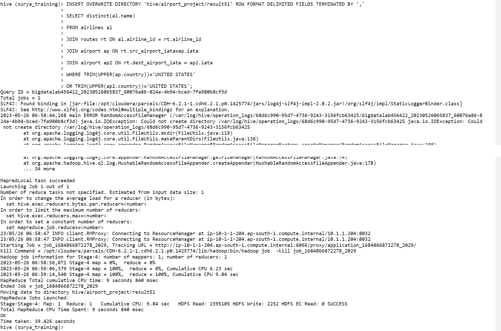

# Day 10 - BigDataTechnologies

## Airlines Project

- Start hive CLI using command below, it launches hive interactive shell mode

    ```bash
    [bigdatalab456422@ip-10-1-1-204 ~]$ hive
    ```

    ```console
    [bigdatalab456422@ip-10-1-1-204~]$ hive
    WARNING: Use "yarn jar" to launch YARN applications.
    SLF4J: Class path contains multiple SLF4J bindings.
    SLF4J: Found binding in [jar:file:/opt/cloudera/parcels/CDH-6.2.1-1.cdh6.2.1.p0.1425774/jars/log4j-slf4j-impl-2.8.2.jar!/org/slf4j/impl/StaticLoggerBinder.class]
    SLF4J: Found binding in [jar:file:/opt/cloudera/parcels/CDH-6.2.1-1.cdh6.2.1.p0.1425774/jars/slf4j-log4j12-1.7.25.jar!/org/slf4j/impl/StaticLoggerBinder.class]
    SLF4J: See http://www.slf4j.org/codes.html#multiple_bindings for an explanation.
    SLF4J: Actual binding is of type [org.apache.logging.slf4j.Log4jLoggerFactory]
    2023-05-25 05:11:50,539 main WARN JNDI lookup class is not available because this JRE does not support JNDI. JNDI string lookups will not be available, continuing configuration. Ignoring java.lang.ClassNotFoundException: org.apache.logging.log4j.core.lookup.JndiLookup
    
    Logging initialized using configuration in jar:file:/opt/cloudera/parcels/CDH-6.2.1-1.cdh6.2.1.p0.1425774/jars/hive-common-2.1.1-cdh6.2.1.jar!/hive-log4j2.properties Async:false
    
    WARNING: Hive CLI is deprecated and migration to Beeline is recommended.
    hive>
    ```

- Run command below to set Hive CLI to print current DB

    ```hive
    hive> set hive.cli.print.current.db = true ;
    ```

- Run command below to use the `surya_training` database

    ```hive
    hive (default)> USE surya_training ;
    ```

    ```console
    OK
    Time taken: 0.029 seconds
    hive (surya_training)>
    ```

- Run command below to `SHOW TABLES` in current database `surya_training`

    ```hive
    hive (surya_training)> SHOW TABLES ;
    ```

    ```console
    OK
    nyse
    stkvol
    Time taken: 0.083 seconds, Fetched: 2 row(s)
    hive (surya_training)>
    ```

### Loading Data

- We have three data files
  1. `airports_mod.dat` : contains information about airports
  2. `Final_airlines` : contains information about airline carriers
  3. `routes.dat` : contains information about the routes on which different airlines operate and to which airports those routes cater to
- So, we'll first need to create three tables in Hive to store data from these files, and only then we can do any analytical operation on them

### `airports_mod.dat`

#### `CREATE TABLE airport`

- Run command below to create table `airport` in row format delimited, fields terminated by `,` and stored as text file

    ```hive
    hive (surya_training)> CREATE TABLE airport (
    airport_id INT,
    name STRING,
    city STRING,
    country STRING,
    iata STRING,
    icao STRING,
    latitude DOUBLE,
    longitude DOUBLE,
    altitude INT,
    timezone DOUBLE,
    dst STRING,
    TZ STRING)
    ROW FORMAT DELIMITED FIELDS TERMINATED BY ',' STORED AS TEXTFILE;
    ```

    ```console
    OK
    Time taken: 0.465 seconds
    hive (surya_training)>
    ```

- Now, run a `SHOW TABLES` command to confirm `airport` table is created

    ```hive
    hive (surya_training)> SHOW TABLES ;
    ```

    ```console
    OK
    airport
    nyse
    stkvol
    Time taken: 0.218 seconds, Fetched: 3 row(s)
    hive (surya_training)>
    ```

#### Loading data into `airport` table

- Now our `airport` table is created successfully, so we can load data into this table
- First upload `airports_mod.dat` file to Hadoop client using FTP
- Now use `hadoop fs -put` command to copy the data file to `training` directory on hdfs as shown in command below, but this command needs to be run on hadoop client CLI, not on Hive CLI, so you may keep hadoop client CLI open in separate web-browser tab

    ```bash
    [bigdatalab456422@ip-10-1-1-204 ~]$ hadoop fs -put airports_mod.dat training
    ```

- Once data file has been copied to `training` directory on hdfs, run below command in **hive CLI** to load data from local hdfs path while overwriting the table `airport`

    ```hive
    hive (surya_training)> LOAD DATA LOCAL INPATH 'airports_mod.dat' OVERWRITE INTO TABLE airport ;
    ```

    ```console
    Loading data to table surya_training.airport
    OK
    Time taken: 1.824 seconds
    hive (surya_training)>
    ```

#### `SELECT` records from `airport` table

- use `SELECT` command as shown below to print the first 10 records from `airport` table

    ```hive
    hive (surya_training)> SELECT * FROM airport LIMIT 10 ;
    ```

    ```console
    OK
    1       Goroka  Goroka  Papua New Guinea        GKA     AYGA    -6.081689       145.391881      5282    10.0    U       Pacific/Port_Moresby
    2       Madang  Madang  Papua New Guinea        MAG     AYMD    -5.207083       145.7887        20      10.0    U       Pacific/Port_Moresby
    3       Mount Hagen     Mount Hagen     Papua New Guinea        HGU     ΑΥΜΗ    -5.826789       144.295861      5388    10.0    U       Pacific/Port_Moresby
    4       Nadzab  Nadzab  Papua New Guinea        LAE     AYNZ    -6.569828       146.726242      239     10.0    U       Pacific/Port_Moresby
    5       Port Moresby Jacksons Intl      Port Moresby    Papua New Guinea        POM     AYPY    -9.443383       147.22005       146     10.0    U       Pacific/Port_Moresby
    6       Wewak Intl      Wewak   Papua New Guinea        WWK     AYWK    -3.583828       143.669186      19      10.0    U       Pacific/Port_Moresby
    7       Narsarsuaq      Narssarssuaq    Greenland       UAK     BGBW    61.160517       -45.425978      112     -3.0    E       America/Godthab
    8       Nuuk    Godthaab        Greenland       GOH     BGGH    64.190922       -51.678064      283     -3.0    E       America/Godthab
    9       Sondre Stromfjord       Sondrestrom     Greenland       SFJ     BGSF    67.016969       -50.689325      165     -3.0    E       America/Godthab
    10      Thule Air Base  Thule   Greenland       THU     BGTL    76.531203       -68.703161      251     -4.0    E       America/Thule
    Time taken: 0.3 seconds, Fetched: 10 row(s)
    hive (surya_training)>
    ```

### Initial Analytics on `airport` table

#### Show Count of all the Airports

- Print Count of all records from table `airport` and verify if the airport count is 8107

    ```hive
    hive (surya_training)> SELECT count(airport_id) FROM airport ;
    ```

    

#### Show Count of Airports in each Country

- Print count of airports in each country and verify if INDIA has 140 airports

    ```hive
    hive (surya_training)> SELECT country, count(airport_id) FROM airport GROUP BY country ;
    ```

    

### `Final_airlines`

#### `CREATE TABLE airlines`

- Run command below to create table `airlines` in row format delimited, fields terminated by `,` and stored as text file

    ```hive
    hive (surya_training)> CREATE TABLE airlines(
    airline_id INT,
    name STRING,
    alias STRING,
    iata STRING,
    icao STRING,
    callsign STRING,
    country STRING,
    active STRING)
    ROW FORMAT DELIMITED FIELDS TERMINATED BY ',' STORED AS TEXTFILE;
    ```

    ```console
    OK
    Time taken: 0.106 seconds
    hive (surya_training)>
    ```

#### Loading data into `airlines` table

- Now our `airlines` table is created successfully, so we can load data into this table
- First upload `Final_airlines` file to Hadoop client using FTP
- Now use `hadoop fs -put` command to copy the data file to `training` directory on hdfs as shown in command below, but this command needs to be run on hadoop client CLI, not on Hive CLI, so you may run it in hadoop client CLI open in separate web-browser tab

    ```bash
    [bigdatalab456422@ip-10-1-1-204 ~]$ hadoop fs -put Final_airlines training
    ```

- Once data file has been copied to `training` directory on hdfs, run below command in **hive CLI** to load data from local hdfs path while overwriting the table `airlines`

    ```hive
    hive (surya_training)> LOAD DATA LOCAL INPATH 'Final_airlines' OVERWRITE INTO TABLE airlines;
    ```

    ```console
    Loading data to table surya_training.airlines
    OK
    Time taken: 0.902 seconds
    hive (surya_training)>
    ```

### Initial Analytics on `airlines` table

#### Find Count of Airlines

- Print the count of airlines in table `airlines` and verify if the count is 6048

    ```hive
    hive (surya_training)> SELECT count(airline_id) FROM airlines ;
    ```

    

### `routes.dat`

#### `CREATE TABLE routes`

- Run command below to create table `routes` in row format delimited, fields terminated by `,` and stored as text file

    ```hive
    hive (surya_training)> CREATE TABLE routes(
    airline_iata STRING,
    airline_id STRING,
    src_airport_iata STRING,
    src_airport_id INT,
    dest_airport_iata STRING,
    dest_airport_id INT,
    codeshare STRING,
    stop INT,
    equipment STRING)
    ROW FORMAT DELIMITED FIELDS TERMINATED BY ',' STORED AS TEXTFILE;
    ```

    ```console
    OK
    Time taken: 0.147 seconds
    hive (surya_training)>
    ```

#### Loading data into `routes` table

- Now our `routes` table is created successfully, so we can load data into this table
- First upload `routes.dat` file to Hadoop client using FTP
- Now use `hadoop fs -put` command to copy the data file `routes.dat` to `training` directory on hdfs as shown in command below, but this command needs to be run on hadoop client CLI, not on Hive CLI, so you may run it in hadoop client CLI open in separate web-browser tab

    ```bash
    [bigdatalab456422@ip-10-1-1-204 ~]$ hadoop fs -put routes.dat training
    ```

- Once data file `routes.dat` has been copied to `training` directory on hdfs, run below command in **hive CLI** to load data from local hdfs path while overwriting the table `routes`

    ```hive
    hive (surya_training)> LOAD DATA LOCAL INPATH 'routes.dat' OVERWRITE INTO TABLE routes;
    ```

    ```console
    Loading data to table surya_training.routes
    OK
    Time taken: 0.86 seconds
    hive (surya_training)>
    ```

### Initial Analytics on `routes` table

#### Show First 10 records

- Print the first 10 records from table `routes`

    ```hive
    hive (surya_training)> SELECT * FROM SELECT-_-FROM-routes-LIMIT-10 LIMIT 10;
    ```

    

#### Count Number of Routes

- Print the count of routes in table `routes` and verify if the count is 67663

    ```hive
    hive (surya_training)> SELECT count(*) FROM routes ;
    ```

    

### Assignments

- Now, you have loaded data in all three tables `airport`, `airlines` and `routes` from data files `airports_mod.dat`, `Final_airlines` and `routes.dat` respectively, you may proceed for further analytical operations on these three tables

#### A. Find list of Airports operating in the Country India

- Run this command to find airports operating in India

    ```hive
    hive (surya_training)> SELECT * FROM airport WHERE
    country='India';
    ```

    

- Run this command to save the results into a file for the airports which operate in India

    ```hive
    hive (surya_training)> INSERT OVERWRITE DIRECTORY 'hive/airport_project/result10' ROW FORMAT DELIMITED FIELDS TERMINATED BY ','
    SELECT * FROM airport WHERE country='India';
    ```

    

- You may open `Hue` tool and visit the hdfs path at `/user/bigdatalab456422/hive/airport_project/result10/000000_0` to open the file which contains data dumped from previous command

    

- Run this command from instructor (Sandeep) to save the results into a file for the airports which operate in India

    ```hive
    hive (surya_training)> INSERT OVERWRITE DIRECTORY 'hive/airport_project/result11' ROW FORMAT DELIMITED FIELDS TERMINATED BY ','
    SELECT * FROM airport WHERE trim(upper(country)) = 'INDIA';
    ```

    

- You may open `Hue` tool and visit the hdfs path at `/user/bigdatalab456422/hive/airport_project/result11/000000_0` to open the file which contains data dumped from previous command

    

#### B. Find the list of Airlines having zero stops

- Run this command to save the results into a file for the airlines having zero stops

    ```hive
    hive (surya_training)> INSERT OVERWRITE DIRECTORY 'hive/airport_project/result20' ROW FORMAT DELIMITED FIELDS TERMINATED BY ','
    SELECT distinct(al.name), rt.stop FROM airlines al JOIN routes rt ON al.airline_id=rt.airline_id WHERE rt.stop=0;
    ```

    

- You may open `Hue` tool and visit the hdfs path at `/user/bigdatalab456422/hive/airport_project/result20/000000_0` to open the file which contains data dumped from previous command

    

- Run this command from instructor (Sandeep) to save the results into a file for the airlines having zero stops

    ```hive
    hive (surya_training)> INSERT OVERWRITE DIRECTORY 'hive/airport_project/result21' ROW FORMAT DELIMITED FIELDS TERMINATED BY ','
    SELECT DISTINCT(name)
    FROM airlines a
    JOIN routes r
    ON a.airline_id=r.airline_id
    WHERE stop=0;
    ```

    

- You may open `Hue` tool and visit the hdfs path at `/user/bigdatalab456422/hive/airport_project/result21/000000_0` to open the file which contains data dumped from previous command

    

#### C. List of Airlines operating with code share

- Run this command to save the results into a file for the airlines operating with code share

    ```hive
    hive (surya_training)> INSERT OVERWRITE DIRECTORY 'hive/airport_project/result30' ROW FORMAT DELIMITED FIELDS TERMINATED BY ','
    SELECT distinct(al.airline_id), al.name, rt.codeshare FROM airlines al JOIN routes rt ON al.airline_id=rt.airline_id WHERE rt.codeshare='Y';
    ```

    

- You may open `Hue` tool and visit the hdfs path at `/user/bigdatalab456422/hive/airport_project/result30/000000_0` to open the file which contains data dumped from previous command

    

- Run this command from instructor (Sandeep) to save the results into a file for the airlines operating with code share

    ```hive
    hive (surya_training)> INSERT OVERWRITE DIRECTORY 'hive/airport_project/result31' ROW FORMAT DELIMITED FIELDS TERMINATED BY ','
    SELECT DISTINCT(name) FROM airlines a JOIN routes r ON a.airline_id=r.airline_id WHERE TRIM(UPPER(codeshare))='Y';
    ```

    

- You may open `Hue` tool and visit the hdfs path at `/user/bigdatalab456422/hive/airport_project/result31/000000_0` to open the file which contains data dumped from previous command

    

#### D. Which country (or) territory having highest Airports

- Run this command to save the results into a file for the country or territory having highest airports

    ```hive
    hive (surya_training)> INSERT OVERWRITE DIRECTORY 'hive/airport_project/result4' ROW FORMAT DELIMITED FIELDS TERMINATED BY ','
    SELECT ap.country, count(ap.country) FROM airport ap GROUP BY country;
    ```

    

- You may open `Hue` tool and visit the hdfs path at `/user/bigdatalab456422/hive/airport_project/result4/000000_0` to open the file which contains data dumped from previous command
  - [screenshot-not-available]

- Run this command from instructor (Sandeep) to save the results into a file for the country or territory having highest airports

    ```hive
    hive (surya_training)> INSERT OVERWRITE DIRECTORY 'hive/airport_project/result47' ROW FORMAT DELIMITED FIELDS TERMINATED BY ','
    SELECT country, count(airport_id) AS cnt FROM airport GROUP BY country HAVING cnt IN
    (SELECT max(total) FROM
    (SELECT count(airport_id) AS total FROM airport GROUP BY country) AS abc);
    ```

    

- You may open `Hue` tool and visit the hdfs path at `/user/bigdatalab456422/hive/airport_project/result47/000000_0` to open the file which contains data dumped from previous command

    

- Run this command from a colleague (Prasad Amle) to save the results into a file for the country or territory having highest airports, he has used ranking for this problem instead of sub-query, and this query also produced correct results

    ```hive
    hive (surya_training)> INSERT OVERWRITE DIRECTORY 'hive/airport_project/result48' ROW FORMAT DELIMITED FIELDS TERMINATED BY ','
    SELECT * FROM (SELECT country, count(airport_id), DENSE_RANK()
    OVER (ORDER BY COUNT(airport_id) DESC) AS rnk
    FROM airport GROUP BY country) AS X
    WHERE X.rnk=1;
    ```

    

- You may open `Hue` tool and visit the hdfs path at `/user/bigdatalab456422/hive/airport_project/result48/000000_0` to open the file which contains data dumped from previous command
  - [screenshot-not-available]

#### D.1 Which country (or) territory having lowest Airports

- Run this command from instructor (Sandeep) to save the results into a file for the for the country or territory having lowest airports

    ```hive
    hive (surya_training)> INSERT OVERWRITE DIRECTORY 'hive/airport_project/result47a' ROW FORMAT DELIMITED FIELDS TERMINATED BY ','
    SELECT country, count(airport_id) AS cnt FROM airport GROUP BY country HAVING cnt IN
    (SELECT min(total) FROM
    (SELECT count(airport_id) AS total FROM airport GROUP BY country) AS abc);
    ```

    

- You may open `Hue` tool and visit the hdfs path at `/user/bigdatalab456422/hive/airport_project/result47a/000000_0` to open the file which contains data dumped from previous command

    

- Run this command from a colleague (Prasad Amle) to save the results into a file for the country or territory having lowest airports, he has used ranking for this problem instead of sub-query, and this query also produced correct results

    ```hive
    hive (surya_training)> INSERT OVERWRITE DIRECTORY 'hive/airport_project/result48a' ROW FORMAT DELIMITED FIELDS TERMINATED BY ','
    SELECT * FROM (SELECT country, count(airport_id), DENSE_RANK()
    OVER (ORDER BY COUNT(airport_id) ASC) AS rnk
    FROM airport GROUP BY country) AS X
    WHERE X.rnk=1;
    ```

    

- You may open `Hue` tool and visit the hdfs path at `/user/bigdatalab456422/hive/airport_project/result48a/000000_0` to open the file which contains data dumped from previous command

    

#### E. Find the list of Active Airlines in United States

- Run this command to save the results into a file for the list of active airlines in United States

    ```hive
    hive (surya_training)> INSERT OVERWRITE DIRECTORY 'hive/airport_project/result51' ROW FORMAT DELIMITED FIELDS TERMINATED BY ','
    SELECT distinct(al.name)
    FROM airlines al
    JOIN routes rt ON al.airline_id = rt.airline_id
    JOIN airport ap ON rt.src_airport_iata=ap.iata
    JOIN airport ap2 ON rt.dest_airport_iata = ap2.iata
    WHERE TRIM(UPPER(ap.country))='UNITED STATES'
    OR TRIM(UPPER(ap2.country))='UNITED STATES';
    ```

    

- You may open `Hue` tool and visit the hdfs path at `/user/bigdatalab456422/hive/airport_project/result51/000000_0` to open the file which contains data dumped from previous command

    

- Run this command from instructor (Sandeep) to save the results into a file for the list of active airlines in United States

    ```hive
    hive (surya_training)> INSERT OVERWRITE DIRECTORY 'hive/airport_project/result57' ROW FORMAT DELIMITED FIELDS TERMINATED BY ','
    SELECT distinct(a.name)
    FROM airlines a
    JOIN routes r ON a.airline_id = r.airline_id
    JOIN airport ar1 ON ar1.airport_id = src_airport_id
    JOIN airport ar2 ON ar2.airport_id = dest_airport_id
    WHERE TRIM(UPPER(ar1.country))='UNITED STATES'
    OR TRIM(UPPER(ar2.country))='UNITED STATES' ;
    ```

    

- You may open `Hue` tool and visit the hdfs path at `/user/bigdatalab456422/hive/airport_project/result57/000000_0` to open the file which contains data dumped from previous command

    

### QnA

- I had a query for the reason why `java.io.IOException` `ERROR` logs being verbosed at screen when I triggerd a Hive query, instructor told that it was related to some `RandomAccessManager` module which can be ignored

    ```hive
    hive (surya_training)> INSERT OVERWRITE DIRECTORY 'hive/airport_project/result2' ROW FORMAT DELIMITED FIELDS TERMINATED BY ','
    SELECT al.name, rt.src_airport_iata, rt.dest_airport_iata, rt.stop FROM airlines al JOIN routes rt ON al.airline_id=rt.airline_id WHERE rt.stop=0 ;
    ```

    
