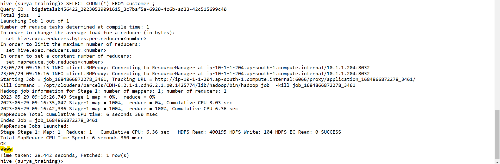
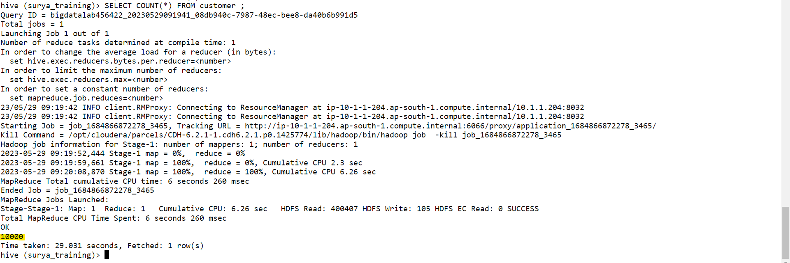
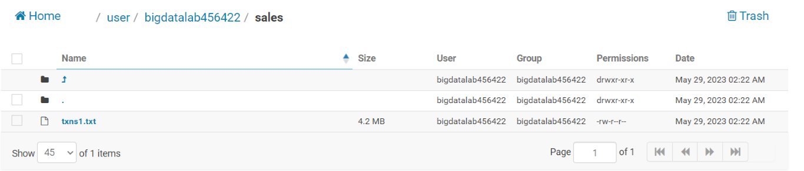
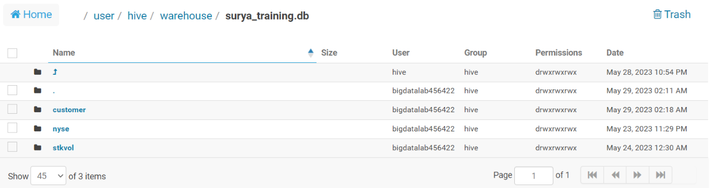

# Day 12 - BigDataTechnologies

## Customers & Transactions

- Start hive CLI using command below, it launches hive interactive shell mode

    ```bash
    [bigdatalab456422@ip-10-1-1-204 ~]$ hive
    ```

    ```console
    [bigdatalab456422@ip-10-1-1-204~]$ hive
    WARNING: Use "yarn jar" to launch YARN applications.
    SLF4J: Class path contains multiple SLF4J bindings.
    SLF4J: Found binding in [jar:file:/opt/cloudera/parcels/CDH-6.2.1-1.cdh6.2.1.p0.1425774/jars/log4j-slf4j-impl-2.8.2.jar!/org/slf4j/impl/StaticLoggerBinder.class]
    SLF4J: Found binding in [jar:file:/opt/cloudera/parcels/CDH-6.2.1-1.cdh6.2.1.p0.1425774/jars/slf4j-log4j12-1.7.25.jar!/org/slf4j/impl/StaticLoggerBinder.class]
    SLF4J: See http://www.slf4j.org/codes.html#multiple_bindings for an explanation.
    SLF4J: Actual binding is of type [org.apache.logging.slf4j.Log4jLoggerFactory]
    2023-05-29 09:11:50,539 main WARN JNDI lookup class is not available because this JRE does not support JNDI. JNDI string lookups will not be available, continuing configuration. Ignoring java.lang.ClassNotFoundException: org.apache.logging.log4j.core.lookup.JndiLookup

    Logging initialized using configuration in jar:file:/opt/cloudera/parcels/CDH-6.2.1-1.cdh6.2.1.p0.1425774/jars/hive-common-2.1.1-cdh6.2.1.jar!/hive-log4j2.properties Async:false

    WARNING: Hive CLI is deprecated and migration to Beeline is recommended.
    hive>
    ```

- Run command below to set Hive CLI to print current DB

    ```hive
    hive> set hive.cli.print.current.db = true ;
    ```

- Run command below to use the `surya_training` database

    ```hive
    hive (default)> USE surya_training ;
    ```

    ```console
    OK
    Time taken: 0.029 seconds
    hive (surya_training)>
    ```

### Uploading data files using FTP

- First upload `custs.txt`, `custs_add` and `txns1.txt` files to Client/linux Filesystem

### Customer Table

- We'll create a `customer` table
- Then load data into it from `custs.txt` using `OVERWRITE`, so that if any data exists, it'll be replaced
- Then load data into it from `custs_add` without using `OVERWRITE`, so that the data is appended and previous data is not lost

#### CREATE TABLE `customer`

- Run the command below to create a table `customer`

    ```hive
    hive (surya_training)> CREATE TABLE customer(custno INT, firstname STRING, lastname STRING, age INT, profession STRING)
    ROW FORMAT DELIMITED FIELDS TERMINATED BY ',' STORED AS TEXTFILE;
    ```

    ```console
    OK
    Time taken: 0.398 seconds
    hive (surya_training)>
    ```

- Now, run a `SHOW TABLES` command to confirm `customer` table is created

    ```hive
    hive (surya_training)> show tables ;
    ```

    ```console
    OK
    customer
    nyse
    stkvol
    Time taken: 0.197 seconds, Fetched: 3 row(s)
    hive (surya_training)>
    ```

#### Loading data into `customer` table

- Now our `customer` table is created successfully, so we can load data into this table
- Data file `custs.txt` have already been uploaded using FTP, so you can run below command to load the data from file using `LOCAL INPATH` and performing a `OVERWRITE` into the table using command below

    ```hive
    hive (surya_training)> LOAD DATA LOCAL INPATH 'custs.txt' OVERWRITE INTO TABLE customer;
    ```

    ```console
    Loading data to table surya_training.customer
    OK
    Time taken: 1.138 seconds
    hive (surya_training)>
    ```

- Now that data has been loaded, you can check for the count of records in the table `customer` using command below, and it should show 9999 records only

    ```hive
    hive (surya_training)> SELECT COUNT(*) FROM customer ;
    ```

    

### Loading more data into `customer` table

- Data file `custs_add` have already been uploaded using FTP, so you can run below command to load the data from file using `LOCAL INPATH` and **without** performing a `OVERWRITE` into the table using command below, so that data from this file is appended to the table `customer`

    ```hive
    hive (surya_training)> LOAD DATA LOCAL INPATH 'custs_add' INTO TABLE customer;
    ```

    ```console
    Loading data to table surya_training.customer
    OK
    Time taken: 0.684 seconds
    hive (surya_training)>
    ```

- Now that this file `custs_add` had only 1 record which has been loaded, you can check for the count of records in the table `customer` using command below, and it should show `10000` records only

    ```hive
    hive (surya_training)> SELECT COUNT(*) FROM customer ;
    ```

    

### Transactions Table

- We’ll create a `txnrecords` table, but we'll create it as an external table, so we'll need to put put the data file `txns1.txt` in a hdfs location and then map that data file to the table while creating it

#### Moving Data files into a hdfs location

- First create a directory `sales` on hdfs using command below in client command-line

    ```bash
    [bigdatalab456422@ip-10-1-1-204 ~]$ hadoop fs -mkdir sales
    ```

    ```console
    [bigdatalab456422@ip-10-1-1-204 ~]$ 
    ```

- Once this directory is created, now use `hadoop fs -put` utility to copy the data file `txns1.txt` to the `sales` directory on hdfs using command below

    ```bash
    [bigdatalab456422@ip-10-1-1-204 ~]$ hadoop fs -put txns1.txt sales
    ```

    ```console
    [bigdatalab456422@ip-10-1-1-204 ~]$ 
    ```

- To check if data file `txns1.txt` exists in `sales` directory in hdfs, use `hadoop fs -ls` utility as below

    ```bash
    [bigdatalab456422@ip-10-1-1-204 ~]$ hadoop fs -ls sales
    ```

    ```console
    Found 1 items
    -rw-r--r--   3 bigdatalab456422 bigdatalab456422    4418144 2023-05-29 09:22 sales/txns1.txt
    [bigdatalab456422@ip-10-1-1-204 ~]$ 
    ```

- Alternatively, you can open the `Hue` tool and visit the hdfs path at `/user/bigdatalab456422/sales` to open the directory `sales` which contains data file `txns1.txt1`

    

#### CREATE TABLE `transaction`

- Now we need to create an External table `txnrecords` which has data `STORED AS TEXTFILE` at a location mapped to the `sales` directory `LOCATION` on hdfs using command below in hive interactive CLI

```hive
hive (surya_training)> CREATE TABLE txnrecords(txnno INT, txndate STRING, custno INT, amount DOUBLE,
category STRING, product STRING, city STRING, state STRING, spendby STRING)
ROW FORMAT DELIMITED FIELDS TERMINATED BY ',' STORED AS textfile
LOCATION '/user/bigdatalab456422/sales';
```

```console
OK
Time taken: 0.072 seconds
hive (surya_training)>
```

> This text file `txns1.txt` in hdfs directory `sales` is directly accessible in table, but is not mapped to the hive warehouse directory `/user/hive/warehouse`, instead it is mapped to the hdfs directory of `$HADOOP_PATH/sales/`, so reading all the files in this hdfs directory as table contents in this External table

- Now that, table `txnrecords` is created and mapped to the data file directory, you may run the command below to list the first 10 records of `txnrecords` table

```hive
hive (surya_training)> SELECT * FROM txnrecords LIMIT 10;
```

```console
OK
0       06-26-2011      4007024 40.33   Exercise & Fitness      Cardio Machine Accessories      Clarksville     Tennessee       credit
1       05-26-2011      4006742 198.44  Exercise & Fitness      Weightlifting Gloves    Long Beach      California      credit
2       06-01-2011      4009775 5.58    Exercise & Fitness      Weightlifting Machine Accessories       Anaheim California      credit
3       06-05-2011      4002199 198.19  Gymnastics      Gymnastics Rings        Milwaukee       Wisconsin       credit
4       12-17-2011      4002613 98.81   Team Sports     Field Hockey    Nashville       Tennessee       credit
5       02-14-2011      4007591 193.63  Outdoor Recreation      Camping & Backpacking & Hiking  Chicago Illinois        credit
6       10-28-2011      4002190 27.89   Puzzles Jigsaw Puzzles  Charleston      South Carolina  credit
7       07-14-2011      4002964 96.01   Outdoor Play Equipment  Sandboxes       Columbus        Ohio    credit
8       01-17-2011      4007361 10.44   Winter Sports   Snowmobiling    Des Moines      Iowa    credit
9       05-17-2011      4004798 152.46  Jumping Bungee Jumping  St. Petersburg  Florida credit
Time taken: 0.103 seconds, Fetched: 10 row(s)
hive (surya_training)>
```

- You may open the Hue tool and visit the hive warehouse directory at `/user/hive/warehouse/surya_training.db` to confirm that this this external table is not created in hive warehouse directory, instead it is created in `$HADOOP_PATH/sales` hdfs directory where its data file is kept




#### Mapping data into `transaction` table

## Hive Optimizations

- If 1TB data takes 'x' time, so 10TB data will take '10x' time
- We can optimize the Hive database by
  1. Creating ORC files
  2. Creating Parquet files
  3. Creating Partitions in Tables
  4. Creating Buckets in Tables
  5. Using Columnar tables
  6. Using inbuilt indexes

### ORC Files

- What are ORC Files?
- ORC stands for Optimized Row Columnar
- improves performance when hive performs R/W and processes data

#### Advantages of ORC Files

1. Compressed data, reduces data storage by over 90%
2. Inbuilt indexes
3. Columnar tables
4. Hive data is processes faster as compared to processing of text files
5. Efficient Execution
6. Data is encrypted, so data is more secure
7. ORC supports ACID properties, but Parquet doesn't support ACID properties

#### Disadvantages of ORC Files

#### Create table stored as ORC file

### Load data into table stored as ORC file

### Parquet Files

- What are Parquet Files?

#### Advantages of Parquet files

#### Disadvantages of Parquet files

1. Parquet does not support ACID properties

#### Create table stored as PARQUET file

### Load data into table stored as PARQUET file

### Indexing

- Indexing makes execution faster but hive has limited indexing capabilities

## Partitioning

## Bucketing/Clustering

---

## For Next Day

## Types of Tables in Hive

### Managed Tables

### External Tables

## UDF (User Defined Functions) in Hive
