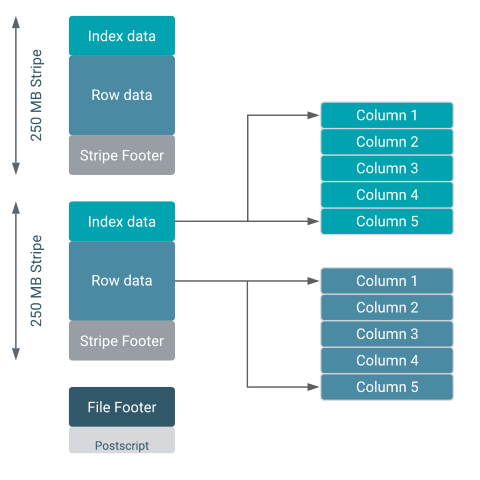
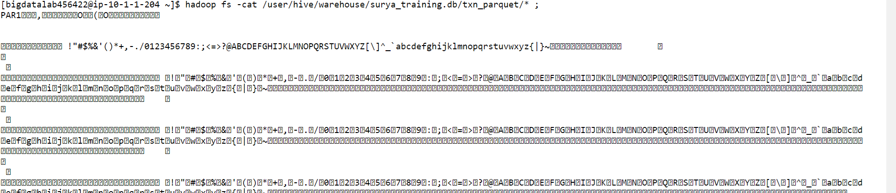

# Day 12 - BigDataTechnologies

## Customers & Transactions

- Start hive CLI using command below, it launches hive interactive shell mode

    ```bash
    [bigdatalab456422@ip-10-1-1-204 ~]$ hive
    ```

    ```console
    [bigdatalab456422@ip-10-1-1-204~]$ hive
    WARNING: Use "yarn jar" to launch YARN applications.
    SLF4J: Class path contains multiple SLF4J bindings.
    SLF4J: Found binding in [jar:file:/opt/cloudera/parcels/CDH-6.2.1-1.cdh6.2.1.p0.1425774/jars/log4j-slf4j-impl-2.8.2.jar!/org/slf4j/impl/StaticLoggerBinder.class]
    SLF4J: Found binding in [jar:file:/opt/cloudera/parcels/CDH-6.2.1-1.cdh6.2.1.p0.1425774/jars/slf4j-log4j12-1.7.25.jar!/org/slf4j/impl/StaticLoggerBinder.class]
    SLF4J: See http://www.slf4j.org/codes.html#multiple_bindings for an explanation.
    SLF4J: Actual binding is of type [org.apache.logging.slf4j.Log4jLoggerFactory]
    2023-05-29 09:11:50,539 main WARN JNDI lookup class is not available because this JRE does not support JNDI. JNDI string lookups will not be available, continuing configuration. Ignoring java.lang.ClassNotFoundException: org.apache.logging.log4j.core.lookup.JndiLookup

    Logging initialized using configuration in jar:file:/opt/cloudera/parcels/CDH-6.2.1-1.cdh6.2.1.p0.1425774/jars/hive-common-2.1.1-cdh6.2.1.jar!/hive-log4j2.properties Async:false

    WARNING: Hive CLI is deprecated and migration to Beeline is recommended.
    hive>
    ```

- Run command below to set Hive CLI to print current DB

    ```hive
    hive> set hive.cli.print.current.db = true ;
    ```

- Run command below to use the `surya_training` database

    ```hive
    hive (default)> USE surya_training ;
    ```

    ```console
    OK
    Time taken: 0.029 seconds
    hive (surya_training)>
    ```

### Uploading data files using FTP

- First upload `custs.txt`, `custs_add` and `txns1.txt` files to Client/linux Filesystem

### Customer Table

- We'll create a `customer` table
- Then load data into it from `custs.txt` using `OVERWRITE`, so that if any data exists, it'll be replaced
- Then load data into it from `custs_add` without using `OVERWRITE`, so that the data is appended and previous data is not lost

#### CREATE TABLE `customer`

- Run the command below to create a table `customer`

    ```hive
    hive (surya_training)> CREATE TABLE customer(custno INT, firstname STRING, lastname STRING, age INT, profession STRING)
    ROW FORMAT DELIMITED FIELDS TERMINATED BY ',' STORED AS TEXTFILE;
    ```

    ```console
    OK
    Time taken: 0.398 seconds
    hive (surya_training)>
    ```

- Now, run a `SHOW TABLES` command to confirm `customer` table is created

    ```hive
    hive (surya_training)> show tables ;
    ```

    ```console
    OK
    customer
    nyse
    stkvol
    Time taken: 0.197 seconds, Fetched: 3 row(s)
    hive (surya_training)>
    ```

#### Loading data into `customer` table

- Now our `customer` table is created successfully, so we can load data into this table
- Data file `custs.txt` have already been uploaded using FTP, so you can run below command to load the data from file using `LOCAL INPATH` and performing a `OVERWRITE` into the table using command below

    ```hive
    hive (surya_training)> LOAD DATA LOCAL INPATH 'custs.txt' OVERWRITE INTO TABLE customer;
    ```

    ```console
    Loading data to table surya_training.customer
    OK
    Time taken: 1.138 seconds
    hive (surya_training)>
    ```

- Now that data has been loaded, you can check for the count of records in the table `customer` using command below, and it should show 9999 records only

    ```hive
    hive (surya_training)> SELECT COUNT(*) FROM customer ;
    ```

    

### Loading more data into `customer` table

- Data file `custs_add` have already been uploaded using FTP, so you can run below command to load the data from file using `LOCAL INPATH` and **without** performing a `OVERWRITE` into the table using command below, so that data from this file is appended to the table `customer`

    ```hive
    hive (surya_training)> LOAD DATA LOCAL INPATH 'custs_add' INTO TABLE customer;
    ```

    ```console
    Loading data to table surya_training.customer
    OK
    Time taken: 0.684 seconds
    hive (surya_training)>
    ```

- Now that this file `custs_add` had only 1 record which has been loaded, you can check for the count of records in the table `customer` using command below, and it should show `10000` records only

    ```hive
    hive (surya_training)> SELECT COUNT(*) FROM customer ;
    ```

    

### Transactions Table

- We’ll create a `txnrecords` table, but we'll map it to an location (not an External table, it is still a managed table), so we'll need to put the data file `txns1.txt` in a hdfs location and then map that data file to the table while creating it

#### Moving Data files into a hdfs location

- First create a directory `sales` on hdfs using command below in client command-line

    ```bash
    [bigdatalab456422@ip-10-1-1-204 ~]$ hadoop fs -mkdir sales
    ```

    ```console
    [bigdatalab456422@ip-10-1-1-204 ~]$ 
    ```

- Once this directory is created, now use `hadoop fs -put` utility to copy the data file `txns1.txt` to the `sales` directory on hdfs using command below

    ```bash
    [bigdatalab456422@ip-10-1-1-204 ~]$ hadoop fs -put txns1.txt sales
    ```

    ```console
    [bigdatalab456422@ip-10-1-1-204 ~]$ 
    ```

- To check if data file `txns1.txt` exists in `sales` directory in hdfs, use `hadoop fs -ls` utility as below

    ```bash
    [bigdatalab456422@ip-10-1-1-204 ~]$ hadoop fs -ls sales
    ```

    ```console
    Found 1 items
    -rw-r--r--   3 bigdatalab456422 bigdatalab456422    4418144 2023-05-29 09:22 sales/txns1.txt
    [bigdatalab456422@ip-10-1-1-204 ~]$ 
    ```

- Alternatively, you can open the `Hue` tool and visit the hdfs path at `/user/bigdatalab456422/sales` to open the directory `sales` which contains data file `txns1.txt1`

    

#### CREATE TABLE `transaction`

- Now we need to create a table `txnrecords` which has data `STORED AS TEXTFILE` at a location mapped to the `sales` directory `LOCATION` on hdfs using command below in hive interactive CLI

    ```hive
    hive (surya_training)> CREATE TABLE txnrecords(txnno INT, txndate STRING, custno INT, amount DOUBLE,
    category STRING, product STRING, city STRING, state STRING, spendby STRING)
    ROW FORMAT DELIMITED FIELDS TERMINATED BY ',' STORED AS textfile
    LOCATION '/user/bigdatalab456422/sales';
    ```

    ```console
    OK
    Time taken: 0.072 seconds
    hive (surya_training)>
    ```

> This text file `txns1.txt` in hdfs directory `sales` is directly accessible in table, but is not mapped to the hive warehouse directory `/user/hive/warehouse`, instead it is mapped to the hdfs directory of `$HADOOP_PATH/sales/`, so reading all the files in this hdfs directory as table contents in this table

- Now that, table `txnrecords` is created and mapped to the data file directory, you may run the command below to list the first 10 records of `txnrecords` table

    ```hive
    hive (surya_training)> SELECT * FROM txnrecords LIMIT 10;
    ```

    ```console
    OK
    0       06-26-2011      4007024 40.33   Exercise & Fitness      Cardio Machine Accessories      Clarksville     Tennessee       credit
    1       05-26-2011      4006742 198.44  Exercise & Fitness      Weightlifting Gloves    Long Beach      California      credit
    2       06-01-2011      4009775 5.58    Exercise & Fitness      Weightlifting Machine Accessories       Anaheim California      credit
    3       06-05-2011      4002199 198.19  Gymnastics      Gymnastics Rings        Milwaukee       Wisconsin       credit
    4       12-17-2011      4002613 98.81   Team Sports     Field Hockey    Nashville       Tennessee       credit
    5       02-14-2011      4007591 193.63  Outdoor Recreation      Camping & Backpacking & Hiking  Chicago Illinois        credit
    6       10-28-2011      4002190 27.89   Puzzles Jigsaw Puzzles  Charleston      South Carolina  credit
    7       07-14-2011      4002964 96.01   Outdoor Play Equipment  Sandboxes       Columbus        Ohio    credit
    8       01-17-2011      4007361 10.44   Winter Sports   Snowmobiling    Des Moines      Iowa    credit
    9       05-17-2011      4004798 152.46  Jumping Bungee Jumping  St. Petersburg  Florida credit
    Time taken: 0.103 seconds, Fetched: 10 row(s)
    hive (surya_training)>
    ```

- You may open the Hue tool and visit the hive warehouse directory at `/user/hive/warehouse/surya_training.db` to confirm that this table is not created in hive warehouse directory, instead it is created in `$HADOOP_PATH/sales` hdfs directory where its data file is kept


#### Mapping data into `transaction` table

## Hive Optimizations

- If 1TB data takes 'x' time, so 10TB data will take '10x' time
- We can optimize the Hive database by
  1. Using ORC files to store Hive tables
  2. Creating Partitions in Tables
  3. Creating Buckets in Tables
  4. Using Columnar tables such as ORC
  5. Using inbuilt indexes

- Hive performance optimization involves several factors, from data design to query structures, to configurations.
- We can use following strategies for optimizing the Hive performance

  1. Using Suitable File formats in Hive preferably ORC format
  2. Indexing
  3. Using optimized Execution Engine
  4. Vectorization
  5. Cost Based Optimization (CBO)
  6. Compression
  7. Partitioning
  8. Bucketing

### 1. Using Suitable File formats in Hive

- Hive supports following file formats
  1. **Text File :** Simple line-based human-readable format, widely supported but inefficient in storage & performance, has no compression
  2. **RCFile (Record Columnar File) :** Hybrid format to store data in columnar layout, provides some storage & performance efficiency, provides compression, more complex to implement
  3. **ORC (Optimized Row Columnar) :** Columnar storage format designed specifically for Hive, provides fast query execution due to reduced I/O & better R/W by providing efficient execution plans, higher compression ratio, supports complex data types & schema evolution, requires more CPU resources for R/W
  4. **Parquet :** Another columnar storage format optimized for heavy Read ops (OLAP), excellent storage & performance, supports advanced features like nested data structures & schema evolution, compatible with various data processing frameworks like Spark, Impala , excellent compression ratio, slightly higher complex in setup
  5. **Avro :** Row-based storage format designed for data serialization, supports better schema evolution, good for data streaming, not much query performance optimized compared to columnar formats like ORC & Parquet

#### ORC Files

- What are ORC Files?
- ORC stands for Optimized Row Columnar
- default storage for Hive data
- columnar storage specifically designed for Hive
- improves performance when hive performs R/W and processes data

##### Advantages of ORC Files

1. Compressed data, reduces data storage by over 90% thus providing higher compression ratio
2. **Inbuilt indexes :** has lightweight inbuilt index to allow faster reads
3. **ACID support:** ORC file in an ACID table supports ACID properties
4. **Efficient Compression :** stored as columns and compressed, leads to smaller disk reads, also ideal for Vectorization optimization
5. **Fast Reads :** has built in index, allows footer statistics causing entire stipes to be skipped during reads, Predicate pushdown also pushes filters so that minimal rows are read, Bloom filters further reduce the number of rows that are returned
6. **Ideal for Large-scale deployments :** Facebook uses ORC format for 300+PB deployment
7. **Columnar Storage :** stores data in columnar format, designed specifically for Hive as Apache project, so data can't be directly read like text files, it provides fast & efficient reads by skipping entire stripes
8. **Flexibility for Compression algorithm :** allows you to specify a compression algorithm for a table
9. **Larger Block :** uses larger blocks of 256MB by default'
10. **Predicate Pushdown :** it supports predicate pushdown being a columnar storage format, so queries are faster since filters are applied earlier due to Predicate Pushdown support



##### Disadvantages of ORC Files

1. Requires more CPU resources for R/W due to high compression as it is a columnar format

##### Create table stored as ORC file

- Create a table `STORED AS ORC` by running the command below

    ```hive
    hive (surya_training)> CREATE TABLE txn_orc(txnno INT, txndate STRING, custno INT, amount DOUBLE, 
    category STRING, product STRING, city STRING, state STRING, spendby STRING) 
    STORED AS ORC;
    ```

    ```console
    OK
    Time taken: 0.092 seconds
    hive (surya_training)>
    ```

##### Load data into table stored as ORC file

- Now we'll load data into this new `ORC` file hive table `txn_orc`, and for this we'll copy from `txnrecords` table which we created recently
- We'll `SELECT` records from data source table `txnrecords` and dump it using `INSERT OVERWRITE` to new `ORC` table `txn_orc` using command below

    ```hive
    hive (surya_training)> INSERT OVERWRITE TABLE txn_orc SELECT * FROM txnrecords;
    ```

    

##### Exploring around ORC file Hive Table

- Once Data is loaded into this `ORC` file Hive table `txn_orc`, you may list the first 10 records from it using command below which is same as the table `txnrecords` which has data `STORED AS TEXTFILE`

    ```hive
    hive (surya_training)> SELECT * FROM txn_orc LIMIT 10;
    ```

    ```console
    OK
    0       06-26-2011      4007024 40.33   Exercise & Fitness      Cardio Machine Accessories      Clarksville     Tennessee       credit
    1       05-26-2011      4006742 198.44  Exercise & Fitness      Weightlifting Gloves    Long Beach      California      credit
    2       06-01-2011      4009775 5.58    Exercise & Fitness      Weightlifting Machine Accessories       Anaheim California      credit
    3       06-05-2011      4002199 198.19  Gymnastics      Gymnastics Rings        Milwaukee       Wisconsin       credit
    4       12-17-2011      4002613 98.81   Team Sports     Field Hockey    Nashville       Tennessee       credit
    5       02-14-2011      4007591 193.63  Outdoor Recreation      Camping & Backpacking & Hiking  Chicago Illinois        credit
    6       10-28-2011      4002190 27.89   Puzzles Jigsaw Puzzles  Charleston      South Carolina  credit
    7       07-14-2011      4002964 96.01   Outdoor Play Equipment  Sandboxes       Columbus        Ohio    credit
    8       01-17-2011      4007361 10.44   Winter Sports   Snowmobiling    Des Moines      Iowa    credit
    9       05-17-2011      4004798 152.46  Jumping Bungee Jumping  St. Petersburg  Florida credit
    Time taken: 0.15 seconds, Fetched: 10 row(s)
    hive (surya_training)>
    ```

- You may try to use `DESC FORMATTED` information of this table `txn_orc` using command below and notice that, the SerDe Library this table uses is not the `LazySimpleSerDe`, but it is `OrcSerDe` because it uses `ORC` file format

    ```hive
    hive (surya_training)> DESC FORMATTED txn_orc ;
    ```

    ```console
    OK
    # col_name              data_type               comment

    txnno                   int
    txndate                 string
    custno                  int
    amount                  double
    category                string
    product                 string
    city                    string
    state                   string
    spendby                 string

    # Detailed Table Information
    Database:               surya_training
    OwnerType:              USER
    Owner:                  bigdatalab456422
    CreateTime:             Mon May 29 10:22:23 UTC 2023
    LastAccessTime:         UNKNOWN
    Retention:              0
    Location:               hdfs://nameservice1/user/hive/warehouse/surya_training.db/txn_orc
    Table Type:             MANAGED_TABLE
    Table Parameters:
            COLUMN_STATS_ACCURATE   {\"BASIC_STATS\":\"true\"}
            numFiles                1
            numRows                 50000
            rawDataSize             28800000
            totalSize               505976
            transient_lastDdlTime   1685355855

    # Storage Information
    SerDe Library:          org.apache.hadoop.hive.ql.io.orc.OrcSerde
    InputFormat:            org.apache.hadoop.hive.ql.io.orc.OrcInputFormat
    OutputFormat:           org.apache.hadoop.hive.ql.io.orc.OrcOutputFormat
    Compressed:             No
    Num Buckets:            -1
    Bucket Columns:         []
    Sort Columns:           []
    Storage Desc Params:
            serialization.format    1
    Time taken: 0.035 seconds, Fetched: 37 row(s)
    hive (surya_training)>
    ```

- Now you have table location from the previous command, you may try to print out the table right from the hdfs using `hdfs fs -cat` utility using command below on Hadoop CLI and you'll notice that data is not human readable because it stores data in a columnar format so data needs to be properly serialized before reading

    ```bash
    [bigdatalab456422@ip-10-1-1-204 ~]$ hadoop fs -cat /user/hive/warehouse/surya_training.db/txn_orc/* ;
    ```

    

#### Parquet Files

- Apache Parquet is also another popular columnar storage file format used by Hadoop systems
- developed by Cloudera and Twitter, and now an open source Apache project
- schema metadata is embedded into the file, so it supports Schema evolution
- provides excellent storage and performance, especially for large datasets
- optimized for heavy Read operations
- has an extension `.parquet`
- default storage for Spark data
- supports multiple engines like Apache Hive, Apache Drill, Cloudera Impala, Apache Crunch, Apache Pig, Apache Spark and multiple data description like Apache Avro, Apache Thrift, Google Protocol Buffers
- Another columnar storage format optimized for heavy Read ops (OLAP), excellent storage & performance, supports advanced features like nested data structures & schema evolution, compatible with various data processing frameworks like Spark, Impala , excellent compression ratio, slightly higher complex in setup

##### Advantages of Parquet files

1. **Columnar Storage :** Parquet allows query engines to cherry-pick columns, avoiding to read entire row
2. **Schema Metadata :** Parquet contains the schema information in metadata, so query engine automatically infers schema
3. **Compression :** Parquet files being a Columnar format, provide excellent compression ratio
4. **Performance Gain :** It stores data in row-groups using columnar storage which allows for Predicate Pushdown so minimal rows are read, providing performance gain while reading data
5. **Predicate Pushdown :** It supports predicate pushdown being a columnar storage format, so queries are faster since filters are applied earlier due to Predicate Pushdown support
6. **Complex Data Types' support :** It can efficiently store complex nested data structures such as arrays, maps
7. **Interoperability :** It can work seamlessly with multiple engines like Apache Hive, Apache Drill, Cloudera Impala, Apache Crunch, Apache Pig, Apache Spark and multiple data description like Apache Avro, Apache Thrift, Google Protocol Buffers

##### Disadvantages of Parquet files

1. Parquet does not support ACID transactions
2. Deleting rows from Parquet is not easy
3. Doesn't support DML transactions
4. Expensive footer reads
5. Suitable for small datasets, but splitting large data sets into multiple parquet files isn't great in managing it
6. Parquet files are immutable, so you can't directly modify the file directly say updating a column name, dropping columns, instead you need to read the file, make changes and then rewrite the entire file, thus making it an expensive computation
7. Although schema enforcement is supported using metadata, but Parquet doesn't support check constraints

##### Create table stored as PARQUET file

- Create a table `STORED AS PARQUET;` by running the command below in Hive CLI

    ```hive
    hive (surya_training)> CREATE TABLE txn_parquet(txnno INT, txndate STRING, custno INT, amount DOUBLE, 
    category STRING, product STRING, city STRING, state STRING, spendby STRING) 
    STORED AS PARQUET;
    ```

    ```console
    OK
    Time taken: 0.095 seconds
    hive (surya_training)>
    ```

##### Load data into table stored as PARQUET file

- Now we'll load data into this new `PARQUET` file hive table `txn_parquet`, and for this we'll copy from `txnrecords` table which we created recently
- We'll `SELECT` records from data source table `txnrecords` and dump it using `INSERT OVERWRITE` to new `PARQUET` table `txn_parquet` using command below

    ```hive
    hive (surya_training)> INSERT OVERWRITE TABLE txn_parquet SELECT * FROM txnrecords;
    ```

    

##### Exploring around PARQUET file Hive Table

- Once Data is loaded into this `PARQUET` file Hive table `txn_parquet`, you may list the first 10 records from it using command below which is same as the table `txnrecords` which has data `STORED AS TEXTFILE`

    ```hive
    hive (surya_training)> SELECT * FROM txn_parquet LIMIT 10;
    ```

    

- You may try to use `DESC FORMATTED` information of this table `txn_parquet` using command below and notice that, the SerDe Library this table uses is not the `LazySimpleSerDe`, but it is `ParquetHiveSerDe` because it uses `PARQUET` file format

    ```hive
    hive (surya_training)> DESC FORMATTED txn_parquet ;
    ```

    ```console
    OK
    # col_name              data_type               comment

    txnno                   int
    txndate                 string
    custno                  int
    amount                  double
    category                string
    product                 string
    city                    string
    state                   string
    spendby                 string

    # Detailed Table Information
    Database:               surya_training
    OwnerType:              USER
    Owner:                  bigdatalab456422
    CreateTime:             Mon May 29 17:25:50 UTC 2023
    LastAccessTime:         UNKNOWN
    Retention:              0
    Location:               hdfs://nameservice1/user/hive/warehouse/surya_training.db/txn_parquet
    Table Type:             MANAGED_TABLE
    Table Parameters:
            COLUMN_STATS_ACCURATE   {\"BASIC_STATS\":\"true\"}
            numFiles                1
            numRows                 50000
            rawDataSize             450000
            totalSize               787768
            transient_lastDdlTime   1685381694

    # Storage Information
    SerDe Library:          org.apache.hadoop.hive.ql.io.parquet.serde.ParquetHiveSerDe
    InputFormat:            org.apache.hadoop.hive.ql.io.parquet.MapredParquetInputFormat
    OutputFormat:           org.apache.hadoop.hive.ql.io.parquet.MapredParquetOutputFormat
    Compressed:             No
    Num Buckets:            -1
    Bucket Columns:         []
    Sort Columns:           []
    Storage Desc Params:
            serialization.format    1
    Time taken: 0.024 seconds, Fetched: 37 row(s)
    hive (surya_training)>
    ```

- Now you have table location for `txn_parquet` table from the previous command, you may try to print out the table right from the hdfs using `hdfs fs -cat` utility using command below on Hadoop CLI and you'll notice that data is not human readable because Parquet also stores data in a columnar format so data needs to be properly serialized before reading

    ```bash
    [bigdatalab456422@ip-10-1-1-204 ~]$ hadoop fs -cat /user/hive/warehouse/surya_training.db/txn_parquet/* ;
    ```

    

#### Avro

- First released in 2009, developed within Apache Hadoop's architecture
- uses JSON to define data types and schemas
- uses row-based storage
- trades compression efficiency to provide condensed binary format to reduce data storage needs compared to ORC and Parquet
- supports 100% schema enforcement with schema & data stored in same file or message

##### Advantages of Avro Files

1. **Schema Evolution :** offers highly developed options for schema evolution as they change over time, accommodating changes like missing, added or changed fields
2. **Schema Enforcement :** supports 100% schema enforcement with schema & data stored in same file or message
3. **Row-based storage :** Row-based storage makes it a better choice when all the fields need to be accessed
4. **Data Serialization :** better option for data streaming where data needs to be serialized to share across different system due to its row-based storage
5. **Language Independent :** uses a binary encoding for serialized data, ensuring storage and data transmission regardless of programming language used

##### Disadvantages of Avro Files

1. not much query performance optimized as compared to ORC and Parquet
2. does not support to skip data like ORC and Parquet due to its Row-based storage, so entire data needs to be read

##### Create table stored as AVRO file

- Create a table `STORED AS AVRO` by running the command below

    ```hive
    hive (surya_training)> CREATE TABLE txn_avro(txnno INT, txndate STRING, custno INT, amount DOUBLE, 
    category STRING, product STRING, city STRING, state STRING, spendby STRING) 
    STORED AS AVRO;
    ```

    ```console
    OK
    Time taken: 0.066 seconds
    hive (surya_training)>
    ```

##### Load data into table stored as AVRO file

- Now we'll load data into this new `AVRO` file hive table `txn_avro`, and for this we'll copy from `txnrecords` table which we created recently
- We'll `SELECT` records from data source table `txnrecords` and dump it using `INSERT OVERWRITE` to new `AVRO` table `txn_avro` using command below

    ```hive
    hive (surya_training)> INSERT OVERWRITE TABLE txn_avro SELECT * FROM txnrecords;
    ```

    ```console
    Query ID = bigdatalab456422_20230529102351_375da077-bc1a-44d7-abd9-eaadab2a8f92
    Total jobs = 3
    Launching Job 1 out of 3
    Number of reduce tasks is set to 0 since there's no reduce operator
    Job running in-process (local Hadoop)
    2023-05-29 10:23:52,856 Stage-1 map = 100%,  reduce = 0%
    Ended Job = job_local530631128_0004
    Stage-4 is selected by condition resolver.
    Stage-3 is filtered out by condition resolver.
    Stage-5 is filtered out by condition resolver.
    Moving data to: hdfs://nameservice1/user/hive/warehouse/surya_training.db/txn_avro/.hive-staging_hive_2023-05-29_10-23-51_514_7229980198089780719-1/-ext-10000
    Loading data to table surya_training.txn_avro
    Table surya_training.txn_avro stats: [numFiles=1, numRows=50000, totalSize=4416287, rawDataSize=0]
    MapReduce Jobs Launched:
    Stage-Stage-1:  HDFS Read: 19731399 HDFS Write: 10126259 SUCCESS
    Total MapReduce CPU Time Spent: 0 msec
    OK
    Time taken: 1.429 seconds
    hive (surya_training)>
    ```

##### Exploring around AVRO file Hive Table

- Once Data is loaded into this `AVRO` file Hive table `txn_avro`, you may list the first 10 records from it using command below which is same as the table `txnrecords` which has data `STORED AS TEXTFILE`

    ```hive
    hive (surya_training)> SELECT * FROM txn_avro LIMIT 10;
    ```

    ```console
    OK
    0       06-26-2011      4007024 40.33   Exercise & Fitness      Cardio Machine Accessories      Clarksville     Tennessee       credit
    1       05-26-2011      4006742 198.44  Exercise & Fitness      Weightlifting Gloves    Long Beach      California      credit
    2       06-01-2011      4009775 5.58    Exercise & Fitness      Weightlifting Machine Accessories       Anaheim California      credit
    3       06-05-2011      4002199 198.19  Gymnastics      Gymnastics Rings        Milwaukee       Wisconsin       credit
    4       12-17-2011      4002613 98.81   Team Sports     Field Hockey    Nashville       Tennessee       credit
    5       02-14-2011      4007591 193.63  Outdoor Recreation      Camping & Backpacking & Hiking  Chicago Illinois        credit
    6       10-28-2011      4002190 27.89   Puzzles Jigsaw Puzzles  Charleston      South Carolina  credit
    7       07-14-2011      4002964 96.01   Outdoor Play Equipment  Sandboxes       Columbus        Ohio    credit
    8       01-17-2011      4007361 10.44   Winter Sports   Snowmobiling    Des Moines      Iowa    credit
    9       05-17-2011      4004798 152.46  Jumping Bungee Jumping  St. Petersburg  Florida credit
    Time taken: 0.048 seconds, Fetched: 10 row(s)
    hive (surya_training)>
    ```

- You may try to use `DESC FORMATTED` information of this table `txn_avro` using command below and notice that, the SerDe Library this table uses is not the `LazySimpleSerDe`, but it is `AvroSerDe` because it uses `AVRO` file format

    ```hive
    hive (surya_training)> DESC FORMATTED txn_avro ;
    ```

    ```console
    OK
    # col_name              data_type               comment

    txnno                   int
    txndate                 string
    custno                  int
    amount                  double
    category                string
    product                 string
    city                    string
    state                   string
    spendby                 string

    # Detailed Table Information
    Database:               surya_training
    OwnerType:              USER
    Owner:                  bigdatalab456422
    CreateTime:             Mon May 29 10:22:23 UTC 2023
    LastAccessTime:         UNKNOWN
    Retention:              0
    Location:               hdfs://nameservice1/user/hive/warehouse/surya_training.db/txn_avro
    Table Type:             MANAGED_TABLE
    Table Parameters:
            COLUMN_STATS_ACCURATE   {\"BASIC_STATS\":\"true\"}
            numFiles                1
            numRows                 50000
            rawDataSize             0
            totalSize               4416287
            transient_lastDdlTime   1727631453

    # Storage Information
    SerDe Library:          org.apache.hadoop.hive.serde2.avro.AvroSerDe
    InputFormat:            org.apache.hadoop.hive.ql.io.avro.AvroContainerInputFormat
    OutputFormat:           org.apache.hadoop.hive.ql.io.avro.AvroContainerOutputFormat
    Compressed:             No
    Num Buckets:            -1
    Bucket Columns:         []
    Sort Columns:           []
    Storage Desc Params:
            serialization.format    1
    Time taken: 0.027 seconds, Fetched: 37 row(s)
    hive (surya_training)>
    ```

- Now you have table location from the previous command, you may try to print out the table right from the hdfs using `hdfs fs -cat` utility using command below on Hadoop CLI and you'll notice that data is not human readable because it stores data in a binary format so data needs to be properly serialized before reading, notice that in the starting lines it shows the schema information that might be vaguely readable due to row-based binary storage

    ```bash
    [bigdatalab456422@ip-10-1-1-204 ~]$ hadoop fs -cat /user/hive/warehouse/surya_training.db/txn_avro/* ;
    ```

    ```console
    Objavro.schema� {"type":"record","name":"txn_avro","namespace":"surya_training","fields":[{"name":"txnno","type":["null","int"],"default":null},{"name":"txndate","type":["null","string"],"default":null},{"name":"custno","type":["null","int"],"default":null},{"name":"amount","type":["null","double"],"default":null},{"name":"category","type":["null","string"],"default":null},{"name":"product","type":["null","string"],"default":null},{"name":"city","type":["null","string"],"default":null},{"name":"state","type":["null","string"],"default":null},{"name":"spendby","type":["null","string"],"default":null}]}���&u��!�D�*����06-26-2011��
    ףp=*D@$Exercise & Fitness4Cardio Machine AccessoriesClarksvilleTennessee
                                                                            credit05-26-2011����G�z�h@$Exercise & Fitness(Weightlifting GlovesLong BeachCalifornia
                                                                                                                                                                credit06-01-2011޼�R���Q@$Exercise & FitnessBWeightlifting Machine AccessoriesAnaheimCalifornia
                                                                    credit06-05-2011����G�z�h@Gymnastics Gymnastics RingsMilwaukeeWisconsin
                                                                                                                                        credi12-17-2011����p=
    ׳X@Team SportsField HockeyNashville  Tennessee
                                                credit
    02-14-2011�\���(4h@$Outdoor Recreation<Camping & Backpacking & HikingChicagoIllinois
                                                                                        credit
                                                                                            10-28-2011����p=
    ```

### Indexing

- One of the best Hive optimization
- involves creation of an auxillary table called Index table acting as a reference for an original Hive table, facilitating quicker query performance
- If queries frequently involve one particular column, creating index on this column would enhance query performance
  - When you create index for a column, Hive will use index table to map this column values to the corresponding HDFS locations where the complete record is stored
  - During query that filters/sorts on that index column, hive can quickly locate the records using index instead of reading entire table
- beneficial for columns frequently referenced in `WHERE` clauses
- Although Indexing makes execution faster but hive has limited indexing capabilities due to
  1. **Performance Overhead :** Maintaining indexes adds some overhead during the data insertion and updates, not suggested to use indexes for hive warehouses on a transactional use-case
  2. **No Automatic Indexing :** You need to explicitly create and manage indexes in hive warehouse
- You may create an index using the following syntax

    ```hive
    CREATE INDEX index_name
    ON TABLE table_name (column_name)
    AS 'COMPACT'
    WITH DEFERRED REBUILD;
    ```

- You may rebuild this index using syntax below

    ```hive
    ALTER INDEX index_name
    ON table_name REBUILD;
    ```

## Partitioning

## Bucketing/Clustering

---

## For Next Day

## Types of Tables in Hive

### Managed Tables

### External Tables

## UDF (User Defined Functions) in Hive
