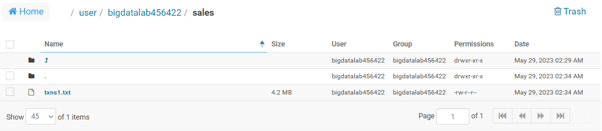
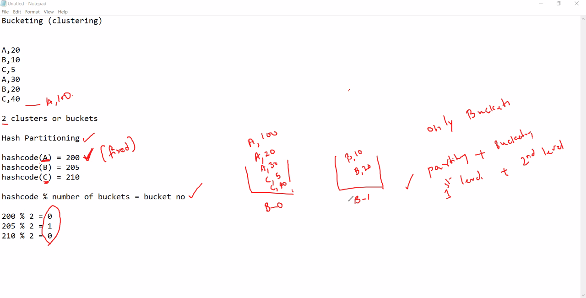
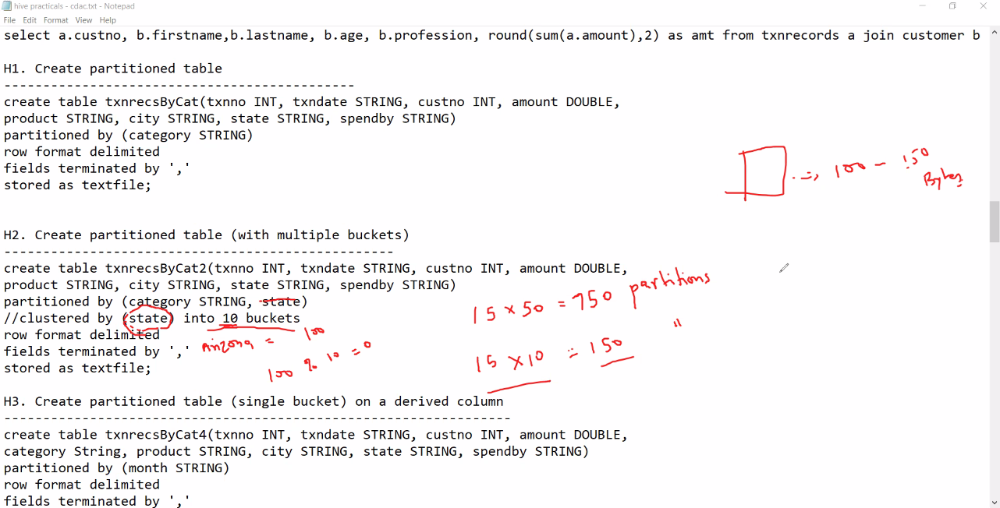
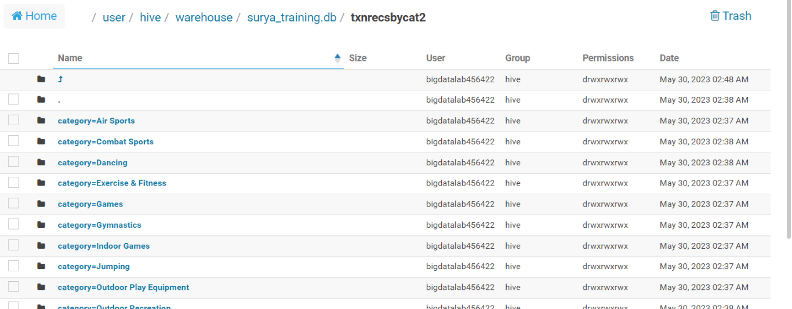
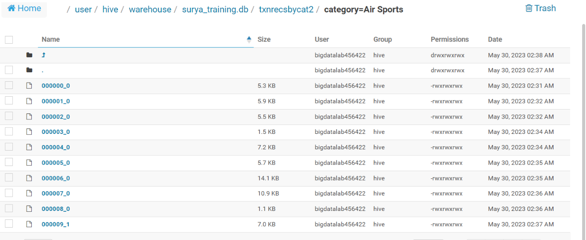
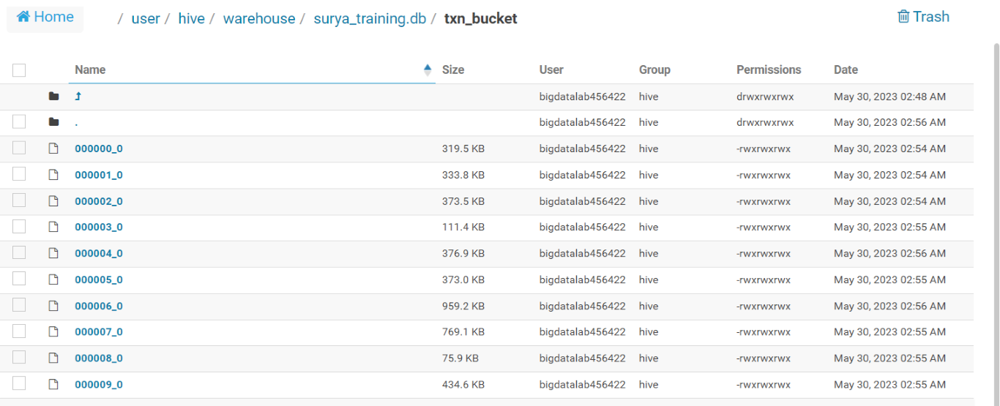
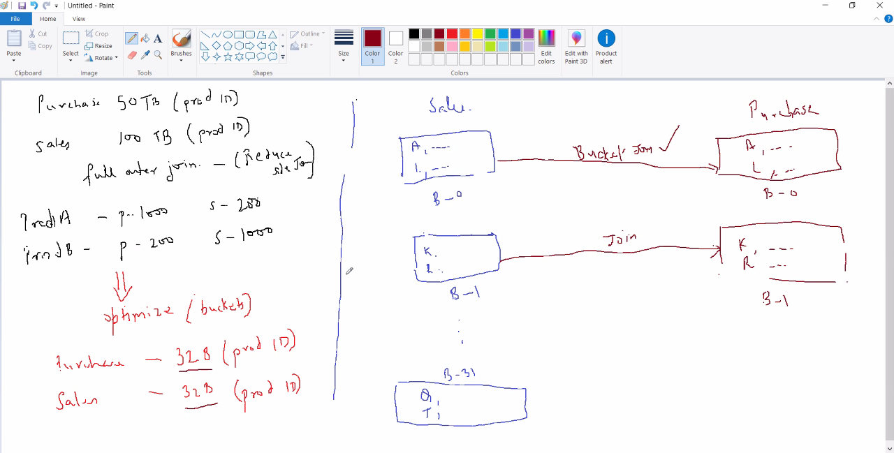

# Day 12 - BigDataTechnologies

## Customers & Transactions

- Start hive CLI using command below, it launches hive interactive shell which is Hive CLI

    ```bash
    [bigdatalab456422@ip-10-1-1-204 ~]$ hive
    ```

    ```console
    WARNING: Use "yarn jar" to launch YARN applications.
    SLF4J: Class path contains multiple SLF4J bindings.
    SLF4J: Found binding in [jar:file:/opt/cloudera/parcels/CDH-6.2.1-1.cdh6.2.1.p0.1425774/jars/log4j-slf4j-impl-2.8.2.jar!/org/slf4j/impl/StaticLoggerBinder.class]
    SLF4J: Found binding in [jar:file:/opt/cloudera/parcels/CDH-6.2.1-1.cdh6.2.1.p0.1425774/jars/slf4j-log4j12-1.7.25.jar!/org/slf4j/impl/StaticLoggerBinder.class]
    SLF4J: See http://www.slf4j.org/codes.html#multiple_bindings for an explanation.
    SLF4J: Actual binding is of type [org.apache.logging.slf4j.Log4jLoggerFactory]
    2023-05-29 09:11:50,539 main WARN JNDI lookup class is not available because this JRE does not support JNDI. JNDI string lookups will not be available, continuing configuration. Ignoring java.lang.ClassNotFoundException: org.apache.logging.log4j.core.lookup.JndiLookup

    Logging initialized using configuration in jar:file:/opt/cloudera/parcels/CDH-6.2.1-1.cdh6.2.1.p0.1425774/jars/hive-common-2.1.1-cdh6.2.1.jar!/hive-log4j2.properties Async:false

    WARNING: Hive CLI is deprecated and migration to Beeline is recommended.
    hive>
    ```

- Run command below to set Hive CLI to print current DB

    ```sql
    hive> SET hive.cli.print.current.db = true ;
    ```

- Run command below to use the `surya_training` database

    ```sql
    hive (default)> USE surya_training ;
    ```

    ```console
    OK
    Time taken: 0.029 seconds
    hive (surya_training)>
    ```

### Uploading data files using FTP

- First upload `custs.txt`, `custs_add` and `txns1.txt` files to Client/linux Filesystem

### Customer Table

- We'll create a `customer` table
- Then load data into it from `custs.txt` using `OVERWRITE`, so that if any data exists, it'll be replaced
- Then load data into it from `custs_add` without using `OVERWRITE`, so that the data is appended and previous data is not lost

#### CREATE TABLE `customer`

- Run the command below to create a table `customer`

    ```sql
    hive (surya_training)> CREATE TABLE customer(custno INT, firstname STRING, lastname STRING, age INT, profession STRING)
    ROW FORMAT DELIMITED FIELDS TERMINATED BY ',' STORED AS TEXTFILE;
    ```

    ```console
    OK
    Time taken: 0.398 seconds
    hive (surya_training)>
    ```

- Now, run a `SHOW TABLES` command to confirm `customer` table is created

    ```sql
    hive (surya_training)> SHOW TABLES ;
    ```

    ```console
    OK
    customer
    nyse
    stkvol
    Time taken: 0.197 seconds, Fetched: 3 row(s)
    hive (surya_training)>
    ```

#### Loading data into `customer` table

- Now our `customer` table is created successfully, so we can load data into this table
- Data file `custs.txt` have already been uploaded using FTP, so you can run below command to load the data from file using `LOCAL INPATH` and performing a `OVERWRITE` into the table using command below

    ```sql
    hive (surya_training)> LOAD DATA LOCAL INPATH 'custs.txt' OVERWRITE INTO TABLE customer;
    ```

    ```console
    Loading data to table surya_training.customer
    OK
    Time taken: 1.138 seconds
    hive (surya_training)>
    ```

- Now that data has been loaded, you can check for the count of records in the table `customer` using command below, and it should show 9999 records only

    ```sql
    hive (surya_training)> SELECT COUNT(*) FROM customer ;
    ```

    

### Loading more data into `customer` table

- Data file `custs_add` have already been uploaded using FTP, so you can run below command to load the data from file using `LOCAL INPATH` and **without** performing a `OVERWRITE` into the table using command below, so that data from this file is appended to the table `customer`

    ```sql
    hive (surya_training)> LOAD DATA LOCAL INPATH 'custs_add' INTO TABLE customer;
    ```

    ```console
    Loading data to table surya_training.customer
    OK
    Time taken: 0.684 seconds
    hive (surya_training)>
    ```

- Now that this file `custs_add` had only 1 record which has been loaded, you can check for the count of records in the table `customer` using command below, and it should show `10000` records only

    ```sql
    hive (surya_training)> SELECT COUNT(*) FROM customer ;
    ```

    

### Transactions Table

- We’ll create a `txnrecords` table, but we'll map it to an location (not an External table, it is still a managed table), so we'll need to put the data file `txns1.txt` in a hdfs location and then map that data file to the table while creating it

#### Moving Data files into a hdfs location

- First create a directory `sales` on hdfs using command below in client command-line

    ```bash
    [bigdatalab456422@ip-10-1-1-204 ~]$ hadoop fs -mkdir sales
    ```

    ```console
    [bigdatalab456422@ip-10-1-1-204 ~]$ 
    ```

- Once this directory is created, now use `hadoop fs -put` utility to copy the data file `txns1.txt` to the `sales` directory on hdfs using command below

    ```bash
    [bigdatalab456422@ip-10-1-1-204 ~]$ hadoop fs -put txns1.txt sales
    ```

    ```console
    [bigdatalab456422@ip-10-1-1-204 ~]$ 
    ```

- To check if data file `txns1.txt` exists in `sales` directory in hdfs, use `hadoop fs -ls` utility as below

    ```bash
    [bigdatalab456422@ip-10-1-1-204 ~]$ hadoop fs -ls sales
    ```

    ```console
    Found 1 items
    -rw-r--r--   3 bigdatalab456422 bigdatalab456422    4418144 2023-05-29 09:22 sales/txns1.txt
    [bigdatalab456422@ip-10-1-1-204 ~]$ 
    ```

- Alternatively, you can open the `Hue` tool and visit the hdfs path at `/user/bigdatalab456422/sales` to open the directory `sales` which contains data file `txns1.txt1`

    

#### CREATE TABLE `transaction`

- Now we need to create a table `txnrecords` which has data `STORED AS TEXTFILE` at a location mapped to the `sales` directory `LOCATION` on hdfs using command below in hive interactive CLI

    ```sql
    hive (surya_training)> CREATE TABLE txnrecords(txnno INT, txndate STRING, custno INT, amount DOUBLE,
    category STRING, product STRING, city STRING, state STRING, spendby STRING)
    ROW FORMAT DELIMITED FIELDS TERMINATED BY ',' STORED AS textfile
    LOCATION '/user/bigdatalab456422/sales';
    ```

    ```console
    OK
    Time taken: 0.072 seconds
    hive (surya_training)>
    ```

> This text file `txns1.txt` in hdfs directory `sales` is directly accessible in table, but is not mapped to the hive warehouse directory `/user/hive/warehouse`, instead it is mapped to the hdfs directory of `$HADOOP_PATH/sales/`, so reading all the files in this hdfs directory as table contents in this table

- Now that, table `txnrecords` is created and mapped to the data file directory, you may run the command below to list the first 10 records of `txnrecords` table

    ```sql
    hive (surya_training)> SELECT * FROM txnrecords LIMIT 10;
    ```

    ```console
    OK
    0       06-26-2011      4007024 40.33   Exercise & Fitness      Cardio Machine Accessories      Clarksville     Tennessee       credit
    1       05-26-2011      4006742 198.44  Exercise & Fitness      Weightlifting Gloves    Long Beach      California      credit
    2       06-01-2011      4009775 5.58    Exercise & Fitness      Weightlifting Machine Accessories       Anaheim California      credit
    3       06-05-2011      4002199 198.19  Gymnastics      Gymnastics Rings        Milwaukee       Wisconsin       credit
    4       12-17-2011      4002613 98.81   Team Sports     Field Hockey    Nashville       Tennessee       credit
    5       02-14-2011      4007591 193.63  Outdoor Recreation      Camping & Backpacking & Hiking  Chicago Illinois        credit
    6       10-28-2011      4002190 27.89   Puzzles Jigsaw Puzzles  Charleston      South Carolina  credit
    7       07-14-2011      4002964 96.01   Outdoor Play Equipment  Sandboxes       Columbus        Ohio    credit
    8       01-17-2011      4007361 10.44   Winter Sports   Snowmobiling    Des Moines      Iowa    credit
    9       05-17-2011      4004798 152.46  Jumping Bungee Jumping  St. Petersburg  Florida credit
    Time taken: 0.103 seconds, Fetched: 10 row(s)
    hive (surya_training)>
    ```

- You may open the Hue tool and visit the hive warehouse directory at `/user/hive/warehouse/surya_training.db` to confirm that this table is not created in hive warehouse directory, instead it is created in `$HADOOP_PATH/sales` hdfs directory where its data file is kept




#### Mapping data into `transaction` table

## Hive Optimizations

- If 1TB data takes 'x' time, so 10TB data will take '10x' time
- We can optimize the Hive database by
  1. Using ORC files to store Hive tables
  2. Creating Partitions in Tables
  3. Creating Buckets in Tables
  4. Using Columnar tables such as ORC
  5. Using inbuilt indexes

- Hive performance optimization involves several factors, from data design to query structures, to configurations.
- We can use following strategies for optimizing the Hive performance

  1. Using Suitable File formats in Hive preferably ORC format
  2. Indexing
  3. Optimizing Execution Engine
  4. Vectorization
  5. Cost Based Optimization (CBO)
  6. Compression
  7. Partitioning
  8. Bucketing

### 1. Using Suitable File formats in Hive

- Hive supports following file formats
  1. **Text File :** Simple line-based human-readable format, widely supported but inefficient in storage & performance, has no compression
  2. **RCFile (Record Columnar File) :** Hybrid format to store data in columnar layout, provides some storage & performance efficiency, provides compression, more complex to implement
  3. **ORC (Optimized Row Columnar) :** Columnar storage format designed specifically for Hive, provides fast query execution due to reduced I/O & better R/W by providing efficient execution plans, higher compression ratio, supports complex data types & schema evolution, requires more CPU resources for R/W
  4. **Parquet :** Another columnar storage format optimized for heavy Read ops (OLAP), excellent storage & performance, supports advanced features like nested data structures & schema evolution, compatible with various data processing frameworks like Spark, Impala , excellent compression ratio, slightly higher complex in setup
  5. **Avro :** Row-based storage format designed for data serialization, supports better schema evolution, good for data streaming, not much query performance optimized compared to columnar formats like ORC & Parquet

#### 1. ORC Files

- What are ORC Files?
- ORC stands for Optimized Row Columnar
- default storage for Hive data
- columnar storage specifically designed for Hive
- improves performance when hive performs R/W and processes data

##### Advantages of ORC Files

1. Compressed data, reduces data storage by over 90% thus providing higher compression ratio
2. **Inbuilt indexes :** has lightweight inbuilt index to allow faster reads
3. **ACID support:** ORC file in an ACID table supports ACID properties
4. **Efficient Compression :** stored as columns and compressed, leads to smaller disk reads, also ideal for Vectorization optimization
5. **Fast Reads :** has built in index, allows footer statistics causing entire stipes to be skipped during reads, Predicate pushdown also pushes filters so that minimal rows are read, Bloom filters further reduce the number of rows that are returned
6. **Ideal for Large-scale deployments :** Facebook uses ORC format for 300+PB deployment
7. **Columnar Storage :** stores data in columnar format, designed specifically for Hive as Apache project, so data can't be directly read like text files, it provides fast & efficient reads by skipping entire stripes
8. **Flexibility for Compression algorithm :** allows you to specify a compression algorithm for a table
9. **Larger Block :** uses larger blocks of 256MB by default'
10. **Predicate Pushdown :** it supports predicate pushdown being a columnar storage format, so queries are faster since filters are applied earlier due to Predicate Pushdown support


##### Disadvantages of ORC Files

1. Requires more CPU resources for R/W due to high compression as it is a columnar format

##### Create table stored as ORC file

- Create a table `STORED AS ORC` by running the command below

    ```sql
    hive (surya_training)> CREATE TABLE txn_orc(txnno INT, txndate STRING, custno INT, amount DOUBLE, 
    category STRING, product STRING, city STRING, state STRING, spendby STRING) 
    STORED AS ORC;
    ```

    ```console
    OK
    Time taken: 0.092 seconds
    hive (surya_training)>
    ```

##### Load data into table stored as ORC file

- Now we'll load data into this new `ORC` file hive table `txn_orc`, and for this we'll copy from `txnrecords` table which we created recently
- We'll `SELECT` records from data source table `txnrecords` and dump it using `INSERT OVERWRITE` to new `ORC` table `txn_orc` using command below

    ```sql
    hive (surya_training)> INSERT OVERWRITE TABLE txn_orc SELECT * FROM txnrecords;
    ```

    

##### Exploring around ORC file Hive Table

- Once Data is loaded into this `ORC` file Hive table `txn_orc`, you may list the first 10 records from it using command below which is same as the table `txnrecords` which has data `STORED AS TEXTFILE`

    ```sql
    hive (surya_training)> SELECT * FROM txn_orc LIMIT 10;
    ```

    ```console
    OK
    0       06-26-2011      4007024 40.33   Exercise & Fitness      Cardio Machine Accessories      Clarksville     Tennessee       credit
    1       05-26-2011      4006742 198.44  Exercise & Fitness      Weightlifting Gloves    Long Beach      California      credit
    2       06-01-2011      4009775 5.58    Exercise & Fitness      Weightlifting Machine Accessories       Anaheim California      credit
    3       06-05-2011      4002199 198.19  Gymnastics      Gymnastics Rings        Milwaukee       Wisconsin       credit
    4       12-17-2011      4002613 98.81   Team Sports     Field Hockey    Nashville       Tennessee       credit
    5       02-14-2011      4007591 193.63  Outdoor Recreation      Camping & Backpacking & Hiking  Chicago Illinois        credit
    6       10-28-2011      4002190 27.89   Puzzles Jigsaw Puzzles  Charleston      South Carolina  credit
    7       07-14-2011      4002964 96.01   Outdoor Play Equipment  Sandboxes       Columbus        Ohio    credit
    8       01-17-2011      4007361 10.44   Winter Sports   Snowmobiling    Des Moines      Iowa    credit
    9       05-17-2011      4004798 152.46  Jumping Bungee Jumping  St. Petersburg  Florida credit
    Time taken: 0.15 seconds, Fetched: 10 row(s)
    hive (surya_training)>
    ```

- You may try to use `DESC FORMATTED` information of this table `txn_orc` using command below and notice that, the SerDe Library this table uses is not the `LazySimpleSerDe`, but it is `OrcSerDe` because it uses `ORC` file format

    ```sql
    hive (surya_training)> DESC FORMATTED txn_orc ;
    ```

    ```console
    OK
    # col_name              data_type               comment

    txnno                   int
    txndate                 string
    custno                  int
    amount                  double
    category                string
    product                 string
    city                    string
    state                   string
    spendby                 string

    # Detailed Table Information
    Database:               surya_training
    OwnerType:              USER
    Owner:                  bigdatalab456422
    CreateTime:             Mon May 29 10:22:23 UTC 2023
    LastAccessTime:         UNKNOWN
    Retention:              0
    Location:               hdfs://nameservice1/user/hive/warehouse/surya_training.db/txn_orc
    Table Type:             MANAGED_TABLE
    Table Parameters:
            COLUMN_STATS_ACCURATE   {\"BASIC_STATS\":\"true\"}
            numFiles                1
            numRows                 50000
            rawDataSize             28800000
            totalSize               505976
            transient_lastDdlTime   1685355855

    # Storage Information
    SerDe Library:          org.apache.hadoop.hive.ql.io.orc.OrcSerde
    InputFormat:            org.apache.hadoop.hive.ql.io.orc.OrcInputFormat
    OutputFormat:           org.apache.hadoop.hive.ql.io.orc.OrcOutputFormat
    Compressed:             No
    Num Buckets:            -1
    Bucket Columns:         []
    Sort Columns:           []
    Storage Desc Params:
            serialization.format    1
    Time taken: 0.035 seconds, Fetched: 37 row(s)
    hive (surya_training)>
    ```

- Now you have table location from the previous command, you may try to print out the table right from the hdfs using `hdfs fs -cat` utility using command below on Hadoop CLI and you'll notice that data is not human readable because it stores data in a columnar format so data needs to be properly serialized before reading

    ```bash
    [bigdatalab456422@ip-10-1-1-204 ~]$ hadoop fs -cat /user/hive/warehouse/surya_training.db/txn_orc/* ;
    ```

    

#### 2. Parquet Files

- Apache Parquet is also another popular columnar storage file format used by Hadoop systems
- developed by Cloudera and Twitter, and now an open source Apache project
- schema metadata is embedded into the file, so it supports Schema evolution
- provides excellent storage and performance, especially for large datasets
- optimized for heavy Read operations
- has an extension `.parquet`
- default storage for Spark data
- supports multiple engines like Apache Hive, Apache Drill, Cloudera Impala, Apache Crunch, Apache Pig, Apache Spark and multiple data description like Apache Avro, Apache Thrift, Google Protocol Buffers
- Another columnar storage format optimized for heavy Read ops (OLAP), excellent storage & performance, supports advanced features like nested data structures & schema evolution, compatible with various data processing frameworks like Spark, Impala , excellent compression ratio, slightly higher complex in setup

##### Advantages of Parquet files

1. **Columnar Storage :** Parquet allows query engines to cherry-pick columns, avoiding to read entire row
2. **Schema Metadata :** Parquet contains the schema information in metadata, so query engine automatically infers schema
3. **Compression :** Parquet files being a Columnar format, provide excellent compression ratio
4. **Performance Gain :** It stores data in row-groups using columnar storage which allows for Predicate Pushdown so minimal rows are read, providing performance gain while reading data
5. **Predicate Pushdown :** It supports predicate pushdown being a columnar storage format, so queries are faster since filters are applied earlier due to Predicate Pushdown support
6. **Complex Data Types' support :** It can efficiently store complex nested data structures such as arrays, maps
7. **Interoperability :** It can work seamlessly with multiple engines like Apache Hive, Apache Drill, Cloudera Impala, Apache Crunch, Apache Pig, Apache Spark and multiple data description like Apache Avro, Apache Thrift, Google Protocol Buffers

##### Disadvantages of Parquet files

1. Parquet does not support ACID transactions
2. Deleting rows from Parquet is not easy
3. Doesn't support DML transactions
4. Expensive footer reads
5. Suitable for small datasets, but splitting large data sets into multiple parquet files isn't great in managing it
6. Parquet files are immutable, so you can't directly modify the file directly say updating a column name, dropping columns, instead you need to read the file, make changes and then rewrite the entire file, thus making it an expensive computation
7. Although schema enforcement is supported using metadata, but Parquet doesn't support check constraints

##### Create table stored as PARQUET file

- Create a table `STORED AS PARQUET;` by running the command below in Hive CLI

    ```sql
    hive (surya_training)> CREATE TABLE txn_parquet(txnno INT, txndate STRING, custno INT, amount DOUBLE, 
    category STRING, product STRING, city STRING, state STRING, spendby STRING) 
    STORED AS PARQUET;
    ```

    ```console
    OK
    Time taken: 0.095 seconds
    hive (surya_training)>
    ```

##### Load data into table stored as PARQUET file

- Now we'll load data into this new `PARQUET` file hive table `txn_parquet`, and for this we'll copy from `txnrecords` table which we created recently
- We'll `SELECT` records from data source table `txnrecords` and dump it using `INSERT OVERWRITE` to new `PARQUET` table `txn_parquet` using command below

    ```sql
    hive (surya_training)> INSERT OVERWRITE TABLE txn_parquet SELECT * FROM txnrecords;
    ```

    

##### Exploring around PARQUET file Hive Table

- Once Data is loaded into this `PARQUET` file Hive table `txn_parquet`, you may list the first 10 records from it using command below which is same as the table `txnrecords` which has data `STORED AS TEXTFILE`

    ```sql
    hive (surya_training)> SELECT * FROM txn_parquet LIMIT 10;
    ```

    

- You may try to use `DESC FORMATTED` information of this table `txn_parquet` using command below and notice that, the SerDe Library this table uses is not the `LazySimpleSerDe`, but it is `ParquetHiveSerDe` because it uses `PARQUET` file format

    ```sql
    hive (surya_training)> DESC FORMATTED txn_parquet ;
    ```

    ```console
    OK
    # col_name              data_type               comment

    txnno                   int
    txndate                 string
    custno                  int
    amount                  double
    category                string
    product                 string
    city                    string
    state                   string
    spendby                 string

    # Detailed Table Information
    Database:               surya_training
    OwnerType:              USER
    Owner:                  bigdatalab456422
    CreateTime:             Mon May 29 17:25:50 UTC 2023
    LastAccessTime:         UNKNOWN
    Retention:              0
    Location:               hdfs://nameservice1/user/hive/warehouse/surya_training.db/txn_parquet
    Table Type:             MANAGED_TABLE
    Table Parameters:
            COLUMN_STATS_ACCURATE   {\"BASIC_STATS\":\"true\"}
            numFiles                1
            numRows                 50000
            rawDataSize             450000
            totalSize               787768
            transient_lastDdlTime   1685381694

    # Storage Information
    SerDe Library:          org.apache.hadoop.hive.ql.io.parquet.serde.ParquetHiveSerDe
    InputFormat:            org.apache.hadoop.hive.ql.io.parquet.MapredParquetInputFormat
    OutputFormat:           org.apache.hadoop.hive.ql.io.parquet.MapredParquetOutputFormat
    Compressed:             No
    Num Buckets:            -1
    Bucket Columns:         []
    Sort Columns:           []
    Storage Desc Params:
            serialization.format    1
    Time taken: 0.024 seconds, Fetched: 37 row(s)
    hive (surya_training)>
    ```

- Now you have table location for `txn_parquet` table from the previous command, you may try to print out the table right from the hdfs using `hdfs fs -cat` utility using command below on Hadoop CLI and you'll notice that data is not human readable because Parquet also stores data in a columnar format so data needs to be properly serialized before reading

    ```bash
    [bigdatalab456422@ip-10-1-1-204 ~]$ hadoop fs -cat /user/hive/warehouse/surya_training.db/txn_parquet/* ;
    ```

    

#### 3. Avro

- First released in 2009, developed within Apache Hadoop's architecture by Doug Cutting
- uses JSON to define data types and schemas
- uses row-based storage
- trades compression efficiency to provide condensed binary format to reduce data storage needs compared to ORC and Parquet
- supports 100% schema enforcement with schema & data stored in same file or message
- language-neutral data serialization system

> Avro is not really a file format, it’s a file format plus a serialization and de-serialization framework with regular old sequence files you can store complex objects but you have to manage the process

##### Advantages of Avro Files

1. **Schema Evolution :** offers highly developed options for schema evolution as they change over time, accommodating changes like missing, added or changed fields
2. **Schema Enforcement :** supports 100% schema enforcement with schema & data stored in same file or message
3. **Row-based storage :** Row-based storage makes it a better choice when all the fields need to be accessed
4. **Data Serialization :** better option for data streaming where data needs to be serialized to share across different system due to its row-based storage
5. **Language Independent :** uses a binary encoding for serialized data, ensuring storage and data transmission regardless of programming language used
6. **Fast Serialization:** it depends heavily on its schema, allows data to be written with no prior knowledge of the schema, so it serializes fast and the resulting serialized data is lesser in size

##### Disadvantages of Avro Files

1. not much query performance optimized as compared to ORC and Parquet
2. does not support to skip data like ORC and Parquet due to its Row-based storage, so entire data needs to be read

##### Create table stored as AVRO file

- Create a table `STORED AS AVRO` by running the command below

    ```sql
    hive (surya_training)> CREATE TABLE txn_avro(txnno INT, txndate STRING, custno INT, amount DOUBLE, 
    category STRING, product STRING, city STRING, state STRING, spendby STRING) 
    STORED AS AVRO;
    ```

    ```console
    OK
    Time taken: 0.066 seconds
    hive (surya_training)>
    ```

##### Load data into table stored as AVRO file

- Now we'll load data into this new `AVRO` file hive table `txn_avro`, and for this we'll copy from `txnrecords` table which we created recently
- We'll `SELECT` records from data source table `txnrecords` and dump it using `INSERT OVERWRITE` to new `AVRO` table `txn_avro` using command below

    ```sql
    hive (surya_training)> INSERT OVERWRITE TABLE txn_avro SELECT * FROM txnrecords;
    ```

    ```console
    Query ID = bigdatalab456422_20230529102351_375da077-bc1a-44d7-abd9-eaadab2a8f92
    Total jobs = 3
    Launching Job 1 out of 3
    Number of reduce tasks is set to 0 since there's no reduce operator
    Job running in-process (local Hadoop)
    2023-05-29 10:23:52,856 Stage-1 map = 100%,  reduce = 0%
    Ended Job = job_local530631128_0004
    Stage-4 is selected by condition resolver.
    Stage-3 is filtered out by condition resolver.
    Stage-5 is filtered out by condition resolver.
    Moving data to: hdfs://nameservice1/user/hive/warehouse/surya_training.db/txn_avro/.hive-staging_hive_2023-05-29_10-23-51_514_7229980198089780719-1/-ext-10000
    Loading data to table surya_training.txn_avro
    Table surya_training.txn_avro stats: [numFiles=1, numRows=50000, totalSize=4416287, rawDataSize=0]
    MapReduce Jobs Launched:
    Stage-Stage-1:  HDFS Read: 19731399 HDFS Write: 10126259 SUCCESS
    Total MapReduce CPU Time Spent: 0 msec
    OK
    Time taken: 1.429 seconds
    hive (surya_training)>
    ```

##### Exploring around AVRO file Hive Table

- Once Data is loaded into this `AVRO` file Hive table `txn_avro`, you may list the first 10 records from it using command below which is same as the table `txnrecords` which has data `STORED AS TEXTFILE`

    ```sql
    hive (surya_training)> SELECT * FROM txn_avro LIMIT 10;
    ```

    ```console
    OK
    0       06-26-2011      4007024 40.33   Exercise & Fitness      Cardio Machine Accessories      Clarksville     Tennessee       credit
    1       05-26-2011      4006742 198.44  Exercise & Fitness      Weightlifting Gloves    Long Beach      California      credit
    2       06-01-2011      4009775 5.58    Exercise & Fitness      Weightlifting Machine Accessories       Anaheim California      credit
    3       06-05-2011      4002199 198.19  Gymnastics      Gymnastics Rings        Milwaukee       Wisconsin       credit
    4       12-17-2011      4002613 98.81   Team Sports     Field Hockey    Nashville       Tennessee       credit
    5       02-14-2011      4007591 193.63  Outdoor Recreation      Camping & Backpacking & Hiking  Chicago Illinois        credit
    6       10-28-2011      4002190 27.89   Puzzles Jigsaw Puzzles  Charleston      South Carolina  credit
    7       07-14-2011      4002964 96.01   Outdoor Play Equipment  Sandboxes       Columbus        Ohio    credit
    8       01-17-2011      4007361 10.44   Winter Sports   Snowmobiling    Des Moines      Iowa    credit
    9       05-17-2011      4004798 152.46  Jumping Bungee Jumping  St. Petersburg  Florida credit
    Time taken: 0.048 seconds, Fetched: 10 row(s)
    hive (surya_training)>
    ```

- You may try to use `DESC FORMATTED` information of this table `txn_avro` using command below and notice that, the SerDe Library this table uses is not the `LazySimpleSerDe`, but it is `AvroSerDe` because it uses `AVRO` file format

    ```sql
    hive (surya_training)> DESC FORMATTED txn_avro ;
    ```

    ```console
    OK
    # col_name              data_type               comment

    txnno                   int
    txndate                 string
    custno                  int
    amount                  double
    category                string
    product                 string
    city                    string
    state                   string
    spendby                 string

    # Detailed Table Information
    Database:               surya_training
    OwnerType:              USER
    Owner:                  bigdatalab456422
    CreateTime:             Mon May 29 10:22:23 UTC 2023
    LastAccessTime:         UNKNOWN
    Retention:              0
    Location:               hdfs://nameservice1/user/hive/warehouse/surya_training.db/txn_avro
    Table Type:             MANAGED_TABLE
    Table Parameters:
            COLUMN_STATS_ACCURATE   {\"BASIC_STATS\":\"true\"}
            numFiles                1
            numRows                 50000
            rawDataSize             0
            totalSize               4416287
            transient_lastDdlTime   1727631453

    # Storage Information
    SerDe Library:          org.apache.hadoop.hive.serde2.avro.AvroSerDe
    InputFormat:            org.apache.hadoop.hive.ql.io.avro.AvroContainerInputFormat
    OutputFormat:           org.apache.hadoop.hive.ql.io.avro.AvroContainerOutputFormat
    Compressed:             No
    Num Buckets:            -1
    Bucket Columns:         []
    Sort Columns:           []
    Storage Desc Params:
            serialization.format    1
    Time taken: 0.027 seconds, Fetched: 37 row(s)
    hive (surya_training)>
    ```

- Now you have table location from the previous command, you may try to print out the table right from the hdfs using `hdfs fs -cat` utility using command below on Hadoop CLI and you'll notice that data is not human readable because it stores data in a binary format so data needs to be properly serialized before reading, notice that in the starting lines it shows the schema information that might be vaguely readable due to row-based binary storage

    ```bash
    [bigdatalab456422@ip-10-1-1-204 ~]$ hadoop fs -cat /user/hive/warehouse/surya_training.db/txn_avro/* ;
    ```

    ```console
    Objavro.schema� {"type":"record","name":"txn_avro","namespace":"surya_training","fields":[{"name":"txnno","type":["null","int"],"default":null},{"name":"txndate","type":["null","string"],"default":null},{"name":"custno","type":["null","int"],"default":null},{"name":"amount","type":["null","double"],"default":null},{"name":"category","type":["null","string"],"default":null},{"name":"product","type":["null","string"],"default":null},{"name":"city","type":["null","string"],"default":null},{"name":"state","type":["null","string"],"default":null},{"name":"spendby","type":["null","string"],"default":null}]}���&u��!�D�*����06-26-2011��
    ףp=*D@$Exercise & Fitness4Cardio Machine AccessoriesClarksvilleTennessee
                                                                            credit05-26-2011����G�z�h@$Exercise & Fitness(Weightlifting GlovesLong BeachCalifornia
                                                                                                                                                                credit06-01-2011޼�R���Q@$Exercise & FitnessBWeightlifting Machine AccessoriesAnaheimCalifornia
                                                                    credit06-05-2011����G�z�h@Gymnastics Gymnastics RingsMilwaukeeWisconsin
                                                                                                                                        credi12-17-2011����p=
    ׳X@Team SportsField HockeyNashville  Tennessee
                                                credit
    02-14-2011�\���(4h@$Outdoor Recreation<Camping & Backpacking & HikingChicagoIllinois
                                                                                        credit
                                                                                            10-28-2011����p=
    ```

### 2. Indexing

- One of the best Hive optimization
- involves creation of an auxillary table called Index table acting as a reference for an original Hive table, facilitating quicker query performance
- If queries frequently involve one particular column, creating index on this column would enhance query performance
  - When you create index for a column, Hive will use index table to map this column values to the corresponding HDFS locations where the complete record is stored
  - During query that filters/sorts on that index column, hive can quickly locate the records using index instead of reading entire table
- beneficial for columns frequently referenced in `WHERE` clauses
- Although Indexing makes execution faster but hive has limited indexing capabilities due to
  1. **Performance Overhead :** Maintaining indexes adds some overhead during the data insertion and updates, not suggested to use indexes for hive warehouses on a transactional use-case
  2. **No Automatic Indexing :** You need to explicitly create and manage indexes in hive warehouse
- You may create an index using the following syntax

    ```sql
    CREATE INDEX index_name
    ON TABLE table_name (column_name)
    AS 'COMPACT'
    WITH DEFERRED REBUILD ;
    ```

- You may rebuild this index using syntax below

    ```sql
    ALTER INDEX index_name
    ON table_name REBUILD ;
    ```

### 3. Optimizing Execution Engine

- Execution engine is used to communicate with Hadoop daemons such as NameNode, DataNodes and job tracker to execute the Hive query on top of Hadoop file system
- executes the execution plan created by the compiler

#### Types of Execution Engines in Hive

- Hive queries can run using three execution engines
  1. MapReduce
  2. Tex
  3. Spark
- In Hive v1.x (prior to Hive v2.0.0), the default execution engine in hive was `MapReduce (MR)`, which was replaced in Hive v2.0+ with `Apache Tez`
- For Hive workloads, We can choose Apache Tez to optimize the execution engine by using the command below

    ```sql
    SET hive.execution.engine = tez ;
    ```

- If you need to change execution engine for all Hive queries, you need to override the `hive.execution.engine` property in `hive-site.xml`

1. **MapReduce (MR) Execution Engine**
    - You may want to avoid using traditional MapReduce due to its performance being too slow than other execution engines
    - If execution engine is set to `mr`, query will be submitted as MapReduce jobs
    - A number of Mappers and Reducers will be assigned and it will run in a traditional distributed way

        ```sql
        SET hive.execution.engine = mr ;
        ```

2. **Tez Execution Engine**
    - If you're primarily using Hive or have an ETL workload, and want to improve performance for HQL queries, use Tez Execution Engine
    - If execution engine is set to `tez`, query will be submitted as Tez job
    - Apache Tez is an application framework that is purposefully built on top of Hadoop YARN
    - is an alternate of the traditional MapReduce design in Hadoop
    - used to build high performance batch & interactive data processing applications
    - improves query performance by using the expressions of Directed Acyclic Graphs (DAGs) and data transfer primitives
    - instead of creating separate jobs for each stage in MapReduce, Apache Tez creates a Single job for all the tasks represented in a DAG
    - Tez framework is for purpose-built tools such as Hive
    - Tez containers can shut down when finished to save resources

        ```sql
        SET hive.execution.engine = tez ;
        ```

    - If Low-Latency Analytical Processing (LLAP) is supported for Hive queries, Apache Tez provides the following execution modes:
      1. **Container Mode :** Every time you run a Hive query, Tez requests a container from YARN
      2. **LLAP Mode :** Every time you run a Hive query, Tez asks the LLAP daemon for a free thread, and starts running a fragment

3. **Spark Execution Engine**
    - If execution engine is set to `spark`, query will be submitted as Spark job
    - Spark Execution Engine is faster for running Hive queries but has some resource management drawbacks
    - used for large scale data processing, used by mainstream developers
    - Spark's containers hog resources even when not processing

        ```sql
        SET hive.execution.engine = spark ;
        ```

### 4. Vectorization/Parallel Execution

- Vectorization was introduced in Hive v0.13
- To improve the performance of operations such as reads, aggregations, filters & joins, we use Vectorized Query Execution
- It happens by performing operations in a batch of 1024 rows at once, instead of single row each time
- can significantly improve query execution time
- You can enable Vectorization using two parameter to help in better parallel execution

    ```sql
    SET hive.vectorized.execution = true ;
    SET hive.vectorized.execution.enabled = true ;
    SET hive.vectorized.execution.reduce.groupby.enabled = true ;
    ```

> Note that, Parallel execution increases cluster utilization, and if cluster utilization is already high then parallel execution can't help much to improve performance

### 5. Cost Based Optimization (CBO)

- It enhances query performance by making intelligent decisions based on the cost of different execution plans, and then selecting the execution plan with the lowest estimated cost
- Cost-based optimization means that before submitting for final execution, Hive optimizes each Query's logical and physical execution plan
- This results in potentially different decisions like, how to order joins, the degree of parallelism and others
- Until the rise of Cost-Based Optimizer, hive used  the hard-coded query plans to execute a single query, but CBO lets hive optimize the query plan on the metadata/statistics gathered
- CBO provides two types of optimizations
  1. Logical Optimizations
      - Projection Pruning
      - Deducing Transitive Predicates
      - Predicate Pushdown
      - Merging of SELECTs and Filters into a single operator
      - Multi-way Joins
      - Query rewrite to accommodate for Join skew on some column values
  2. Physical Optimizations
      - Partition Pruning
      - Scan pruning based on partitions and buckets
      - Scan pruning if a query is based on sampling
      - Apply GROUP BY on the Map-side in some cases
      - Optimize the UNION so that union can be performed on the Map-side only
      - Decide which table to stream last, based on user hint, in a multi-way join
      - Remove unnecessary reduce sink operators
      - For queries with LIMIT clause, reduce the number of files that needs to be scanned for the table
- CBO relies on the metadata/statistics about the data such as row count, data distribution, etc., which can be collected using the command
- To enable Cost-based Optimization (CBO), you need to set the following parameters at the beginning of your query

    ```sql
    SET hive.cbo.enable = true ;                  # enables CBO
    SET hive.stats.autogather = true ;            # recommended & optional, allows hive to automatically gather statistics
    SET hive.compute.query.using.stats = true ;   # recommended & optional, allows CBO to use statistics
    SET hive.stats.fetch.column.stats = true ;    # optional, allows CBO to fetch & use column statistics
    SET hive.stats.fetch.partition.stats = true ; # optional, allows CBO to fetch & use partition statistics
    ```

    and then prepare the data for CBO by running Hive's `analyze` command to collect various statistics on the tables for which we want to use CBO
- Alternatively, if you want to enable CBO for all queries, you may enable using the `hive.cbo.enable` property in `hive-site.xml` file
- Hive can automatically gether statistics if `hive.stats.autogather` property is set to true or those can be calculated using the `ANALYZE` command

> If there are frequent DML operations (Insert, Update, Delete), then only enabling CBO might be helpful and statistics computation might prove to be a performance overhead, as statistics become obsolete leading to poor query execution plans

### 6. Partitioning

```text
Creating a partition table

00000000,06-26-2011,4007024,040.33,Exercise & Fitness,Cardio Machine Accessories,Clarksville,Tennessee,credit
00000001,05-26-2011,4006742,198.44,Exercise & Fitness,Weightlifting Gloves,Long Beach,California,credit
00000002,06-01-2011,4009775,005.58,Exercise & Fitness,Weightlifting Machine Accessories,Anaheim,California,credit
00000003,06-05-2011,4002199,198.19,Gymnastics,Gymnastics Rings,Milwaukee,Wisconsin,credit
00000004,12-17-2011,4002613,098.81,Team Sports,Field Hockey,Nashville  ,Tennessee,credit
00000005,02-14-2011,4007591,193.63,Outdoor Recreation,Camping & Backpacking & Hiking,Chicago,Illinois,credit
00000006,10-28-2011,4002190,027.89,Puzzles,Jigsaw Puzzles,Charleston,South Carolina,credit
00000007,07-14-2011,4002964,096.01,Outdoor Play Equipment,Sandboxes,Columbus,Ohio,credit

data = 1 TB
blocks = 8192
```

```sql
SELECT SUM(amount) FROM txnrecords WHERE category = 'Exercise & Fitness';
```

```text
8000 mappers, containers, RAM

actual data = 10%
```

```sql
SELECT SUM(amount) FROM txnrecords WHERE category = 'Team Sports';
```

```text
8000 mappers

actual data = 5%
```

```sql
SELECT SUM(amount) FROM txnrecords WHERE category = 'Gym';
```

```text
define a new partitioned table txnrecsbycat - partition col - category
```

```sql
SELECT SUM(amount) FROM txnrecsbycat WHERE category = 'Exercise & Fitness';
```

```text
800 blocks, 800 mappers
```


- In the above example, normal tables in hive might have huge records, and filtering through those will need huge resources/more number of mappers/containers/RAM, but if we partition the table for the column(s) which is/are frequently filtered, we can save in resources & make filtering efficient

- Hive partitioning is a partitioning strategy used to improve the query performance & manageability of large datasets by splitting a table into smaller multiple files based on partition keys which are values of a specific column
- The file splits are organized into folders & within each of those folder, the **partition key** has a value that is determined by the name of the folder
- When you create a partitioned table in Hive, you define one or more columns as partition keys
- Partition column(s) are not defined in the column list of the table, so we define partition column(s) separately using  `PARTITIONED BY` clause as below syntax

```sql
CREATE TABLE table1(col1 dt1, col2 dt2, ...)
PARTITIONED  BY (partition1col dt, partition2col dt, ...) ;
```

- And in insert statements, Partition column(s) are mentioned in the start using `PARTITION()` to define the partition column optionally with possible values in partition column(s), then table values using `VALUES` keyword to specify values of table columns first & values of partition column(s) at end for each record as shown in syntax below

```sql
INSERT INTO TABLE table1
PARTITION(partition1='partition1_Val', partition2='partition2_Val', ...)
VALUES(col1_Val, col2_Val, ..., ) ;
```

#### Types of Partitioning

- Partitioning is basically of two types
  1. Static Partitioning
      - used when we have information about the partitions of data we're going to load
      - preferred when loading data in a table from large files
      - needs to be performed in strict mode, means user has to specify at least one partition key, by setting `hive.mapred.mode` property using command below

        ```sql
        SET hive.mapred.mode = strict ;
        ```

  2. Dynamic Partitioning
      - used when we don't have any knowledge about the partitions of the data we're going to load
      - takes more time to load data into the table
      - To enable dynamic partition, we need to set `hive.exec.dynamic.partition` property using the command below

        ```sql
        SET hive.exec.dynamic.partition = true ;
        ```

      - There are two modes of dynamic partitioning
        1. `strict` : requires at least one partition key/column to be static while loading data
        2. `nonstrict` : allows to have dynamic partitioning without requiring to specify at least one partition key/column, this can be set by updating the `hive.exec.dynamic.partition.mode` property to `nonstrict` value using command below

            ```sql
            SET hive.exec.dynamic.partition.mode = nonstrict ;
            ```

      - Here are some of other optional properties in hive which can be configured while using dynamic partitioning for better control

        ```sql
        SET hive.exec.max.dynamic.partitions.pernode = 100 ; # sets the maximum dynamic partitions per mapper/reducer node
        SET hive.exec.max.dynamic.partitions = 1000 ; # sets the maximum total dynamic partitions allowed to be created in total
        SET hive.exec.max.created.files = 100000 ; # set the maximum number of files that can be created by all mappers/reducers in a MapReduce job
        SET hive.error.on.empty.partition = false ; # Set to false to avoid throwing a error on empty partition during dynamic partition
        ```

#### Advantages of Partitioning

1. **Faster Query Performance :** reduces read time by allowing queries to skip irrelevant partitions
2. **Scalability :** helps in managing  large datasets more efficiently
3. **Improved Resource Utilization :** Makes better use of system resources during query execution

#### Disadvantages of partitioning

1. Creating too many partitions may not prove beneficial as it would need to read as many folders as there are keys in the partitioned column
2. It might increase complexity in data management & querying, especially with many partitions
3. If partitions are too small, such as partitions for daily data, may lead to small files problem, so creating partitions in such cases would not be beneficial

> Use partitioning where partition key column can take only a few values, count of values that partition key(s) should not be more as it would put read overhead for those many partitions

#### Best Practices for Partitioning

1. Never partition on a Unique ID column or any other column with high cardinality
2. Size partitions to greater than or equal to 1 GB on average, Consider that each partition should have enough data to be beneficial so that small file problem can be avoided
3. Design queries to process not more than 1000 partitions, Limit the Number of partitions as too many partitions can lead to performance overhead
4. Select only those columns as partition keys which will effectively filter the data and are used frequently to filter data, otherwise it you would lose the purpose of partitioning
5. While creating partitions, do not use a partition name which has invalid characters `:`, `?` or `%`, since directories will be named using the URL encoding of these characters

#### 1. Partition table by a single column

- We'll create a table `PARTITIONED BY` column `category`, and then load data into it using `DISTRIBUTE BY` over column `category` to create multiple partitions for each of the category values, so that it becomes faster for hive to filter records by column `category`
- After creating the table, we'll load the data into it from `txnrecords` which we created earlier using the `DISTRIBUTE BY` clause specifying the `category` column

##### CREATE TABLE `txnrecsByCat` `PARTITIONED BY` single column

- Create a table `PARTITIONED BY` column `category` using the command below
- H1. Create partitioned table

    ```sql
    hive (surya_training)> CREATE TABLE txnrecsByCat(txnno INT, txndate STRING, custno INT, amount DOUBLE, 
    product STRING, city STRING, state STRING, spendby STRING) 
    PARTITIONED BY (category STRING) 
    ROW FORMAT DELIMITED FIELDS TERMINATED BY ',' STORED AS TEXTFILE ;
    ```

    ```console
    OK
    Time taken: 0.131 seconds
    hive (surya_training)>
    ```

> Note that the partition key column `category` is passed to `PARTITIONED BY (category STRING)` instead of using mentioning it with other columns of table

- Once `txnrecsByCat` table is created, you may use `DESC` command on it using command below, notice that it shows the columns on which partitions will be created

    ```sql
    hive (surya_training)> DESC txnrecsByCat ;
    ```

    ```console
    OK
    txnno                   int
    txndate                 string
    custno                  int
    amount                  double
    product                 string
    city                    string
    state                   string
    spendby                 string
    category                string

    # Partition Information
    # col_name              data_type               comment

    category                string
    Time taken: 0.113 seconds, Fetched: 14 row(s)
    hive (surya_training)>
    ```

- You've just created partitioned table, now you'll need to set dynamic partitioning mode to `nonstrict` to allow hive to insert data without requiring at least one partition key to be specified & enable dynamic partitioning using commands below, which might not be set by default

    ```sql
    hive (surya_training)> SET hive.exec.dynamic.partition = true ; # enable dynamic partitioning
    ```

    ```sql
    hive (surya_training)> SET hive.exec.dynamic.partition.mode = nonstrict ; # allow hive to insert data without requiring at least one partition key to be specified
    ```

##### Loading data into `txnrecsByCat` table `DISTRIBUTE BY` single column `category`

- Load data into table `txnrecsByCat` using `INSERT OVERWRITE` to rewrite any exiting data, `PARTITION(category)` to specify the partition column, `DISTRIBUTE BY category` clause to indicate how data will be distributed across different reducers, use the command below
- I1. Load data into partition table (single bucket)

    ```sql
    hive (surya_training)> INSERT OVERWRITE TABLE txnrecsByCat
    PARTITION(category) 
    SELECT txn.txnno, txn.txndate,txn.custno, txn.amount,txn.product,txn.city,txn.state, txn.spendby, txn.category
    FROM txnrecords txn 
    DISTRIBUTE BY category ;
    ```

    ```console
    hive (surya_training)> INSERT OVERWRITE TABLE txnrecsByCat PARTITION (category)
                        > 
                        > SELECT txn.txnno, txn.txndate,txn.custno, txn.amount,txn.product,txn.city,txn.state, txn.spendby, txn.category FROM txnrecords txn DISTRIBUTE BY category;
    Query ID = bigdatalab456422_20230529114258_e47ccbe0-cc5e-4634-a79b-8b6851f076bc
    Total jobs = 1
    Launching Job 1 out of 1
    Number of reduce tasks not specified. Estimated from input data size: 1
    In order to change the average load for a reducer (in bytes):
    set hive.exec.reducers.bytes.per.reducer <number>
    In order to limit the maximum number of reducers:
    set hive.exec.reducers.max=<number>
    In order to set a constant number of reducers:
    set mapreduce.job.reduces <number>
    23/05/29 11:42:59 INFO client.RMProxy: Connecting to ResourceManager at ip-10-1-1-204.ap-south-1.compute.internal/10.1.1.204:8032
    23/05/29 11:42:59 INFO client.RMProxy: Connecting to ResourceManager at ip-10-1-1-204.ap-south-1.compute.internal/10.1.1.204:8032
    Starting Job = job_1684866872278_3571, Tracking URL = http://ip-10-1-1-204.ap-south-1.compute.internal:6066/proxy/application_1684866872278_3571/
    Kill Command = /opt/cloudera/parcels/CDH-6.2.1-1.cdh6.2.1.p0.1425774/lib/hadoop/bin/hadoop job  -kill job_1684866872278_3571
    Hadoop job information for Stage-1: number of mappers: 1; number of reducers: 1
    2023-05-29 11:43:20,267 Stage-1 map = 0%,  reduce = 0%
    2023-05-29 11:43:31,564 Stage-1 map = 100%,  reduce = 0%, Cumulative CPU 4.19 sec
    2023-05-29 11:43:40,803 Stage-1 map = 100%,  reduce = 100%, Cumulative CPU 9.57 sec
    MapReduce Total cumulative CPU time: 9 seconds 570 msec
    Ended Job = job_1684866872278_3571
    Loading data to table surya_training.txnrecsbycat partition (category=null)

            Time taken to load dynamic partitions: 0.41 seconds
            Time taken for adding to write entity : 0.004 seconds
    MapReduce Jobs Launched:
    Stage-Stage-1: Map: 1  Reduce: 1   Cumulative CPU: 9.57 sec   HDFS Read: 4428810 HDFS Write: 3500532 HDFS EC Read: O SUCCESS
    Total MapReduce CPU Time Spent: 9 seconds 570 msec
    OK Time taken: 44.713 seconds
    hive (surya_training)>
    ```

- You may open `Hue` tool and visit the hdfs path at `/user/hive/warehouse/surya_training.db/txnrecsbycat` to open the table and see the different folders created for each of the partition created from previous command

    

  - Now open the folder for `category=Air Sports` partition to see the file which has records with `category=Air Sports`

    

#### 2. Partition table by two columns

- We'll create a table `PARTITIONED BY` columns `category` & `spendby`, and then load data into it using `DISTRIBUTE BY` over these two columns `category` & `spendby` to create multiple partitions for each of the category values and inside each of them, it'll have partitions for spendby values, so that it becomes faster for hive to filter records by column `category` and then by column `spendby`
- After creating the table, we'll load the data into it from `txnrecords` which we created earlier using the `DISTRIBUTE BY` clause specifying the `category` & `spendby` columns

##### CREATE TABLE `txnrecsByCat3` `PARTITIONED BY` two columns `category` & `spendby`

- Create a table `PARTITIONED BY` columns `category` & `spendby` using the command below
- H3. Create partitioned table (single bucket) on a derived column

    ```sql
    hive (surya_training)> CREATE TABLE txnrecsByCat3(txnno INT, txndate STRING, custno INT, amount DOUBLE, 
    product STRING, city STRING, state STRING) 
    PARTITIONED BY (category STRING,spendby STRING) 
    ROW FORMAT DELIMITED FIELDS TERMINATED BY ',' STORED AS TEXTFILE ;
    ```

    ```console
    OK
    Time taken: 0.081 seconds
    hive (surya_training)>
    ```

- Once `txnrecsByCat3` table is created, you may use `DESC` command on it using command below, notice that it shows two columns in an order on which partitions will be created

    ```sql
    hive (surya_training)> DESC txnrecsByCat3 ;
    ```

    ```console
    OK
    txnno                   int
    txndate                 string
    custno                  int
    amount                  double
    product                 string
    city                    string
    state                   string
    category                string
    spendby                 string

    # Partition Information
    # col_name              data_type               comment

    category                string
    spendby                 string
    Time taken: 0.033 seconds, Fetched: 15 row(s)
    hive (surya_training)>
    ```

- You've just created partitioned table, you'll NEITHER need to set dynamic partitioning mode to `nonstrict` NOR enable dynamic partitioning since we've done that after creating `txnrecsByCat` table earlier

##### Loading data into `txnrecsByCat3` table `DISTRIBUTE BY` two columns `category` & `spendby;`

- Load data into table `txnrecsByCat` using `INSERT OVERWRITE` to rewrite any exiting data, `PARTITION(category)` to specify the partition column, `DISTRIBUTE BY category` clause to indicate how data will be distributed across different reducers, use the command below
- I1. Load data into partition table (single bucket)

    ```sql
    hive (surya_training)> FROM txnrecords txn 
    INSERT OVERWRITE TABLE txnrecsByCat3 
    PARTITION(category,spendby) 
    SELECT txn.txnno, txn.txndate,txn.custno, txn.amount,txn.product,txn.city,txn.state, txn.category, txn.spendby 
    DISTRIBUTE BY category,spendby ;
    ```

    ```console
    hive (surya_training)> FROM txnrecords txn INSERT OVERWRITE TABLE txnrecsByCat3 PARTITION (category, spendby)
                        >
                        > SELECT txn.txnno, txn.txndate,txn.custno, txn.amount,txn.product, txn.city,txn.state, txn.category, txn.spendby DISTRIBUTE BY category, spendby;
    Query ID = bigdatalab456422_20230529120218_ae66b8ab-30b2-4cbd-9240-c67fe1080a73
    Total jobs = 1
    Launching Job 1 out of 1
    Number of reduce tasks not specified. Estimated from input data size: 1
    In order to change the average load for a reducer (in bytes):
    set hive.exec.reducers.bytes.per.reducer=<number>
    In order to limit the maximum number of reducers:
    set hive.exec.reducers.max=<number>
    In order to set a constant number of reducers:
    set mapreduce.job.reduces=<number>
    23/05/29 12:02:19 INFO client.RMProxy: Connecting to ResourceManager at ip-10-1-1-204.ap-south-1.compute.internal/10.1.1.204:8032
    23/05/29 12:02:19 INFO client.RMProxy: Connecting to ResourceManager at ip-10-1-1-204.ap-south-1.compute.internal/10.1.1.204:8032
    Starting Job = job_1684866872278_3613, Tracking URL = http://ip-10-1-1-204.ap-south-1.compute.internal:6066/proxy/application_1684866872278_3613/
    Kill Command = /opt/cloudera/parcels/CDH-6.2.1-1.cdh6.2.1.p0.1425774/lib/hadoop/bin/hadoop job  -kill job_1684866872278_3613
    Hadoop job information for Stage-1: number of mappers: 1; number of reducers: 1
    2023-05-29 12:02:30,497 Stage-1 map = 0%,  reduce = 0%
    2023-05-29 12:02:38,848 Stage-1 map = 100%,  reduce = 0%, Cumulative CPU 3.31 sec
    2023-05-29 12:02:48,084 Stage-1 map = 100%,  reduce = 100%, Cumulative CPU 10.32 sec
    MapReduce Total cumulative CPU time: 10 seconds 320 msec
    Ended Job = job_1684866872278_3613
    Loading data to table surya_training.txnrecsbycat3 partition (category=null, spendby=null)

    chmod: File hdfs://nameservice1/user/hive/warehouse/surya_training.db/txnrecsbycat3/category=Jumping/spendby=cash does not exist.
    chmod: File hdfs://nameservice1/user/hive/warehouse/surya_training.db/txnrecsbycat3/category=Racquet Sports/spendby=credit does not exist.
    chmod: File hdfs://nameservice1/user/hive/warehouse/surya_training.db/txnrecsbycat3/category=Winter Sports/spendby=cash does not exist.
    chmod: changing permissions of 'hdfs://nameservice1/user/hive/warehouse/surya_training.db/txnrecsbycat3/category=Outdoor Play Equipment/spendby=cash': Directory/File does not exist /user/hive/warehouse/surya_training.db/txnrecsbycat3/category=Outdoor Play Equipment/spendby=cash
    chmod: changing permissions of 'hdfs://nameservice1/user/hive/warehouse/surya_training.db/txnrecsbycat3/category=Exercise & Fitness/spendby=credit': Directory/File does not exist /user/hive/warehouse/surya_training.db/txnrecsbycat3/category=Exercise & Fitness/spendby=credit
            Time taken to load dynamic partitions: 0.852 seconds
            Time taken for adding to write entity : 0.004 seconds
    MapReduce Jobs Launched:
    Stage-Stage-1: Map: 1  Reduce: 1   Cumulative CPU: 10.32 sec   HDFS Read: 4428817 HDFS Write: 3165791 HDFS EC Read: O SUCCESS
    Total MapReduce CPU Time Spent: 10 seconds 320 msec
    OK
    Time taken: 32.689 seconds
    hive (surya_training)>
    ```

- You may open `Hue` tool and visit the hdfs path at `/user/hive/warehouse/surya_training.db/txnrecsbycat3` to open the table and see the different folders created for each of the partitions for column `category` created from previous command

    

  - Now open the folder for `category=Air Sports` partition resulting into path `/user/hive/warehouse/surya_training.db/txnrecsbycat3/category=Air%20Sports` to see the folders for the partitions created for column `spendby`

    

#### 3. Partition table by a calculated column

- We'll create a table `PARTITIONED BY` a calculated column `month`, and then load data into it using `DISTRIBUTE BY` over this calculated column `month` to create multiple partitions for each of the month values, so that it becomes faster for hive to filter records by column `month`
- After creating the table, we'll load the data into it from `txnrecords` which we created earlier using the `DISTRIBUTE BY` clause specifying the calculation for calculated column `month`

##### CREATE TABLE `txnrecsByCat4` `PARTITIONED BY` a new calculated column

- Create a table `PARTITIONED BY` calculated column `month` using the command below
- H3. Create partitioned table (single bucket) on a derived column

    ```sql
    hive (surya_training)> CREATE TABLE txnrecsByCat4(txnno INT, txndate STRING, custno INT, amount DOUBLE, 
    category String, product STRING, city STRING, state STRING, spendby STRING) 
    PARTITIONED BY (month STRING) 
    ROW FORMAT DELIMITED FIELDS TERMINATED BY ',' STORED AS TEXTFILE ;
    ```

    ```console
    OK
    Time taken: 0.083 seconds
    hive (surya_training)>
    ```

- Once `txnrecsByCat4` table is created, you may use `DESC` command on it using command below, notice that it shows the calculated column `month` on which partitions will be created

    ```sql
    hive (surya_training)> DESC txnrecsByCat4 ;
    ```

    ```console
    OK
    txnno                   int
    txndate                 string
    custno                  int
    amount                  double
    category                string
    product                 string
    city                    string
    state                   string
    spendby                 string
    month                   string

    # Partition Information
    # col_name              data_type               comment

    month                   string
    Time taken: 0.102 seconds, Fetched: 15 row(s)
    hive (surya_training)>
    ```

##### Loading data into `txnrecsByCat4` table `DISTRIBUTE BY` a new calculated column

- Load data into table `txnrecsByCat4` using `INSERT OVERWRITE` to rewrite any exiting data, `PARTITION(month)` to specify the partition column, `DISTRIBUTE BY` clause to indicate how data will be distributed across different reducers, use the command below
- I3. Load data into partition table (single bucket)

```sql
hive (surya_training)> FROM txnrecords txn 
INSERT OVERWRITE TABLE txnrecsByCat4 
PARTITION(month) 
SELECT txn.txnno, txn.txndate,txn.custno, txn.amount,txn.category,txn.product,txn.city,txn.state, txn.spendby,substring(txn.txndate,1,2) 
DISTRIBUTE BY substring(txn.txndate,1,2) ;
```

```console
hive (surya_training)> FROM txnrecords txn INSERT OVERWRITE TABLE txnrecsByCat4 PARTITION (month)
                     >
                     > SELECT txn.txnno, txn.txndate, txn.custno, txn.amount,txn.category,txn.product,txn.city,txn.state, txn.spendby, substring(txn.txndate,1,2) DISTRIBUTE BY substring(txn.txndate, 1,2);
Query ID = bigdatalab456422_20230529120834_9198f7d3-58e8-4616-9558-c7f41086f459
Total jobs = 1
Launching Job 1 out of 1
Number of reduce tasks not specified. Estimated from input data size: 1
In order to change the average load for a reducer (in bytes):
  set hive.exec.reducers.bytes.per.reducer=<number>
In order to limit the maximum number of reducers:
  set hive.exec.reducers.max=<number>
In order to set a constant number of reducers:
  set mapreduce.job.reduces=<number>
23/05/29 12:08:34 INFO client.RMProxy: Connecting to ResourceManager at ip-10-1-1-204.ap-south-1.compute.internal/10.1.1.204:8032
23/05/29 12:08:34 INFO client.RMProxy: Connecting to ResourceManager at ip-10-1-1-204.ap-south-1.compute.internal/10.1.1.204:8032
Starting Job = job_1684866872278_3639, Tracking URL = http://ip-10-1-1-204.ap-south-1.compute.internal:6066/proxy/application_1684866872278_3639/
Kill Command = /opt/cloudera/parcels/CDH-6.2.1-1.cdh6.2.1.p0.1425774/lib/hadoop/bin/hadoop job  -kill job_1684866872278_3639
Hadoop job information for Stage-1: number of mappers: 1; number of reducers: 1
2023-05-29 12:08:48,735 Stage-1 map = 0%,  reduce =  0%
2023-05-29 12:08:58,131 Stage-1 map = 100%,  reduce = 0%, Cumulative CPU 5.06 sec
2023-05-29 12:09:08,365 Stage-1 map = 100%,  reduce = 100%, Cumulative CPU 11.2 sec
MapReduce Total cumulative CPU time: 11 seconds 200 msec
Ended Job = job_1684866872278_3639
Loading data to table surya_training.txnrecsbycat4 partition (month=null)
         Time taken to load dynamic partitions: 0.299 seconds
         Time taken for adding to write entity : 0.001 seconds
MapReduce Jobs Launched:
Stage-Stage-1: Map: 1  Reduce: 1   Cumulative CPU: 11.2 sec   HDFS Read: 4429675 HDFS Write: 4226779 HDFS EC Read: O SUCCESS
Total MapReduce CPU Time Spent: 11 seconds 200 msec
OK
Time taken: 36.021 seconds
hive (surya_training)>
```

- You may open `Hue` tool and visit the hdfs path at `/user/hive/warehouse/surya_training.db/txnrecsbycat4` to open the table and see the different folders created for each of the partitions for column `month` created from previous command

    

  - Now open the folder for `month=01` partition resulting into path `/user/hive/warehouse/surya_training.db/txnrecsbycat4/month=01` to see the file(s) in the partition for column `month`

    

### 7. Bucketing

```text
Bucketing (clustering)


A,20
B,10
C,5
A,30
B,20
C,40

2 clusters or buckets

Hash Partitioning

hashcode(A) = 200
hashcode(B) = 205
hashcode(C) = 210

hashcode % number of buckets = bucket no

200 % 2 = 0
205 % 2 = 1
210 % 2 = 0
```





- At max 20,000 partitions are allowed, and to avoid creating a lot of partitions, we create clusters/buckets
- uses hash partitioning to decide which record will go into which bucket
- At times, there is a huge dataset available, but even after partitioning on column(s), the partitioned file size still doesn't match with the actual expectations and it remains huge
  - So user might need to create buckets to divide the table data sets into more manageable parts
- it provides the flexibility to further segregate the data into more manageable sections called **buckets** or **cluster**
- it is based on the hash function, which depends on the type of bucketing column
- Records bucketed by the same column value will always be stored in the same bucket
- `CLUSTERED BY` clause is used to divide the table into buckets
- You can divide the tables or partitions into buckets, which are stored in the following ways
  1. As files in the directories of partitions if the table is partitioned
  2. As files in the directory for the table
- We can create a table which is partitioned on one column, and bucketed/clustered into 'n' buckets on another column using syntax below

    ```sql
    CREATE TABLE table1(col1, dt1, col2, dt2, ...)
    PARTITIONED BY(partition1col dt, partition2col dt, ...)
    CLUSTERED BY(clus1col) SORTED BY (sort1col) INTO n BUCKETS ;
    ```

> Buckets are created as multiple files, while Partitions are created as multiple folders

- Before inserting data into a bucketed table, we need to first enforce bucketing by setting the property `hive.enforce.bucketing`

    ```sql
    SET hive.enforce.bucketing = true ;
    ```

#### Advantages of Bucketing

1. works well with the columns having high cardinality
2. enables parallel processing since data from each bucket can be processed independently
3. results into a manageable data sized buckets as compared to the original single large dataset
4. can prove beneficial in joining columns when used with ORC File format

#### Disadvantages of Bucketing

1. Data is unevenly distributed over the bucket files, as records are placed based on the hash function, this might lead to performance issues
2. once a table is bucketed, it has fixed number of buckets, and you may require bucket that data again proving to be a resource-intensive process

#### Best Practices for Bucketing

1. Use a single key for the buckets of the largest table
2. Normally, do not bucket and sort on the same column

#### 1. Bucketing: Partitioned Table with Multiple Buckets

- We'll create a table `PARTITIONED BY` column `category` and `CLUSTERED BY` column state `INTO 10 BUCKETS`, and then load data into it using `DISTRIBUTE BY category`, which will create multiple partitions for each value of `category` column, and within each of those partition folders, it'll have 10 buckets created across all the values of `state` column, so that it becomes faster for hive to filter records by column `category` and easy to store by creating buckets for values of `state` column

##### CREATE TABLE `txnrecsByCat2` `PARTITIONED BY` single column `CLUSTERED BY` another column `INTO multiple BUCKETS`

- Create a table `PARTITIONED BY` column `category` and `CLUSTERED BY` `state` column `INTO 10 BUCKETS` using the command below
- H2. Create partitioned table (with multiple buckets & partitioning)

```sql
hive (surya_training)> CREATE TABLE txnrecsByCat2(txnno INT, txndate STRING, custno INT, amount DOUBLE, 
product STRING, city STRING, state STRING, spendby STRING) 
PARTITIONED BY (category STRING) 
CLUSTERED BY (state) INTO 10 buckets 
ROW FORMAT DELIMITED FIELDS TERMINATED BY ',' STORED AS TEXTFILE ;
```

```console
OK
Time taken: 0.437 seconds
hive (surya_training)>
```

> In bucketing, we only specify the number of buckets we want and hive will do the rest of decision making how the buckets will be created based on hash function, but in case of partitioning, we need to specify on which column we want to create partitions and optionally we can tell on which exact values of that column we want to create partitions

- You've just created a partitioned table with buckets, but before loading data into it, we need to set some hive properties/flags
  - First, enable dynamic partitioning in nonstrict mode using command below, since this table uses partitioning

    ```sql
    hive (surya_training)> SET hive.exec.dynamic.partition.mode = nonstrict ;
    hive (surya_training)> SET hive.exec.dynamic.partition = true ;
    ```

  - Second, we need to enforce bucketing using command below, since this table also uses bucketing/clustering

    ```sql
    hive (surya_training)> SET hive.enforce.bucketing = true ;
    ```

##### Loading data into `txnrecsByCat2` table `DISTRIBUTE BY` single column `category`

- Load data into table `txnrecsByCat2` using `INSERT OVERWRITE` to rewrite any existing data, `PARTITION(category)` to specify partition column, `DISTRIBUTE BY category` to indicate how the data will be distributed across different reducers, use the command below
- I2. Load data into partition table (with multiple buckets & partitioning)

    ```sql
    hive (surya_training)> INSERT OVERWRITE TABLE txnrecsByCat2 
    PARTITION(category) 
    SELECT txn.txnno, txn.txndate, txn.custno, txn.amount,txn.product,txn.city,txn.state, txn.spendby, txn.category 
    FROM txnrecords txn 
    DISTRIBUTE BY category ;
    ```

    ```console
    hive (surya_training)> INSERT OVERWRITE TABLE txnrecsByCat2 PARTITION (category)
                        >
                        > SELECT txn.txnno, txn.txndate,txn.custno, txn.amount, txn.product, txn.city,txn.state,
                        >
                        > txn.spendby, txn.category
                        >
                        > FROM txnrecords txn
                        >
                        > DISTRIBUTE BY category;
    Query ID = bigdatalab456422_20230530092516_5c09c625-7ad3-4699-9250-166751c81898
    Total jobs = 2
    Launching Job 1 out of 2
    Number of reduce tasks not specified. Estimated from input data size: 1
    In order to change the average load for a reducer (in bytes):
    set hive.exec.reducers.bytes.per.reducer=<number>
    In order to limit the maximum number of reducers:
    set hive.exec.reducers.max=<number>
    In order to set a constant number of reducers:
    set mapreduce.job.reduces=<number>
    23/05/30 09:25:18 INFO client.RMProxy: Connecting to ResourceManager at ip-10-1-1-204.ap-south-1.compute.internal/10.1.1.204:8032
    23/05/30 09:25:18 INFO client.RMProxy: Connecting to ResourceManager at ip-10-1-1-204.ap-south-1.compute.internal/10.1.1.204:8032
    Starting Job = job_1684866872278_3996, Tracking URL = http://ip-10-1-1-204.ap-south-1.compute.internal:6066/proxy/application_1684866872278_3996/
    Kill Command = /opt/cloudera/parcels/CDH-6.2.1-1.cdh6.2.1.p0.1425774/lib/hadoop/bin/hadoop job  -kill job_1684866872278_3996
    Hadoop job information for Stage-1: number of mappers: 1; number of reducers: 1
    2023-05-30 09:27:02,024 Stage-1 map = 0%,  reduce = 0%
    2023-05-30 09:27:47,005 Stage-1 map = 100%,  reduce = 0%, Cumulative CPU 5.32 sec
    2023-05-30 09:28:13,003 Stage-1 map = 100%,  reduce = 100%, Cumulative CPU 10.6 sec
    MapReduce Total cumulative CPU time: 10 seconds 850 msec
    Ended Job = job_1684866872278_3996
    Launching Job 2 out of 2
    Number of reduce tasks determined at compile time: 10
    In order to change the average load for a reducer (in bytes):
    set hive.exec.reducers.bytes.per.reducer=<number>
    In order to limit the maximum number of reducers:
    set hive.exec.reducers.max=<number>
    In order to set a constant number of reducers:
    set mapreduce.job.reduces=<number>
    23/05/30 09:28:45 INFO client.RMProxy: Connecting to ResourceManager at ip-10-1-1-204.ap-south-1.compute.internal/10.1.1.204:8032
    23/05/30 09:28:45 INFO client.RMProxy: Connecting to ResourceManager at ip-10-1-1-204.ap-south-1.compute.internal/10.1.1.204:8032
    Starting Job = job_1684866872278_4018, Tracking URL = http://ip-10-1-1-204.ap-south-1.compute.internal:6066/proxy/application_1684866872278_4018/
    Kill Command = /opt/cloudera/parcels/CDH-6.2.1-1.cdh6.2.1.p0.1425774/lib/hadoop/bin/hadoop job  -kill job_1684866872278_4018
    Hadoop job information for Stage-2: number of mappers: 1; number of reducers: 10
    2023-05-30 09:30:42,711 Stage-2 map = 0%,  reduce = 0%
    2023-05-30 09:31:52,883 Stage-2 map = 100%,  reduce = 10%, Cumulative CPU 9.69 sec
    2023-05-30 09:32:53,034 Stage-2 map = 100%,  reduce = 10%, Cumulative CPU 10.62 sec
    2023-05-30 09:32:55,121 Stage-2 map = 100%,  reduce = 30%, Cumulative CPU 21.38 sec
    2023-05-30 09:33:55,266 Stage-2 map = 100%,  reduce = 30%, Cumulative CPU 23.27 sec
    2023-05-30 09:34:03,604 Stage-2 map = 100%,  reduce = 40%, Cumulative CPU 28.16 sec
    2023-05-30 09:34:05,667 Stage-2 map = 100%,  reduce = 50%, Cumulative CPU 33.5 sec
    2023-05-30 09:35:06,423 Stage-2 map = 100%,  reduce = 50%, Cumulative CPU 35.94 sec
    2023-05-30 09:35:21,908 Stage-2 map = 100%,  reduce = 60%, Cumulative CPU 41.05 sec
    2023-05-30 09:35:22,962 Stage-2 map = 100%,  reduce = 70%, Cumulative CPU 46.61 sec
    2023-05-30 09:36:23,097 Stage-2 map = 100%,  reduce = 70%, Cumulative CPU 48.84 sec
    2023-05-30 09:36:28,206 Stage-2 map = 100%,  reduce = 80%, Cumulative CPU 54.42 sec
    2023-05-30 09:36:35,419 Stage-2 map = 100%,  reduce = 90%, Cumulative CPU 59.17 sec
    2023-05-30 09:37:35,844 Stage-2 map = 100%,  reduce = 90%, Cumulative CPU 61.44 sec
    2023-05-30 09:37:42,003 Stage-2 map = 100%,  reduce = 100%, Cumulative CPU 66.68 sec
    2023-05-30 09:38:42,141 Stage-2 map = 100%,  reduce = 100%, Cumulative CPU 67.64 sec
    MapReduce Total cumulative CPU time: 1 minutes 7 seconds 640 msec
    Ended Job = job_1684866872278_4018
    Loading data to table surya_training.txnrecsbycat2 partition (category=null)

            Time taken to load dynamic partitions: 0.713 seconds
            Time taken for adding to write entity : 0.004 seconds
    MapReduce Jobs Launched:
    Stage-Stage-1: Map: 1  Reduce: 1   Cumulative CPU: 10.85 sec   HDFS Read: 4427194 HDFS Write: 4868792 HDFS EC Read: 0 SUCCESS
    Stage-Stage-2: Map: 1  Reduce: 10   Cumulative CPU: 67.64 sec   HDFS Read: 4920524 HDFS Write: 3510614 HDFS EC Read: 0 SUCCESS
    Total MapReduce CPU Time Spent: 1 minutes 18 seconds 490 msec
    OK
    Time taken: 817.442 seconds
    hive (surya_training)>
    ```

- When data is loaded into the table, multiple partitions are created for `category` column, and each partition folder has 10 buckets for `state` column
- You may open `Hue` tool and visit the hdfs path at `/user/hive/warehouse/surya_training.db/txnrecsbycat2` to open the table and see the different folders created for each of the partitions for column `category` created from previous command

  

  - Now open the folder for `month=01` partition resulting into path `/user/hive/warehouse/surya_training.db/txnrecsbycat2/category=Air%20Sports` to see the buckets in the form of 10 files for the column `state`

    

- Notice that all the partitions are of varying size, some are smaller while others are huge, this is because records are placed into buckets based on the hash function

#### 2. Bucketing: Table with only buckets

- We'll create a table `CLUSTERED BY` column state `INTO 10 BUCKETS`, and then load data into it, which will create 10 buckets across all the values of `state` column, so that it becomes easy to store data by creating buckets for values of `state` column
- This time we're not creating partitions, but pure bucketing, so bucket files will be created directly into the table folder in hive warehouse location on hdfs

##### CREATE TABLE `txn_bucket` `CLUSTERED BY` single column `INTO multiple BUCKETS`

- Create a table `CLUSTERED BY` `state` column `INTO 10 BUCKETS` using the command below
- mod H2. Create partitioned table (only buckets)

    ```sql
    hive (surya_training)> CREATE TABLE txn_bucket(txnno INT, txndate STRING, custno INT, amount DOUBLE, 
    category STRING, product STRING, city STRING, state STRING, spendby STRING) 
    CLUSTERED BY (state) INTO 10 buckets 
    ROW FORMAT DELIMITED FIELDS TERMINATED BY ',' STORED AS TEXTFILE ;
    ```

    ```console
    OK
    Time taken: 0.116 seconds
    hive (surya_training)>
    ```

- This time, we don't need to set hive flags to enforce bucketing as we've set that earlier before loading data into `txnrecsbycat2`

##### Loading data into `txn_bucket` table

- No need to use `DISTRIBUTE BY` clause while loading data into a clustered table since we're only doing pure bucketing not involving partitioning
- Load data into table `txn_bucket` using `INSERT OVERWRITE` to rewrite any existing data, by taking a `SELECT` from `txnrecords` table, use the command below

    ```sql
    hive (surya_training)> INSERT OVERWRITE TABLE txn_bucket SELECT * FROM txnrecords ;
    ```

    ```console
    hive (surya_training)> INSERT OVERWRITE TABLE txn_bucket
                        >
                        > SELECT FROM txnrecords;
    Query ID = bigdatalab456422_20230530095035_e735f98c-174d-41ee-8193-767036d18e15
    Total jobs = 1
    Launching Job 1 out of 1
    Number of reduce tasks determined at compile time: 10
    In order to change the average load for a reducer (in bytes):
    set hive.exec.reducers.bytes.per.reducer=<number>
    In order to limit the maximum number of reducers:
    set hive.exec.reducers.max=<number>
    In order to set a constant number of reducers:
    set mapreduce.job.reduces=<number>
    23/05/30 09:50:37 INFO client.RMProxy: Connecting to ResourceManager at ip-10-1-1-204.ap-south-1.compute.internal/10.1.1.204:8032
    23/05/30 09:50:37 INFO client.RMProxy: Connecting to ResourceManager at ip-10-1-1-204.ap-south-1.compute.internal/10.1.1.204:8032
    Starting Job = job_1684866872278_4071, Tracking URL = http://ip-10-1-1-204.ap-south-1.compute.internal:6066/proxy/application_1684866872278_4071/
    Kill Command = /opt/cloudera/parcels/CDH-6.2.1-1.cdh6.2.1.p0.1425774/lib/hadoop/bin/hadoop job  -kill job_1684866872278_4071
    Hadoop job information for Stage-1: number of mappers: 1; number of reducers: 10
    2023-05-30 09:52:43,812 Stage-1 map = 0%,  reduce = 0%
    2023-05-30 09:53:43,943 Stage-1 map = 0%,  reduce = 0%
    2023-05-30 09:53:54,258 Stage-1 map = 100%,  reduce = 0%, Cumulative CPU 4.84 sec
    2023-05-30 09:54:44,308 Stage-1 map = 100%,  reduce = 13%, Cumulative CPU 9.44 sec
    2023-05-30 09:54:45,331 Stage-1 map = 100%,  reduce = 20%, Cumulative CPU 11.27 sec
    2023-05-30 09:54:51,526 Stage-1 map = 100%,  reduce = 23%, Cumulative CPU 12.85 sec 
    2023-05-30 09:54:52,556 Stage-1 map = 100%,  reduce = 27%, Cumulative CPU 14.82 sec
    2023-05-30 09:54:55,629 Stage-1 map = 100%,  reduce = 30%, Cumulative CPU 17.57 sec
    2023-05-30 09:55:06,950 Stage-1 map = 100%,  reduce = 37%, Cumulative CPU 19.6 sec
    2023-05-30 09:55:14,176 Stage-1 map = 100%,  reduce = 40%, Cumulative CPU 21.52 sec
    2023-05-30 09:55:14,176 Stage-1 map = 100%,  reduce = 47%, Cumulative CPU 23.56 sec
    2023-05-30 09:55:18,316 Stage-1 map = 100%,  reduce = 53%, Cumulative CPU 25.91 sec
    2023-05-30 09:55:26,535 Stage-1 map = 100%,  reduce = 60%, Cumulative CPU 30.76 sec
    2023-05-30 09:55:27,562 Stage-1 map = 100%,  reduce = 73%, Cumulative CPU 34.44 sec
    2023-05-30 09:55:32,697 Stage-1 map = 100%,  reduce = 77%, Cumulative CPU 36.15 sec
    2023-05-30 09:55:35,801 Stage-1 map = 100%,  reduce = 80%, Cumulative CPU 38.96 sec
    2023-05-30 09:56:13,203 Stage-1 map = 100%,  reduce = 87%, Cumulative CPU 40.6 sec
    2023-05-30 09:56:14,246 Stage-1 map = 100%,  reduce = 93%, Cumulative CPU 42.17 sec
    2023-05-30 09:56:24,610 Stage-1 map = 100%,  reduce = 100%, Cumulative CPU 46.52 sec

    MapReduce Total cumulative CPU time: 46 seconds 520 msec
    Ended Job = job_1684866872278_4071
    Loading data to table surya_training.txn_bucket
    MapReduce Jobs Launched:
    Stage-Stage-1: Map: 1  Reduce: 10   Cumulative CPU: 46.52 sec   HDFS Read: 4480604 HDFS Write: 4226867 HDFS EC Read: 0 SUCCESS
    Total MapReduce CPU Time Spent: 46 seconds 520 msec
    OK
    Time taken: 354.446 seconds
    hive (surya_training)>
    ```

- When data is loaded into the table, 10 buckets for `state` column will be created in the `txn_bucket` table folder
- You may open `Hue` tool and visit the hdfs path at `/user/hive/warehouse/surya_training.db/txn_bucket` to open the table folder and see the 10 files for each of the buckets created for each of the bucket for column `state` from previous command

  

- Notice that all the partitions are of varying size, some are smaller while others are huge, this is because records are placed into buckets based on the hash function

### 8. Join Optimization

- First lets see how a common Join query is executed using MapReduce
  - Mappers do a parallel sort of the tables on the Join keys, which are then passed on to the Reducers
  - All of the tuples with the same key is given to the same reducer. A reducer may get tuples for more than one key. Key for tuple will also include table id, thus sorted output from two different tables with the same key can be recognized.
  - Reducers will merge the sorted stream to get join output

#### 1. Mention Bigger table at last in a join

- Remember that while writing the join query, the table which is mentioned last is streamed through the Reducers, rest all are buffered in the memory in the Reducers.
- So we should always mention the bigger table at the last, which will lessen the memory needed by the Reducer

#### 2. Using `STREAMTABLE` Query Hint

- Alternate to the mentioning bigger table at last in a join is that we can use a Hive query Hint `STREAMTABLE` as indicated in the syntax below that indicates to the Hive Optimizer that the table mentioned with `STREAMTABLE()` query hint to be considered a streaming table, which is useful when that table is continuously changing or is significantly larger compared to other tables

    ```sql
    SELECT /*+ STREAMTABLE(tableA) */ tableA.val, tableB.val, tableC.val
    FROM tableA
    JOIN tableB ON (tableA.key = tableB.key1)
    JOIN tableC ON (tableC.key = tableB.key1) ;
    ```

#### 3. Avoiding `WHERE` clause with `JOIN`

- Like in the example below, if a `WHERE` clause is used with a `JOIN`, then the JOIN part is executed first and then the results are filtered using the `WHERE` clause in the next stage

    ```sql
    SELECT tableA.val, tableB.val
    FROM tableA
    LEFT OUTER JOIN tableB ON (tableA.key = tableB.key)
    WHERE tableA.ds = '2009-07-07' AND tableB.ds = '2009-07-07' ;
    ```

- This separate filtering of records could have been avoided, instead executed along while joining tables by just mentioning the filtering conditions along with  the `JOIN` condition(s) as below

    ```sql
    SELECT tableA.val, tableB.val
    FROM tableA
    LEFT OUTER JOIN tableB
        ON (tableA.key = tableB.key
            AND tableA.ds = '2009-07-07' AND tableB.ds = '2009-07-07' ) ;
    ```

#### 4. Algorithms on `JOIN` Queries

- These `JOIN` queries include a Shuffle phase in which the outputs of all the Mappers are sorted and shuffled using the `JOIN` key(s), which takes a big cost to execution in terms of processing, I/O and data transfer cost
- To reduce these costs, a lot of `JOIN` algorithms have been worked on
  1. Multi-Way Join
  2. Map Join
  3. Bucket-Map (BM) Join
  4. Sort-Merge-Bucket (SMB) Join
  5. Skew Join

##### 1. Multi-Way `JOIN`

- If multiple joins share the same driving side `JOIN` key, then all of those joins can be done in a single task
- All the joins can be done in the same Reducer since the Reducer for the first table will already be sorted based on the join key
- Hence, reducing the number of reducers for each of the multiple tables by doing all the Reduce task in single reducer

```sql
SELECT tableA.val, tableB.val, tableC.val
FROM tableA
JOIN tableB ON (tableA.key = tableB.key1)
JOIN tableC ON (tableC.key = tableB.key1) ;
```

##### 2. MapSide `JOIN`

- It is useful for Star schema Joins
- It keeps all the smaller (dimension) tables in memory in all of the Mappers, and the big (fact) table is streamed over it in the Mapper
- This avoids shuffling cost that is inherent in Common-Join
- For each of the smaller (dimension) tables, a hash table would be created using the `JOIN` key as the hash table key, and while merging data in the Mapper, data will be matched with the hash value based on the `JOIN` key
- The constraint for this is that, at least one of the tables being joined should be small, so that Map Join can be performed
- Hive can automatically optimize Joins into MapSide Joins if we set the following Hive properties

    ```sql
    SET hive.auto.convert.join = true ; # enable optimization to convert CommonJoin into MapJoin based in input file size
    SET hive.auto.convert.join.noconditionaltask = true ; # enable to convert Joins without conditional tasks
    SET hive.auto.convert.join.noconditionaltask.size = 10000000 ; # sets a limit of table size to be eligible for auto conversion without conditional tasks
    ```

- Alternatively, if you want to convert a Join to a MapSide Join, you can use the `/*+ MAPJOIN(b) */` hint in the query as below

    ```sql
    SELECT /*+ MAPJOIN(tableB) */ tableA.key, tableA.value
    FROM tableA
    JOIN tableB ON tableA.key = tableB.key ;
    ```

  - But this query hint has a restriction that `FULL OUTER JOIN` and `RIGHT OUTER JOIN` can't be performed for the `tableB`

##### 3. Bucket-Map (BM) Join

- Joins of two buckets from two tables is performed, where Join is based on same key/hash
- Results into faster Join processing as only buckets are read for Join instead of entire table while joining



- If the sizes of the tables are bigger to fit in the memory of the Mapper, we divide the table into buckets that can fit into the memory
- The tables being joined are bucketed on the Join columns, and if the number of buckets in one table is a multiple of the number of buckets in the other table, then the buckets can be joined with each other by creating a hash table of the buckets in the smaller table in the memory, and then streaming the content of other table into the Mapper
  - So, effectively the buckets of smaller table are joined while the streaming the data of larger table into the Mapper, provided that number of buckets should be a multiple/factor
- While Bucket-Join is not the default behavior, To optimize Bucket-Map Join, we need to first enable it by setting `hive.optimize.bucketmapjoin` property

    ```sql
    SET hive.optimize.bucketmapjoin = true ;
    ```

- Consider if `tableA` and `tableB` have 4 buckets each, then the Bucket-Map Join can be done on the Mapper only by using the `/*+ MAPJOIN(b) */` query hint as below

    ```sql
    SELECT /*+ MAPJOIN(tableB) */ tableA.key, tableA.value
    FROM tableA
    JOIN tableB ON tableA.key = tableB.key ;
    ```

  - Instead of fetching `tableB` completely for the Mapper of `tableA`, only the required bucket of `tableB` is fetched
  - For above query, the Mapper processing the bucket 1 of `tableA` will fetch bucket 1 of `tableB`

##### 4. Sort-Merge-Bucket (SMB) Join

- It is another optimization on Bucket-Map Join
- If data to be joined is already sorted on joining keys, then hash table creation is instead a Sort-Merge Join algorithm is followed
- To use Sort-Merge-Bucket Join, we first need to set a few hive properties as below
  - First change Hive input format to `BucketizedHiveInputFormat`

    ```sql
    SET hive.input.format = org.apache.hadoop.hive.ql.io.BucketizedHiveInputFormat ;
    ```

  - Then enable the Bucket-Map Join by using the property `hive.optimize.bucketmapjoin` as below

    ```sql
    SET hive.optimize.bucketmapjoin = true ;
    ```

  - Then enable the  Sorted-Merge in Bucket-Map Join using property `hive.optimize.bucketmapjoin.sortedmerge` as below

    ```sql
    SET hive.optimize.bucketmapjoin.sortedmerge = true ;
    ```

- Once these Hive properties have been set for Sort-Merge-Bucket (SMB) Join, then the previous command will work for this purpose which will be optimized by Hive optimizer automatically, only difference is that now it'll use Join keys in sorted order instead of created hash table of Join Keys as in Bucket-Map Join, so we can use the same command with `/*+ MAPJOIN(tableB) */` query hint as below

    ```sql
    SELECT /*+ MAPJOIN(tableB) */ tableA..key, tableA.value
    FROM tableA
    JOIN tableB ON tableA.key = tableB.key ;
    ```

##### 5. Skew Join

- If the distribution of data is skewed for some specific values, then performance may suffer since some of the instances  of Join operators (Reducers in the MapReduce) may get overloaded and others might be underutilized
- On the User hint, Hive would internally re-write a Join query around the skew value as Union if Joins
- This would execute one query to implement Join of the skewed key and other for the rest of the Join keys, and then merge the outputs of both queries using `UNION` internally
- For example `R1 JOIN R2 ON R1.x = R2.a` with most of the data distributed around `x = 1`, then this join may be rewritten as `R1 JOIN R2 ON R1.x = R2.a AND R1.x = 1` `UNION ALL` `R1 JOIN R2 ON R1.x = R2.a AND R1.x <> 1`
- This Skew Join optimization is performed automatically and internally by hive, but we need to set some Hive properties for this

    ```sql
    SET hive.optimize.skewjoin = true ; # enables Skew Join optimization
    SET hive.skewjoin.key = 500000 ; # sets a threshold for minimum records to be skewed for Skew Join to be performed
    ```
