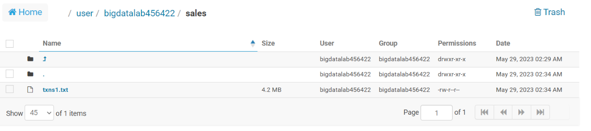
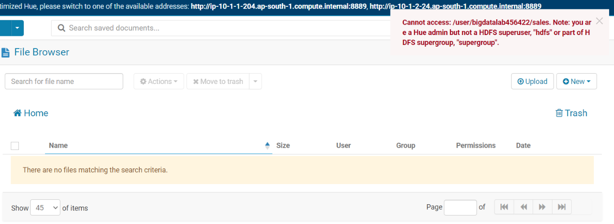

# Day 13 - BigDataTechnologies

- Start hive CLI using command below, it launches hive interactive shell which is Hive CLI

    ```bash
    [bigdatalab456422@ip-10-1-1-204 ~]$ hive
    ```

    ```console
    WARNING: Use "yarn jar" to launch YARN applications.
    SLF4J: Class path contains multiple SLF4J bindings.
    SLF4J: Found binding in [jar:file:/opt/cloudera/parcels/CDH-6.2.1-1.cdh6.2.1.p0.1425774/jars/log4j-slf4j-impl-2.8.2.jar!/org/slf4j/impl/StaticLoggerBinder.class]
    SLF4J: Found binding in [jar:file:/opt/cloudera/parcels/CDH-6.2.1-1.cdh6.2.1.p0.1425774/jars/slf4j-log4j12-1.7.25.jar!/org/slf4j/impl/StaticLoggerBinder.class]
    SLF4J: See http://www.slf4j.org/codes.html#multiple_bindings for an explanation.
    SLF4J: Actual binding is of type [org.apache.logging.slf4j.Log4jLoggerFactory]
    2023-05-30 09:54:50,539 main WARN JNDI lookup class is not available because this JRE does not support JNDI. JNDI string lookups will not be available, continuing configuration. Ignoring java.lang.ClassNotFoundException: org.apache.logging.log4j.core.lookup.JndiLookup

    Logging initialized using configuration in jar:file:/opt/cloudera/parcels/CDH-6.2.1-1.cdh6.2.1.p0.1425774/jars/hive-common-2.1.1-cdh6.2.1.jar!/hive-log4j2.properties Async:false

    WARNING: Hive CLI is deprecated and migration to Beeline is recommended.
    hive>
    ```

- Run command below to set Hive CLI to print current DB

    ```sql
    hive> SET hive.cli.print.current.db = true ;
    ```

- Run command below to use the `surya_training` database

    ```sql
    hive (default)> USE surya_training ;
    ```

    ```console
    OK
    Time taken: 0.029 seconds
    hive (surya_training)>
    ```

## Types of Tables in Hive

```text
Types of tables

1) managed table
2) external

User define function
```

### Managed Tables

1. Created by default by hive
2. If you drop a Managed table, you also lose/delete the data as well as the schema from the Hive Metastore
3. If someone is accessing the data from a Managed table that is deleted, the data becomes inaccessible to the User
4. Managed table data and its Hive Metadata are managed by Hive
5. Data is stored in `/databaseName/tableName/` inside our warehouse by default, which is essentially a location in HDFS to be read as Hive location for these Managed tables
6. Managed tables support `TRUNCATE` as data and the Hive Metadata for table, are both managed by Hive
7. These also support ACID Transactions, using ORC file format by default
8. These also support Query Result Caching, means it can store the result of the already executed Hive Query, for a subsequent query
9. Table data and its Hive Metastore containing table schema will be removed as soon as the table is dropped

> When you create a Manged table using storage types such as text, CSV, AVRO, or JSON, you get an insert-only ACID transaction support, means you cannot update or delete columns in insert-only transactional tables, but if you create a Managed table using ORC format, you get an ACID transactional table with Insert, Update and delete (CRUD) capabilities, making it available for full ACID compliance.

#### `DESC` the table `txnrecords`

- Use the `DESC` command on `txnrecords` table and notice that it shows that it is a `MANAGED_TABLE` in `Table Type:` field using the command below, also note the table path which will be used further

    ```sql
    hive (surya_training)> DESC FORMATTED txnrecords ;
    ```

    ```console
    OK
    # col_name              data_type               comment

    txnno                   int
    txndate                 string
    custno                  int
    amount                  double
    category                string
    product                 string
    city                    string
    state                   string
    spendby                 string

    # Detailed Table Information
    Database:               surya_training
    Owner Type:             USER
    Owner:                  bigdatalab456422
    CreateTime:             Mon May 29 09:29:46 UTC 2023
    LastAccessTime:         UNKNOWN
    Retention:              0
    Location:               hdfs://nameservice1/user/bigdatalab456422/sales
    Table Type:             MANAGED_TABLE
    Table Parameters:
            transient_lastDdlTime   1685352586

    # Storage Information
    SerDe Library:          org.apache.hadoop.hive.serde2.lazy.LazySimpleSerDe
    InputFormat:            org.apache.hadoop.mapred.TextInputFormat
    OutputFormat:           org.apache.hadoop.hive.ql.io.HiveIgnoreKeyTextOutputFormat
    Compressed:             No
    Num Buckets:            -1
    Bucket Columns:         []
    Sort Columns:           []
    Storage Desc Params:
            field.delim             ,
            serialization.format    ,
    Time taken: 0.088 seconds, Fetched: 35 row(s)
    hive (surya_training)>
    ```

- Now you may list tables to track down exactly which tables exist right now because we'll delete `txnrecords` table later which is a Managed Table to see its behavior upon deletion

    ```sql
    hive (surya_training)> SHOW TABLES ;
    ```

    ```console
    OK
    customer
    nyse
    stkvol
    txn_bucket
    txn_orc
    txn_parquet
    txnrecords
    txnrecsbycat
    txnrecsbycat2
    txnrecsbycat3
    txnrecsbycat4
    Time taken: 0.035 seconds, Fetched: 11 row(s)
    hive (surya_training)>
    ```

#### Open the table location in Hue

- So our table `txnrecords` should exist in its table location that we got FROM `DESC FORMATTED` command earlier, so open the `Hue` tool and visit the path at `/user/bigdatalab456422/sales` to see what are the contents of this table path

  

#### `DROP` the table `txnrecords`

- Now we'll `DROP` the table `txnrecords` to observe its behavior upon deletion

    ```sql
    hive (surya_training)> DROP TABLE txnrecords ;
    ```

    ```console
    OK
    Time taken: 0.165 seconds
    hive (surya_training)>
    ```

- Now list all the tables, as we've deleted `txnrecords` table, so it will not be listed now

    ```sql
    hive (surya_training)> SHOW TABLES ;
    ```

    ```console
    OK
    customer
    nyse
    stkvol
    txn_bucket
    txn_orc
    txn_parquet
    txnrecsbycat
    txnrecsbycat2
    txnrecsbycat3
    txnrecsbycat4
    Time taken: 0.035 seconds, Fetched: 10 row(s)
    hive (surya_training)>
    ```

#### Open the table location in Hue after deletion

- Since this `txnrecords` table was a Managed Table, and upon deletion, their data should also be deleted, So if we open the path location for this Managed table in `Hue` tool, it'll show an error indicating that path is inaccessible
- You may goto the `Hue` tool you last opened and just refresh it for the table path at `/user/bigdatalab456422/sales` to see what error it shows

  

### External Tables

1. To avoid losing the data from the table while only deleting the schema, you use the External table
2. Only the Schema/structure is deleted from the Hive Metastore, but data is kept intact at it actual location from where it was Mapped
3. Data is independent of the Schema of the table, as Hive only stores the Schema and then maps some external location of data store to that External table
4. The Hive Metadata is stored in a typical relational database such as MySQL, PostgreSQL or Derby depending on your configuration
5. By default, Hive uses `Apache Derby` as its embedded metastore database, which is suitable for small use-cases
6. `EXTERNAL` keyword is used while creating an External table
7. Hive wont take the data to its own warehouse location
8. External tables do not support `TRUNCATE` command since Hive only manages the Hive Meta data but not the data for external tables
9. These tables do not support ACID transactions
10. These tables also do not support result caching
11. Only Hive Metadata will be removed keeping the external table intact when External tables are dropped

> Managed tables are not used when data is stored externally, outside of Hive and accessed by other Hadoop tools on HDFS

#### `CREATE EXTERNAL TABLE`

- While creating an external table, we need to specify the location of the datastore from which this table will read data
- We've created a folder at `sales` folder location and placed the text file `txns1.txt` in that folder on Day12 wile creating Transaction Table
- We'll create an external table `txnrecords` using `EXTERNAL` keyword, for which data is already available at `/user/bigdatalab456422/sales` which is essentially a location on hdfs, use the command below

    ```sql
    hive (surya_training)> CREATE EXTERNAL TABLE txnrecords(txnno INT, txndate STRING, custno INT, amount DOUBLE, 
    category STRING, product STRING, city STRING, state STRING, spendby STRING) 
    ROW FORMAT DELIMITED FIELDS TERMINATED BY ',' STORED AS textfile
    LOCATION '/user/bigdatalab456422/sales' ;
    ```

    ```console
    OK
    Time taken: 0.076 seconds
    hive (surya_training)>
    ```

- Now list all the tables, you'll see the table `txnrecords` in this list

    ```sql
    Shows newly created external table
    hive (surya_training)> show tables ;
    ```

    ```console
    OK
    customer
    nyse
    stkvol
    txn_bucket
    txn_orc
    txn_parquet
    txnrecords
    txnrecsbycat
    txnrecsbycat2
    txnrecsbycat3
    txnrecsbycat4
    Time taken: 0.036 seconds, Fetched: 11 row(s)
    hive (surya_training)>
    ```

- Now data can be accessed right away, since external table is mapped to the external store location at the time of creation

## UDF (User Defined Functions) in Hive

- USer Defined Functions (UDF) are used to create custom defined function using Java
- We'll create a UDF to convert Unix time to date, time

### `CREATE TABLE testing`

- Create a table `testing` which has a `id` column and a `unixtime` column to store the time stamps in UNIX format

    ```sql
    hive (surya_training)> CREATE TABLE testing(id string,unixtime string) 
    ROW FORMAT DELIMITED FIELDS TERMINATED BY ',' ;
    ```

    ```console
    OK
    Time taken: 0.091 seconds
    hive (surya_training)>
    ```

- Once `testing` table is created, you may describe it using `DESC` command as below to list the column details in it

    ```sql
    hive (surya_training)> DESC testing ;
    ```

    ```console
    OK
    id                      string
    unixtime                string
    Time taken: 0.061 seconds, Fetched: 2 row(s)
    hive (surya_training)>
    ```

### Upload `counter.txt` file using FTP

- To load data into the `testing` table, we'll need a data store which we can load
- Upload `counter.txt` file to the Client/Linux File System
- Now copy this file to Hadoop file system using the `hadoop fs -put` utility in the Linux terminal for Hadoop Client

    ```bash
    [bigdatalab456422@ip-10-1-1-204 ~]$ hadoop fs -put counter.txt .
    ```

### Load data into table `testing`

- Use the command below in hive CLI to load the data file `counter.txt` from the hdfs into `testing` table

    ```sql
    hive (surya_training)> LOAD DATA LOCAL INPATH 'counter.txt' INTO TABLE testing;
    ```

    ```console
    Loading data to table surya_training.testing
    OK
    Time taken: 0.712 seconds
    hive (surya_training)>
    ```

- Once data is loaded into `testing` table, you may list all the records to see the contents of this table, notice that the `unixtime` column has time stamps in UNIX format

    ```sql
    hive (surya_training)> SELECT * FROM testing;
    ```

    ```console
    OK
    one     1470000000000
    two     1389523259550
    three   1389523259550
    four    1389523259550
    five    1479589200000
    Time taken: 0.073 seconds, Fetched: 5 row(s)
    hive (surya_training)>
    ```

### Generating the .jar file for UDF

1. Launch Eclipse application using Java perspective, click OK for Workspace Launcher
2. Create a new project by going to `File > New > Java Project`
3. Enter project name as `hive` and click Finish
4. Expand the Project `hive` in the package explorer, `Right-click on hive project > New > Class`
5. Enter the class name as `UnixtimeToDate` and click Finish
6. Add the below code to `UnixtimeToDate.java`, and save it, it might show some error because external jars are not added right now, but will be added in next step

    ```java
    import java.util.Date;
    import java.text.DateFormat;
    import org.apache.hadoop.hive.ql.exec.UDF; 
    import org.apache.hadoop.io.Text;

    public class UnixtimeToDate extends UDF{
        public Text evaluate(Text text){
            if(text==null) return null;
            long timestamp = Long.parseLong(text.toString());
            return new Text(toDate(timestamp));
        }
        private String toDate(long timestamp) {
            Date date = new Date (timestamp);
            return DateFormat.getInstance().format(date).toString();
        }
    }
    ```

7. `Right-Click on hive project > Build Path > Configure Build Path`, select the `Libraries` tab, and click on `Add external jars`, click on File System and add a jar file which is `hive-exec-1.2.1.jar`
8. After saving the changes, there should not be any *ERROR* in java program
9. `Right-Click on hive Project > Export > Java > Jar File > Next >` Enter the jar file name as `udfhive.jar` with full path in export destination, click on Finish

### Upload .jar file using FTP for UDF

- Upload the `udfhive.jar` file which you’ve generated by compiling the Java code for UDF task

### Unzip the .jar file for UDF

- We need to extract the class file(s) from the .jar file, we extract it using `jar` command by running the command below

    ```bash
    [bigdatalab456422@ip-10-1-1-204 ~]$ jar tvf udfhive.jar
    ```

    ```console
    25 Tue May 30 16:59:30 UTC 2023 META-INF/MANIFEST.MF
    1097 Tue May 30 16:57:42 UTC 2023 hive/UnixtimeToDate.class
    756 Tue May 30 16:57:42 UTC 2023 .classpath
    380 Tue May 30 16:50:58 UTC 2023 .project
    [bigdatalab456422@ip-10-1-1-204 ~]$
    ```

### Add the jar file to Hive Session

- Use the `add jar` utility to add aUser-Defined Function (UDF) jar file `udfhive.jar` to the current Hive session
- Once the jar file is added, the functions contained in it  can be called limiting the scope within the current Hive session

    ```sql
    hive (surya_training)> add jar udfhive.jar ;
    ```

    ```console
    Added [udfhive.jar] to class path
    Added resources: [udfhive.jar]
    hive (surya_training)>
    ```

### List the jars in current Hive session

- Use the `list jars` utility to verify if the jar file is now available within the current Hive session
- Below command should will list `udfhive.jar` indicating it is now available to use

    ```sql
    hive (surya_training)> list jars ;
    ```

    ```console
    udfhive.jar
    hive (surya_training) >
    ```

### `CREATE TEMPORARY FUNCTION userdate`

- Create a temporary function `userdate` which is a UDF using the `UnixtimeToDate` class from the Hive library, use command below

    ```sql
    hive (surya_training)> CREATE TEMPORARY FUNCTION userdate AS 'hive.UnixtimeToDate';
    ```

    ```console
    OK
    Time taken: 0.018 seconds
    hive (surya_training)>
    ```

### Using UDF `userdate`

- You may now select the time stamp columns into a human-readable format implementing `userdate` UDF using command below

    ```sql
    hive (surya_training)> SELECT id, userdate(unixtime) FROM testing;
    ```

    ```console
    hive (surya_training)> SELECT id, userdate (unixtime) FROM testing;
    Query ID = bigdatalab456422_20230530113508_ccb44fc8-6cdf-43b2-9672-9ea7f93b189a
    Total jobs = 1
    Launching Job 1 out of 1
    Number of reduce tasks is set to 0 since there's no reduce operator
    23/05/30 11:35:09 INFO client.RMProxy: Connecting to ResourceManager at ip-10-1-1-204.ap-south-1.compute.internal/10.1.1.204:8032
    23/05/30 11:35:09 INFO client.RMProxy: Connecting to ResourceManager at ip-10-1-1-204.ap-south-1.compute.internal/10.1.1.204:8032
    Starting Job = job_1684866872278_4107, Tracking URL = http://ip-10-1-1-204.ap-south-1.compute.internal:6066/proxy/application_1684866872278_4107/
    Kill Command = /opt/cloudera/parcels/CDH-6.2.1-1.cdh6.2.1.p0.1425774/lib/hadoop/bin/hadoop job  -kill job_1684866872278_4107
    Hadoop job information for Stage-1: number of mappers: 1; number of reducers: 0
    2023-05-30 11:35:27,918 Stage-1 map = 0%,  reduce = 0%
    2023-05-30 11:35:38,133 Stage-1 map = 100%,  reduce = 0%, Cumulative CPU 3.74 sec
    MapReduce Total cumulative CPU time: 3 seconds 740 msec
    Ended Job = job_1684866872278_4107
    MapReduce Jobs Launched:
    Stage-Stage-1: Map: 1   Cumulative CPU: 3.74 sec   HDFS Read: 4297 HDFS Write: 255 HDFS EC Read: 0 SUCCESS
    Total MapReduce CPU Time Spent: 3 seconds 740 msec
    OK
    one     7/31/16 9:20 PM
    two     1/12/14 10:40 AM
    three   1/12/14 10:40 AM
    four    1/12/14 10:40 AM
    five    11/19/16 9:00 PM
    Time taken: 31.419 seconds, Fetched: 5 row(s)
    hive (surya_training)>
    ```
