# Day 14 - BigDataTechnologies

## ORDER BY vs. SORT BY

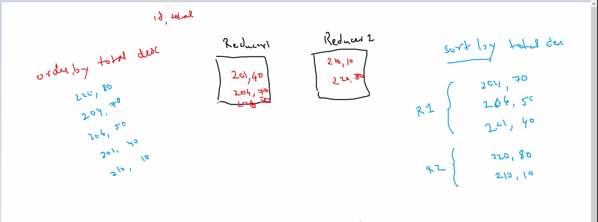

- When analyzing data in Apache Hive, sorting data is essential
- allows us to organize information in specific order
- makes easier to identify trends, patterns and relationships
- We have two methods to sort data
  1. `ORDER BY`
  2. `SORT BY`
- Choosing the right method to sort can impact efficiency

### `ORDER BY` - Single Reducer

1. sorts all of the data on all reducers
2. **slower**, as it takes up all the reducers
3. it sorts all of the dataset based on the specified column(s)
4. guarantees a total order of the results, means that all records are sorted according to the specified column
5. can be used **for one or more columns** for sorting
6. entire result set is sorted in memory on the reducer before being returned
7. is a resource-intensive task, since all the records are shuffled on a single reducer, might even lead to Out-of-Memory errors

```sql
SELECT *
FROM table1
ORDER BY col1 ;
```

> Better performance is traded for total ordering

### `SORT BY` - Multiple Reducers

1. sorts only the data within one reducer
2. **faster**, works with only one reducer at the end
3. used to sort each reducer's output individually
4. does not guarantee a total order of the final result set, means output of individual reducer is sorted, but data is not sorted across all reducers in a global manner
5. can only be used **for a single column** for sorting
6. `SORT BY` can be more efficient than `ORDER BY` for large datasets, since sorting takes place in a parallel manner across reducers
7. typically used when total order of result set is not necessary, such as using with `LIMIT` clause

```sql
SELECT *
FROM table1
SORT BY col1 ;
```

## OLTP vs. OLAP

### OLTP

1. stands for OnLine Transaction Processing
2. for manual punching/entry of source data into database
3. Example: depositing money into bank account, so cashier creates a manual entry
4. enables **real-time** execution of large number of database **transactions** by large number of people, typically over the internet
5. behind many of our everyday transactions, like ATM transactions, hotel reservations
6. can also drive non-financial transactions, including password changes, text messages
7. uses a Relational Database that can do following
    1. process a large number of relatively smaller transactions, usually inserts, updates & deletes
    2. enables **multi-user access** to the same data, while ensuring data integrity
    3. support very **rapid processing**, with response times measured in milliseconds
    4. provide indexed data sets for rapid search & retrievals
    5. be **available 24/7/365**, with constant **incremental backups**
8. Many organizations use OLTP systems to provide data for OLAP, thus utilizing a combination of both OLTP and OLAP

### OLAP

1. Stands for OnLine Analytical Processing
2. for automated entry into database using OLAP to update Fact Table and showing data at dashboard
3. Example: orders on an eCommerce website, updating fact tables to reload data on dashboard
4. is a system for performing multi-dimensional analysis at **high speeds** on **large volumes** of data
5. Typically, data comes from a data warehouse, data mart or some other centralized data store
6. Ideal for **data mining**, **business intelligence** and **complex analytical calculations**, as well as business reporting functions such as financial analysis, budgeting and sales forecasting

#### Data Dimension

- One element of a particular dataset
- Example: Sales figures might have several dimensions related to region, time of year, product models, etc.

#### OLAP Cube

- The core of most OLAP databases is OLAP Cube
- allows you to quickly query, report and analyze multi-dimensional data
- OLAP Cube extends the row-column format of a traditional relational database schema and adds layers for other data dimensions
- Example: the top layer of a cube might organize sales by region, which can also be drilled-down into layers for sales by state, city, etc.
- The historical, aggregated data for OLAP is usually stored in a Star-Schema or Snowflake-Schema

## Data Warehouse

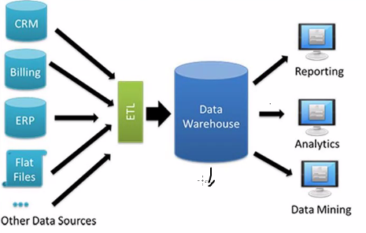

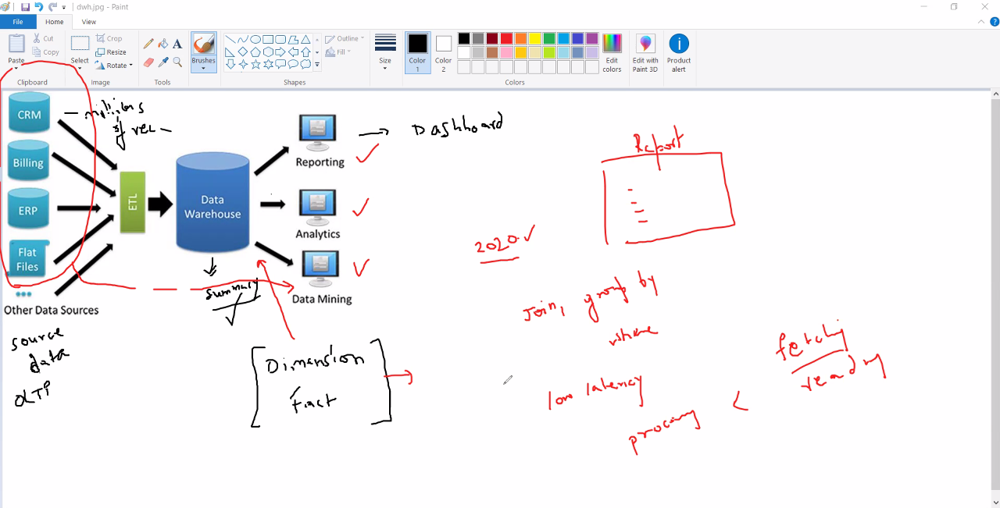

1. Data warehouse design is as per report/dashboard
2. Stores structured  data in summary
3. Idea is to read data, not processing
4. ETL is done by Hadoop developers to get data for analytical tools like Informatica, etc.
5. is a centralized repository that stores structured data and semi-structured data for the purpose of reporting and analysis
6. data comes from a variety of sources like PoS systems, business apps, relational databases, and then cleaned & standardized before it hits data warehouse
7. Typically used for Business Intelligence (BI), reporting and data analysis
8. With large amounts of information that it can store, it provides easy access to historical data, used for mining, Visualization and other business reporting

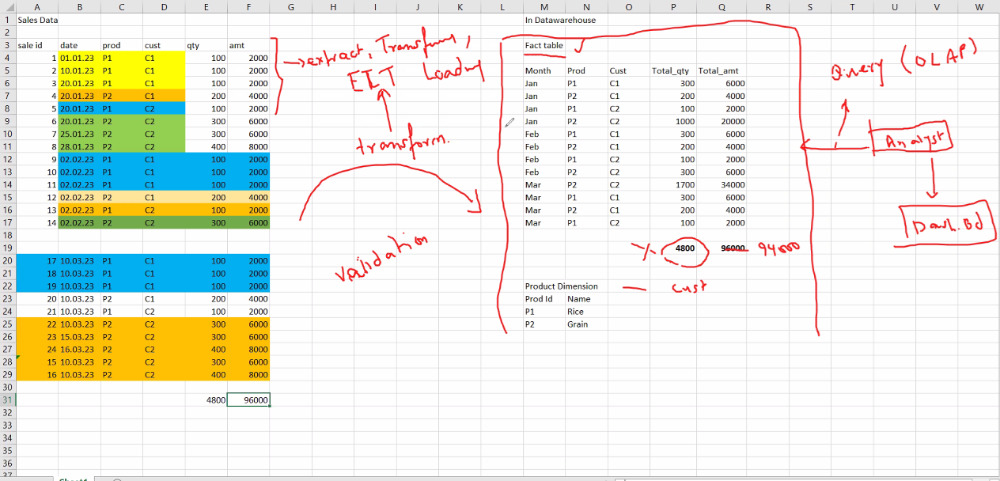

### Data Mart

- A subset of a Data warehouse, tailored for a specific business line or team, focused on a particular subject area like, sales, finance, etc.
- used to analyze department-specific information more efficiently

### ETL and ELT on Data Warehouse

- ETL (Extract, Transform, Load) and ELT (Extract, Load, Transform) are two different approaches for analytics


#### ETL

1. ETL approach uses a set of business rules to process data from several sources before centralized integration/loading
2. ETL transforms data on a secondary processing server, and then loads it into data warehouse
3. it transforms data from one structured format into another format, and then loads it
4. Loading data into warehouse is slower since it needs to transform first
5. Need to develop custom solutions to mask Personally Identifiable Information (PII) and protect data for compliance & regulations

#### ELT

1. ELT approach loads data as it is and then transforms it at a later stage, depending on the use case and analytic requirements
2. ELT first loads data into the warehouse in its original format first, and then it can be transformed as it is processed, whenever and as many times it is needed
3. it handles all types of data including unstructured data, so it loads all formats of data into target data warehouse, and then data can be transformed into the format as per requirement
4. Loading data into warehouse is faster since it directly loads data and then transforms it in parallel using a secondary server, thus providing near real-time data transformation
5. it provides granular access control and multi-factor authentication directly within data warehouse, making easier to meet compliance & regulations

### Types of Tables in Data Warehouse

1. Data Warehouse has following set of tables
    1. Dimension Tables
    2. Fact Tables

#### Fact Table

- Table that stores the measurements, metrics, or facts related to a business operation
- located at the centre of a Star Schema or Snowflake Schema, and is surrounded by Dimension Tables
- When multiple Fact Tables are used, they can be organized using a **Fact Constellation Schema**
- A Fact Tables has two types of columns
  1. columns that contain facts
  2. columns that server as foreign keys linking to Dimension Tables
- The primary key of a Fact Tables is often a composite key made up of all the foreign keys in the table
- Fact Tables can hold various measurements, such as additive, non-additive, partly additive measures, and store store important information in the data warehouse
- useful for evaluating dimensional attributes because they provide additive values that can act as independent variables

##### Granularity of a Fact Table

- Fact Table Grain is the level of detail or depth of the information recorded in a Fact Table
- A Successful Fact table is designed at the highest level
- The grain of a Fact Table refers to the most basic level at which the facts can be defined to provide detailed data
- Example: The grain of a sales Fact Table might be "sales volume by day by product by the shop", meaning each entry in the table is uniquely identified by a day, product, shop. While other dimensions such as location or region, may also be included in the Fact Table, but they do not contribute to the uniqueness of an entry. These extra dimensions are called **Affiliate Dimensions**, which can provide additional information to slice and dice, but they usually provide insights at a higher level of aggregation

#### Dimension Table

- Contain descriptions of the objects in a Fact Table, provides information about dimensions such as values, characteristics, keys
- Dimension Table refers to a set of data related to any quantifiable event and is the foundation for Dimensional Modelling
- Dimension Tables are usually small, with a row number ranging from a few hundred to a few thousand
- It has a primary key column, allowing each dimension row to be uniquely identifiable, which is used to link the Dimension Table to a Fact Table
- A **Surrogate key** is a system generated key, often used to uniquely identify the rows in the Dimension Table

### Types of Schemas in Data Warehouse

- Schema is the logical description of the entire database
- Includes names and description of records of all records types including all associated data-items and aggregates
- While a database uses Relational Model, a Data Warehouse uses Star Schema, Snowflake Schema or Fact Constellation Schema

#### Star Schema

- Each dimension in a Star Schema is  represented by only one-dimension table
- This Dimension table contains the set of attributes
- Below diagram shows the sales data of a company with respect to the four dimensions, namely time, item, branch and location

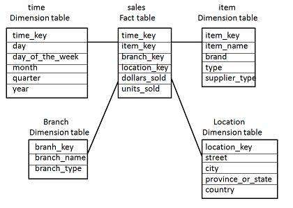

- The Fact Table is at the center, it contains keys to each of the dimensions
- The Fact Table also contains the attributes, such as dollars_sold and units_sold
- Each Dimension has only one Dimension Table, and each table holds a set of attributes

#### Snowflake Schema

- Some dimension tables in Snowflake Schema are normalized
- The normalization splits up the data into additional tables
- Unlike Star Schema, the dimensions in a Snowflake Schema are normalized
- Example: the item dimension table in Star Schema can be normalized into two Dimension Tables, item and supplier

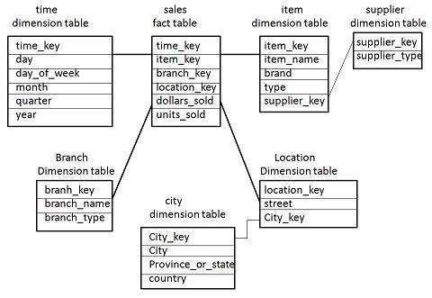

- Now the supplier_key attribute in item Dimension Table is linked to supplier Dimension Table
- Due to normalization in Snowflake Schema, redundancy is reduced, so it becomes easy to maintain and saves storage space

#### Fact Constellation Schema

- A Fact Constellation has multiple schemas
- Also known as **Galaxy Schema**
- The following diagram shows two Fact Tables, sales and shipping

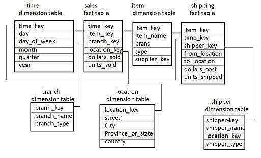

- The sales Fact Table is same as that in the Star Schema
- The shipping Fact Table also contains two measures, dollars_sold and units_sold
- It is possible to share Dimension Tables between Fact Tables, e.g., time, item and location Dimension Tables are shared between sales and shipping Fact Tables

### Slowly Changing Dimension (SCD) Tables

- Dimension Tables designed to manage and track changes over time
- Since Data warehouses are used to analyze historical data, so it is essential to store the different states of data
- Choosing the right type of SCD is important as it depends on the business requirements for reporting and analysis, and it might have performance implications, especially as data volume grows

#### Types of Slowly Changing Dimension (SCD) Tables

1. **Type 0 (Passive/Fixed Method)**
    - used where **historical accuracy is not important**, and data is constantly updated
    - original values are replaced with new data without maintaining history
    - very simple implementation
    - Example
      - Source

        | ID | Name | Salary | Fax Number |
        | -- | -- | -- | -- |
        | 123 | Vivek | 10000 | 123-456-789 |

      - DWH table

        | ID | Name | Salary | Fax Number |
        | -- | -- | -- | -- |
        | 123 | Vivek | 10000 | 456-123-8899 |

2. **Type 1 (Overwrite)**
    - used where most recent value is necessary, such as corrections to data
    - existing records are **updated directly** maintaining latest snapshot, previous values are lost
    - easy to manage, but supports **no historical reporting**
    - might include structured approaches for updates, often aligned with business rules
    - Example
      - Lets say, we just loaded data into DWH by taking a snapshot
        - Source

            | ID | Name | Salary | Designation |
            | -- | -- | -- | -- |
            | 123 | Vivek | 10000 | Developer |

        - DWH table

            | ID | Name | Salary | Designation |
            | -- | -- | -- | -- |
            | 123 | Vivek | 10000 | Developer |

      - Now we realize that there is error in this record, so we update in the source
        - Source

            | ID | Name | Salary | Designation |
            | -- | -- | -- | -- |
            | 123 | Vivek Goel | 40000 | Lead |

        - DWH table

            | ID | Name | Salary | Designation |
            | -- | -- | -- | -- |
            | 123 | Vivek | 10000 | Developer |

      - Now, data is updated in the source, but mot reflected in DWH, so we'll again take a snapshot of the source and update it in DWH, so previous values are lost

        - Source

            | ID | Name | Salary | Designation |
            | -- | -- | -- | -- |
            | 123 | Vivek Goel | 40000 | Lead |

        - DWH table

            | ID | Name | Salary | Designation |
            | -- | -- | -- | -- |
            | 123 | Vivek Goel | 40000 | Lead |

3. **Type 2 (Add history as new row)**
    - used when it is essential to track historical changes over time
    - a **new record** is created for each change, usually including effective dates
    - allows for **complete historical tracking**, however it can lead to larger tables and more complex queries
    - Example
      - Lets say, we added a record of an employee assuming he's going to work till a maximum date at Gurgaon office
        - Source

            | ID | Name | Salary | Office | Date Eff. |
            | -- | -- | -- | -- | -- |
            | 123 | Vivek | 10000 | Gurgaon | 10-Aug-13 |

        - DWH table

            | ID | Name | Salary | Office | From_date | To_date | Curr_Flag |
            | -- | -- | -- | -- | -- | -- | -- |
            | 123 | Vivek | 10000 | Gurgaon | 10-Aug-13 | 12-Aug-99 | Y |

      - Now after 2 years, salary is increased, location has changed, and work date has also changed as per source
        - Source

            | ID | Name | Salary | Office | Date Eff. |
            | -- | -- | -- | -- | -- |
            | 123 | Vivek | 40000 | California | 10-Jan-15 |

        - DWH table

            | ID | Name | Salary | Office | From_date | To_date | Curr_Flag |
            | -- | -- | -- | -- | -- | -- | -- |
            | 123 | Vivek | 10000 | Gurgaon | 10-Aug-13 | 12-Dec-99 | Y |

      - In the DWH, we introduce a new row for each change, so we update the previous record, and add a new record for latest entry
        - Source

            | ID | Name | Salary | Office | Date Eff. |
            | -- | -- | -- | -- | -- |
            | 123 | Vivek | 40000 | California | 10-Jan-15 |

        - DWH table

            | ID | Name | Salary | Office | From_date | To_date | Curr_Flag |
            | -- | -- | -- | -- | -- | -- | -- |
            | 123 | Vivek | 10000 | Gurgaon | 10-Aug-13 | 09-Jan-15 | N |
            | 123 | Vivek | 40000 | California | 10-Jan-15 | 12-Dec-99 | Y |

      - Now Lets day, after six months, he moved to Houston as per source
        - Source

            | ID | Name | Salary | Office | Date Eff. |
            | -- | -- | -- | -- | -- |
            | 123 | Vivek | 40000 | Houston | 25-Jul-15 |

        - DWH table

            | ID | Name | Salary | Office | From_date | To_date | Curr_Flag |
            | -- | -- | -- | -- | -- | -- | -- |
            | 123 | Vivek | 10000 | Gurgaon | 10-Aug-13 | 09-Jan-15 | N |
            | 123 | Vivek | 40000 | California | 10-Jan-15 | 12-Dec-99 | Y |

      - So we add another row for new changes while changing the Flag
        - Source

            | ID | Name | Salary | Office | Date Eff. |
            | -- | -- | -- | -- | -- |
            | 123 | Vivek | 40000 | Houston | 25-Jul-15 |

        - DWH table

            | ID | Name | Salary | Office | From_date | To_date | Curr_Flag |
            | -- | -- | -- | -- | -- | -- | -- |
            | 123 | Vivek | 10000 | Gurgaon | 10-Aug-13 | 09-Jan-15 | N |
            | 123 | Vivek | 40000 | California | 10-Jan-15 | 24-Jul-15 | N |
            | 123 | Vivek | 40000 | Houston | 25-Jul-15 | 12-Dec-99 | Y |

4. **Type 3 (Add history as new column/attribute)**
    - used when it is important to maintain some history but not all changes
    - A **new column** is added to the existing record to store the previous value alongside the current value
    - provides **limited historical context** (usually only one prior value), can lead to complications if multiple changes occur
    - Example
      - Lets say, we added a record of an employee at Gurgaon office
        - Source

            | ID | Name | Salary | Office | Date Eff. |
            | -- | -- | -- | -- | -- |
            | 123 | Vivek | 10000 | Gurgaon | 10-Aug-13 |

        - DWH table

            | ID | Name | Salary | Prev_Office | Curr_Office | From_date |
            | -- | -- | -- | -- | -- | -- |
            | 123 | Vivek | 10000 | Gurgaon | Gurgaon | 10-Aug-13 |

      - Now after 2 years, he moved to California with an increased salary as per source
        - Source

            | ID | Name | Salary | Office | Date Eff. |
            | -- | -- | -- | -- | -- |
            | 123 | Vivek | 40000 | California | 10-Jan-15 |

        - DWH table

            | ID | Name | Salary | Prev_Office | Curr_Office | From_date |
            | -- | -- | -- | -- | -- | -- |
            | 123 | Vivek | 10000 | Gurgaon | Gurgaon | 10-Aug-13 |

      - So we're going to update DWH with new salary, Current office as California with a from date
        - Source

            | ID | Name | Salary | Office | Date Eff. |
            | -- | -- | -- | -- | -- |
            | 123 | Vivek | 40000 | California | 10-Jan-15 |

        - DWH table

            | ID | Name | Salary | Prev_Office | Curr_Office | From_date |
            | -- | -- | -- | -- | -- | -- |
            | 123 | Vivek | 40000 | Gurgaon | California | 10-Jan-15 |

      - Now he starts working in Houston after six months as per source
        - Source

            | ID | Name | Salary | Office | Date Eff. |
            | -- | -- | -- | -- | -- |
            | 123 | Vivek | 40000 | Houston | 25-Jul-15 |

        - DWH table

            | ID | Name | Salary | Prev_Office | Curr_Office | From_date |
            | -- | -- | -- | -- | -- | -- |
            | 123 | Vivek | 40000 | Gurgaon | California | 10-Jan-15 |

      - Now we'll loose the Gurgaon part and update the previous and current office locations with From date
        - Source

            | ID | Name | Salary | Office | Date Eff. |
            | -- | -- | -- | -- | -- |
            | 123 | Vivek | 40000 | Houston | 25-Jul-15 |

        - DWH table

            | ID | Name | Salary | Prev_Office | Curr_Office | From_date |
            | -- | -- | -- | -- | -- | -- |
            | 123 | Vivek | 40000 | California | Houston | 25-Jul-15 |

5. **Type 4 (Historical Table: Add a new Dimension)**
    - used when historical data needs to be maintained separately for performance or simplicity, such as tracking employee roles over time
    - Current Dimension values are kept in the main table, while historical values are stored in a **separate historical table**
    - improves query performance for querying current data, may complicate joins and queries for historical analysis
    - Example
      - Lets say, we added a record of an employee at Gurgaon office
        - Source

            | ID | Name | Salary | Office | Date Eff. |
            | -- | -- | -- | -- | -- |
            | 123 | Vivek | 10000 | Gurgaon | 10-Aug-13 |

        - DWH table

            | ID | Name | Salary | Office |
            | -- | -- | -- | -- |
            | 123 | Vivek | 10000 | Gurgaon |

        - History table

            | ID | Name | Salary | Office | From_date | To_date |
            | -- | -- | -- | -- | -- | -- |
            | 123 | Vivek | 10000 | Gurgaon | 10-Aug-13 | 12-Dec-99 |

      - Now employee moved to California with increased salary after 2 years as per source
        - Source

            | ID | Name | Salary | Office | Date Eff. |
            | -- | -- | -- | -- | -- |
            | 123 | Vivek | 40000 | California | 10-Jan-15 |

        - DWH table

            | ID | Name | Salary | Office |
            | -- | -- | -- | -- |
            | 123 | Vivek | 10000 | Gurgaon |

        - History table

            | ID | Name | Salary | Office | From_date | To_date |
            | -- | -- | -- | -- | -- | -- |
            | 123 | Vivek | 10000 | Gurgaon | 10-Aug-13 | 12-Dec-99 |

      - So, record will be updated in main table and one record will be added to History table
        - Source

            | ID | Name | Salary | Office | Date Eff. |
            | -- | -- | -- | -- | -- |
            | 123 | Vivek | 40000 | California | 10-Jan-15 |

        - DWH table

            | ID | Name | Salary | Office |
            | -- | -- | -- | -- |
            | 123 | Vivek | 40000 | California |

        - History table

            | ID | Name | Salary | Office | From_date | To_date |
            | -- | -- | -- | -- | -- | -- |
            | 123 | Vivek | 10000 | Gurgaon | 10-Aug-13 | 09-Jan-15 |
            | 123 | Vivek | 40000 | California | 10-Jan-15 | 12-Dec-99 |

      - Now employee moved to Houston after six months as per source
        - Source

            | ID | Name | Salary | Office | Date Eff. |
            | -- | -- | -- | -- | -- |
            | 123 | Vivek | 40000 | Houston | 25-Jul-15 |

        - DWH table

            | ID | Name | Salary | Office |
            | -- | -- | -- | -- |
            | 123 | Vivek | 40000 | California |

        - History table

            | ID | Name | Salary | Office | From_date | To_date |
            | -- | -- | -- | -- | -- | -- |
            | 123 | Vivek | 10000 | Gurgaon | 10-Aug-13 | 09-Jan-15 |
            | 123 | Vivek | 40000 | California | 10-Jan-15 | 12-Dec-99 |

      - So, record will be updated in main table and another record will be added to History table for Houston
        - Source

            | ID | Name | Salary | Office | Date Eff. |
            | -- | -- | -- | -- | -- |
            | 123 | Vivek | 40000 | Houston | 25-Jul-15 |

        - DWH table

            | ID | Name | Salary | Office |
            | -- | -- | -- | -- |
            | 123 | Vivek | 40000 | Houston |

        - History table

            | ID | Name | Salary | Office | From_date | To_date |
            | -- | -- | -- | -- | -- | -- |
            | 123 | Vivek | 10000 | Gurgaon | 10-Aug-13 | 09-Jan-15 |
            | 123 | Vivek | 40000 | California | 10-Jan-15 | 24-Jul-15 |
            | 123 | Vivek | 40000 | Houston | 25-Jul-15 | 12-Dec-99 |

6. **Type 6 (Hybrid)**
    - used when a combination of current, previous and historical tracking is required, such as customer status changes and their effective dates
    - **combines Type2 and Type 3**, typically retains current value, previous values and a full history
    - provides **comprehensive historical tracking** but can be complex to manage and query
    - Example
      - Lets say, we added a record of an employee at Gurgaon office
        - Source

            | ID | Name | Salary | Office | Date Eff. |
            | -- | -- | -- | -- | -- |
            | 123 | Vivek | 10000 | Gurgaon | 10-Aug-13 |

        - DWH table

            | ID | Name | Salary | Curr_Office | Hist_Office | From_date | To_date | Curr_Flag |
            | -- | -- | -- | -- | -- | -- | -- | -- |
            | 123 | Vivek | 10000 | Gurgaon | Gurgaon | 10-Aug-13 | 12-Dec-99 | Y |

      - Now employee moved to California with increased salary after 2 years as per source
        - Source

            | ID | Name | Salary | Office | Date Eff. |
            | -- | -- | -- | -- | -- |
            | 123 | Vivek | 40000 | California | 10-Jan-15 |

        - DWH table

            | ID | Name | Salary | Curr_Office | Hist_Office | From_date | To_date | Curr_Flag |
            | -- | -- | -- | -- | -- | -- | -- | -- |
            | 123 | Vivek | 10000 | Gurgaon | Gurgaon | 10-Aug-13 | 12-Dec-99 | Y |

      - So additional record will be added updating the current Office and current flag
        - Source

            | ID | Name | Salary | Office | Date Eff. |
            | -- | -- | -- | -- | -- |
            | 123 | Vivek | 40000 | California | 10-Jan-15 |

        - DWH table

            | ID | Name | Salary | Curr_Office | Hist_Office | From_date | To_date | Curr_Flag |
            | -- | -- | -- | -- | -- | -- | -- | -- |
            | 123 | Vivek | 10000 | Gurgaon | Gurgaon | 10-Aug-13 | 09-Jan-15 | N |
            | 123 | Vivek | 40000 | California | California | 10-Jan-15 | 12-Dec-99 | Y |

      - Now employee moved to Houston after siz months as per Source
        - Source

            | ID | Name | Salary | Office | Date Eff. |
            | -- | -- | -- | -- | -- |
            | 123 | Vivek | 40000 | Houston | 10-Jan-15 |

        - DWH table

            | ID | Name | Salary | Curr_Office | Hist_Office | From_date | To_date | Curr_Flag |
            | -- | -- | -- | -- | -- | -- | -- | -- |
            | 123 | Vivek | 10000 | Gurgaon | Gurgaon | 10-Aug-13 | 09-Jan-15 | N |
            | 123 | Vivek | 40000 | California | California | 10-Jan-15 | 12-Dec-99 | Y |

      - So a new record will be added with updated Current and previous office locations, dates and current flag
        - Source

            | ID | Name | Salary | Office | Date Eff. |
            | -- | -- | -- | -- | -- |
            | 123 | Vivek | 40000 | Houston | 10-Jan-15 |

        - DWH table

            | ID | Name | Salary | Curr_Office | Hist_Office | From_date | To_date | Curr_Flag |
            | -- | -- | -- | -- | -- | -- | -- | -- |
            | 123 | Vivek | 10000 | Houston | Gurgaon | 10-Aug-13 | 09-Jan-15 | N |
            | 123 | Vivek | 40000 | Houston | California | 10-Jan-15 | 24-Jul-15 | N |
            | 123 | Vivek | 40000 | Houston | Houston | 25-Jul-15 | 12-Dec-99 | Y |

### Challenges of a Data Warehouse

1. **No Support for unstructured data** like images, text, IoT data or messaging frameworks like HL7, JSON and XML.Traditional Data Warehouses are only capable of only storing  clean and highly-structured data
2. **No Support for AI and Machine Learning :** Data Warehouses are purpose-built and optimized for common DWH workloads including historical reporting, BI & querying, not intended/designed to support Machine Learning workloads
3. **SQL only :** DWHs typically offer no support for Python or R, the language choice for App Developers, Data Scientists and Machine Learning Engineers
4. **Duplicated Data :** Many enterprises have Data Warehouses and Data Marts for departments in addition to a Data Lake, resulting into duplicated data, lots of redundant ETL and so single source of truth
5. **Tough to keep in sync :** Keeping two copies of the data synchronized between the Data Lake and the Data Warehouse adds complexity and fragility, that is tough to manage, Data drift can cause inconsistent reporting & incorrect analysis
6. **Closed Proprietary formats increase vendor lock-in :** Most enterprise Data Warehouses use their own proprietary data format, rather than formats based on open-source and open-standards, this increases vendor lock-in, makes it difficult or impossible to analyze your data with other tools, and makes it more difficult to migrate your data
7. **Expensive :** Enterprise Data Warehouses charge you for storing data and also for analyzing it, Storage & Compute costs are tightly coupled together, separation of compute and storage with a Data Lakehouse means you can independently scale either as needed

## Data Lakes

1. Centralized repository/collection of data from different sources
2. No data size limits
3. Can store any type of data
4. Hadoop may be called as Data Lake
5. Data Lake is a repository  of data, typically stored in file format with variable organization or hierarchy
6. Built on object storage, Data Lakes allow flexibility to store data of all types, from variety of sources
7. The data is stored in its original raw, untransformed state, and data is transformed only when provided for analysis based on matching query criteria
8. e.g. Hadoop is a good example of Data Lake Storage
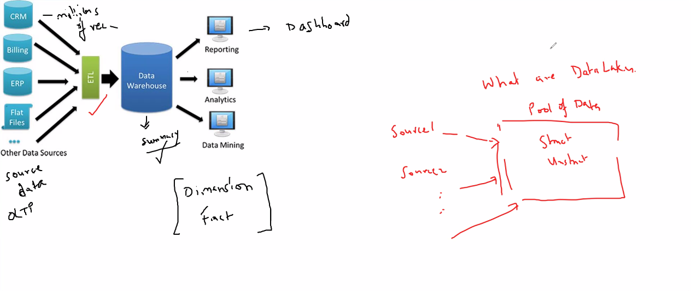

### Benefits of Data Lake

1. **Flexibility :** Data Scientists can utilize data in its rawest form for feature engineering and machine learning
2. **Accessibility :** All the data is stored at a centralized location
3. **Affordability :** It stores data in object storage, which is typically cost-effective
4. **Compatibility :** It is compatible with most open-source data analytics technologies
5. **Comprehensive :** It combines data from all of an enterprise's data sources including IoT
6. **Scalability :** It can be easily scaled to store any amounts of data

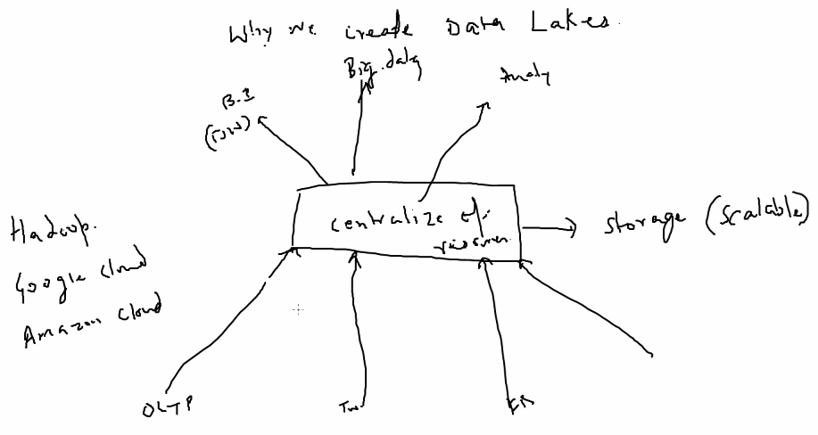

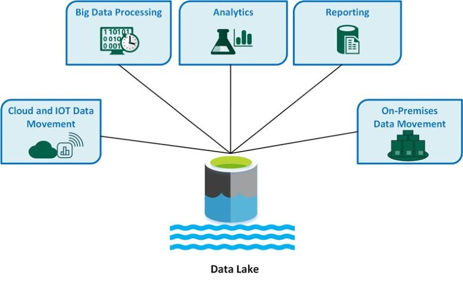

### Data Lake Architecture

- Data Lake is a storage repository with no set architecture of its own that allows organizations to manage vast amounts of data in its native format
- In order to make most of its capabilities, it requires a wide range of tools, technologies, compute engines that help optimize the integration, storage and processing of data and create a layered architecture
- This architecture not only supports big data processing, but can also integrate with a data lakehouse framework
- Every organization has its own unique configuration, but most Lakehouse architectures feature the following
  1. **Resource Management and Orchestration :** Resource Manager enables the Data Lake to consistently execute tasks by allocating the right amount of data, resources and computing power
  2. **Connectors for Easy Accessibility :** A variety of workflows allow users to easily access and share the data they need, in the required format
  3. **Reliable Analytics :** A good analytics service should be fast, scalable, and distributed, supporting diverse workload categories across multiple languages
  4. **Data Classification :** Data profiling, cataloging and archiving help organizations track data content, quality, location and history
  5. **Extract, Load, Transform (ELT) processes :** Data is extracted from multiple sources and loaded into the Data Lake's raw zone, then cleaned and transformed after extraction for easy access by applications
  6. **Security and Support :** Data protection tools like masking, auditing, encryption, and access monitoring ensure that your data remains secure and compliant with  regulations
  7. **Governance and Stewardship :** For effective governance on Data Lake platform, users should be educated on its architectural configuration, as well as best practices for data and operations management

### Challenges of Data Lakes

1. **Data Reliability**
    - Without proper tools in place, Data Lakes suffer from reliability issues making it difficult for Data Scientists and Analysts to reason about the data
    - **Reprocessing Issues**
      - Data Lakes often face challenges when write job fails, requiring time-consuming reprocessing to fix corrupted data, leading to delays and increased operational overhead
      - Data Lakehouse/Delta Lake introduces ACID transactions, ensuring operations are atomic, which eliminates the need for tedious reprocessing, allowing Data Scientists to focus on insights
    - **Quality Assurance**
      - Without effective data validation, errors can go unnoticed, compromising data quality and leading to poor decision-making, unlike software applications where issues are easily detected, problems with data can remain hidden until critical moments
      - Schema enforcement and evolution in Data Lakehouse/Delta Lake helps maintain data quality throughout its lifecycle, instilling confidence in data accuracy
    - **Combining Batch and Streaming Data**
      - Capturing real-time data alongside historical data is essential, but traditional methods (like Lambda Architecture) can be cumbersome and complex
      - Data Lakehouse/Delta Lake seamlessly integrate batch and streaming data, ensuring consistent views even during simultaneous modifications
    - **Bulk Update, Merges and Deletes**
      - Performing updates and deletions is challenging in traditional Data Lakes, particularly  with regulations like CCPA and GDPR, which mandate customer data deletion
      - Data Lakehouse/ Delta Lake simplifies these operations, allowing SQL queries to manage updates and deletions efficiently through ACID transactions
2. **Query Performance**
    - Query performance is the key driver of user satisfaction for Data Lake analytics tools, and for the users who perform interactive, exploratory data analysis using SQL, it is essential to get quick responses to common queries
    - **Small Files**
      - A proliferation of small files can hinder performance due to limited I/O throughput
      - Data Lakehouse/Delta Lake uses small file compaction to consolidate small files into larger ones that are optimized for read access
    - **Unnecessary Reads from Disks**
      - Repeated accessing data from storage can slow down query responses significantly
      - Data Lakehouse/Delta Lake employs caching to selectively hold important tables in memory for quicker recall, and it uses data skipping techniques to increase read throughput avoiding processing the non-relevant data
    - **Deleted Files**
      - On modern Data Lakes using cloud storage, deleted files can actually remain in the Data Lake for up to 30 days, causing unnecessary overhead slowing query performance
      - Data Lakehouse/Delta Lake offers the `VACUUM` command to permanently delete the files that are no longer needed
    - **Data Indexing and Partitioning**
      - Proper indexing and partitioning along the dimensions by which it is most likely to be grouped, are crucial query performance
      - Data Lakehouse/Delta Lake can create and maintain indices and partitions that are optimized for analytics
    - **Metadata Management**
      - Data Lakes can grow to multiple petabytes or more and suffer bottlenecks, not by the data, but by the metadata that accompanies it
      - Data Lakehouse/Delta Lake leverages Spark for scalable metadata management that distributes its processing just like the data itself
3. **Governance and Compliance**
    - **Regulatory Compliance**
      - Ensuring compliance with laws like GDPR and CCPA is difficult since traditional Data Lakes struggle to delete or update date efficiently if customer requests, which might lead to potential fines for non-compliance
      - Deleting or updating data in a regular Parquet Data Lake is compute-intensive and sometimes near impossible
      - Data Lakehouse/Delta Lake enables straightforward data management, facilitating compliance through effective querying and modification capabilities
    - **Historical Data Management**
      - Maintaining historical versions of data at a reasonable cost is challenging in Data Lakes, because they require manual snapshots to be put in place and all those snapshots to be stored
      - Data Lakehouse/Delta Lake allows for easier historical data handling, through ACID transactions and time travel, minimizing costs while ensuring data integrity

### Data Lake vs Data Warehouse

- Both Data Lakes and Data Warehouses are big data repositories, but the primary difference between them is in compute and storage
- Data Warehouse typically stores data in a pre-determined organization with a schema
- Data Lake does not always have a pre-determined schema

|  | Data Lake | Data Warehouse |
| :-- | :-- | :-- |
| Type | Structured, semi-structured, unstructured | Structured |
|  | Relational, non-relational | Relational |
| Schema | Schema on read | Schema on write |
| Format | raw, unfiltered | Processed, vetted |
| Sources | Big Data, IoT, Social Media, Streaming Data | Application, Business, Transactional Data, Batch Reporting |
| Scalability | Easy to scale at low cost | Difficult and expensive to scale |
| Users | Data Scientists, Data Engineers | Data Warehouse Professionals, Business Analysts |
| Use Cases | Machine Learning, Predictive Analytics, Real-Time Analytics | Core Reporting, BI |

## Data Lakehouse

- Despite advantages of Traditional Data Lake to accommodate all kinds of data from all kinds of sources, issues related to quality control, data corruption, improper partitioning can occur
- A poorly managed Data Lake can lead to issues related to data integrity, bottlenecks, slow performance and security risks, which is where Data Lakehouse can perform better
- A Data Lakehouse is an open-standards based storage solution that is multifaceted in nature
- It can address the needs of Data Scientists and Data Engineers to conduct deep data analysis & processing, as well as the needs of traditional Data Warehouse professionals who curate & publish data for BI and reporting
- It can seamlessly operate in each workload on top of Data Lake without duplicating data into another well defined database
- It overcomes the challenges of a traditional Data Lake by adding a Delta Lake Storage Layer directly on top of cloud Data Lake
- This Delta Lake Storage provides flexibility in analytic architecture to handle ACID transactions for reliability, streaming integrations and advanced features like data versioning & schema enforcement
- The necessity of a Data Lakehouse depends on the complexity of needs, its flexibility and range make it an optimal solution for many enterprises

### Data lake vs. Data Lakehouse

|  | Data Lake | Data Lakehouse |
| :-- | :-- | :-- |
| Type | Structured, semi-structured, unstructured | Structured, semi-structured, unstructured |
|  | Relational, non-relational | Relational, non-relational |
| Schema | Schema on read | Schema on read, schema on write |
| Format | Raw, unfiltered, processed, curated | Raw, unfiltered, processed, curated, delta format files |
| Sources | Big Data, IoT, Social Media, Streaming Data | Big Data, IoT, Social Media, Streaming Data, Application, Business, Transactional Data, Batch Reporting |
| Scalability | Easy to scale at low cost | Easy to scale at low cost |
| Users | Data Scientists | Business Analysts, Data Engineers, Data Scientists |
| Use Cases | Machine Learning, Predictive Analytics | Core Reporting, BI, Machine Learning, Predictive Analytics |

### Delta Lake

- Delta Lake is an open-source storage framework that enables building a format agnostic Lakehouse architecture
- Delta lake is designed to work with a variety of compute engines including Apache Spark, PrestoDB, Apache Flink, Apache Trino, Apache Hive, Snowflake, Google BigQuery, Athena, Redshift, Databricks, Azure Fabric and APIs for Scala, Java, Rust and Python
- With Delta Universal format (`UniForm`), users can read Delta Tables using clients that support other formats, such as Apache Iceberg and Apache Hudi
- Delta lake is open-source software that extends Parquet data file with a file-based  transaction log for ACID transactions and scalable Metadata handling
- Delta Lake is fully compatible with Apache Spark APIs, and was developed for tight integration with structured streaming, allowing you to easily use a single copy of data for both batch and streaming operations and providing incremental processing at scale
- Delta Lake protocol was originally developed by Databricks and continues to actively contribute to the open-source project

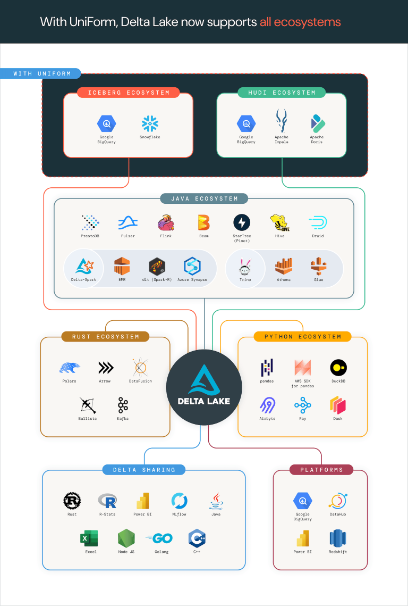

#### Features of Delta Lake

1. **ACID Transactions :** ensures operations are completed reliably and consistently, prevents issues like partial writes & data corruption
2. **Scalable Metadata :** allows to handle petabyte-scale tables with billions of partitions and files with ease
3. **Time Travel :** allows to access/revert to earlier versions of data for audits, rollbacks or reproduction
4. **Open-Source :** community driven, open-standards, open protocol, open discussions
5. **Unified Batch/Streaming :** supports both batch and streaming data processing in a single pipeline, allowing to read & write data in real-time while also performing batch processing
6. **Schema Evolution/Enforcement :** allows for schema changes to be made easily, enabling you to add or modify columns without disrupting ongoing operations
7. **Audit History :** provides a audit trail by logging all changes made to the data, crucial for maintaining data integrity and tracking evolution of datasets
8. **DML Operations :** supports DML operations, making it easier to manage and manipulate datasets

## Dashboard

1. Always create Data Warehouse on top of Data Lake while creating dashboard
2. Not always real-time
3. Usually updated daily or weekly, based on frequency of dashboard being checked
4. A Dashboard is a visual representation of Key-Performance-indicators (KPIs), metrics, and data points that provides a consolidated view of information relevant to a specific objective or business area
5. Examples :
    - BI tools : Tableau, Power BI, Looker, Qlik Sense
    - Data Visualization libraries : D3.js, Chart.js, Plotly
    - Simple Spreadsheet softwares : Microsoft Excel, Google sheets

### Benefits of Analytical Dashboard

1. **Improved Decision Making**
    - Dashboard use Visualizations to present complex data in a clear and understandable manner
    - By displaying data trends and patterns, dashboards assist in recognizing opportunities, threats, and potential areas dor improvement
    - THe visual nature of dashboards simplifies the sharing of data-driven insights across teams
2. **Enhanced Data Accessibility**
    - Analytical dashboards centralize data from various sources, providing a unified and easily accessible view, which eliminates the need to manually gather and analyze data, saving time and ensuring accuracy
3. **Real-time Insights**
    - The best tools can access live data, providing real-time monitoring and analysis of Key Performance metrics, which enables quick reactions to changing situations and helps in staying ahead of trends
4. **Increased Collaboration**
    - Dashboards promote teamwork and collaboration by offering a shared platform for viewing and discussing data
    - Teams can work towards common goals, aligning efforts based on the insights provided by the dashboard

## Hadoop MapReduce vs. Apache Spark

1. MapReduce is very slow while processing
2. Spark is very fast while processing data, so industries are using Hive Tables to store data, but instead of using MapReduce queries, to process data, they're using Spark queries to process data

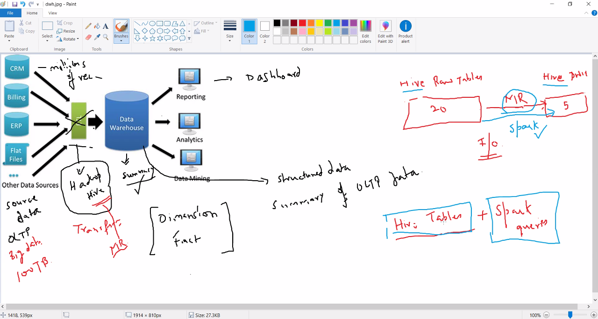

```text
create database raw_data;

use raw_data;

create t1
t2

100s tables


create database dwh

use dwh

create table fact
create table dim1
..
..
```

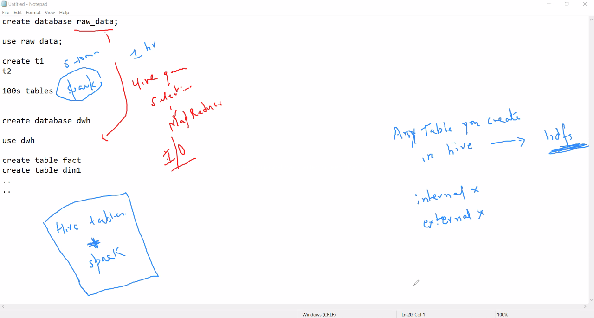
