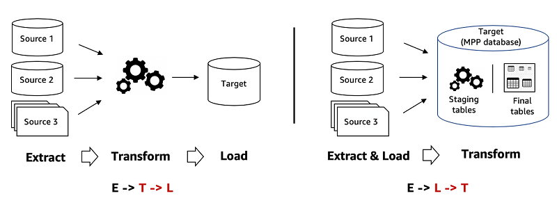

# Day 14 - BigDataTechnologies

## ORDER BY vs. SORT BY


- When analyzing data in Apache Hive, sorting data is essential
- allows us to organize information in specific order
- makes easier to identify trends, patterns and relationships
- We have two methods to sort data
  1. `ORDER BY`
  2. `SORT BY`
- Choosing the right method to sort can impact efficiency

### `ORDER BY` - Single Reducer

1. sorts all of the data on all reducers
2. **slower**, as it takes up all the reducers
3. it sorts all of the dataset based on the specified column(s)
4. guarantees a total order of the results, means that all records are sorted according to the specified column
5. can be used **for one or more columns** for sorting
6. entire result set is sorted in memory on the reducer before being returned
7. is a resource-intensive task, since all the records are shuffled on a single reducer, might even lead to Out-of-Memory errors

```sql
SELECT *
FROM table1
ORDER BY col1 ;
```

> Better performance is traded for total ordering

### `SORT BY` - Multiple Reducers

1. sorts only the data within one reducer
2. **faster**, works with only one reducer at the end
3. used to sort each reducer's output individually
4. does not guarantee a total order of the final result set, means output of individual reducer is sorted, but data is not sorted across all reducers in a global manner
5. can only be used **for a single column** for sorting
6. `SORT BY` can be more efficient than `ORDER BY` for large datasets, since sorting takes place in a parallel manner across reducers
7. typically used when total order of result set is not necessary, such as using with `LIMIT` clause

```sql
SELECT *
FROM table1
SORT BY col1 ;
```

## OLTP vs. OLAP

### OLTP

1. stands for OnLine Transaction Processing
2. for manual punching/entry of source data into database
3. Example: depositing money into bank account, so cashier creates a manual entry
4. enables **real-time** execution of large number of database **transactions** by large number of people, typically over the internet
5. behind many of our everyday transactions, like ATM transactions, hotel reservations
6. can also drive non-financial transactions, including password changes, text messages
7. uses a Relational Database that can do following
    1. process a large number of relatively smaller transactions, usually inserts, updates & deletes
    2. enables **multi-user access** to the same data, while ensuring data integrity
    3. support very **rapid processing**, with response times measured in milliseconds
    4. provide indexed data sets for rapid search & retrievals
    5. be **available 24/7/365**, with constant **incremental backups**
8. Many organizations use OLTP systems to provide data for OLAP, thus utilizing a combination of both OLTP and OLAP

### OLAP

1. Stands for OnLine Analytical Processing
2. for automated entry into database using OLAP to update Fact Table and showing data at dashboard
3. Example: orders on an eCommerce website, updating fact tables to reload data on dashboard
4. is a system for performing multi-dimensional analysis at **high speeds** on **large volumes** of data
5. Typically, data comes from a data warehouse, data mart or some other centralized data store
6. Ideal for **data mining**, **business intelligence** and **complex analytical calculations**, as well as business reporting functions such as financial analysis, budgeting and sales forecasting

#### Data Dimension

- One element of a particular dataset
- Example: Sales figures might have several dimensions related to region, time of year, product models, etc.

#### OLAP Cube

- The core of most OLAP databases is OLAP Cube
- allows you to quickly query, report and analyze multi-dimensional data
- OLAP Cube extends the row-column format of a traditional relational database schema and adds layers for other data dimensions
- Example: the top layer of a cube might organize sales by region, which can also be drilled-down into layers for sales by state, city, etc.
- The historical, aggregated data for OLAP is usually stored in a Star-Schema or Snowflake-Schema

## Data Warehouse


1. Data warehouse design is as per report/dashboard
2. Stores structured  data in summary
3. Idea is to read data, not processing
4. ETL is done by Hadoop developers to get data for analytical tools like Informatica, etc.
5. is a centralized repository that stores structured data and semi-structured data for the purpose of reporting and analysis
6. data comes from a variety of sources like PoS systems, business apps, relational databases, and then cleaned & standardized before it hits data warehouse
7. Typically used for Business Intelligence (BI), reporting and data analysis
8. With large amounts of information that it can store, it provides easy access to historical data, used for mining, Visualization and other business reporting


### Data Mart

- A subset of a Data warehouse, tailored for a specific business line or team, focused on a particular subject area like, sales, finance, etc.
- used to analyze department-specific information more efficiently

### ETL and ELT on Data Warehouse

- ETL (Extract, Transform, Load) and ELT (Extract, Load, Transform) are two different approaches for analytics



#### ETL

1. ETL approach uses a set of business rules to process data from several sources before centralized integration/loading
2. ETL transforms data on a secondary processing server, and then loads it into data warehouse
3. it transforms data from one structured format into another format, and then loads it
4. Loading data into warehouse is slower since it needs to transform first
5. Need to develop custom solutions to mask Personally Identifiable Information (PII) and protect data for compliance & regulations

#### ELT

1. ELT approach loads data as it is and then transforms it at a later stage, depending on the use case and analytic requirements
2. ELT first loads data into the warehouse in its original format first, and then it can be transformed as it is processed, whenever and as many times it is needed
3. it handles all types of data including unstructured data, so it loads all formats of data into target data warehouse, and then data can be transformed into the format as per requirement
4. Loading data into warehouse is faster since it directly loads data and then transforms it in parallel using a secondary server, thus providing near real-time data transformation
5. it provides granular access control and multi-factor authentication directly within data warehouse, making easier to meet compliance & regulations

### Types of Tables in Data Warehouse

1. Data Warehouse has following set of tables
    1. Dimension Tables
    2. Fact Tables

#### Fact Table

- Table that stores the measurements, metrics, or facts related to a business operation
- located at the centre of a Star Schema or Snowflake Schema, and is surrounded by Dimension Tables
- When multiple Fact Tables are used, they can be organized using a **Fact Constellation Schema**
- A Fact Tables has two types of columns
  1. columns that contain facts
  2. columns that server as foreign keys linking to Dimension Tables
- The primary key of a Fact Tables is often a composite key made up of all the foreign keys in the table
- Fact Tables can hold various measurements, such as additive, non-additive, partly additive measures, and store store important information in the data warehouse
- useful for evaluating dimensional attributes because they provide additive values that can act as independent variables

##### Granularity of a Fact Table

- Fact Table Grain is the level of detail or depth of the information recorded in a Fact Table
- A Successful Fact table is designed at the highest level
- The grain of a Fact Table refers to the most basic level at which the facts can be defined to provide detailed data
- Example: The grain of a sales Fact Table might be "sales volume by day by product by the shop", meaning each entry in the table is uniquely identified by a day, product, shop. While other dimensions such as location or region, may also be included in the Fact Table, but they do not contribute to the uniqueness of an entry. These extra dimensions are called **Affiliate Dimensions**, which can provide additional information to slice and dice, but they usually provide insights at a higher level of aggregation

#### Dimension Table

- Contain descriptions of the objects in a Fact Table, provides information about dimensions such as values, characteristics, keys
- Dimension Table refers to a set of data related to any quantifiable event and is the foundation for Dimensional Modelling
- Dimension Tables are usually small, with a row number ranging from a few hundred to a few thousand
- It has a primary key column, allowing each dimension row to be uniquely identifiable, which is used to link the Dimension Table to a Fact Table
- A **Surrogate key** is a system generated key, often used to uniquely identify the rows in the Dimension Table

### Types of Schemas in Data Warehouse

- Schema is the logical description of the entire database
- Includes names and description of records of all records types including all associated data-items and aggregates
- While a database uses Relational Model, a Data Warehouse uses Star Schema, Snowflake Schema or Fact Constellation Schema

#### Star Schema

- Each dimension in a Star Schema is  represented by only one-dimension table
- This Dimension table contains the set of attributes
- Below diagram shows the sales data of a company with respect to the four dimensions, namely time, item, branch and location


- The Fact Table is at the center, it contains keys to each of the dimensions
- The Fact Table also contains the attributes, such as dollars_sold and units_sold
- Each Dimension has only one Dimension Table, and each table holds a set of attributes

#### Snowflake Schema

- Some dimension tables in Snowflake Schema are normalized
- The normalization splits up the data into additional tables
- Unlike Star Schema, the dimensions in a Snowflake Schema are normalized
- Example: the item dimension table in Star Schema can be normalized into two Dimension Tables, item and supplier


- Now the supplier_key attribute in item Dimension Table is linked to supplier Dimension Table
- Due to normalization in Snowflake Schema, redundancy is reduced, so it becomes easy to maintain and saves storage space

#### Fact Constellation Schema

- A Fact Constellation has multiple schemas
- Also known as **Galaxy Schema**
- The following diagram shows two Fact Tables, sales and shipping


- The sales Fact Table is same as that in the Star Schema
- The shipping Fact Table also contains two measures, dollars_sold and units_sold
- It is possible to share Dimension Tables between Fact Tables, e.g., time, item and location Dimension Tables are shared between sales and shipping Fact Tables

### Slowly Changing Dimension (SCD) Tables

- Dimension Tables designed to manage and track changes over time
- Since Data warehouses are used to analyze historical data, so it is essential to store the different states of data
- Choosing the right type of SCD is important as it depends on the business requirements for reporting and analysis, and it might have performance implications, especially as data volume grows

#### Types of Slowly Changing Dimension (SCD) Tables

1. **Type 0 (Passive/Fixed Method)**
    - used where **historical accuracy is not important**, and data is constantly updated
    - original values are replaced with new data without maintaining history
    - very simple implementation
    - Example
      - Source

        | ID | Name | Salary | Fax Number |
        | -- | -- | -- | -- |
        | 123 | Vivek | 10000 | 123-456-789 |

      - DWH table

        | ID | Name | Salary | Fax Number |
        | -- | -- | -- | -- |
        | 123 | Vivek | 10000 | 456-123-8899 |

2. **Type 1 (Overwrite)**
    - used where most recent value is necessary, such as corrections to data
    - existing records are **updated directly** maintaining latest snapshot, previous values are lost
    - easy to manage, but supports **no historical reporting**
    - might include structured approaches for updates, often aligned with business rules
    - Example
      - Lets say, we just loaded data into DWH by taking a snapshot
        - Source

            | ID | Name | Salary | Designation |
            | -- | -- | -- | -- |
            | 123 | Vivek | 10000 | Developer |

        - DWH table

            | ID | Name | Salary | Designation |
            | -- | -- | -- | -- |
            | 123 | Vivek | 10000 | Developer |

      - Now we realize that there is error in this record, so we update in the source
        - Source

            | ID | Name | Salary | Designation |
            | -- | -- | -- | -- |
            | 123 | Vivek Goel | 40000 | Lead |

        - DWH table

            | ID | Name | Salary | Designation |
            | -- | -- | -- | -- |
            | 123 | Vivek | 10000 | Developer |

      - Now, data is updated in the source, but mot reflected in DWH, so we'll again take a snapshot of the source and update it in DWH, so previous values are lost

        - Source

            | ID | Name | Salary | Designation |
            | -- | -- | -- | -- |
            | 123 | Vivek Goel | 40000 | Lead |

        - DWH table

            | ID | Name | Salary | Designation |
            | -- | -- | -- | -- |
            | 123 | Vivek Goel | 40000 | Lead |

3. **Type 2 (Add history as new row)**
    - used when it is essential to track historical changes over time
    - a **new record** is created for each change, usually including effective dates
    - allows for **complete historical tracking**, however it can lead to larger tables and more complex queries
    - Example
      - asa
        - Source

            | ID | Name | Salary | Office | Date Eff. |
            | -- | -- | -- | -- | -- |
            | 123 | Vivek | 10000 | Gurgaon | 10-Aug-13 |

        - DWH table

            | ID | Name | Salary | Office | From_date | To_date | Curr_Flag |
            | -- | -- | -- | -- | -- | -- | -- |
            | 123 | Vivek | 10000 | Gurgaon | 10-Aug-13 | 12-Aug-99 | Y |

      - asa
        - Source

            | ID | Name | Salary | Office | Date Eff. |
            | -- | -- | -- | -- | -- |
            | 123 | Vivek | 10000 | Gurgaon | 10-Aug-13 |

        - DWH table

            | ID | Name | Salary | Office | From_date | To_date | Curr_Flag |
            | -- | -- | -- | -- | -- | -- | -- |
            | 123 | Vivek | 10000 | Gurgaon | 10-Aug-13 | 09-Jan-15 | N |
            | 123 | Vivek | 40000 | California | 10-Jan-15 | 12-Dec-99 | Y |

4. **Type 3 (Add history as new column/attribute)**
    - used when it is important to maintain some history but not all changes
    - A **new column** is added to the existing record to store the previous value alongside the current value
    - provides **limited historical context** (usually only one prior value), can lead to complications if multiple changes occur
5. **Type 4 (Historical Table: Add a new Dimension)**
    - used when historical data needs to be maintained separately for performance or simplicity, such as tracking employee roles over time
    - Current Dimension values are kept in the main table, while historical values are stored in a **separate historical table**
    - improves query performance for querying current data, may complicate joins and queries for historical analysis
6. **Type 6 (Hybrid)**
    - used when a combination of current, previous and historical tracking is required, such as customer status changes and their effective dates
    - **combines Type2 and Type 3**, typically retains current value, previous values and a full history
    - provides **comprehensive historical tracking** but can be complex to manage and query

## Data Lakes

- Centralized repository/collection of data from different sources
- No data size limits
- Can store any type of data
- Hadoop may be called as Data Lake

### Need of Data Lakes

## Dashboard

## MapReduce vs. Spark
