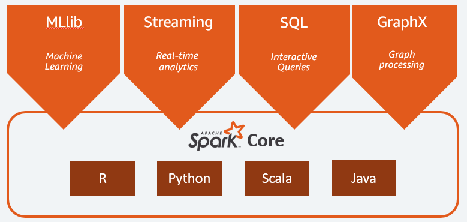

# Day 15 - BigDataTechnologies

## Apache Spark

1. Spark is ...
    - Not a modified version of Hadoop
    - A low latency cluster computing system
    - Separate, fast, MapReduce-like engine
      - In-memory data storage for very fast iterative queries
      - General execution graphs and powerful optimizations
      - 40x to 100x faster than Hadoop
      - 100x faster than MapReduce for iterative algorithms
    - Compatible with Hadoop's storage APIs
      - can read/write to any Hadoop-supported system, including HDFS, HBase, SequenceFiles, etc.
        
2. Apache Spark is an open-source distributed data processing engine for big data analytics, not a storage framework
3. utilizes in-memory caching, and optimized query execution for faster analytics against data of any size, it isn't tied to Hadoop's MapReduce two-stage paradigm to store and process data
4. It also provides APIs for Java, Scala, Python and R, making it accessible to more developers
5. supports code reusability across multiple nodes for batch processing, interactive querying, real-time analytics, machine learning and graph processing
6. initially started by Matei Zaharia at UC Berkeley's AMPLab in 2009, open-sourced in 2010, donated to Apache Software Foundation in 2013
7. in-memory processing makes repeated access to the same data much faster
8. Apache Spark can run as a standalone application OR on top of Hadoop YARN to read data from HDFS
9. Apache Spark includes a core data processing engine, as well as libraries for  SQL, Machine Learning, Stream Processing and Graph processing
10. Apache Spark can read from and write to a variety of storage types including HDFS, text files, etc.

## Data Sharing in Hadoop MapReduce vs Apache Spark

1. In Hadoop
    1. It has a filesystem for storage and computer power for processing on each data node
    2. After each iteration in a job, it writes data back to HDFS, increasing overhead in processing time and cost
    3. Data needs to be read from HDFS before each iteration, and final output is written again to the HDFS
    4. For each query, data needs to be read separately to produce different results, this read for each new query increases more overhead in time and cost
    
2. In Apache Spark
    1. It has no filesystem for storage, instead caches data on RAM while processing, it is purely for processing framework
    2. It is a new thing, not a modified version of Hadoop
    3. It can read/write from/to any source like HDFS, Hive, Oracle, etc.
    4. Since it uses in-memory processing, so it requires more RAM, making it expensive than Hadoop
    5. Even for each iteration in a job, it keeps data on RAM and uses that for next iteration, does not writes back to the storage after each iteration, instead writes back to storage after complete processing, making it faster
    6. Data is once loaded into RAM which can be used to process different queries, each producing a different result, reducing the read overhead for different queries
    

## Apache Spark Components

- Apache Spark has following components

### 1. Cluster Manager

- Spark can operate with following kinds of Cluster Manager to manage its cluster(s)

1. **Spark Standalone**
    - A simple cluster manager included with Spark to run Spark apps on cluster of machines
    - Suitable for small clusters or development environments
    - It has Masters and number of workers with configured amount of memory and CPU cores
    - In Cluster mode, Spark allocates resources based on the cores, by default, an app will grab all the cores in the cluster
    - To check the application, each Spark app has a Web UI providing information on executors, storage usage, tasks, etc.
    - For High Availability, *ZooKeeper Quorum* helps in automatic recovery of Master node; Cluster tolerates the worker failure despite Master recovery is enabled or not
    - For Security, Spark supports authentication via a Shared-Secret with all the cluster Managers, and Standalone Manager requires user to configure each of the nodes with the Shared-Secret, data transfer can be can be encrypted using *Secure Sockets Layer (SSL)* for communication protocols, and *Simple Authentication and Security Layer (SASL)* for block transfers, access to Spark UI is restricted using *Access Control List (ACL)*
    - For monitoring, it has a Web UI to view cluster and job statistics, log outputs for each job, Applications' UI is created using Spark UI to show event logs (if any) for that application
2. **Apache Mesos**
    - Apache Mesos support is deprecated as of Apache Spark 3.2.0
    - A distributed systems kernel that abstracts across a cluster
    - can run multiple types of applications such as Spark, Hadoop, on the same cluster for efficient resource utilization
    - allows applications to request and release resources dynamically as needed
    - provides fault tolerance and scalability, making it suitable for large and complex
    - uses node abstraction to allow a variety of workloads on a node, decreasing overhead of allocating a specific machine for different workloads
    - Mesos uses reverse-virtualization, combining multiple physical resources into a single virtual resource
    - Mesos has three components
      1. **Mesos Master :** it is an instance of cluster, a cluster has many Mesos Masters to provide fault tolerance, out of which only one instance is the leading master
      2. **Mesos Slave :** a Mesos instance that offers resources to the cluster, Mesos master assigns tasks to the Mesos slave
      3. **Mesos Framework :** allows applications to request resources from the cluster
    - Some other frameworks that use Mesos are Chronos, marathon, Aurora, Hadoop, Spark, Jenkins, etc.
    - For High Availability, it uses *Apache ZooKeeper* for automatic recovery of Master Node, incase of failover, task execution is not stopped
    - For security, Mesos provides security to any entity interacting with Cluster, each of those entities can be enabled to use authentication, Custom modules can be used to replace Mesos default authentication module Cyrus SASL, By Default communication between modules in unencrypted while SSL/TLS can be enabled to encrypt communication, Mesos uses *Access Control List (ACL)* to provide access to services
    - For monitoring, Mesos supports per container network monitoring and isolation, providing many metrics including allocated CPU, memory usage, etc. for Master Node and Slave Nodes accessible with URL
3. **Hadoop YARN**
    - YARN stands for Yet another Resource Negotiator, which is a sub-project of Hadoop
    - It bifurcates the functionality of Resource Manger and Job Scheduling into different daemons, providing a global Resource Manager (RM) and a per-application Application Master (AM), an application is either a DAG or an individual job
    - It is a combination of Resource Manger and Node Manager
      - **YARN Resource Manager** manages resources among all the applications, it has a Job Scheduler and Application Manager (AM)
        - **Job Scheduler** allocates resources to applications, and monitors the application status
        - **Application Manager (AM)** manages applications across all the nodes
      - **YARN Node Manager**  contains Application Master and Container
        - **Container** is a place where actual processing takes place in an isolated manner, Each task of MapReduce runs in one container, an application requires one or more containers
        - **Application Master** is a per-application framework aimed to negotiate resources from Resource Manager, works with Node Manager(s) to monitor tasks for resource needs
    - YARN allows to share and configure the same resource pool between all the framework that runs on YARN, likely pre-installed on Hadoop
    - For High Availability, it supports manual recovery of Master Node, and can use *ZooKeeper* based *ActiveStandBy* embedded in the Resource Manager for automatic recovery, doesn't require a separate ZooKeeper failover controller
    - For Security, it has security for authentication using *Access Control List (ACL)* for Hadoop services and Web UIs, Service Level Authorization to provide authority to client, SSL for encryption of communication between clients and services
    - For monitoring, YARN has a Web UI for Resource Manager and Node Manager, Resource Manager UI provides metrics for clusters, and Node Manager UI provides information for each node, applications and containers running on that Node
4. **Kubernetes**
    - A container orchestration platform to manage containerized applications
    - suitable for cloud-native applications and environments using containers
    - Allows Spark to run as containers, scaling applications easily based on resource needs
    - Kubernetes API creates a driver pod that manages the application and launches executor pods for processing tasks
    - When an application completes, the executor pods terminate and are cleaned up, but driver pod persists logs and remains in completed state in Kubernetes API until it's eventually garbage collected or manually cleaned up
    - Kubernetes handles the lifecycle for both driver and executor pods ensuring job scheduling
    - It can scale the number of executor pods based on workload, runs multiple instances of Spark driver in different pods to enhance availability
    - For High Availability, It monitors health of nodes in a cluster, If a pod crashes, either driver or Executor, it automatically restarts that pod, providing automatic recovery
    - For Security, it supports *Role-Based Access Control (RBAC)* based on external authentication mechanisms like LDAP, etc., allows to define network policies, manages secrets using Kubernetes API

### 2. Spark Workloads

- The Spark framework includes following workloads
  1. Spark Core as the foundation for the platform
  2. Spark SQL for interactive queries
  3. Spark Streaming for real-time analytics
  4. Spark MLlib for machine learning
  5. Spark GraphX for graph processing

  

#### 1. Spark Core

- All the functionalities in Apache Spark are built on top of Spark Core
- It is responsible for memory management, fault recovery, scheduling, distributing & monitoring jobs, and interacting with storage systems
- It is exposed through an API built for Java, Scala, Python and R, to hide the complexity of distributed computing behind simple high-level operators
- Spark Core is the home to the API that consist of `Resilient Distributed Dataset (RDD)` and provides APIs for building and Manipulating RDDs, Spark RDD handles partitioning data across all the nodes in a cluster, holds the memory pool of the cluster as a single unit
  - Two operations are performed on RDDs
    1. **Transformation :** produces new RDD from existing RDD, executed in a lazy evaluation fashion
    2. **Action :** allows to work on actual dataset to produce results, triggers execution of transformations

#### 2. Spark SQL

- Spark SQL is a framework for structured big data processing on a distributed query engine
- It provides low-latency interactive queries up to 100x faster than MapReduce
- It allows Spark to access Metadata about data and computation for extra optimizations
- It includes Cost-Based Optimizer (CBO), columnar storage, code generation for faster queries, etc., while scaling to thousands of nodes
- It allows Business Analysts to  use standard SQL or Hive Query Language (HQL) for querying data
- It allows developers to use APIs available in Scala, Java, Python and R
- It supports various data-sources out-of-the-box including JDBC, ODBC, JSON, HDFS, Hive, ORC and Parquet
- It supports popular data stores like Amazon Redshift, Amazon S3, Couchbase, MongoDB, Salesforce, ElasticSearch,  and others all of which can be found at [Spark Packages](https://spark-packages.org/?q=tags%3A%22Data%20Sources%22)
- It provides `DataFrame` API to work with different structured data sources such as Hive, Avro, Parquet, ORC, JSON, JDBC
- It uses Cost-Based Optimizer (CBO) to optimize query execution plans
- It Used for tabular or structured schema to create DataFrames

#### 3. Spark Streaming

- Spark Streaming provides scalable, high-throughout fault tolerant stream processing of streaming data
- It is a real-time analytics solution that leverages Spark Core's fast scheduling capability to perform streaming analytics
- It ingests data in micro-batches to enable analytics on that data with the same application code written for batch analytics, providing fault tolerance
- It improves developer productivity, since same code for batch processing can be abstracted to use for streaming applications
- Once data from live stream is captured, it can be sent to file system, databases or live dashboards
- Spark Streaming supports data from twitter, Apache Kafka, Apache Flume, HDFS, Amazon Kinesis, TCP sockets, and many more all of which can be found at [Spark Packages](https://spark-packages.org/?q=tags%3A%22Streaming%22) ecosystem
- It works in three stages
  1. **Gathering**
      - It provides two types of built-in streaming sources
        1. **Basic Sources :** includes sources available in `StreamingContext` API such as File systems and socket connections
        2. **Advanced Sources :** includes sources like Apache Kafka, Apache Flume, Amazon Kinesis, etc. available through extra utility classes
  2. **Processing**
      - The gathered data is processed using complex algorithms with a high-level function, such as MapReduce, Join and window
  3. **Data Storage**
      - The processed data is then pushed to file systems, databases and live-dashboards
      - Spark Streaming also provides high-level abstraction, also known as `Discretized Stream` or `DStream`
      - `DStream` in Spark signifies continuous stream of data, which can be formed either using sources such as Apache Kafka, Apache Flume, and Amazon Kinesis or by high-level operations on other DStreams
      - DStream is internally a sequence of RDDs

#### 4. Spark MLlib

- It is a library to perform Machine Learning on data at scale
- It is aimed to make Machine Learning scalable and easy
- Machine Learning models can be trained by Data Scientists with R and Python on any Hadoop data source, saved using MLlib, and imported into a Java or Scala-based pipelines to build complex workflows
- Spark was designed for fast, interactive computation that runs in-memory, enabling Machine Learning to run quickly
- It provides tools for  feature extraction, transformation and model evaluation
- The algorithms in MLlib have the ability to perform classification, regression, clustering, collaborative filtering and pattern mining, and some lower-level Machine Learning primitives such as Gradient Descent are also present in it
- In Spark v2.0, the `RDD` based API in `spark.mllib` package was put in maintenance, making the `DataFrame` based API as the primary Machine Learning API for Spark, MLlib will not add any new features in RDD based API instead it is only maintained
- The reason to switch to DataFrame based API in MLlib is that it is more user-friendly than RDD based API
- DataFrame based API for MLlib includes Spark Data Sources, SQL DataFrame queries, `Tungsten` and `Catalyst` Optimizations and uniform API across languages
- MLlib also uses linear algebra package `Breeze`, which is a collection of  libraries for numerical computing and Machine Learning
- For Machine Learning

#### 5. Spark GraphX

- Spark GraphX is a distributed graph processing framework built on top of Spark
- It provides ETL, EDA, and iterative graph computation to enable users to interactively build and transform a graph data structure at scale
- It comes with a highly flexible API, and a selection of distributed Graph algorithms
- For Entity Relationships

## Data Flow in Spark

## Apache Spark APIs

### PySpark

### SparkR

## Apache Spark Architecture

### Resilient Distributed Dataset (RDD)

### Directed Acyclic Graph (DAG)

### Spark Execution Modes

#### Local Execution Mode

#### Client Execution Mode

#### Cluster Execution Mode

### DataFrame

### Dataset

### RDD

#### Lazy Evaluation

### Actions and Transformations

## Apache Spark Programming Model

## Fault Tolerance in Apache Spark

## Apache Spark Hands-on (Transactions dataset)

### Starting PySpark

### Find the Category of Transactions with Highest Net Value

## reduceByKey() & sortBy()
