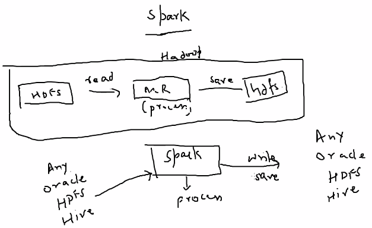
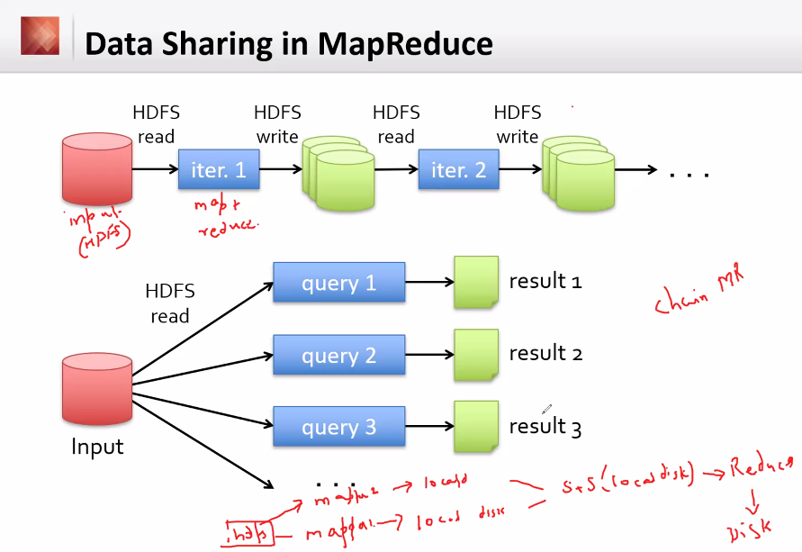
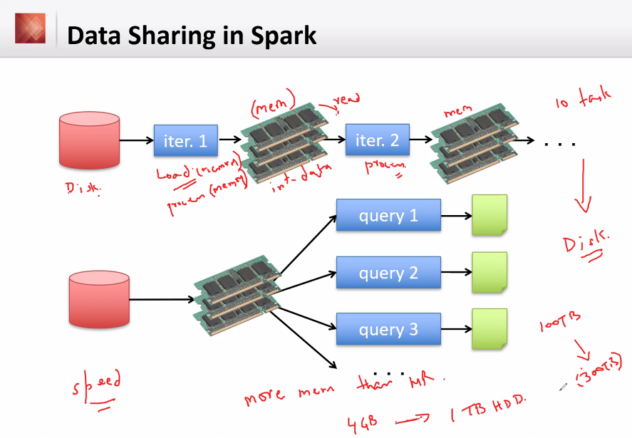
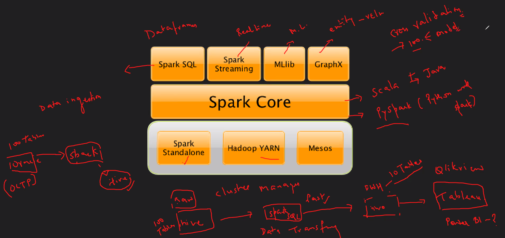

# Day 15 - BigDataTechnologies

## Apache Spark

1. Spark is ...
    - Not a modified version of Hadoop
    - A low latency cluster computing system
    - Separate, fast, MapReduce-like engine
      - In-memory data storage for very fast iterative queries
      - General execution graphs and powerful optimizations
      - 40x to 100x faster than Hadoop
      - 100x faster than MapReduce for iterative algorithms
    - Compatible with Hadoop's storage APIs
      - can read/write to any Hadoop-supported system, including HDFS, HBase, SequenceFiles, etc.
        
2. Apache Spark is an open-source distributed data processing engine for big data analytics, not a storage framework
3. utilizes in-memory caching, and optimized query execution for faster analytics against data of any size, it isn't tied to Hadoop's MapReduce two-stage paradigm to store and process data
4. It also provides APIs for Java, Scala, Python and R, making it accessible to more developers
5. supports code reusability across multiple nodes for batch processing, interactive querying, real-time analytics, machine learning and graph processing
6. initially started by Matei Zaharia at UC Berkeley's AMPLab in 2009, open-sourced in 2010, donated to Apache Software Foundation in 2013
7. in-memory processing makes repeated access to the same data much faster
8. Apache Spark can run as a standalone application OR on top of Hadoop YARN to read data from HDFS
9. Apache Spark includes a core data processing engine, as well as libraries for  SQL, Machine Learning, Stream Processing and Graph processing
10. Apache Spark can read from and write to a variety of storage types including HDFS, text files, etc.

## Data Sharing in Hadoop MapReduce vs Apache Spark

1. In Hadoop
    1. It has a filesystem for storage and computer power for processing on each data node
    2. After each iteration in a job, it writes data back to HDFS, increasing overhead in processing time and cost
    3. Data needs to be read from HDFS before each iteration, and final output is written again to the HDFS
    4. For each query, data needs to be read separately to produce different results, this read for each new query increases more overhead in time and cost
    
2. In Apache Spark
    1. It has no filesystem for storage, instead caches data on RAM while processing, it is purely for processing framework
    2. It is a new thing, not a modified version of Hadoop
    3. It can read/write from/to any source like HDFS, Hive, Oracle, etc.
    4. Since it uses in-memory processing, so it requires more RAM, making it expensive than Hadoop
    5. Even for each iteration in a job, it keeps data on RAM and uses that for next iteration, does not writes back to the storage after each iteration, instead writes back to storage after complete processing, making it faster
    6. Data is once loaded into RAM which can be used to process different queries, each producing a different result, reducing the read overhead for different queries
    

## Apache Spark Components

- Apache Spark has following components

### 1. Resource Manager

- Spark can operate with following kinds of Resource Managers (RM) to manage its cluster(s)

1. **Spark Standalone**
    - A simple cluster manager included with Spark to run Spark apps on cluster of machines
    - Suitable for small clusters or development environments
    - It has Masters and number of workers with configured amount of memory and CPU cores
    - In Cluster mode, Spark allocates resources based on the cores, by default, an app will grab all the cores in the cluster
    - To check the application, each Spark app has a Web UI providing information on executors, storage usage, tasks, etc.
2. **Apache Mesos**
    - Apache Mesos support is deprecated as of Apache Spark 3.2.0
    - A distributed systems kernel that abstracts across a cluster
    - can run multiple types of applications such as Spark, Hadoop, on the same cluster for efficient resource utilization
    - allows applications to request and release resources dynamically as needed
    - provides fault tolerance and scalability, making it suitable for large and complex
    - uses node abstraction to allow a variety of workloads on a node, decreasing overhead of allocating a specific machine for different workloads
    - Mesos uses reverse-virtualization, combining multiple physical resources into a single virtual resource
    - Mesos has three components
      1. **Mesos Master :** it is an instance of cluster, a cluster has many Mesos Masters to provide fault tolerance, out of which only one instance is the leading master
      2. **Mesos Slave :** a Mesos instance that offers resources to the cluster, Mesos master assigns tasks to the Mesos slave
      3. **Mesos Framework :** allows applications to request resources from the cluster
    - Some other frameworks that use Mesos are Chronos, marathon, Aurora, Hadoop, Spark, Jenkins, etc.
3. **Hadoop YARN**
    - YARN stands for Yet another Resource Negotiator, which is a sub-project of Hadoop
    - It bifurcates the functionality of Resource Manger and Job Scheduling into different daemons, providing a global Resource Manager (RM) and a per-application Application Master (AM), an application is either a DAG or an individual job
4. **Kubernetes**

### 2. Spark Core API

- All the functionalities in Apache Spark are built on top of Spark Core
- It delivers speed by providing in-memory computation, so it is a foundation for parallel and distributed computing in Spark
- Spark Core is the home to the API that consist of `Resilient Distributed Dataset (RDD)`

### 3. SparkSQL

- Used for tabular or structured schema to create DataFrames

### 4. Spark Streaming

- For Real-time processing

### 5. MLib

- For Machine Learning

### 6. GraphX

- For Entity Relationships

## Data Flow in Spark

## Apache Spark APIs

### PySpark

### SparkR

## Apache Spark Architecture

### Resilient Distributed Dataset (RDD)

### Directed Acyclic Graph (DAG)

### Spark Execution Modes

#### Local Execution Mode

#### Client Execution Mode

#### Cluster Execution Mode

### DataFrame

### Dataset

### RDD

#### Lazy Evaluation

### Actions and Transformations

## Apache Spark Programming Model

## Fault Tolerance in Apache Spark

## Apache Spark Hands-on (Transactions dataset)

### Starting PySpark

### Find the Category of Transactions with Highest Net Value

## reduceByKey() & sortBy()
