# 01.01 Complete Machine Learning In 6 Hours | Krish Naik- Practice

## Types of Analytics

- To make decisions based on some data, we have following ways:

1. Predictive Analytics
    - helps to identify trends, correlations and causation within datasets
    - e.g. in healthcare, to forecast regions which will experience a rise in flu cases
2. Prescriptive Analytics
    - predicts likely outcomes
    - e.g. makes decision recommendations like when a tire will wear out and need to be replaced
3. Diagnostic Analytics
    - helps pinpoint the reason an event occurred
    - e.g. Manufacturers can analyze a failed components on an assembly line and figure out the reason behind its failure
4. Descriptive Analytics
    - evaluates the qualities and quantities of a dataset
    - e.g. a content streaming provider might use descriptive statistics to understand how many subscribers he's lost or gained over a given period of time and what kind of content is being watched

## Data Science Lifecycle

1. Identify the Problem
    - to identify a problem or opportunity
2. Data Mining
    - to extract the data relevant to that problem or opportunity from large datasets
3. Data Cleaning
    - to fix errors & redundancies
4. Data Exploration
    - Data Exploration analysis is to try to make sense of that data
5. Feature Engineering
    - to use domain knowledge to extract details from the data
6. Predictive Modeling
    - to use data to predict or forecast future outcomes and behaviors
7. Data Visualization
    - to represent the data with graphical tools such as charts and animations

## Agenda

1. Introduction to ML (AI vs. ML vs. DL vs. DS)
2. Supervised ML and Unsupervised ML
3. Linear Regression (Maths & Geometric Intuition)
4. R²  & Adjusted R²
5. Ridge and Lasso Regression

## AI vs. ML vs. DL vs. DS

### AI (Artificial Intelligence)

- Imagine the entire universe, it can be called as AI
- When talking about AI, it means Artificial Intelligence
- You're creating an AI application if you'reworking in these roles
  - Machine Learning Developer
  - Deep Learning Developer
  - Vision Developer
  - Data Scientist
  - AI Engineer
- To define Artificial Intelligence (AI), you can say that it is a process where we create some kind of application in which it will be able to do its task without any human intervention
- A person need not monitor an AI application, it will be able to take decisions, perform its tasks, and do many other things
- E.g.
  - Netflix has an AI model
    - Suppose you watch an action movie for some time, then the AI work that is implements here is called recommendation. When you are continuously watching action movies, then automatically the AI model of Netflix will make sure that it will give us recommendation on action movies
    - If you watch comedy movie, it will give us recommendations for comedy movies
    - This recommendation system understands your behavior and it is being able to do its task without asking you anything
  - Amazon also has an AI model
    - If you buy an iPhone, then it may recommend you headphones
    - Such kund of AI model is integrated in Amazon website that will recommend similar things
  - YouTube Ads
    - The Ads that you see when you watch a video on YouTube, those are also recommended using an AI engine that is included in YouTube website which really plays for a business driven goal
  - Self Driving Cars
    - Tesla has self driving cars, based on the road conditions, it is able to drive it automatically with the help of an AI application integrated with the car itself
- It is the business driven things that we basically do with the help of AI

### ML (Machine Learning)

- It is a subset of AI
- It provides statstools to analyze, visualize the data and do predictions and forecasting
- You'll se a lot of Machine Learning Algorithms, and internally those Machine Learning Algorithms uses statstools, because when we work with data statistics it is definitely very much important
- Machine Learning (ML) is a subset of Artificial Intelligence (AI)

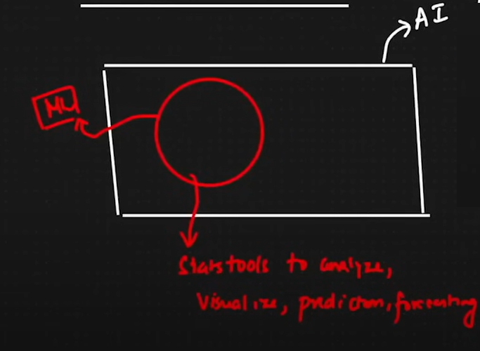

### DL (Deep Learning)

- Deep Learning (DL) is a subset of Machine Learning (ML), which is a subset of Artificial Intelligence (AI)
- In 1950-60s, Scientists thought that can we make machine learnlike how human beings learn, so for that particular purpose, Deep Learning came into existence
- Here, the plan is to mimic Human Brain to implement & learn something

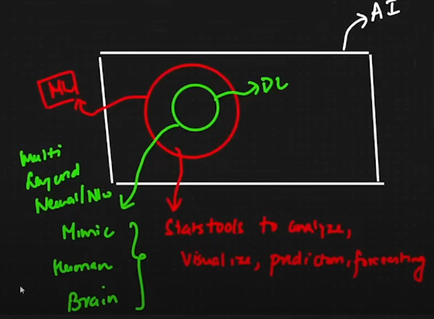

- For this, you use Multi-Layered Nerual Networks, and this Multi-Layered Neural Networks will basically help you to train the machines or applications that we're trying to create
- With the help of Deep Learning, we're able to solve such complex use cases

### DS (Data Science)

- If I come to Data Science, a Data Scientist is a part of every thing
- If you tell yourself as a Data Scientist and tomorrow you're given a business use case and situation comes that you probably have to solve the use case with the help of Machine Learning (ML) Algorithms or Deep Learning (DL) Algorithms, again the final goal is to create an Artificial (AI) Application
- You can't tell that you're a Data Scientist and you'll work only in Machine Learning (ML) or only in Deep Learning (DL)

## Machine Learning & Deep Learning

- For problem statements that we solve, the majority of busniess problems will fall majorly under two sections
  
1. Supervised Machine Learning
    1. Regression Problem
    2. Classification Problem
2. Unsupervised Machine Learning
    1. Clustering Problem
    2. Dimensionality Reduction Problem

> Reinforcement Learning can be considered as another type of Machine Learning

### 1. Supervised Machine Learning

- Consider a dataset which has

|Age    |Weight |
|:--    |:--    |
|24     |62     |
|25     |63     |
|21     |72     |
|27     |62     |

- Let's say that the task is to take this data and create a model which takes a new age and it should be able to give the output of weight
- First of all, we'll train this model with this data
- This model is also called `Hypothesis`

- There are two things that are important

1. Independent Feature
    - The inputs based on which the model is being trained are independent features
    - Here the `Age` is the independent Feature
2. Dependent Feature
    - Whatever will be predicted by the model as output is called Dependent Features
    - Here the `Weight` is the dependent feature

- `Weight` is dependent on `Age`, so when `Age` changes, `Weight` also changes
- Here, the model is fed with inputs and outputs and then model predicts based on its learning

#### 1. Regression Problem

- Suppose I take same example of `Age` and `Weight` as

|Age    |Weight |
|:--    |:--    |
|24     |72     |
|23     |71     |
|25     |71.5   |

- Here, Weight is the output variable which is the dependent feature
- Whenever we try to find output, we have it as a continuous variable

> If, it has a continuous variable, then it becomes a Regression Problem statement

- Suppose we're using this data set and we're populating it with the help of a scatter plot
  - Then, in order to solve this problem using linear regression, we'll try to draw/find a straight line which has an equation `y = mx + c`
  - With the help of this equation, we'll try to find out the predicted points
  - In this way, we solve a regression problem by finding out the predicted points

> In a regression problem, your output will always be a continuous variable

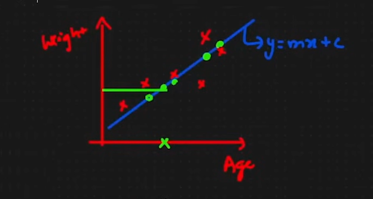

#### 2. Classification Problem

- Suppose I have a dataset

|No of Study hours  |No of play hours   |No of Sleep hours  |Output (Pass/Fail) |
|:--                |:--                |:--                |:--                |
|-                  |-                  |-                  |Pass               |
|-                  |-                  |-                  |Fail               |
|-                  |-                  |-                  |Pass               |
|-                  |-                  |-                  |Fail               |
|-                  |-                  |-                  |Pass               |

> Whenever you have a fixed number of categories, then it becomes a classification problem statement

- Here, in the above dataset, we have only two possible outputs, so it becomes a `binary classification problem`
- When you have more than two different categories, then it becomes a `Multi-Class Classification Problem`

### 2. Unsupervised Machine Learning

- There is no output feature/variable, machine learns from the unlabelled data

#### 1. Clustering

- Lets say that my dataset is

|Salary |Age    |
|:--    |:--    |
|50000  |24     |
|20000  |25     |
|25000  |23     |

- Now, in this scenario, we don't have any output variable/dependent variable

> The kind of assumptions that we can make from this dataset is called clustering where we'll make clusters 
> Clustering means that based on the the data, we'll try to find out similar groups

- Let's say I'm going to do *Customer Segmentation*
  - So, as per clustering, I'll try to find out similar groups of customers
  - Each of the groups of people will be referred as clusters
  - Each cluster will specify some information, for example which may be
    - `Cluster 1`: These people are very yound and were also able to get amazing salary
    - `Cluster 2`: These people have more age and have good salary
    - `Cluster 3`: These people does not have as much salary as per their age, might be considered as Middle-class people
  - Here, we're grouping as per clusters based on salary and age
  - There is no output feature/variable, so it comes under Unsupervised learning

> Understand that, Clustering is not a classification problem, it is a grouping problem

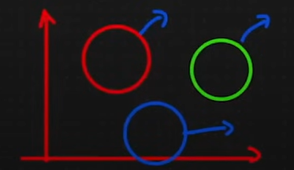

- Use case for clustering is
  - Customer Segmentation
    - Suppose, my company launches **product1** to target **rich people** for it, and **product2** is launched for **middle-class people**
    - So, my company can identify the groups as *rich people* or *middle-class people*, to target the ads for respective groups
    - This activity is called `Customer Segmentation`
    - Based on this customer Segmentation, we can later apply any kind of regression or classification

#### 2. Dimensionality Reduction

- Suppose, we have 1000 features/dimensions, can we reduce it to lower dimensions say 100 features/dimensions
- It is possible to reduce the dimensions with the help of Dimensionality Reduction Algorithms, such as `PCA`, `LDA`
- The idea is to reduce the count of features, in the cases where the count of features of is huge such that it can be reduced into a data set with count of features being few, so that machine can be trained while maintaining the sanity of the data set

## 1. Supervised Machine Learning Algorithms

- Supervised Machine Learning Algorithms include
    1. Linear Regression
    2. Ridge & Lasso Regression
    3. Logistic Regression
    4. Decision Tree
    5. Adaboost
    6. Random Forest
    7. Gradient Boosting
    8. Xg Boost
    9. Naive Bayes
    10. SVN
    11. KNN

### 1. Linear Regression Algorithms

- It has very simple Problem Statement haing two kinds of variables, independent variables and dependent variables
- Suppose I have two feaatures
    1. X : Age
    2. Y : Weight
- Based on these two features, I have some data points which are present here
- In Linear Regression, we try to create a model with the help of a training dataset, and then predict output upon taking the inputs
- This model is a kind of `Hypothesis Testing` Model, which takes the new Age and gives the outputs of the Weights, and then with the help of performance metrics, we verify whether this model is performing well or not
- In short, we try to find a best fit line which will actually help us to do the prediction, such that if I provide it a new age it should be able to predict an output

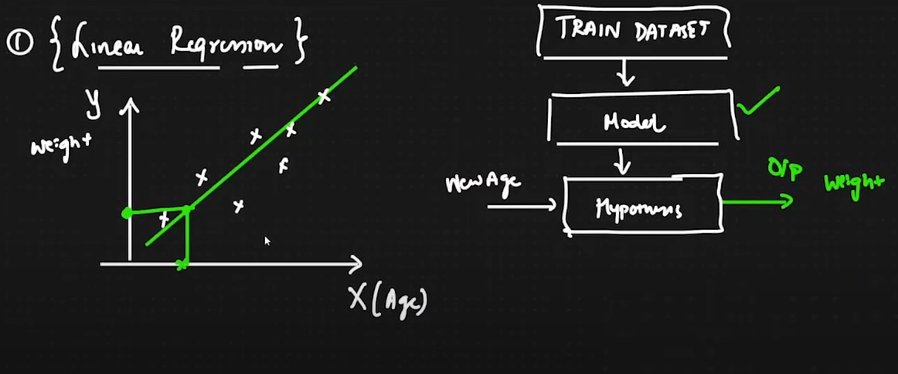

- From this graph/diagram, I can say that `y` is a linear function of `x`, i.e. `f(x)`
- When ever we say linear regression, it basically means that we're going to create a staright line
- Although we can create non-linear/non-straight/curved lines too using other algorithms, but linear regression means to create a straight line

#### Equation of a Linear Regression

- Linear regression is represented by the equation of a line which is
  - ${y = mx + c}$ , where
    - ${m}$ is the slope/gradient/coefficient
    - ${c}$ is the y-intercept that lies on the line
- This equation of line/linear regression is also represented by
  - ${y = β_0 + β_1x}$
  - ${h_{θ}(x) = θ_0 + θ_1x}$
    - it is Linear Hypothesis or linear regression model equation where
      - ${y}$ or ${h_{θ}(x)}$
        - hypothesis function, also known as model
        - predicts the output (dependent variable) based on the input variable 'x' (independent variable)
      - ${β_0}$ or ${θ_0}$
        - y-intercept of the linear model
        - shifts the line up or down
      - ${β_1}$ or ${θ_1}$
        - slope of the line or coefficient
        - determines the angle or steepness of the line
      - ${x}$
        - input variable
        - represents the features or independent variable
- As per Andrew NG, the equation of a straight line is
  - ${y = mx^{(i)} + c}$
  - ${y = β_0 + β_1x^{(i)}}$
  - ${h_{θ}(x^{(i)}) = θ_0 + θ_1x^{(i)}}$
- To understand what is ${θ_0}$ and ${θ_1}$, lets say we have a problem statement, where we have some data points and we're trying to create a best fit line
  - the best fit line is given by the equation ${h_{θ}(x) = θ_0 + θ_1x}$
  
  - 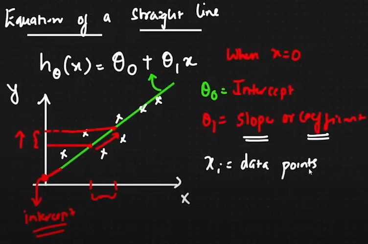
  
  - ${θ_0}$ is the intercept, which means when ${x = 0}$, then ${h_{θ}(x) = θ_0}$
    - The intercept basically indicates that at what point the best fit line meets the y-axis
  - ${θ_1}$ is the slope or coefficient
    - slope indicates the movement of y-axis coordinate when a point moves for one-unit of x-axis along the best fit line
  - ${x_i}$ denote the various data points along the best fit line

#### Aim of Linear Regression

- The aim of the Linear Regression is to find the best fit line in such a way that the distance between the data points that we have and the predicted data points should be minumum
- Suppose, we're trying to find a best fit line, we have to ensure that the sum of all the distances between each actual point and its respective predicted data point should be minumum
  - Only when the sum of all the differences of actual and predicted data points is minimum, then we can say that it is the best fit line of linear regression

- 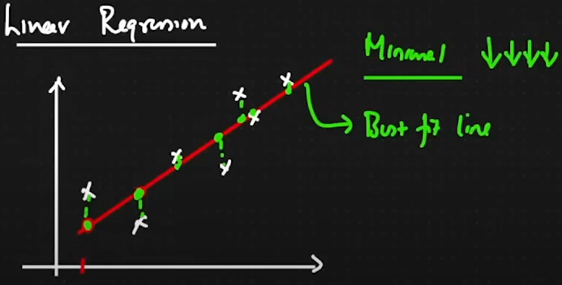

#### Cost Function

- To find the best fit line, we can't go like plotting multiple lines along the available data points and then select the best fit line amongst all the possible lines
- Instead, We need to start at one point and we should lead towards finding the best fit line
- To move towards finding the best fit line after plotting one data point, we use `Cost Function`
- The hypothesis is
${h_{θ}(x) = θ_0 + θ_1x}$
  - ${θ_0}$ and ${θ_1}$ are the weights that needs to be updated
- The Cost Function is used to find out the best fit line such that there is minimal distance between the data points and predicted data points, and cost function is implemented using the below equation which is the cost function equation
  - ${J(θ_0, θ_1) = \frac{1}{2m} ∑_{i=1}^{m} (h_{θ}(x^{(i)}) - y^{(i)})^2}$, where
    - ${h_{θ}(x^{(i)})}$
      - represents the predicted data points for respective input values of ${x}$
    - ${y^{(i)}}$
      - represents the actual data points for respective input values of ${x}$
    - ${(h_{θ}(x^{(i)}) - y^{(i)})^2}$
      - represents the square of the distance between the predicted data points and the actual data points
    - $∑_{i=1}^{m} (h_{θ}(x^{(i)}) - y^{(i)})^2$
      - represents the sum of the squares of all the distances between the predicted data points and their respective actual data points
    - ${m}$
      - represents the count of the data points
    - ${\frac{1}{m}}$
      - used with sum of squares of the distances to give the average
      - sum/count gives the average
    - ${\frac{1}{2}}$
      - used to simplify the equation for the partial derivation purpose, so that the while updating the weights ${θ_0}$ and ${θ_1}$, we try to find the partial derivative of the Cost Function and it becomes easier to find the partial derivative of the equation
      - The partial derivative of ${x^2}$ is given by ${\frac{∂(x^2)}{∂x} = 2x}$
      - this above partial derivative of  ${x^n}$ is given by the formula ${\frac{∂(x^n)}{∂x} = nx^{n-1}}$
      - when we find the partial derivative of ${J(θ_0, θ_1)}$, it becomes easier to solve it when the equation is divided by ${2}$, so it is again a function in the partial derivative form
  - The cost function is
  ${J(θ_0, θ_1) = \frac{1}{2m} ∑_{i=1}^{m} (h_{θ}(x^{(i)}) - y^{(i)})^2}$
    - it can also be represented in the derivative form as
    ${\frac{∂J(θ_0, θ_1)}{∂x} = 2J(θ_0, θ_1) = \frac{1}{m}∑_{i=1}^{m}(h_{θ}(x^{(i)}) - y^{(i)})^2}$
    - The `Cost function` may also be referred as `Squared Error Function`, because distance between the predicted data points and actual data points doesn't come out as a negative value in the sum function

#### What we need to solve in Linear Regression

- We need to minimize the Cost Function, ${min. J(θ_0, θ_1)}$
- To minimize the Cost Function, we adjust the parameters ${θ_0}$ and ${θ_1}$
- Let's compare with two different things while finding the line for linear regression
  1. Hypothesis Testing
  2. w.r.t. Cost Function

##### Hypothesis Testing & associated Cost Function

- The hypothesis is
  - ${h_{θ}(x) = θ_0 + θ_1x}$

1. If ${θ_0 = 0}$

    - It means that the best fit line passes through origin
    - when ${θ_0 = 0}$, then
      - Hypothesis is ${h_{θ}(x) = θ_0 + θ_1x}$
      - ${⇒}$ ${h_{θ}(x) = θ_1x}$
    - 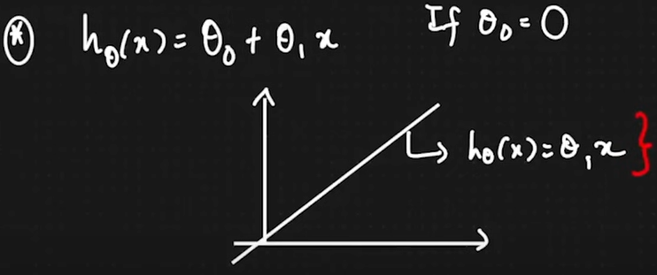
    - Lets consider, I have three actual data points `(1, 1)`, `(2, 2)` and `(3, 3)`
    - Now, keeping the y-intercept ${θ_0 = 0}$, and changing the value of slope/coefficient ${θ₁}$
      1. if ${θ_1 = 1}$
          - the predicted data points would be `(1, 1)`, `(2, 2)` and `(3, 3)`

          - 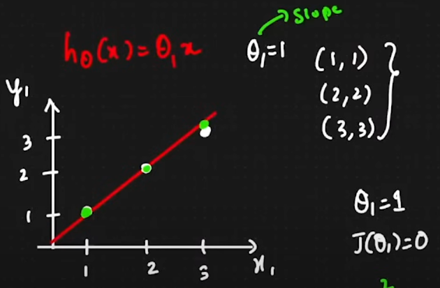
          - ${J(θ_1)} = \frac{1}{2\times3} ∑_{i=1}^{3} (h_{θ}(x^{(i)}) - y^{(i)})^2$
          - ${=\frac{1}{2\times3}[(1-1)^2 + (2-2)^2 + (3-3)^2]}$
          - ${= 0}$
          - the graph for Cost Function when ${θ_1 = 1}$ will be plotted as 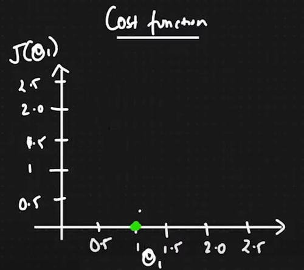
      2. if ${θ_1 = 0.5}$
          - the predicted data points would be `(1, 0.5)`, `(2, 1)` and `(3, 1.5)`

          - 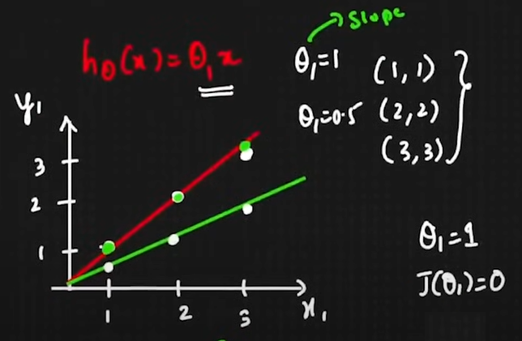
          - Here, Slope has decreased
          - ${J(θ_1)} = \frac{1}{2\times3} ∑_{i=1}^{3} (h_{θ}(x^{(i)}) - y^{(i)})^2$
          - ${=\frac{1}{2\times3}[(0.5-1)^2 + (1-2)^2 + (1.5-3)^2]}$
          - ${=\frac{1}{2\times3}[0.25 + 1 + 2.25]}$
          - ${≈ 0.58}$
          - The graph for Cost Function when ${θ_1 = 1}$ will be plotted as 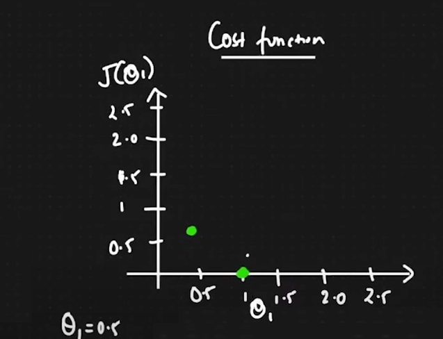

      3. if ${θ_1 = 0}$
          - the predicted data points would be `(1, 0)`, `(2, 0)` and `(3, 0)`

          - 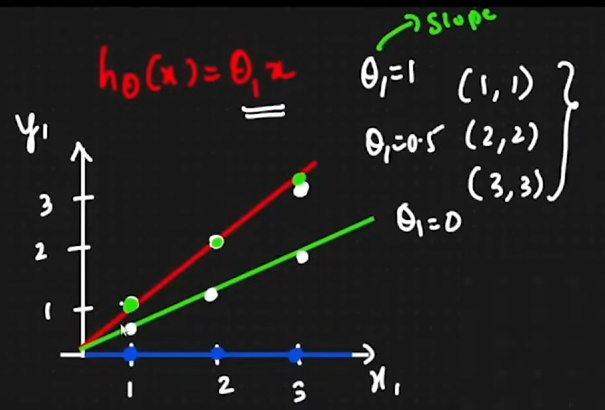
          - ${J(θ_1)} = \frac{1}{2\times3} ∑_{i=1}^{3} (h_{θ}(x^{(i)}) - y^{(i)})^2$
          - ${=\frac{1}{2\times3}[(0-1)^2 + (0-2)^2 + (0-3)^2]}$
          - ${=\frac{1}{6}[1 + 4 + 9]}$
          - ${≈ 2.33}$
          - the graph for Cost Function when ${θ_1 = 0}$ will be plotted as 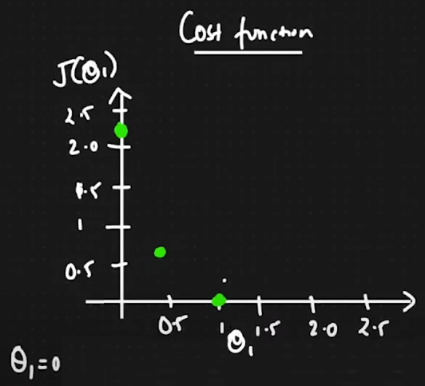

      4. if ${θ_1 = 0.4}$
          - the predicted data points would be `(1, 0.4)`, `(2, 0.8)` and `(3, 1.2)`

          - 

          - Similary, when ${θ_1 = 0.4}$, then ${J(θ_1) ≈ 5.04}$
      - Now, if we keep plotting the Cost function against its ${θ_1}$ value by changing its value, and join all the points, we'll get a curve, which is called `Gradient Descent`

      - 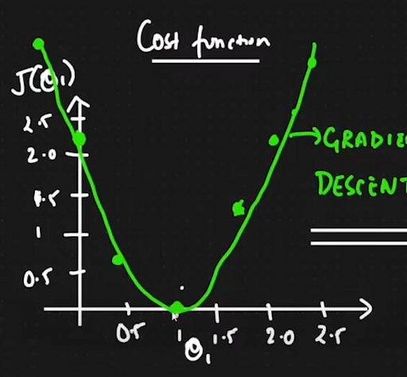

      - This Gradient Descent plays a very crucial role in making sure that you get the right ${θ_1}$ or light slope value
      - The most suitable point is the lowest value in the curve, which is called `Global Minima`
      - This Global Minima corresponds to the best fit line, because the distance between the actual data points and the predicted data points is very less

##### Moving towards Global Minima

- We start with one actual data point and its predicted data point, and then we move towards minimizing the difference between the actual data points and the predicted data points to find the Global Minima
- To find the Global Minima, we use a `Convergance Algorithm`

##### Convergance Algorithm

- If we start with one data point, we need to update the value of ${θ_1}$ , instead of using different ${θ_1}$ values

> Convergance Algorithm says that we need to repeat until convergance

- Here, we'll update the ${θ_j}$ value repeatedly until we reach the Global Minima, making ${J(θ_0,θ_1)}$ smaller
- ${θ_j:=θ_j - α \frac{∂}{∂θ_j}J(θ_0,θ_1)}$
  - ${α}$ is the learning rate
  - ${θ_j}$ is the parameter to be adjusted, represented for slope/gradient
  - ${J}$ is the cost function
  - ${\frac{∂}{∂θ_j}J(θ_0,θ_1)}$ is the slope/gradient added for adjustment and is the partial derivative of the data point on the curve
- Suppose, I have a gradient descent in a cost function represented by this curve in which we'll start with an initial point and we need to reach the global minima
  - After starting from the intial point, I need to find the partial derivative which will give the slope/gradient of the curve at that point
  - Slope might be positive slope if it is rising, or it might be negative slope if it is descending
    - If slope is positive, we'll update the value of ${θ_1}$ , by reducing the value of ${θ_1}$
      - ${θ_1 := θ_1 - α(+slope)}$
    - If slope is negative, we'll update the value of ${θ_1}$ , by increasing the value of ${θ_1}$
      - ${θ_1 := θ_1 - α(-slope)}$
      - ${⇒θ_1 := θ_1 + α(|slope|)}$
    - The convergance will stop when the value of ${θ_1}$ becomes such that its ${J(θ_0,θ_1)}$ becomes very less
    - 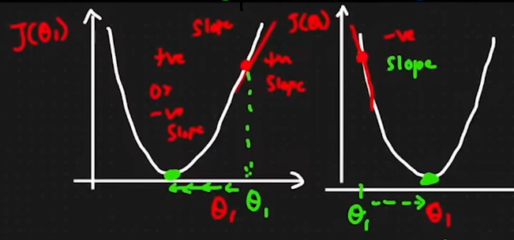
  - ${α}$ is the learning rate
    - it determines by what speed i'll reach the global minima
    - usually we select ${α = 0.01}$
      - if we select a smaller learning rate ${α}$, then it'll take smaller steps to move towards the optimal minima
        - if we select a tiny learning rate, then it'll take lot of interations, thus taking forever to reach minima
      - if we select a bigger learning rate ${α}$, then it'll take bigger steps to move towards the optimal minima
        - if we select a huge learning rate, then it'll keep on adjusting itself with bigger adjustments, thus it'll never reach minima
      - so, we need to take a learning rate ${α}$, which is neither too small nor too big
    - 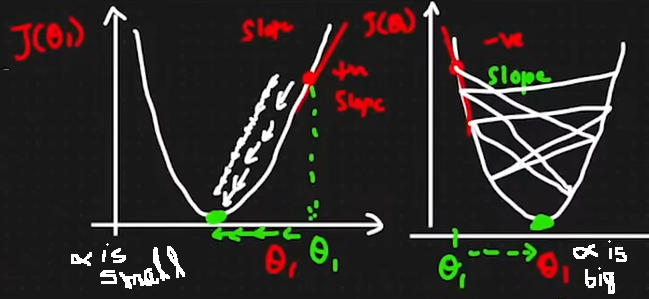
- There might be one scenario where the cost function has a local minima
  - 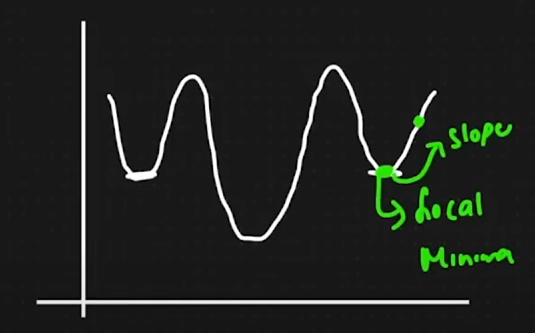
  - if we start with one point using Linear Regression, we'll be reach to Global Minima only using this Convergance Algorithm in Linear Regression
  - But in case of DL (Deep Learning) techniques such as ANN (Artificial Neural Network) algorithms, we have a lot of local minima, so we have to use other Gradient Descent algorithms such as RMSProp (Root Mean Square Propagation), Adam Optimizers, which solve this problem of local minima
  - `Interview Question`: Do you see any local minima in Linear Regression?
    - Ans: The cost function that we use in Linear Regression will definitely not give us local minima, but in case of Deep Learning techniques such as ANN, we have different optimizers which will solve the problem of local minima

##### Gradient Descent

> Gradient Descent algorithm says that Repeat Until Convergance

- it is a type of convergance algorithm
- ${θ_j := θ_j - α \frac{∂}{∂θ_j} J(θ_0, θ_1)}$
  - we'll try to find out ${\frac{∂}{∂θ_j} J(θ_0, θ_1)}$, which is the partial derivative of cost function
  - ${\frac{∂}{∂θ_j} J(θ_0, θ_1) = \frac{∂}{∂θ_j} \frac{1}{2m} ∑_{i=1}^{m}(h_θ(x^{(i)}) - y^{(i)})^2 }$
    - Cost Function ${J(θ_0, θ_1)}$ is for two variables, so ${j}$ in ${θ_j}$ will be ${0}$ and ${1}$
  - Since ${\frac{∂}{∂x}x^2 = 2x}$
    - so ${\frac{∂}{∂x}(\frac{1}{2m}x^2) = \frac{\cancel{2}x}{\cancel{2}m} = \frac{x}{m}}$
  - when ${j=0}$, then partial derivative of cost function w.r.t. ${θ_0}$ will be as
    - ${j = 0 ⇒ \frac{∂}{∂θ_0}J(θ_0, θ_1)}$
    - ${\frac{∂}{∂θ_0}J(θ_0, θ_1)= \frac{1}{m} ∑_{i=1}^{m}(h_θ(x^{(i)}) - y^{(i)})}$
    - [//]:# (- ${\frac{∂}{∂θ_0}J(θ_0, θ_1)= \frac{1}{m} ∑_{i=1}^{m}(θ_0 +θ_1x - y^{(i)})\quad[∵ h_θ(x) = θ_0 + θ_1x]}$)
    - [//]:# (- ${\frac{∂}{∂θ_0}J(θ_0, θ_1)=\frac{1}{m} ∑_{i=1}^{m}(θ_1x - y^{(i)})\quad[∵ θ_0 = 0 ⇒ h_θ(x) = θ_1x]}$)
  - when ${j=1}$, then partial derivative of cost function w.r.t. ${θ_1}$ will be as
    - ${j = 1 ⇒ \frac{∂}{∂θ_1}J(θ_0, θ_1)}$
    - ${\frac{∂}{∂θ_1}J(θ_0, θ_1)= \frac{1}{m} ∑_{i=1}^{m} (h_θ(x^{(i)}) - y^{(i)})^2}$
    - ${\frac{∂}{∂θ_1}J(θ_0, θ_1)=\frac{1}{m} ∑_{i=1}^{m} (h_θ(x^{(i)}) - y^{(i)})^2. x^{(i)}\quad[∵h_θ(x)=θ_0+θ_1x⇒\frac{∂}{∂θ_1}h_θ(x) = \frac{∂}{∂θ_1}θ_1x = x]}$
- we'll repeat until we converge by adjusting two parameters ${θ_0}$ and ${θ_1}$ for which adjustment is represented as
  - ${θ_0 := θ_0 - α \frac{1}{m} ∑_{i=1}^{m}(h_θ(x^{(i)}) - y^{(i)})}$
  - ${θ_1 := θ_1 - α \frac{1}{m} ∑_{i=1}^{m}(h_θ(x^{(i)}) - y^{(i)}).x^{(i)}}$

#### Performance Metrics

- The two performance metrics to verify how good a model is with respect to linear regression are

##### 1. Coefficient of Determination, R²

- measures the proportion of the variance in the dependent variable explained by the independent variables in the model
- renges between 0 to 1 where o indicates that the model does not explain any variablility, and 1 indicates it explains all the variablility
- Higher R-squared values suggest a better fit, but it does not necessarily mean that the model is a good predictor in absolute sense
- ${R^2 =\frac{Explained\ Variation}{Total\ Variation} = 1 - \frac{Unexplained\ Variation}{Total\ Variation}}$
  - ${ = \frac{TSS-RSS}{TSS} = 1 - \frac{RSS}{TSS}}$
- ${R^2 = 1 - \frac{RSS}{TSS}}$
  - ${ = 1 - \frac{SS_{Res}}{SS_{Total}} }$
  - ${= 1 - \frac{∑(y_i - ŷ_i)^2}{∑(y_i - ȳ)^2}}$ where
  - ${y_i}$
    - represents the actual data points
  - ${ŷ = h_θ(x) = θ_0 + θ_1x}$
    - represents the predicted data points
  - ${ȳ}$
    - represents the mean of actual data points
  - ${RSS}$ or ${SS_{Res}}$
    - Unexaplained Variation
    - Residual sum of squares (sum of squares of differences between actual data points and predicted data points)
    - ${SS_{Res} = ∑(y_i - ŷ_i)^2}$
      - Residual = actual - predicted = ${y_i - ŷ_i}$
  - ${TSS}$ or ${SS_{Total}}$
    - Total Variation
    - Total sum of squares (Total variation in the squares of differences between actual data points and their mean)
    - ${SS_{Total} = ∑(y_i - ȳ)^2}$
- 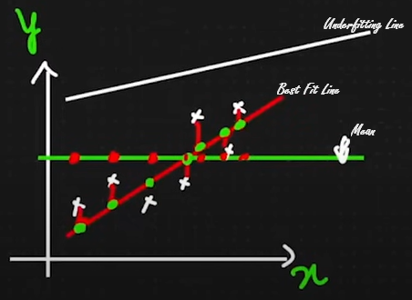
- Underfitting case
  - 0 ≤ ${R^2}$ < 1
  - ${R^2 = 1 - \frac{SS_{Res}}{SS_{Total}} = 1 - \frac{Lower\ value}{Higher\ value} = 1 - [0≤n<1] = positive\ R^2}$
  - ${\red↑R^2 = 1 - \frac{SS_{Res}\red↓}{SS_{Total}}}$
  - ${SS_{Res}}$ having low value means that regression line was very close to the actual points
  - means that independent variables explain the majority of variation in the target variable, so we'll have a really high R-squared value
- Overfitting case
  - ${R^2}$ < 0
  - ${R^2 = 1 - \frac{SS_{Res}}{SS_{Total}} = 1 - \frac{Higher\ value}{Lower\ value} = 1 - [n>1] = negative\ R^2}$
  - ${\red↓R^2 = 1 - \frac{SS_{Res}\red↑}{SS_{Total}}}$
  - ${SS_{Res}}$ having high value means that regression line was far away from the actual points
  - means that independent variables fail to explain the majority of variation in the target variable, so we'll have a really low R-squared values

> The problem with ${R^2}$ is that its value never decreases no matter the number of variables we add to our regression model, even if we are adding redundant variables to the data. It either remains same or increases with addition of new independent variables

##### 2. Adjusted R²

- Adjusted R-squared is a statistical measure used to evaluate the goodness of fit of a regression model

> Unlike the standard R-Squared , which simply tells you the proportion of variance explained by the model, Adjusted R-squared takes into account the number of predictors (independent variables) in the model

- Adjusted R-squared addresses a limitation of R-squared, especially in multiple regression (models with more than one independent variables)
- While R-squared tends to increase as more variables are added to the model (even if they don't improve the model significantly), the Adjusted R-squared penalizes the addition of unnecessary  variables
- it considers the number of predictors in the model and adjusts R-squared accordingly, & this adjustment helps to avoid overfitting, providing a more accurate measure of model's goodness of fit
- Example
  - Suppose I have features to predict the Price of a House, with two features

    |Number of Bedrooms |Price |
    |:- |:- |
    |Correlated Independent Feature |Dependent Feature|

  - While solving this problem, Lets say ${R^2}$ is 85% or 0.85
  - Now, If I add another feature 'Location' which is correlated with 'Price', so there is certain chance that the ${R^2}$ will increase to lets say 90% or 0.90

    |Number of Bedrooms |Location |Price |
    |:- |:- |:- |
    |Correlated Independent Feature |Correlated Independent Feature |Dependent Feature|

  - Now, If I add another feature 'Gender' indicating which gender is going to stay, and this feature is not related to 'Price', but there is a scenario that even though I added one feature ${R^2}$ will increase to 91% or 0.91

    |Gender |Number of Bedrooms |Location |Price |
    |:- |:- |:- |:- |
    |Non-Correlated Independent Feature |Correlated Independent Feature |Correlated Independent Feature |Dependent Feature|

> ${R^2}$ works in such a way that if I keep on adding features which are nowhere correlated, still ${R^2}$ will increase

- But, this should not be the case where if feature(s) which are not correlated, when added leads to increase in performance metrics, rather it should not increase the performance of model in such case
- In order to prevent picking a model where non-correlated features are increasing the ${R^2}$ value, we use Adjusted ${{R^2}}$
- ${R^2\ Adjusted = 1-\frac{(1-R^2)(N-1)}{N-p-1}}$ where
  - ${N}$ is the number pf data points
  - ${p}$ is the number of predictors
  - ${R^2}$ is the represents the R-squared values determined by
- ${Adjusted\ R^2 = [1-[\frac{(1-R^2)(N-1)}{(N-↑p-1)↓}]↑]↓}$
  - if the R-squared value didn't increase significantly on addition of a new independent variable, then the value of Adjusted R-squared will actually decrease
- ${Adjusted\ R^2 = [1-[\frac{↓(1-↑R^2)(N-1)}{(N-↑p-1)↓}]↑]↑}$
  - if on adding the new independent variable, we see a significant increase in R-squared value, then the Adjusted R-squared value will also increase

#### Practical Implementation

### 2. Ridge and Lasso Regression Algorithms

- Example
  - Lets say we have a scenario, where I have two data points
    - Now, If I try to create a best fit line, it will pass through all such data points
    - Lets say, this best fit line passes through origin then ${θ_0=0}$
    - and, since best fit line passes through all the data points, then the cost function (which needs to be minimized) ${J(θ_0,θ_1)=0}$
    - This data which has been plotted with two data points will be called as Training Data
    - 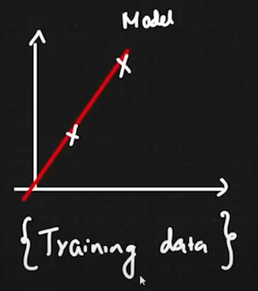
    - Data can be categorized/split into two types
      1. Training Data
      2. Testing Data
    - Now, Imagine if new data points come up which are test data, and we predict w.r.t. these new data points/test data, and the predicted data point comes up on the previous best fit line, so the difference between the new data points and its predicted data point is huge, which creates a case of *Overfitting*
    - 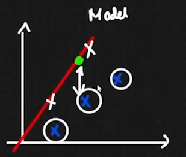
- **Overfitting**
  - performs well with Training Data (Low Bias), but fails to perform well with Test Data (High Variance)
- **Underfitting**
  - performs badly with Training Data (High Bias), performs badly with Test Data too (High Variance)

|Model 1 | Model 2 |Model 3|
|:- |:- |:- |
|Trainining Accuracy = 90% |Trainining Accuracy = 92% |Trainining Accuracy = 70% |
|Test Accuracy = 80% |Test Accuracy = 91% |Test Accuracy = 65% |
|Overfitting Case |Generalized Model | Underfitting Case |
|Low Bias |Low Bias |High Bias |
|High Variance |Low Variance | High Variance |

- We always require a Generalized Model because it'll give us good outputs while using Test Data

#### 1. Ridge Regression

- also known as L2 regularization
- Example
  - Lets say I have two actual data points, and I draw the best fit line which passes through these two data points and through origin, so ${J(θ_1)=0}$ because best fit line passes through origin
  - Here, Cost function would be
    - ${J(θ_0,θ_1) = \frac{1}{2m} ∑_{i=1}^{m}(h_θ(x^{(i)})-y^{(i)})^2}$
    - ${J(θ_0,θ_1) = \frac{1}{2m} ∑_{i=1}^{m}(ŷ^{(i)}-y^{(i)})^2}$
  - This cost function essentially boils down to ${(ŷ^{(i)}-y^{(i)})^2}$
  - Since predicted data points for Training data also lie on the best fit line, cost function becomes 0
    - ${J(θ_0,θ_1) = 0}$
  - But, this is a case of overfitting and we have to ensure that the cost function doesn't become zero, this is where Ridge Regression comes into picture
  - 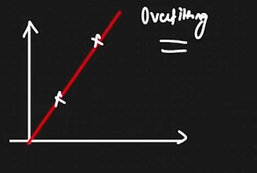
  - Ridge Regression adds a new unique parameter or one more sample value, which is ${λ(slope)^2}$ so that cost function is not 0
    - in equation of a line passing through origin, the equation of line which is ${h_θ(x)=θ_0+θ_1x}$ will become ${h_θ(x)=θ_1x}$, where ${θ_1}$ is the slope because ${θ_0=0}$ as line passes through origin
  - So cost function becomes
    - ${J(θ_0, θ_1)=(ŷ^{(i)}-y^{(i)})^2+λ(θ_1)^2}$
    - ${J(θ_0, θ_1)=0+λ(θ_1)^2\ \ \ [∵cost\ function\ is\ zero\ when\ points\ are\ on\ best\ fit\ line]}$
    - ${J(θ_0, θ_1)=0+1(θ_1)^2\ \ \ [∵λ\ initialized\ with\ 1]}$
    - ${J(θ_0, θ_1)=0+1(2)^2\ \ \ [∵assume\ Slope\ θ_1\ is\ 2]}$
    - ${J(θ_0, θ_1)=4}$
  - 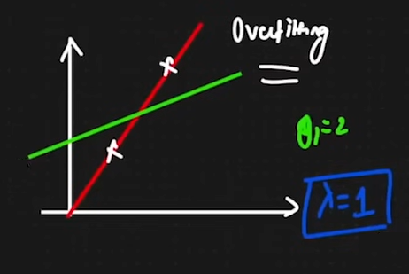
  - Now, we have some cost function associated due to added hyperparameter, and now have to further reduce the cost function value
  - so we'll get the next best fit line, which will have some cost associated with it, as there are some small value of  differences in actual data points and the new best fit line
  - Now, because of some small difference in actual data points and the new best fit line, there will be a decrease in slope
  - Note that there should be small differences only as small differences introduce less steeper slopes, ensuring that we do not indroduce a steep slope as steep slopes lead to overfitting cases
  - for the next iteration, the next line is
    - ${J(θ_0, θ_1)=(ŷ^{(i)}-y^{(i)})^2+λ(θ_1)^2}$
    - ${J(θ_0, θ_1)=small\ value +1(1.5)^2}$
    - ${J(θ_0, θ_1)=small\ value +2.25}$
    - ${J(θ_0, θ_1)≈3}$
  - 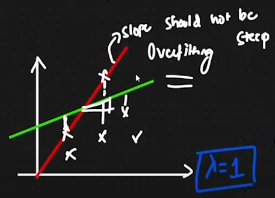
  - As, there is some small differences introduced, so slope will decrease and cost function will also decrease from 4 to less than or approximately 3
  - This will give a genralized model with low bias and low variance, instead of the overfitting condition

> We use L2 Regularization / Ridge Regression to prevent overfitting by reducing the cost until you get a best fit line which will handle the regression as a generalized model

- After some iterations, the cost function will not decrease further, so it cannot reduce to zero which is a case of overfitting
- For such cases, we have to specify another hyperparameter which is Number of iterations
- There are two hyperparameters for Ridge regression / L2 regularization
  1. ${λ}$
      - adjusted slope, indicates how fast you want to reduce the steepness
      - we have to add small values of slope as big slope values make model prone to overfitting
  2. Number of iterations
      - indicates how many times we have to update the slope ${θ_1}$ value
      - associates with convergance algorithm by adjusting the slope in each iteration

#### 2. Lasso Regression

- also known as L1 Regularization
- s

#### 2. Assumption of Linear Regression

### 3. Logistic Regression

#### 1. Confusion Matrix

## 2. Unsupervised Machine Learning Algorithms

- Unsupervised Machine Learning Algorithms include
    1. K-Means
    2. DB Scan
    3. Hierearchical Clustering
    4. K-Nearest Neighbor Clustering
    5. PCA (Principal Component Analysis)
    6. LDA (Latent Dirichlet Allocation)
